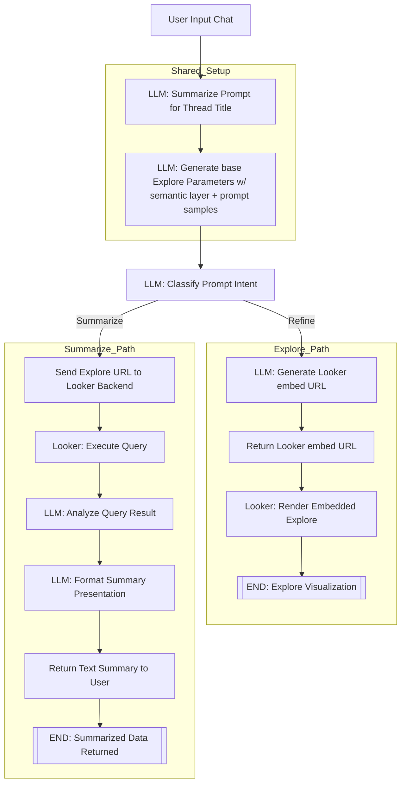

<LookML Metadata>
This information is the semantic model the gemini model behind explore assistant has access to.
It will rely on the user question + available contexts + this semantic model to determine the Looker query / explore to generate. 
Such can be described in the following core workflow :

Model: bkg_spoke
Explore: dms_bkg_cntr_mig

Dimensions Used to group by information (follow the instructions in tags when using a specific field; if map used include a location or lat long dimension;):

| Field Id | Field Type | LookML Type | Label | Description | Tags |
|------------|------------|-------------|-------|-------------|------|
['| Field Id | Field Type | LookML Type | Label | Description | Tags |', '|---|---|---|---|---|---|', '| dms_bkg_cntr.dyn_wgt | Category.dimension | number |  Measures \n        Gross\n    \n    Weight (\n    MT\n    \n    ) |  |  |', '| dms_bkg_cntr.cgo_wgt_kg | Category.dimension | number |  Measures Actual Cargo Weight (KG) |  |  |', '| dms_bkg_cntr.cgo_wgt_lb | Category.dimension | number |  Measures Actual Cargo Weight (LB) |  |  |', '| dms_bkg_cntr.cgo_wgt_mt | Category.dimension | number |  Measures Actual Cargo Weight (MT) |  |  |', '| dms_bkg_master_sub.var_pck_qty | Category.dimension | number |  Measures Booking vs Container Package Variance |  |  |', '| dms_bkg_master_sub.var_qty | Category.dimension | number |  Measures Booking vs Container Quantity Variance |  |  |', '| dms_bkg_master_sub.var_meas_qty | Category.dimension | number |  Measures Booking vs Container Volume (CBM) Variance |  |  |', '| dms_bkg_master_sub.var_wgt | Category.dimension | number |  Measures Booking vs Container Weight (KG) Variance |  |  |', '| dms_bkg_cntr.cbf | Category.dimension | number |  Measures CBF |  |  |', '| dms_bkg_cntr.cbm | Category.dimension | number |  Measures CBM |  |  |', '| dms_bkg_cntr.cntr_vol_qty | Category.dimension | number |  Measures Container Quantity |  |  |', '| dws_dg_cgo.grs_kgs_wgt | Category.dimension | number |  Measures Dangerous Cargo Application Gross Weight (KGS) |  |  |', '| dws_dg_cgo.grs_lbs_wgt | Category.dimension | number |  Measures Dangerous Cargo Application Gross Weight (LBS) |  |  |', '| dms_bkg_master.bkg_pol_etd_dif_dys_tier | Category.dimension | tier |  Measures Days between BKG Creation and Sailing (Tier) | This tiered field enables histogram and distribution analysis.  |  |', '| dms_bkg_cntr.est_cgo_wgt_kg | Category.dimension | number |  Measures Estimated Cargo Weight (KG) |  |  |', '| dms_bkg_cntr.est_cgo_wgt_lb | Category.dimension | number |  Measures Estimated Cargo Weight (LB) |  |  |', '| dms_bkg_cntr.est_cgo_wgt_mt | Category.dimension | number |  Measures Estimated Cargo Weight (MT) |  |  |', '| dms_bkg_cntr.est_cgo_wgt_mt_per_teu_qty | Category.dimension | number |  Measures Estimated Cargo Weight (MT) / TEU |  |  |', '| dms_bkg_cntr.grs_wgt_kg | Category.dimension | number |  Measures Gross Weight (KG) |  |  |', '| dms_bkg_cntr.grs_wgt_lb | Category.dimension | number |  Measures Gross Weight (LB) |  |  |', '| dms_bkg_cntr.grs_wgt_mt | Category.dimension | number |  Measures Gross Weight (MT) |  |  |', '| dms_bkg_cntr.grs_wgt_mt_per_teu_qty | Category.dimension | number |  Measures Gross Weight (MT) / TEU |  |  |', '| dws_dg_cgo.net_kgs_wgt | Category.dimension | number |  Measures Net Weight (KGS) |  |  |', '| dws_dg_cgo.net_lbs_wgt | Category.dimension | number |  Measures Net Weight (LBS) |  |  |', '| dms_bkg_cntr.pck_qty | Category.dimension | number |  Measures Package Quantity |  |  |', '| dms_bkg_cntr.op_teu_qty | Category.dimension | number |  Measures Picked TEU |  |  |', '| dms_bkg_cntr.cntr_teu_qty | Category.dimension | number |  Measures TEU |  |  |', '| dms_bkg_cntr.tare_wgt_kg | Category.dimension | number |  Measures Tare Weight (KG) |  |  |', '| dms_bkg_cntr.tare_wgt_lb | Category.dimension | number |  Measures Tare Weight (LB) |  |  |', '| dms_bkg_cntr.tare_wgt_mt | Category.dimension | number |  Measures Tare Weight (MT) |  |  |', '| dms_bkg_cntr.ttl_ttw_co2_emsn_amt | Category.dimension | number |  Measures Total CO2 Emission - Tank To Wake (KG) |  |  |', '| dms_bkg_cntr.ttl_wtw_co2_emsn_amt | Category.dimension | number |  Measures Total CO2 Emission - Well To Wake (KG) |  |  |', '| dms_bkg_cntr.avg_ttl_dist | Category.dimension | number |  Measures Total Distance (KM) |  |  |', '| dms_bkg_cntr.ib_ttl_lnk_ttw_co2_emsn_amt | Category.dimension | number |  Measures Total Inland Inbound CO2 Emission - Tank To Wake (KG) |  |  |', '| dms_bkg_cntr.ib_ttl_lnk_wtw_co2_emsn_amt | Category.dimension | number |  Measures Total Inland Inbound CO2 Emission - Well To Wake (KG) |  |  |', '| dms_bkg_cntr.avg_ib_ttl_lnk_dist | Category.dimension | number |  Measures Total Inland Inbound Distance (KM) |  |  |', '| dms_bkg_cntr.ob_ttl_lnk_ttw_co2_emsn_amt | Category.dimension | number |  Measures Total Inland Outbound CO2 Emission - Tank To Wake (KG) |  |  |', '| dms_bkg_cntr.ob_ttl_lnk_wtw_co2_emsn_amt | Category.dimension | number |  Measures Total Inland Outbound CO2 Emission - Well To Wake (KG) |  |  |', '| dms_bkg_cntr.avg_ob_ttl_lnk_dist | Category.dimension | number |  Measures Total Inland Outbound Distance (KM) |  |  |', '| dms_bkg_cntr.ocn_ttl_lnk_ttw_co2_emsn_amt | Category.dimension | number |  Measures Total Ocean CO2 Emission - Tank To Wake (KG) |  |  |', '| dms_bkg_cntr.ocn_ttl_lnk_wtw_co2_emsn_amt | Category.dimension | number |  Measures Total Ocean CO2 Emission - Well To Wake (KG) |  |  |', '| dms_bkg_cntr.avg_ocn_ttl_lnk_dist | Category.dimension | number |  Measures Total Ocean Distance (KM) |  |  |', '| dms_bkg_cntr.vgm_wgt | Category.dimension | number |  Measures VGM Declared Weight (KG) |  |  |', '| dms_bkg_cntr.vgm_wgt_lb | Category.dimension | number |  Measures VGM Declared Weight (LB) |  |  |', '| dms_bkg_cntr.vgm_wgt_mt | Category.dimension | number |  Measures VGM Declared Weight (MT) |  |  |', '| dms_bkg_cntr_vgm_info.xter_vgm_wgt | Category.dimension | number |  Measures VGM Latest Weight (KG) |  |  |', '| dms_bkg_master.auto_upld_rslt_cd | Category.dimension | string | Booking Auto Upload Booking Status Code |  |  |', '| dmc_auto_upld_sts.auto_upld_sts_nm | Category.dimension | string | Booking Auto Upload Booking Status Description |  |  |', '| dms_bkg_master.bl_no | Category.dimension | string | Booking BL Number |  |  |', '| dmc_bkg_aloc_sts.bkg_aloc_sts_cd | Category.dimension | string | Booking Booking Allocation Status Code |  |  |', '| dms_bkg_master.bkg_aloc_sts_cd | Category.dimension | string | Booking Booking Allocation Status Code |  |  |', '| dmc_bkg_aloc_sts.bkg_aloc_sts_nm | Category.dimension | string | Booking Booking Allocation Status Name |  |  |', '| dms_bkg_master.auto_upld_aud_sts_cd | Category.dimension | string | Booking Booking Auto Upload Audit Status Code |  |  |', '| dmc_auto_upld_aud_sts.auto_upld_aud_sts_nm | Category.dimension | string | Booking Booking Auto Upload Audit Status Description |  |  |', '| dmc_period_bkg_cxl.yrqtr_desc | Category.dimension | string | Booking Booking Cancel Calendar Quarter (YYYY/QQ) |  |  |', '| dms_bkg_master.bkg_cxl_dt_date | Category.dimension | date_date | Booking Booking Cancel Date |  |  |', '| dms_bkg_master.bkg_cxl_dt_day_of_week | Category.dimension | date_day_of_week | Booking Booking Cancel Day of Week |  |  |', '| dmc_period_bkg_cxl.accqtr_desc | Category.dimension | string | Booking Booking Cancel Fiscal Quarter (YYYY/QQ) |  |  |', '| dms_bkg_master.bkg_cxl_dt_fiscal_quarter_of_year | Category.dimension | date_fiscal_quarter_of_year | Booking Booking Cancel Fiscal Quarter of Year |  |  |', '| dms_bkg_master.bkg_cxl_dt_fiscal_year | Category.dimension | date_fiscal_year | Booking Booking Cancel Fiscal Year |  |  |', '| dms_bkg_master.bkg_cxl_dt_hour_of_day | Category.dimension | date_hour_of_day | Booking Booking Cancel Hour of Day |  |  |', '| dmc_period_bkg_cxl.yrmon_desc | Category.dimension | string | Booking Booking Cancel Month (YYYY/MM) |  |  |', '| dms_bkg_master.bkg_cxl_dt_month_num | Category.dimension | date_month_num | Booking Booking Cancel Month Num |  |  |', '| dmc_period_bkg_cxl.opus_qtr_desc | Category.dimension | string | Booking Booking Cancel OPUS Calendar Quarter |  |  |', '| dmc_period_bkg_cxl.opus_yr | Category.dimension | string | Booking Booking Cancel OPUS Calendar Year |  |  |', '| dmc_period_bkg_cxl.accmrkqtr_desc | Category.dimension | string | Booking Booking Cancel OPUS Fiscal Quarter |  |  |', '| dmc_period_bkg_cxl.acc_mrkyr | Category.dimension | string | Booking Booking Cancel OPUS Fiscal Year |  |  |', '| dmc_period_bkg_cxl.mrkmon_desc | Category.dimension | string | Booking Booking Cancel OPUS Month |  |  |', '| dmc_period_bkg_cxl.yrwk_desc | Category.dimension | string | Booking Booking Cancel OPUS Week |  |  |', '| dms_bkg_master.bkg_cxl_dt_quarter_of_year | Category.dimension | date_quarter_of_year | Booking Booking Cancel Quarter of Year |  |  |', '| dmc_bkg_cxl_rsn.dmc_cxl_rsn_cd | Category.dimension | string | Booking Booking Cancel Reason Code |  |  |', '| dms_bkg_master.bkg_cxl_rsn_cd | Category.dimension | string | Booking Booking Cancel Reason Code |  |  |', '| dmc_bkg_cxl_rsn.dmc_cxl_rsn_desc | Category.dimension | string | Booking Booking Cancel Reason Name |  |  |', '| dms_bkg_master.bkg_cxl_rmk | Category.dimension | string | Booking Booking Cancel Reason Remark |  |  |', '| dmc_bkg_cxl_sub_rsn.bkg_cxl_sub_rsn_cd | Category.dimension | string | Booking Booking Cancel Reason Sub Code |  |  |', '| dms_bkg_master.bkg_cxl_sub_rsn_cd | Category.dimension | string | Booking Booking Cancel Reason Sub Code |  |  |', '| dmc_bkg_cxl_sub_rsn.bkg_cxl_sub_rsn_desc | Category.dimension | string | Booking Booking Cancel Reason Sub Name |  |  |', '| dms_bkg_master.bkg_cxl_dt_time | Category.dimension | date_time | Booking Booking Cancel Time |  |  |', '| dmc_period_bkg_cxl_gdt.yrqtr_desc | Category.dimension | string | Booking Booking Cancel UTC Calendar Quarter (YYYY/QQ) |  |  |', '| dms_bkg_master.bkg_cxl_gdt_date | Category.dimension | date_date | Booking Booking Cancel UTC Date |  |  |', '| dms_bkg_master.bkg_cxl_gdt_day_of_week | Category.dimension | date_day_of_week | Booking Booking Cancel UTC Day of Week |  |  |', '| dmc_period_bkg_cxl_gdt.accqtr_desc | Category.dimension | string | Booking Booking Cancel UTC Fiscal Quarter (YYYY/QQ) |  |  |', '| dms_bkg_master.bkg_cxl_gdt_fiscal_quarter_of_year | Category.dimension | date_fiscal_quarter_of_year | Booking Booking Cancel UTC Fiscal Quarter of Year |  |  |', '| dms_bkg_master.bkg_cxl_gdt_fiscal_year | Category.dimension | date_fiscal_year | Booking Booking Cancel UTC Fiscal Year |  |  |', '| dms_bkg_master.bkg_cxl_gdt_hour_of_day | Category.dimension | date_hour_of_day | Booking Booking Cancel UTC Hour of Day |  |  |', '| dmc_period_bkg_cxl_gdt.yrmon_desc | Category.dimension | string | Booking Booking Cancel UTC Month (YYYY/MM) |  |  |', '| dms_bkg_master.bkg_cxl_gdt_month_num | Category.dimension | date_month_num | Booking Booking Cancel UTC Month Num |  |  |', '| dmc_period_bkg_cxl_gdt.opus_qtr_desc | Category.dimension | string | Booking Booking Cancel UTC OPUS Calendar Quarter |  |  |', '| dmc_period_bkg_cxl_gdt.opus_yr | Category.dimension | string | Booking Booking Cancel UTC OPUS Calendar Year |  |  |', '| dmc_period_bkg_cxl_gdt.accmrkqtr_desc | Category.dimension | string | Booking Booking Cancel UTC OPUS Fiscal Quarter |  |  |', '| dmc_period_bkg_cxl_gdt.acc_mrkyr | Category.dimension | string | Booking Booking Cancel UTC OPUS Fiscal Year |  |  |', '| dmc_period_bkg_cxl_gdt.mrkmon_desc | Category.dimension | string | Booking Booking Cancel UTC OPUS Month |  |  |', '| dmc_period_bkg_cxl_gdt.yrwk_desc | Category.dimension | string | Booking Booking Cancel UTC OPUS Week |  |  |', '| dms_bkg_master.bkg_cxl_gdt_quarter_of_year | Category.dimension | date_quarter_of_year | Booking Booking Cancel UTC Quarter of Year |  |  |', '| dms_bkg_master.bkg_cxl_gdt_time | Category.dimension | date_time | Booking Booking Cancel UTC Time |  |  |', '| dms_bkg_master.bkg_cxl_gdt_week_of_year | Category.dimension | date_week_of_year | Booking Booking Cancel UTC Week of Year |  |  |', '| dmc_period_bkg_cxl_gdt.iso_yrwk_desc | Category.dimension | string | Booking Booking Cancel UTC Week of Year (YYYY/WW) |  |  |', '| dms_bkg_master.bkg_cxl_gdt_year | Category.dimension | date_year | Booking Booking Cancel UTC Year |  |  |', '| dms_bkg_master.bkg_cxl_dt_week_of_year | Category.dimension | date_week_of_year | Booking Booking Cancel Week of Year |  |  |', '| dmc_period_bkg_cxl.iso_yrwk_desc | Category.dimension | string | Booking Booking Cancel Week of Year (YYYY/WW) |  |  |', '| dms_bkg_master.bkg_cxl_dt_year | Category.dimension | date_year | Booking Booking Cancel Year |  |  |', '| dms_bkg_master.bkg_cgo_tp_cd | Category.dimension | string | Booking Booking Cargo Type Code |  |  |', '| dmc_bkg_cgo_tp.bkg_cgo_tp_nm | Category.dimension | string | Booking Booking Cargo Type Name |  |  |', '| dmc_period_bkg_n1st_cfm.yrqtr_desc | Category.dimension | string | Booking Booking Confirm First Calendar Quarter (YYYY/QQ) |  |  |', '| dms_bkg_master.n1st_cfm_dt_date | Category.dimension | date_date | Booking Booking Confirm First Date |  |  |', '| dms_bkg_master.n1st_cfm_dt_day_of_week | Category.dimension | date_day_of_week | Booking Booking Confirm First Day of Week |  |  |', '| dmc_period_bkg_n1st_cfm.accqtr_desc | Category.dimension | string | Booking Booking Confirm First Fiscal Quarter (YYYY/QQ) |  |  |', '| dms_bkg_master.n1st_cfm_dt_fiscal_quarter_of_year | Category.dimension | date_fiscal_quarter_of_year | Booking Booking Confirm First Fiscal Quarter of Year |  |  |', '| dms_bkg_master.n1st_cfm_dt_fiscal_year | Category.dimension | date_fiscal_year | Booking Booking Confirm First Fiscal Year |  |  |', '| dms_bkg_master.n1st_cfm_dt_hour_of_day | Category.dimension | date_hour_of_day | Booking Booking Confirm First Hour of Day |  |  |', '| dmc_period_bkg_n1st_cfm.yrmon_desc | Category.dimension | string | Booking Booking Confirm First Month (YYYY/MM) |  |  |', '| dms_bkg_master.n1st_cfm_dt_month_num | Category.dimension | date_month_num | Booking Booking Confirm First Month Num |  |  |', '| dmc_period_bkg_n1st_cfm.opus_qtr_desc | Category.dimension | string | Booking Booking Confirm First OPUS Calendar Quarter |  |  |', '| dmc_period_bkg_n1st_cfm.opus_yr | Category.dimension | string | Booking Booking Confirm First OPUS Calendar Year |  |  |', '| dmc_period_bkg_n1st_cfm.accmrkqtr_desc | Category.dimension | string | Booking Booking Confirm First OPUS Fiscal Quarter |  |  |', '| dmc_period_bkg_n1st_cfm.acc_mrkyr | Category.dimension | string | Booking Booking Confirm First OPUS Fiscal Year |  |  |', '| dmc_period_bkg_n1st_cfm.mrkmon_desc | Category.dimension | string | Booking Booking Confirm First OPUS Month |  |  |', '| dmc_period_bkg_n1st_cfm.yrwk_desc | Category.dimension | string | Booking Booking Confirm First OPUS Week |  |  |', '| dms_bkg_master.n1st_cfm_dt_quarter_of_year | Category.dimension | date_quarter_of_year | Booking Booking Confirm First Quarter of Year |  |  |', '| dms_bkg_master.n1st_cfm_dt_time | Category.dimension | date_time | Booking Booking Confirm First Time |  |  |', '| dmc_period_bkg_n1st_cfm_gdt.yrqtr_desc | Category.dimension | string | Booking Booking Confirm First UTC Calendar Quarter (YYYY/QQ) |  |  |', '| dms_bkg_master.bkg_n1st_cfm_gdt_date | Category.dimension | date_date | Booking Booking Confirm First UTC Date |  |  |', '| dms_bkg_master.bkg_n1st_cfm_gdt_day_of_week | Category.dimension | date_day_of_week | Booking Booking Confirm First UTC Day of Week |  |  |', '| dmc_period_bkg_n1st_cfm_gdt.accqtr_desc | Category.dimension | string | Booking Booking Confirm First UTC Fiscal Quarter (YYYY/QQ) |  |  |', '| dms_bkg_master.bkg_n1st_cfm_gdt_fiscal_quarter_of_year | Category.dimension | date_fiscal_quarter_of_year | Booking Booking Confirm First UTC Fiscal Quarter of Year |  |  |', '| dms_bkg_master.bkg_n1st_cfm_gdt_fiscal_year | Category.dimension | date_fiscal_year | Booking Booking Confirm First UTC Fiscal Year |  |  |', '| dms_bkg_master.bkg_n1st_cfm_gdt_hour_of_day | Category.dimension | date_hour_of_day | Booking Booking Confirm First UTC Hour of Day |  |  |', '| dmc_period_bkg_n1st_cfm_gdt.yrmon_desc | Category.dimension | string | Booking Booking Confirm First UTC Month (YYYY/MM) |  |  |', '| dms_bkg_master.bkg_n1st_cfm_gdt_month_num | Category.dimension | date_month_num | Booking Booking Confirm First UTC Month Num |  |  |', '| dmc_period_bkg_n1st_cfm_gdt.opus_qtr_desc | Category.dimension | string | Booking Booking Confirm First UTC OPUS Calendar Quarter |  |  |', '| dmc_period_bkg_n1st_cfm_gdt.opus_yr | Category.dimension | string | Booking Booking Confirm First UTC OPUS Calendar Year |  |  |', '| dmc_period_bkg_n1st_cfm_gdt.accmrkqtr_desc | Category.dimension | string | Booking Booking Confirm First UTC OPUS Fiscal Quarter |  |  |', '| dmc_period_bkg_n1st_cfm_gdt.acc_mrkyr | Category.dimension | string | Booking Booking Confirm First UTC OPUS Fiscal Year |  |  |', '| dmc_period_bkg_n1st_cfm_gdt.mrkmon_desc | Category.dimension | string | Booking Booking Confirm First UTC OPUS Month |  |  |', '| dmc_period_bkg_n1st_cfm_gdt.yrwk_desc | Category.dimension | string | Booking Booking Confirm First UTC OPUS Week |  |  |', '| dms_bkg_master.bkg_n1st_cfm_gdt_quarter_of_year | Category.dimension | date_quarter_of_year | Booking Booking Confirm First UTC Quarter of Year |  |  |', '| dms_bkg_master.bkg_n1st_cfm_gdt_time | Category.dimension | date_time | Booking Booking Confirm First UTC Time |  |  |', '| dms_bkg_master.bkg_n1st_cfm_gdt_week_of_year | Category.dimension | date_week_of_year | Booking Booking Confirm First UTC Week of Year |  |  |', '| dmc_period_bkg_n1st_cfm_gdt.iso_yrwk_desc | Category.dimension | string | Booking Booking Confirm First UTC Week of Year (YYYY/WW) |  |  |', '| dms_bkg_master.bkg_n1st_cfm_gdt_year | Category.dimension | date_year | Booking Booking Confirm First UTC Year |  |  |', '| dms_bkg_master.n1st_cfm_dt_week_of_year | Category.dimension | date_week_of_year | Booking Booking Confirm First Week of Year |  |  |', '| dmc_period_bkg_n1st_cfm.iso_yrwk_desc | Category.dimension | string | Booking Booking Confirm First Week of Year (YYYY/WW) |  |  |', '| dms_bkg_master.n1st_cfm_dt_year | Category.dimension | date_year | Booking Booking Confirm First Year |  |  |', '| dmc_period_bkg_lst_cfm.yrqtr_desc | Category.dimension | string | Booking Booking Confirm Last Calendar Quarter (YYYY/QQ) |  |  |', '| dms_bkg_master.bkg_lst_cfm_dt_date | Category.dimension | date_date | Booking Booking Confirm Last Date |  |  |', '| dms_bkg_master.bkg_lst_cfm_dt_day_of_week | Category.dimension | date_day_of_week | Booking Booking Confirm Last Day of Week |  |  |', '| dmc_period_bkg_lst_cfm.accqtr_desc | Category.dimension | string | Booking Booking Confirm Last Fiscal Quarter (YYYY/QQ) |  |  |', '| dms_bkg_master.bkg_lst_cfm_dt_fiscal_quarter_of_year | Category.dimension | date_fiscal_quarter_of_year | Booking Booking Confirm Last Fiscal Quarter of Year |  |  |', '| dms_bkg_master.bkg_lst_cfm_dt_fiscal_year | Category.dimension | date_fiscal_year | Booking Booking Confirm Last Fiscal Year |  |  |', '| dms_bkg_master.bkg_lst_cfm_dt_hour_of_day | Category.dimension | date_hour_of_day | Booking Booking Confirm Last Hour of Day |  |  |', '| dmc_period_bkg_lst_cfm.yrmon_desc | Category.dimension | string | Booking Booking Confirm Last Month (YYYY/MM) |  |  |', '| dms_bkg_master.bkg_lst_cfm_dt_month_num | Category.dimension | date_month_num | Booking Booking Confirm Last Month Num |  |  |', '| dmc_period_bkg_lst_cfm.opus_qtr_desc | Category.dimension | string | Booking Booking Confirm Last OPUS Calendar Quarter |  |  |', '| dmc_period_bkg_lst_cfm.opus_yr | Category.dimension | string | Booking Booking Confirm Last OPUS Calendar Year |  |  |', '| dmc_period_bkg_lst_cfm.accmrkqtr_desc | Category.dimension | string | Booking Booking Confirm Last OPUS Fiscal Quarter |  |  |', '| dmc_period_bkg_lst_cfm.acc_mrkyr | Category.dimension | string | Booking Booking Confirm Last OPUS Fiscal Year |  |  |', '| dmc_period_bkg_lst_cfm.mrkmon_desc | Category.dimension | string | Booking Booking Confirm Last OPUS Month |  |  |', '| dmc_period_bkg_lst_cfm.yrwk_desc | Category.dimension | string | Booking Booking Confirm Last OPUS Week |  |  |', '| dms_bkg_master.bkg_lst_cfm_dt_quarter_of_year | Category.dimension | date_quarter_of_year | Booking Booking Confirm Last Quarter of Year |  |  |', '| dms_bkg_master.bkg_lst_cfm_dt_time | Category.dimension | date_time | Booking Booking Confirm Last Time |  |  |', '| dmc_period_bkg_lst_cfm_gdt.yrqtr_desc | Category.dimension | string | Booking Booking Confirm Last UTC Calendar Quarter (YYYY/QQ) |  |  |', '| dms_bkg_master.bkg_lst_cfm_gdt_date | Category.dimension | date_date | Booking Booking Confirm Last UTC Date |  |  |', '| dms_bkg_master.bkg_lst_cfm_gdt_day_of_week | Category.dimension | date_day_of_week | Booking Booking Confirm Last UTC Day of Week |  |  |', '| dmc_period_bkg_lst_cfm_gdt.accqtr_desc | Category.dimension | string | Booking Booking Confirm Last UTC Fiscal Quarter (YYYY/QQ) |  |  |', '| dms_bkg_master.bkg_lst_cfm_gdt_fiscal_quarter_of_year | Category.dimension | date_fiscal_quarter_of_year | Booking Booking Confirm Last UTC Fiscal Quarter of Year |  |  |', '| dms_bkg_master.bkg_lst_cfm_gdt_fiscal_year | Category.dimension | date_fiscal_year | Booking Booking Confirm Last UTC Fiscal Year |  |  |', '| dms_bkg_master.bkg_lst_cfm_gdt_hour_of_day | Category.dimension | date_hour_of_day | Booking Booking Confirm Last UTC Hour of Day |  |  |', '| dmc_period_bkg_lst_cfm_gdt.yrmon_desc | Category.dimension | string | Booking Booking Confirm Last UTC Month (YYYY/MM) |  |  |', '| dms_bkg_master.bkg_lst_cfm_gdt_month_num | Category.dimension | date_month_num | Booking Booking Confirm Last UTC Month Num |  |  |', '| dmc_period_bkg_lst_cfm_gdt.opus_qtr_desc | Category.dimension | string | Booking Booking Confirm Last UTC OPUS Calendar Quarter |  |  |', '| dmc_period_bkg_lst_cfm_gdt.opus_yr | Category.dimension | string | Booking Booking Confirm Last UTC OPUS Calendar Year |  |  |', '| dmc_period_bkg_lst_cfm_gdt.accmrkqtr_desc | Category.dimension | string | Booking Booking Confirm Last UTC OPUS Fiscal Quarter |  |  |', '| dmc_period_bkg_lst_cfm_gdt.acc_mrkyr | Category.dimension | string | Booking Booking Confirm Last UTC OPUS Fiscal Year |  |  |', '| dmc_period_bkg_lst_cfm_gdt.mrkmon_desc | Category.dimension | string | Booking Booking Confirm Last UTC OPUS Month |  |  |', '| dmc_period_bkg_lst_cfm_gdt.yrwk_desc | Category.dimension | string | Booking Booking Confirm Last UTC OPUS Week |  |  |', '| dms_bkg_master.bkg_lst_cfm_gdt_quarter_of_year | Category.dimension | date_quarter_of_year | Booking Booking Confirm Last UTC Quarter of Year |  |  |', '| dms_bkg_master.bkg_lst_cfm_gdt_time | Category.dimension | date_time | Booking Booking Confirm Last UTC Time |  |  |', '| dms_bkg_master.bkg_lst_cfm_gdt_week_of_year | Category.dimension | date_week_of_year | Booking Booking Confirm Last UTC Week of Year |  |  |', '| dmc_period_bkg_lst_cfm_gdt.iso_yrwk_desc | Category.dimension | string | Booking Booking Confirm Last UTC Week of Year (YYYY/WW) |  |  |', '| dms_bkg_master.bkg_lst_cfm_gdt_year | Category.dimension | date_year | Booking Booking Confirm Last UTC Year |  |  |', '| dms_bkg_master.bkg_lst_cfm_dt_week_of_year | Category.dimension | date_week_of_year | Booking Booking Confirm Last Week of Year |  |  |', '| dmc_period_bkg_lst_cfm.iso_yrwk_desc | Category.dimension | string | Booking Booking Confirm Last Week of Year (YYYY/WW) |  |  |', '| dms_bkg_master.bkg_lst_cfm_dt_year | Category.dimension | date_year | Booking Booking Confirm Last Year |  |  |', '| dms_bkg_master.bkg_cntc_pson_co_nm | Category.dimension | string | Booking Booking Contact Person Company Name |  |  |', '| dms_bkg_master.bkg_cntc_pson_eml | Category.dimension | string | Booking Booking Contact Person Email |  |  |', '| dms_bkg_master.bkg_cntc_pson_fax_no | Category.dimension | string | Booking Booking Contact Person Fax Number |  |  |', '| dms_bkg_master.bkg_cntc_pson_nm | Category.dimension | string | Booking Booking Contact Person Name |  |  |', '| dms_bkg_master.bkg_cntc_pson_phn_no | Category.dimension | string | Booking Booking Contact Person Phone |  |  |', '| dmc_period_bkg_cre.yrqtr_desc | Category.dimension | string | Booking Booking Create Calendar Quarter (YYYY/QQ) |  |  |', '| dms_bkg_master.bkg_cre_dt_date | Category.dimension | date_date | Booking Booking Create Date |  |  |', '| dms_bkg_master.bkg_cre_dt_day_of_week | Category.dimension | date_day_of_week | Booking Booking Create Day of Week |  |  |', '| dmc_period_bkg_cre.accqtr_desc | Category.dimension | string | Booking Booking Create Fiscal Quarter (YYYY/QQ) |  |  |', '| dms_bkg_master.bkg_cre_dt_fiscal_quarter_of_year | Category.dimension | date_fiscal_quarter_of_year | Booking Booking Create Fiscal Quarter of Year |  |  |', '| dms_bkg_master.bkg_cre_dt_fiscal_year | Category.dimension | date_fiscal_year | Booking Booking Create Fiscal Year |  |  |', '| dms_bkg_master.bkg_cre_dt_hour_of_day | Category.dimension | date_hour_of_day | Booking Booking Create Hour of Day |  |  |', '| dmc_period_bkg_cre.yrmon_desc | Category.dimension | string | Booking Booking Create Month (YYYY/MM) |  |  |', '| dms_bkg_master.bkg_cre_dt_month_num | Category.dimension | date_month_num | Booking Booking Create Month Num |  |  |', '| dmc_period_bkg_cre.opus_qtr_desc | Category.dimension | string | Booking Booking Create OPUS Calendar Quarter |  |  |', '| dmc_period_bkg_cre.opus_yr | Category.dimension | string | Booking Booking Create OPUS Calendar Year |  |  |', '| dmc_period_bkg_cre.accmrkqtr_desc | Category.dimension | string | Booking Booking Create OPUS Fiscal Quarter |  |  |', '| dmc_period_bkg_cre.acc_mrkyr | Category.dimension | string | Booking Booking Create OPUS Fiscal Year |  |  |', '| dmc_period_bkg_cre.mrkmon_desc | Category.dimension | string | Booking Booking Create OPUS Month |  |  |', '| dmc_period_bkg_cre.yrwk_desc | Category.dimension | string | Booking Booking Create OPUS Week |  |  |', '| dms_bkg_master.bkg_cre_dt_quarter_of_year | Category.dimension | date_quarter_of_year | Booking Booking Create Quarter of Year |  |  |', '| dms_bkg_master.bkg_cre_dt_time | Category.dimension | date_time | Booking Booking Create Time |  |  |', '| dmc_period_bkg_cre_gdt.yrqtr_desc | Category.dimension | string | Booking Booking Create UTC Calendar Quarter (YYYY/QQ) |  |  |', '| dms_bkg_master.bkg_cre_gdt_date | Category.dimension | date_date | Booking Booking Create UTC Date |  |  |', '| dms_bkg_master.bkg_cre_gdt_day_of_week | Category.dimension | date_day_of_week | Booking Booking Create UTC Day of Week |  |  |', '| dmc_period_bkg_cre_gdt.accqtr_desc | Category.dimension | string | Booking Booking Create UTC Fiscal Quarter (YYYY/QQ) |  |  |', '| dms_bkg_master.bkg_cre_gdt_fiscal_quarter_of_year | Category.dimension | date_fiscal_quarter_of_year | Booking Booking Create UTC Fiscal Quarter of Year |  |  |', '| dms_bkg_master.bkg_cre_gdt_fiscal_year | Category.dimension | date_fiscal_year | Booking Booking Create UTC Fiscal Year |  |  |', '| dms_bkg_master.bkg_cre_gdt_hour_of_day | Category.dimension | date_hour_of_day | Booking Booking Create UTC Hour of Day |  |  |', '| dmc_period_bkg_cre_gdt.yrmon_desc | Category.dimension | string | Booking Booking Create UTC Month (YYYY/MM) |  |  |', '| dms_bkg_master.bkg_cre_gdt_month_num | Category.dimension | date_month_num | Booking Booking Create UTC Month Num |  |  |', '| dmc_period_bkg_cre_gdt.opus_qtr_desc | Category.dimension | string | Booking Booking Create UTC OPUS Calendar Quarter |  |  |', '| dmc_period_bkg_cre_gdt.opus_yr | Category.dimension | string | Booking Booking Create UTC OPUS Calendar Year |  |  |', '| dmc_period_bkg_cre_gdt.accmrkqtr_desc | Category.dimension | string | Booking Booking Create UTC OPUS Fiscal Quarter |  |  |', '| dmc_period_bkg_cre_gdt.acc_mrkyr | Category.dimension | string | Booking Booking Create UTC OPUS Fiscal Year |  |  |', '| dmc_period_bkg_cre_gdt.mrkmon_desc | Category.dimension | string | Booking Booking Create UTC OPUS Month |  |  |', '| dmc_period_bkg_cre_gdt.yrwk_desc | Category.dimension | string | Booking Booking Create UTC OPUS Week |  |  |', '| dms_bkg_master.bkg_cre_gdt_quarter_of_year | Category.dimension | date_quarter_of_year | Booking Booking Create UTC Quarter of Year |  |  |', '| dms_bkg_master.bkg_cre_gdt_time | Category.dimension | date_time | Booking Booking Create UTC Time |  |  |', '| dms_bkg_master.bkg_cre_gdt_week_of_year | Category.dimension | date_week_of_year | Booking Booking Create UTC Week of Year |  |  |', '| dmc_period_bkg_cre_gdt.iso_yrwk_desc | Category.dimension | string | Booking Booking Create UTC Week of Year (YYYY/WW) |  |  |', '| dms_bkg_master.bkg_cre_gdt_year | Category.dimension | date_year | Booking Booking Create UTC Year |  |  |', '| dmc_user_bkg_cre.usr_id | Category.dimension | string | Booking Booking Create User ID |  |  |', '| dms_bkg_master.cre_usr_id | Category.dimension | string | Booking Booking Create User ID |  |  |', '| dmc_user_bkg_cre.usr_nm | Category.dimension | string | Booking Booking Create User Name |  |  |', '| dmc_user_bkg_cre.ofc_cd | Category.dimension | string | Booking Booking Create User Office Code |  |  |', '| dmc_user_bkg_cre.conti_cd | Category.dimension | string | Booking Booking Create User Office Continent Code |  |  |', '| dmc_user_bkg_cre.conti_nm | Category.dimension | string | Booking Booking Create User Office Continent Name |  |  |', '| dmc_user_bkg_cre.cnt_cd | Category.dimension | string | Booking Booking Create User Office Country Code |  |  |', '| dmc_user_bkg_cre.cnt_nm | Category.dimension | string | Booking Booking Create User Office Country Name |  |  |', '| dmc_user_bkg_cre.ofc_lat_lon | Category.dimension | location | Booking Booking Create User Office Geolocation |  |  |', '| dmc_user_bkg_cre.loc_cd | Category.dimension | string | Booking Booking Create User Office Location Code |  |  |', '| dmc_user_bkg_cre.loc_nm | Category.dimension | string | Booking Booking Create User Office Location Name |  |  |', '| dmc_user_bkg_cre.ofc_eng_nm | Category.dimension | string | Booking Booking Create User Office Name |  |  |', '| dmc_user_bkg_cre.rhq_cd | Category.dimension | string | Booking Booking Create User Office RHQ |  |  |', '| dmc_user_bkg_cre.rhq_abbr | Category.dimension | string | Booking Booking Create User Office RHQ Abbreviation |  |  |', '| dmc_user_bkg_cre.rhq_nm | Category.dimension | string | Booking Booking Create User Office RHQ Name |  |  |', '| dmc_user_bkg_cre.rgn_cd | Category.dimension | string | Booking Booking Create User Office Region Code |  |  |', '| dmc_user_bkg_cre.rgn_nm | Category.dimension | string | Booking Booking Create User Office Region Name |  |  |', '| dmc_user_bkg_cre.ste_cd | Category.dimension | string | Booking Booking Create User Office State Code |  |  |', '| dmc_user_bkg_cre.ste_nm | Category.dimension | string | Booking Booking Create User Office State Name |  |  |', '| dmc_user_bkg_cre.sub_cnt_cd | Category.dimension | string | Booking Booking Create User Office Sub Country Code |  |  |', '| dmc_user_bkg_cre.sub_cnt_nm | Category.dimension | string | Booking Booking Create User Office Sub Country Name |  |  |', '| dmc_user_bkg_cre.sconti_cd | Category.dimension | string | Booking Booking Create User Office Subcontinent Code |  |  |', '| dmc_user_bkg_cre.sconti_nm | Category.dimension | string | Booking Booking Create User Office Subcontinent Name |  |  |', '| dmc_user_bkg_cre.usr_tp | Category.dimension | string | Booking Booking Create User Type |  |  |', '| dms_bkg_master.bkg_cre_dt_week_of_year | Category.dimension | date_week_of_year | Booking Booking Create Week of Year |  |  |', '| dmc_period_bkg_cre.iso_yrwk_desc | Category.dimension | string | Booking Booking Create Week of Year (YYYY/WW) |  |  |', '| dms_bkg_master.bkg_cre_dt_year | Category.dimension | date_year | Booking Booking Create Year |  |  |', '| dms_bkg_master.xter_sndr_id | Category.dimension | string | Booking Booking External Request EDI Sender ID |  |  |', '| dms_bkg_master.n1st_cxl_usr_eml | Category.dimension | string | Booking Booking First Cancel User Email |  |  |', '| dms_bkg_master.n1st_cxl_usr_id | Category.dimension | string | Booking Booking First Cancel User ID |  |  |', '| dmc_n1st_cxl_usr.is_oneline_user | Category.dimension | yesno | Booking Booking First Cancel User Is ONE ID (Yes / No) |  |  |', '| dmc_n1st_cxl_usr.usr_nm | Category.dimension | string | Booking Booking First Cancel User Name |  |  |', '| dmc_n1st_cxl_usr.ofc_cd | Category.dimension | string | Booking Booking First Cancel User Office Code |  |  |', '| dmc_n1st_cxl_usr.conti_cd | Category.dimension | string | Booking Booking First Cancel User Office Continent Code |  |  |', '| dmc_n1st_cxl_usr.conti_nm | Category.dimension | string | Booking Booking First Cancel User Office Continent Name |  |  |', '| dmc_n1st_cxl_usr.cnt_cd | Category.dimension | string | Booking Booking First Cancel User Office Country Code |  |  |', '| dmc_n1st_cxl_usr.cnt_nm | Category.dimension | string | Booking Booking First Cancel User Office Country Name |  |  |', '| dmc_n1st_cxl_usr.ofc_lat_lon | Category.dimension | location | Booking Booking First Cancel User Office Geolocation |  |  |', '| dmc_n1st_cxl_usr.loc_cd | Category.dimension | string | Booking Booking First Cancel User Office Location Code |  |  |', '| dmc_n1st_cxl_usr.loc_nm | Category.dimension | string | Booking Booking First Cancel User Office Location Name |  |  |', '| dmc_n1st_cxl_usr.ofc_eng_nm | Category.dimension | string | Booking Booking First Cancel User Office Name |  |  |', '| dmc_n1st_cxl_usr.rhq_cd | Category.dimension | string | Booking Booking First Cancel User Office RHQ |  |  |', '| dmc_n1st_cxl_usr.rhq_abbr | Category.dimension | string | Booking Booking First Cancel User Office RHQ Abbreviation |  |  |', '| dmc_n1st_cxl_usr.rhq_nm | Category.dimension | string | Booking Booking First Cancel User Office RHQ Name |  |  |', '| dmc_n1st_cxl_usr.rgn_cd | Category.dimension | string | Booking Booking First Cancel User Office Region Code |  |  |', '| dmc_n1st_cxl_usr.rgn_nm | Category.dimension | string | Booking Booking First Cancel User Office Region Name |  |  |', '| dmc_n1st_cxl_usr.ste_cd | Category.dimension | string | Booking Booking First Cancel User Office State Code |  |  |', '| dmc_n1st_cxl_usr.ste_nm | Category.dimension | string | Booking Booking First Cancel User Office State Name |  |  |', '| dmc_n1st_cxl_usr.sub_cnt_cd | Category.dimension | string | Booking Booking First Cancel User Office Sub Country Code |  |  |', '| dmc_n1st_cxl_usr.sub_cnt_nm | Category.dimension | string | Booking Booking First Cancel User Office Sub Country Name |  |  |', '| dmc_n1st_cxl_usr.sconti_cd | Category.dimension | string | Booking Booking First Cancel User Office Subcontinent Code |  |  |', '| dmc_n1st_cxl_usr.sconti_nm | Category.dimension | string | Booking Booking First Cancel User Office Subcontinent Name |  |  |', '| dmc_n1st_cxl_usr.usr_tp | Category.dimension | string | Booking Booking First Cancel User Type |  |  |', '| dmc_period_edw_upd_dt.yrqtr_desc | Category.dimension | string | Booking Booking Last Update Calendar Quarter (YYYY/QQ) |  |  |', '| dms_bkg_cntr.edw_upd_dt_date | Category.dimension | date_date | Booking Booking Last Update Date |  |  |', '| dms_bkg_cntr.edw_upd_dt_day_of_week | Category.dimension | date_day_of_week | Booking Booking Last Update Day of Week |  |  |', '| dmc_period_edw_upd_dt.accqtr_desc | Category.dimension | string | Booking Booking Last Update Fiscal Quarter (YYYY/QQ) |  |  |', '| dms_bkg_cntr.edw_upd_dt_fiscal_quarter_of_year | Category.dimension | date_fiscal_quarter_of_year | Booking Booking Last Update Fiscal Quarter of Year |  |  |', '| dms_bkg_cntr.edw_upd_dt_fiscal_year | Category.dimension | date_fiscal_year | Booking Booking Last Update Fiscal Year |  |  |', '| dms_bkg_cntr.edw_upd_dt_hour_of_day | Category.dimension | date_hour_of_day | Booking Booking Last Update Hour of Day |  |  |', '| dmc_period_edw_upd_dt.yrmon_desc | Category.dimension | string | Booking Booking Last Update Month (YYYY/MM) |  |  |', '| dms_bkg_cntr.edw_upd_dt_month_num | Category.dimension | date_month_num | Booking Booking Last Update Month Num |  |  |', '| dmc_period_edw_upd_dt.opus_qtr_desc | Category.dimension | string | Booking Booking Last Update OPUS Calendar Quarter |  |  |', '| dmc_period_edw_upd_dt.opus_yr | Category.dimension | string | Booking Booking Last Update OPUS Calendar Year |  |  |', '| dmc_period_edw_upd_dt.accmrkqtr_desc | Category.dimension | string | Booking Booking Last Update OPUS Fiscal Quarter |  |  |', '| dmc_period_edw_upd_dt.acc_mrkyr | Category.dimension | string | Booking Booking Last Update OPUS Fiscal Year |  |  |', '| dmc_period_edw_upd_dt.mrkmon_desc | Category.dimension | string | Booking Booking Last Update OPUS Month |  |  |', '| dmc_period_edw_upd_dt.yrwk_desc | Category.dimension | string | Booking Booking Last Update OPUS Week |  |  |', '| dms_bkg_cntr.edw_upd_dt_quarter_of_year | Category.dimension | date_quarter_of_year | Booking Booking Last Update Quarter of Year |  |  |', '| dms_bkg_cntr.edw_upd_dt_time | Category.dimension | date_time | Booking Booking Last Update Time |  |  |', '| dms_bkg_cntr.edw_upd_dt_week_of_year | Category.dimension | date_week_of_year | Booking Booking Last Update Week of Year |  |  |', '| dmc_period_edw_upd_dt.iso_yrwk_desc | Category.dimension | string | Booking Booking Last Update Week of Year (YYYY/WW) |  |  |', '| dms_bkg_cntr.edw_upd_dt_year | Category.dimension | date_year | Booking Booking Last Update Year |  |  |', '| dms_bkg_master.bkg_no | Category.dimension | string | Booking Booking Number |  |  |', '| dms_bkg_master.bkg_ofc_cd | Category.dimension | string | Booking Booking Office Code |  |  |', '| dmc_office_bkg_cre.ofc_cd | Category.dimension | string | Booking Booking Office Code |  |  |', '| dmc_office_bkg_cre.conti_cd | Category.dimension | string | Booking Booking Office Continent Code |  |  |', '| dmc_office_bkg_cre.conti_nm | Category.dimension | string | Booking Booking Office Continent Name |  |  |', '| dmc_office_bkg_cre.cnt_cd | Category.dimension | string | Booking Booking Office Country Code |  |  |', '| dmc_office_bkg_cre.cnt_nm | Category.dimension | string | Booking Booking Office Country Name |  |  |', '| dmc_office_bkg_cre.ofc_lat_lon | Category.dimension | location | Booking Booking Office Geolocation |  |  |', '| dmc_office_bkg_cre.loc_cd | Category.dimension | string | Booking Booking Office Location Code |  |  |', '| dmc_office_bkg_cre.loc_nm | Category.dimension | string | Booking Booking Office Location Name |  |  |', '| dmc_office_bkg_cre.ofc_eng_nm | Category.dimension | string | Booking Booking Office Name |  |  |', '| dmc_office_bkg_cre.rhq_cd | Category.dimension | string | Booking Booking Office RHQ |  |  |', '| dmc_office_bkg_cre.rgn_cd | Category.dimension | string | Booking Booking Office Region Code |  |  |', '| dmc_office_bkg_cre.rgn_nm | Category.dimension | string | Booking Booking Office Region Name |  |  |', '| dmc_office_bkg_cre.ste_cd | Category.dimension | string | Booking Booking Office State Code |  |  |', '| dmc_office_bkg_cre.ste_nm | Category.dimension | string | Booking Booking Office State Name |  |  |', '| dmc_office_bkg_cre.sub_cnt_cd | Category.dimension | string | Booking Booking Office Sub Country Code |  |  |', '| dmc_office_bkg_cre.sub_cnt_nm | Category.dimension | string | Booking Booking Office Sub Country Name |  |  |', '| dmc_office_bkg_cre.sconti_cd | Category.dimension | string | Booking Booking Office Subcontinent Code |  |  |', '| dmc_office_bkg_cre.sconti_nm | Category.dimension | string | Booking Booking Office Subcontinent Name |  |  |', '| dmc_bkg_rqst.xter_rqst_cd | Category.dimension | string | Booking Booking Receive Channel Code |  |  |', '| dms_bkg_master.bkg_rqst_cd | Category.dimension | string | Booking Booking Receive Channel Code |  |  |', '| dmc_bkg_rqst.xter_rqst_nm | Category.dimension | string | Booking Booking Receive Channel Name |  |  |', '| dms_bkg_master_sub.sc_rfa_ref_cust_cd | Category.dimension | string | Booking Booking Reference Customer Code |  |  |', '| dmc_customer_ref.cust_nm | Category.dimension | string | Booking Booking Reference Customer Name |  |  |', '| dms_bkg_master.bkg_ref_no | Category.dimension | string | Booking Booking Reference Number | Represents the reference number for the booking |  |', '| dmc_period_bkg_rqst.yrqtr_desc | Category.dimension | string | Booking Booking Request Calendar Quarter (YYYY/QQ) |  |  |', '| dms_bkg_master.bkg_rqst_dt_date | Category.dimension | date_date | Booking Booking Request Date | \n      \n        ▶ Definition: The calendar day the booking request was received.\u3000\u3000\u3000\u3000\u3000\u3000\u3000\u3000\u3000\u3000\u3000\u3000\u3000\u3000\u3000\u3000\u3000\u3000\u3000\u3000\u3000\u3000\u3000\u3000\u3000\u3000\u3000\u3000\u3000\u3000\u3000\u3000\u3000\u3000\u3000\u3000\u3000\u3000\n        ▶ Purpose: To analyze daily trends and aggregate data by date, allowing for day-over-day comparisons and reporting.\u3000\u3000\u3000\u3000\u3000\u3000\u3000\u3000\u3000\u3000\u3000\u3000\u3000\u3000\u3000\u3000\u3000\u3000\u3000\u3000\u3000\u3000\u3000\u3000\u3000\u3000\u3000\u3000\u3000\u3000\u3000\u3000\u3000\u3000\u3000\u3000\u3000\u3000\n        ▶ Values: Date value. Format:YYYY-MM-DD.\u3000\u3000\u3000\u3000\u3000\u3000\u3000\u3000\u3000\u3000\u3000\u3000\u3000\u3000\u3000\u3000\u3000\u3000\u3000\u3000\u3000\u3000\u3000\u3000\u3000\u3000\u3000\u3000\u3000\u3000\u3000\u3000\u3000\u3000\u3000\u3000\u3000\u3000\n        ▶ Interpretation: Use for daily reporting, comparing day-over-day performance, and filtering data by specific dates. Provides a view of booking request activity on a particular calendar day.\n       |  |', '| dms_bkg_master.bkg_rqst_dt_day_of_week | Category.dimension | date_day_of_week | Booking Booking Request Day of Week | \n      \n        ▶ Definition: The name of the day of the week (e.g., Monday, Tuesday) when the booking request was received.\u3000\u3000\u3000\u3000\u3000\u3000\u3000\u3000\u3000\u3000\u3000\u3000\u3000\u3000\u3000\u3000\u3000\u3000\u3000\u3000\u3000\u3000\u3000\u3000\u3000\u3000\u3000\u3000\u3000\u3000\u3000\u3000\u3000\u3000\u3000\u3000\u3000\u3000\n        ▶ Purpose: To analyze booking request patterns across the days of the week, allowing for identifying trends or differences between weekdays and weekends.\u3000\u3000\u3000\u3000\u3000\u3000\u3000\u3000\u3000\u3000\u3000\u3000\u3000\u3000\u3000\u3000\u3000\u3000\u3000\u3000\u3000\u3000\u3000\u3000\u3000\u3000\u3000\u3000\u3000\u3000\u3000\u3000\u3000\u3000\u3000\u3000\u3000\u3000\n        ▶ Values: Text value. Format: Full name.\u3000\u3000\u3000\u3000\u3000\u3000\u3000\u3000\u3000\u3000\u3000\u3000\u3000\u3000\u3000\u3000\u3000\u3000\u3000\u3000\u3000\u3000\u3000\u3000\u3000\u3000\u3000\u3000\u3000\u3000\u3000\u3000\u3000\u3000\u3000\u3000\u3000\u3000\n        ▶ Interpretation: Use to understand weekly patterns in booking request volume or characteristics. For example, compare activity on Mondays vs. Fridays or weekdays vs. weekends.\n       |  |', '| dmc_period_bkg_rqst.accqtr_desc | Category.dimension | string | Booking Booking Request Fiscal Quarter (YYYY/QQ) |  |  |', "| dms_bkg_master.bkg_rqst_dt_fiscal_quarter_of_year | Category.dimension | date_fiscal_quarter_of_year | Booking Booking Request Fiscal Quarter of Year | \n      \n        ▶ Definition: The company-defined fiscal quarter (e.g., FQ1, FQ2, FQ3, FQ4) within the fiscal year when the booking request was received.\u3000\u3000\u3000\u3000\u3000\u3000\u3000\u3000\u3000\u3000\u3000\u3000\u3000\u3000\u3000\u3000\u3000\u3000\u3000\u3000\u3000\u3000\u3000\u3000\u3000\u3000\u3000\u3000\u3000\u3000\u3000\u3000\u3000\u3000\u3000\u3000\u3000\u3000\n        ▶ Purpose: To analyze booking request trends and aggregate data aligned with the company's specific fiscal calendar quarters.\u3000\u3000\u3000\u3000\u3000\u3000\u3000\u3000\u3000\u3000\u3000\u3000\u3000\u3000\u3000\u3000\u3000\u3000\u3000\u3000\u3000\u3000\u3000\u3000\u3000\u3000\u3000\u3000\u3000\u3000\u3000\u3000\u3000\u3000\u3000\u3000\u3000\u3000\n        ▶ Values: Text values. Format: Q1, Q2, Q3, Q4.\u3000\u3000\u3000\u3000\u3000\u3000\u3000\u3000\u3000\u3000\u3000\u3000\u3000\u3000\u3000\u3000\u3000\u3000\u3000\u3000\u3000\u3000\u3000\u3000\u3000\u3000\u3000\u3000\u3000\u3000\u3000\u3000\u3000\u3000\u3000\u3000\u3000\u3000\n        ▶ Interpretation: Use for financial reporting and analysis that follows the company's fiscal calendar. Essential for aligning booking data analysis with financial periods.\n       |  |", "| dms_bkg_master.bkg_rqst_dt_fiscal_year | Category.dimension | date_fiscal_year | Booking Booking Request Fiscal Year | \n      \n        ▶ Definition: The company-defined fiscal year (e.g., FYYYYY) when the booking request was received.\u3000\u3000\u3000\u3000\u3000\u3000\u3000\u3000\u3000\u3000\u3000\u3000\u3000\u3000\u3000\u3000\u3000\u3000\u3000\u3000\u3000\u3000\u3000\u3000\u3000\u3000\u3000\u3000\u3000\u3000\u3000\u3000\u3000\u3000\u3000\u3000\u3000\u3000\n        ▶ Purpose: To analyze booking request trends and aggregate data aligned with the company's specific fiscal calendar years.\u3000\u3000\u3000\u3000\u3000\u3000\u3000\u3000\u3000\u3000\u3000\u3000\u3000\u3000\u3000\u3000\u3000\u3000\u3000\u3000\u3000\u3000\u3000\u3000\u3000\u3000\u3000\u3000\u3000\u3000\u3000\u3000\u3000\u3000\u3000\u3000\u3000\u3000\n        ▶ Values: Text value. Format: FYYYYY.\u3000\u3000\u3000\u3000\u3000\u3000\u3000\u3000\u3000\u3000\u3000\u3000\u3000\u3000\u3000\u3000\u3000\u3000\u3000\u3000\u3000\u3000\u3000\u3000\u3000\u3000\u3000\u3000\u3000\u3000\u3000\u3000\u3000\u3000\u3000\u3000\u3000\u3000\n        ▶ Interpretation: Use for financial reporting and analysis that follows the company's fiscal calendar. Essential for aligning booking data analysis with financial periods.\n       |  |", "| dms_bkg_master.bkg_rqst_dt_hour_of_day | Category.dimension | date_hour_of_day | Booking Booking Request Hour of Day | \n      \n        ▶ Definition: The hour within the day (0-23) when the booking request was received.\u3000\u3000\u3000\u3000\u3000\u3000\u3000\u3000\u3000\u3000\u3000\u3000\u3000\u3000\u3000\u3000\u3000\u3000\u3000\u3000\u3000\u3000\u3000\u3000\u3000\u3000\u3000\u3000\u3000\u3000\u3000\u3000\u3000\u3000\u3000\u3000\u3000\u3000\n        ▶ Purpose: To analyze booking request volume and patterns across the hours of the day, allowing for understanding intraday trends and identifying peak times.\u3000\u3000\u3000\u3000\u3000\u3000\u3000\u3000\u3000\u3000\u3000\u3000\u3000\u3000\u3000\u3000\u3000\u3000\u3000\u3000\u3000\u3000\u3000\u3000\u3000\u3000\u3000\u3000\u3000\u3000\u3000\u3000\u3000\u3000\u3000\u3000\u3000\u3000\n        ▶ Values: Integer numbers from 0 to 23, representing each hour in a 24-hour cycle. Format: Integer (0-23).\u3000\u3000\u3000\u3000\u3000\u3000\u3000\u3000\u3000\u3000\u3000\u3000\u3000\u3000\u3000\u3000\u3000\u3000\u3000\u3000\u3000\u3000\u3000\u3000\u3000\u3000\u3000\u3000\u3000\u3000\u3000\u3000\u3000\u3000\u3000\u3000\u3000\u3000\n        ▶ Interpretation: Use to identify the busiest hours for booking requests, analyze hourly demand fluctuations, and understand short-term patterns within a single day. For example, filtering for hour '9' shows requests received between 9:00 AM and 9:59 AM.\n       |  |", '| dmc_period_bkg_rqst.yrmon_desc | Category.dimension | string | Booking Booking Request Month (YYYY/MM) |  |  |', '| dms_bkg_master.bkg_rqst_dt_month_num | Category.dimension | date_month_num | Booking Booking Request Month Num | \n      \n        ▶ Definition: The number of the calendar month (1-12) within the year when the booking request was received.\u3000\u3000\u3000\u3000\u3000\u3000\u3000\u3000\u3000\u3000\u3000\u3000\u3000\u3000\u3000\u3000\u3000\u3000\u3000\u3000\u3000\u3000\u3000\u3000\u3000\u3000\u3000\u3000\u3000\u3000\u3000\u3000\u3000\u3000\u3000\u3000\u3000\u3000\n        ▶ Purpose: To analyze booking request patterns by month number, often used for sorting or numerical analysis.\u3000\u3000\u3000\u3000\u3000\u3000\u3000\u3000\u3000\u3000\u3000\u3000\u3000\u3000\u3000\u3000\u3000\u3000\u3000\u3000\u3000\u3000\u3000\u3000\u3000\u3000\u3000\u3000\u3000\u3000\u3000\u3000\u3000\u3000\u3000\u3000\u3000\u3000\n        ▶ Values: Integer number from 1 to 12. Format: Integer (1-12).\u3000\u3000\u3000\u3000\u3000\u3000\u3000\u3000\u3000\u3000\u3000\u3000\u3000\u3000\u3000\u3000\u3000\u3000\u3000\u3000\u3000\u3000\u3000\u3000\u3000\u3000\u3000\u3000\u3000\u3000\u3000\u3000\u3000\u3000\u3000\u3000\u3000\u3000\n        ▶ Interpretation: Use for numerical grouping or sorting of data by month, and in specific calculations.\n       |  |', '| dmc_period_bkg_rqst.opus_qtr_desc | Category.dimension | string | Booking Booking Request OPUS Calendar Quarter |  |  |', '| dmc_period_bkg_rqst.opus_yr | Category.dimension | string | Booking Booking Request OPUS Calendar Year |  |  |', '| dmc_period_bkg_rqst.accmrkqtr_desc | Category.dimension | string | Booking Booking Request OPUS Fiscal Quarter |  |  |', '| dmc_period_bkg_rqst.acc_mrkyr | Category.dimension | string | Booking Booking Request OPUS Fiscal Year |  |  |', '| dmc_period_bkg_rqst.mrkmon_desc | Category.dimension | string | Booking Booking Request OPUS Month |  |  |', '| dmc_period_bkg_rqst.yrwk_desc | Category.dimension | string | Booking Booking Request OPUS Week |  |  |', '| dms_bkg_master.bkg_rqst_dt_quarter_of_year | Category.dimension | date_quarter_of_year | Booking Booking Request Quarter of Year | \n      \n        ▶ Definition: The standard calendar quarter (Q1, Q2, Q3, Q4) within the year when the booking request was received.\u3000\u3000\u3000\u3000\u3000\u3000\u3000\u3000\u3000\u3000\u3000\u3000\u3000\u3000\u3000\u3000\u3000\u3000\u3000\u3000\u3000\u3000\u3000\u3000\u3000\u3000\u3000\u3000\u3000\u3000\u3000\u3000\u3000\u3000\u3000\u3000\u3000\u3000\n        ▶ Purpose: To analyze booking request trends and aggregate data by standard calendar quarter.\u3000\u3000\u3000\u3000\u3000\u3000\u3000\u3000\u3000\u3000\u3000\u3000\u3000\u3000\u3000\u3000\u3000\u3000\u3000\u3000\u3000\u3000\u3000\u3000\u3000\u3000\u3000\u3000\u3000\u3000\u3000\u3000\u3000\u3000\u3000\u3000\u3000\u3000\n        ▶ Values: Text values. Format: Q1, Q2, Q3, Q4.\u3000\u3000\u3000\u3000\u3000\u3000\u3000\u3000\u3000\u3000\u3000\u3000\u3000\u3000\u3000\u3000\u3000\u3000\u3000\u3000\u3000\u3000\u3000\u3000\u3000\u3000\u3000\u3000\u3000\u3000\u3000\u3000\u3000\u3000\u3000\u3000\u3000\u3000\n        ▶ Interpretation: Use for quarterly reporting and comparing performance quarter-over-quarter or year-over-year based on the standard calendar. Useful for longer-term seasonal analysis.\n       |  |', "| dms_bkg_master.bkg_rqst_dt_time | Category.dimension | date_time | Booking Booking Request Time | \n      \n        ▶ Definition: The precise date and time, recorded in the local timezone when the booking request was received from the customer.\u3000\u3000\u3000\u3000\u3000\u3000\u3000\u3000\u3000\u3000\u3000\u3000\u3000\u3000\u3000\u3000\u3000\u3000\u3000\u3000\u3000\u3000\u3000\u3000\u3000\u3000\u3000\u3000\u3000\u3000\u3000\u3000\u3000\u3000\u3000\u3000\u3000\u3000\n        ▶ Purpose: Used to analyze events at the most granular time level to the second, representing the timestamp when the customer's request was initially received.\u3000\u3000\u3000\u3000\u3000\u3000\u3000\u3000\u3000\u3000\u3000\u3000\u3000\u3000\u3000\u3000\u3000\u3000\u3000\u3000\u3000\u3000\u3000\u3000\u3000\u3000\u3000\u3000\u3000\u3000\u3000\u3000\u3000\u3000\u3000\u3000\u3000\u3000\n        ▶ Values: A precise timestamp value. Format: YYYY-MM-DD HH:MM:SS.\u3000\u3000\u3000\u3000\u3000\u3000\u3000\u3000\u3000\u3000\u3000\u3000\u3000\u3000\u3000\u3000\u3000\u3000\u3000\u3000\u3000\u3000\u3000\u3000\u3000\u3000\u3000\u3000\u3000\u3000\u3000\u3000\u3000\u3000\u3000\u3000\u3000\u3000\n        ▶ Interpretation: Use this field when exact timing is needed, such as calculating precise durations between this timestamp and other event timestamps, or for analyzing trends at a sub-minute granularity.\n       |  |", '| dmc_period_bkg_rqst_gdt.yrqtr_desc | Category.dimension | string | Booking Booking Request UTC Calendar Quarter (YYYY/QQ) |  |  |', '| dms_bkg_master.bkg_rqst_gdt_date | Category.dimension | date_date | Booking Booking Request UTC Date |  |  |', '| dms_bkg_master.bkg_rqst_gdt_day_of_week | Category.dimension | date_day_of_week | Booking Booking Request UTC Day of Week |  |  |', '| dmc_period_bkg_rqst_gdt.accqtr_desc | Category.dimension | string | Booking Booking Request UTC Fiscal Quarter (YYYY/QQ) |  |  |', '| dms_bkg_master.bkg_rqst_gdt_fiscal_quarter_of_year | Category.dimension | date_fiscal_quarter_of_year | Booking Booking Request UTC Fiscal Quarter of Year |  |  |', '| dms_bkg_master.bkg_rqst_gdt_fiscal_year | Category.dimension | date_fiscal_year | Booking Booking Request UTC Fiscal Year |  |  |', '| dms_bkg_master.bkg_rqst_gdt_hour_of_day | Category.dimension | date_hour_of_day | Booking Booking Request UTC Hour of Day |  |  |', '| dmc_period_bkg_rqst_gdt.yrmon_desc | Category.dimension | string | Booking Booking Request UTC Month (YYYY/MM) |  |  |', '| dms_bkg_master.bkg_rqst_gdt_month_num | Category.dimension | date_month_num | Booking Booking Request UTC Month Num |  |  |', '| dmc_period_bkg_rqst_gdt.opus_qtr_desc | Category.dimension | string | Booking Booking Request UTC OPUS Calendar Quarter |  |  |', '| dmc_period_bkg_rqst_gdt.opus_yr | Category.dimension | string | Booking Booking Request UTC OPUS Calendar Year |  |  |', '| dmc_period_bkg_rqst_gdt.accmrkqtr_desc | Category.dimension | string | Booking Booking Request UTC OPUS Fiscal Quarter |  |  |', '| dmc_period_bkg_rqst_gdt.acc_mrkyr | Category.dimension | string | Booking Booking Request UTC OPUS Fiscal Year |  |  |', '| dmc_period_bkg_rqst_gdt.mrkmon_desc | Category.dimension | string | Booking Booking Request UTC OPUS Month |  |  |', '| dmc_period_bkg_rqst_gdt.yrwk_desc | Category.dimension | string | Booking Booking Request UTC OPUS Week |  |  |', '| dms_bkg_master.bkg_rqst_gdt_quarter_of_year | Category.dimension | date_quarter_of_year | Booking Booking Request UTC Quarter of Year |  |  |', '| dms_bkg_master.bkg_rqst_gdt_time | Category.dimension | date_time | Booking Booking Request UTC Time |  |  |', '| dms_bkg_master.bkg_rqst_gdt_week_of_year | Category.dimension | date_week_of_year | Booking Booking Request UTC Week of Year |  |  |', '| dmc_period_bkg_rqst_gdt.iso_yrwk_desc | Category.dimension | string | Booking Booking Request UTC Week of Year (YYYY/WW) |  |  |', '| dms_bkg_master.bkg_rqst_gdt_year | Category.dimension | date_year | Booking Booking Request UTC Year |  |  |', '| dms_bkg_master.bkg_rqst_dt_week_of_year | Category.dimension | date_week_of_year | Booking Booking Request Week of Year | \n      \n        ▶ Definition: The standard calendar week number (1-52 or 53) within the year when the booking request was received.\u3000\u3000\u3000\u3000\u3000\u3000\u3000\u3000\u3000\u3000\u3000\u3000\u3000\u3000\u3000\u3000\u3000\u3000\u3000\u3000\u3000\u3000\u3000\u3000\u3000\u3000\u3000\u3000\u3000\u3000\u3000\u3000\u3000\u3000\u3000\u3000\u3000\u3000\n        ▶ Purpose: To analyze booking request trends on a weekly granularity according to the standard calendar week numbering.\u3000\u3000\u3000\u3000\u3000\u3000\u3000\u3000\u3000\u3000\u3000\u3000\u3000\u3000\u3000\u3000\u3000\u3000\u3000\u3000\u3000\u3000\u3000\u3000\u3000\u3000\u3000\u3000\u3000\u3000\u3000\u3000\u3000\u3000\u3000\u3000\u3000\u3000\n        ▶ Values: Integer number from 1 to 52 or 53. Format: Integer.\u3000\u3000\u3000\u3000\u3000\u3000\u3000\u3000\u3000\u3000\u3000\u3000\u3000\u3000\u3000\u3000\u3000\u3000\u3000\u3000\u3000\u3000\u3000\u3000\u3000\u3000\u3000\u3000\u3000\u3000\u3000\u3000\u3000\u3000\u3000\u3000\u3000\u3000\n        ▶ Interpretation: Use to track week-over-week changes in booking request volume or other metrics. Useful for identifying seasonal trends or impacts of weekly events.\n       |  |', '| dmc_period_bkg_rqst.iso_yrwk_desc | Category.dimension | string | Booking Booking Request Week of Year (YYYY/WW) |  |  |', '| dms_bkg_master.bkg_rqst_dt_year | Category.dimension | date_year | Booking Booking Request Year | \n      \n        ▶ Definition: The standard calendar year (YYYY) when the booking request was received.\u3000\u3000\u3000\u3000\u3000\u3000\u3000\u3000\u3000\u3000\u3000\u3000\u3000\u3000\u3000\u3000\u3000\u3000\u3000\u3000\u3000\u3000\u3000\u3000\u3000\u3000\u3000\u3000\u3000\u3000\u3000\u3000\u3000\u3000\u3000\u3000\u3000\u3000\n        ▶ Purpose: To analyze booking request trends and aggregate data by calendar year.\u3000\u3000\u3000\u3000\u3000\u3000\u3000\u3000\u3000\u3000\u3000\u3000\u3000\u3000\u3000\u3000\u3000\u3000\u3000\u3000\u3000\u3000\u3000\u3000\u3000\u3000\u3000\u3000\u3000\u3000\u3000\u3000\u3000\u3000\u3000\u3000\u3000\u3000\n        ▶ Values: Integer number. Format: YYYY.\u3000\u3000\u3000\u3000\u3000\u3000\u3000\u3000\u3000\u3000\u3000\u3000\u3000\u3000\u3000\u3000\u3000\u3000\u3000\u3000\u3000\u3000\u3000\u3000\u3000\u3000\u3000\u3000\u3000\u3000\u3000\u3000\u3000\u3000\u3000\u3000\u3000\u3000\n        ▶ Interpretation: Use for annual reporting and comparing performance year-over-year based on the standard calendar. Provides the highest-level yearly view of booking activity.\n       |  |', '| dms_bkg_master.bkg_shpr_ref_no | Category.dimension | string | Booking Booking Shipper Reference Number |  |  |', '| dmc_bkg_sts.bkg_sts_cd | Category.dimension | string | Booking Booking Status Code |  |  |', '| dms_bkg_master.bkg_sts_cd | Category.dimension | string | Booking Booking Status Code |  |  |', '| dmc_bkg_sts.bkg_sts_desc | Category.dimension | string | Booking Booking Status Description |  |  |', '| dmc_period_dtct_brk_dt.yrqtr_desc | Category.dimension | string | Booking Broken Detect Route Last Calendar Quarter (YYYY/QQ) |  |  |', '| dms_brk_rout_mst.dtct_brk_dt_date | Category.dimension | date_date | Booking Broken Detect Route Last Date |  |  |', '| dms_brk_rout_mst.dtct_brk_dt_day_of_week | Category.dimension | date_day_of_week | Booking Broken Detect Route Last Day of Week |  |  |', '| dmc_period_dtct_brk_dt.accqtr_desc | Category.dimension | string | Booking Broken Detect Route Last Fiscal Quarter (YYYY/QQ) |  |  |', '| dms_brk_rout_mst.dtct_brk_dt_fiscal_quarter_of_year | Category.dimension | date_fiscal_quarter_of_year | Booking Broken Detect Route Last Fiscal Quarter of Year |  |  |', '| dms_brk_rout_mst.dtct_brk_dt_fiscal_year | Category.dimension | date_fiscal_year | Booking Broken Detect Route Last Fiscal Year |  |  |', '| dms_brk_rout_mst.dtct_brk_dt_hour_of_day | Category.dimension | date_hour_of_day | Booking Broken Detect Route Last Hour of Day |  |  |', '| dmc_period_dtct_brk_dt.yrmon_desc | Category.dimension | string | Booking Broken Detect Route Last Month (YYYY/MM) |  |  |', '| dms_brk_rout_mst.dtct_brk_dt_month_num | Category.dimension | date_month_num | Booking Broken Detect Route Last Month Num |  |  |', '| dmc_period_dtct_brk_dt.opus_qtr_desc | Category.dimension | string | Booking Broken Detect Route Last OPUS Calendar Quarter |  |  |', '| dmc_period_dtct_brk_dt.opus_yr | Category.dimension | string | Booking Broken Detect Route Last OPUS Calendar Year |  |  |', '| dmc_period_dtct_brk_dt.accmrkqtr_desc | Category.dimension | string | Booking Broken Detect Route Last OPUS Fiscal Quarter |  |  |', '| dmc_period_dtct_brk_dt.acc_mrkyr | Category.dimension | string | Booking Broken Detect Route Last OPUS Fiscal Year |  |  |', '| dmc_period_dtct_brk_dt.mrkmon_desc | Category.dimension | string | Booking Broken Detect Route Last OPUS Month |  |  |', '| dmc_period_dtct_brk_dt.yrwk_desc | Category.dimension | string | Booking Broken Detect Route Last OPUS Week |  |  |', '| dms_brk_rout_mst.dtct_brk_dt_quarter_of_year | Category.dimension | date_quarter_of_year | Booking Broken Detect Route Last Quarter of Year |  |  |', '| dms_brk_rout_mst.dtct_brk_dt_time | Category.dimension | date_time | Booking Broken Detect Route Last Time |  |  |', '| dms_brk_rout_mst.dtct_brk_dt_week_of_year | Category.dimension | date_week_of_year | Booking Broken Detect Route Last Week of Year |  |  |', '| dmc_period_dtct_brk_dt.iso_yrwk_desc | Category.dimension | string | Booking Broken Detect Route Last Week of Year (YYYY/WW) |  |  |', '| dms_brk_rout_mst.dtct_brk_dt_year | Category.dimension | date_year | Booking Broken Detect Route Last Year |  |  |', '| dmc_period_brk_dt.yrqtr_desc | Category.dimension | string | Booking Broken Route Last Calendar Quarter (YYYY/QQ) |  |  |', '| dms_brk_rout_mst.brk_dt_date | Category.dimension | date_date | Booking Broken Route Last Date |  |  |', '| dms_brk_rout_mst.brk_dt_day_of_week | Category.dimension | date_day_of_week | Booking Broken Route Last Day of Week |  |  |', '| dmc_period_brk_dt.accqtr_desc | Category.dimension | string | Booking Broken Route Last Fiscal Quarter (YYYY/QQ) |  |  |', '| dms_brk_rout_mst.brk_dt_fiscal_quarter_of_year | Category.dimension | date_fiscal_quarter_of_year | Booking Broken Route Last Fiscal Quarter of Year |  |  |', '| dms_brk_rout_mst.brk_dt_fiscal_year | Category.dimension | date_fiscal_year | Booking Broken Route Last Fiscal Year |  |  |', '| dms_brk_rout_mst.brk_dt_hour_of_day | Category.dimension | date_hour_of_day | Booking Broken Route Last Hour of Day |  |  |', '| dmc_period_brk_dt.yrmon_desc | Category.dimension | string | Booking Broken Route Last Month (YYYY/MM) |  |  |', '| dms_brk_rout_mst.brk_dt_month_num | Category.dimension | date_month_num | Booking Broken Route Last Month Num |  |  |', '| dmc_period_brk_dt.opus_qtr_desc | Category.dimension | string | Booking Broken Route Last OPUS Calendar Quarter |  |  |', '| dmc_period_brk_dt.opus_yr | Category.dimension | string | Booking Broken Route Last OPUS Calendar Year |  |  |', '| dmc_period_brk_dt.accmrkqtr_desc | Category.dimension | string | Booking Broken Route Last OPUS Fiscal Quarter |  |  |', '| dmc_period_brk_dt.acc_mrkyr | Category.dimension | string | Booking Broken Route Last OPUS Fiscal Year |  |  |', '| dmc_period_brk_dt.mrkmon_desc | Category.dimension | string | Booking Broken Route Last OPUS Month |  |  |', '| dmc_period_brk_dt.yrwk_desc | Category.dimension | string | Booking Broken Route Last OPUS Week |  |  |', '| dms_brk_rout_mst.brk_dt_quarter_of_year | Category.dimension | date_quarter_of_year | Booking Broken Route Last Quarter of Year |  |  |', '| dms_brk_rout_mst.brk_dt_time | Category.dimension | date_time | Booking Broken Route Last Time |  |  |', '| dms_brk_rout_mst.brk_dt_week_of_year | Category.dimension | date_week_of_year | Booking Broken Route Last Week of Year |  |  |', '| dmc_period_brk_dt.iso_yrwk_desc | Category.dimension | string | Booking Broken Route Last Week of Year (YYYY/WW) |  |  |', '| dms_brk_rout_mst.brk_dt_year | Category.dimension | date_year | Booking Broken Route Last Year |  |  |', '| dmc_period_rsolv_dt.yrqtr_desc | Category.dimension | string | Booking Broken Route Resolve Last Calendar Quarter (YYYY/QQ) |  |  |', '| dms_brk_rout_mst.rsolv_dt_date | Category.dimension | date_date | Booking Broken Route Resolve Last Date |  |  |', '| dms_brk_rout_mst.rsolv_dt_day_of_week | Category.dimension | date_day_of_week | Booking Broken Route Resolve Last Day of Week |  |  |', '| dmc_period_rsolv_dt.accqtr_desc | Category.dimension | string | Booking Broken Route Resolve Last Fiscal Quarter (YYYY/QQ) |  |  |', '| dms_brk_rout_mst.rsolv_dt_fiscal_quarter_of_year | Category.dimension | date_fiscal_quarter_of_year | Booking Broken Route Resolve Last Fiscal Quarter of Year |  |  |', '| dms_brk_rout_mst.rsolv_dt_fiscal_year | Category.dimension | date_fiscal_year | Booking Broken Route Resolve Last Fiscal Year |  |  |', '| dms_brk_rout_mst.rsolv_dt_hour_of_day | Category.dimension | date_hour_of_day | Booking Broken Route Resolve Last Hour of Day |  |  |', '| dmc_period_rsolv_dt.yrmon_desc | Category.dimension | string | Booking Broken Route Resolve Last Month (YYYY/MM) |  |  |', '| dms_brk_rout_mst.rsolv_dt_month_num | Category.dimension | date_month_num | Booking Broken Route Resolve Last Month Num |  |  |', '| dmc_period_rsolv_dt.opus_qtr_desc | Category.dimension | string | Booking Broken Route Resolve Last OPUS Calendar Quarter |  |  |', '| dmc_period_rsolv_dt.opus_yr | Category.dimension | string | Booking Broken Route Resolve Last OPUS Calendar Year |  |  |', '| dmc_period_rsolv_dt.accmrkqtr_desc | Category.dimension | string | Booking Broken Route Resolve Last OPUS Fiscal Quarter |  |  |', '| dmc_period_rsolv_dt.acc_mrkyr | Category.dimension | string | Booking Broken Route Resolve Last OPUS Fiscal Year |  |  |', '| dmc_period_rsolv_dt.mrkmon_desc | Category.dimension | string | Booking Broken Route Resolve Last OPUS Month |  |  |', '| dmc_period_rsolv_dt.yrwk_desc | Category.dimension | string | Booking Broken Route Resolve Last OPUS Week |  |  |', '| dms_brk_rout_mst.rsolv_dt_quarter_of_year | Category.dimension | date_quarter_of_year | Booking Broken Route Resolve Last Quarter of Year |  |  |', '| dms_brk_rout_mst.rsolv_dt_time | Category.dimension | date_time | Booking Broken Route Resolve Last Time |  |  |', '| dms_brk_rout_mst.rsolv_usr_id | Category.dimension | string | Booking Broken Route Resolve Last User ID |  |  |', '| dmc_usr_rsolv_usr.is_oneline_user | Category.dimension | yesno | Booking Broken Route Resolve Last User Is ONE ID (Yes / No) |  |  |', '| dmc_usr_rsolv_usr.usr_nm | Category.dimension | string | Booking Broken Route Resolve Last User Name |  |  |', '| dmc_usr_rsolv_usr.conti_cd | Category.dimension | string | Booking Broken Route Resolve Last User Office Continent Code |  |  |', '| dmc_usr_rsolv_usr.conti_nm | Category.dimension | string | Booking Broken Route Resolve Last User Office Continent Name |  |  |', '| dmc_usr_rsolv_usr.cnt_cd | Category.dimension | string | Booking Broken Route Resolve Last User Office Country Code |  |  |', '| dmc_usr_rsolv_usr.cnt_nm | Category.dimension | string | Booking Broken Route Resolve Last User Office Country Name |  |  |', '| dmc_usr_rsolv_usr.ofc_lat_lon | Category.dimension | location | Booking Broken Route Resolve Last User Office Geolocation |  |  |', '| dmc_usr_rsolv_usr.loc_cd | Category.dimension | string | Booking Broken Route Resolve Last User Office Location Code |  |  |', '| dmc_usr_rsolv_usr.loc_nm | Category.dimension | string | Booking Broken Route Resolve Last User Office Location Name |  |  |', '| dmc_usr_rsolv_usr.ofc_eng_nm | Category.dimension | string | Booking Broken Route Resolve Last User Office Name |  |  |', '| dmc_usr_rsolv_usr.rhq_cd | Category.dimension | string | Booking Broken Route Resolve Last User Office RHQ |  |  |', '| dmc_usr_rsolv_usr.rhq_abbr | Category.dimension | string | Booking Broken Route Resolve Last User Office RHQ Abbreviation |  |  |', '| dmc_usr_rsolv_usr.rhq_nm | Category.dimension | string | Booking Broken Route Resolve Last User Office RHQ Name |  |  |', '| dmc_usr_rsolv_usr.rgn_nm | Category.dimension | string | Booking Broken Route Resolve Last User Office Region Name |  |  |', '| dmc_usr_rsolv_usr.sub_cnt_cd | Category.dimension | string | Booking Broken Route Resolve Last User Office Sub Country Code |  |  |', '| dmc_usr_rsolv_usr.sub_cnt_nm | Category.dimension | string | Booking Broken Route Resolve Last User Office Sub Country Name |  |  |', '| dmc_usr_rsolv_usr.sconti_cd | Category.dimension | string | Booking Broken Route Resolve Last User Office Subcontinent Code |  |  |', '| dmc_usr_rsolv_usr.sconti_nm | Category.dimension | string | Booking Broken Route Resolve Last User Office Subcontinent Name |  |  |', '| dmc_usr_rsolv_usr.usr_tp | Category.dimension | string | Booking Broken Route Resolve Last User Type |  |  |', '| dms_brk_rout_mst.rsolv_dt_week_of_year | Category.dimension | date_week_of_year | Booking Broken Route Resolve Last Week of Year |  |  |', '| dmc_period_rsolv_dt.iso_yrwk_desc | Category.dimension | string | Booking Broken Route Resolve Last Week of Year (YYYY/WW) |  |  |', '| dms_brk_rout_mst.rsolv_dt_year | Category.dimension | date_year | Booking Broken Route Resolve Last Year |  |  |', '| dms_brk_rout_mst.rsolv_ofc_cd | Category.dimension | string | Booking Broken Route Resolve Office Code |  |  |', '| dmc_office_rsolv_ofc.conti_cd | Category.dimension | string | Booking Broken Route Resolve Office Continent Code |  |  |', '| dmc_office_rsolv_ofc.conti_nm | Category.dimension | string | Booking Broken Route Resolve Office Continent Name |  |  |', '| dmc_office_rsolv_ofc.cnt_cd | Category.dimension | string | Booking Broken Route Resolve Office Country Code |  |  |', '| dmc_office_rsolv_ofc.cnt_nm | Category.dimension | string | Booking Broken Route Resolve Office Country Name |  |  |', '| dmc_office_rsolv_ofc.ofc_lat_lon | Category.dimension | location | Booking Broken Route Resolve Office Geolocation |  |  |', '| dmc_office_rsolv_ofc.loc_cd | Category.dimension | string | Booking Broken Route Resolve Office Location Code |  |  |', '| dmc_office_rsolv_ofc.loc_nm | Category.dimension | string | Booking Broken Route Resolve Office Location Name |  |  |', '| dmc_office_rsolv_ofc.ofc_eng_nm | Category.dimension | string | Booking Broken Route Resolve Office Name |  |  |', '| dmc_office_rsolv_ofc.rhq_cd | Category.dimension | string | Booking Broken Route Resolve Office RHQ |  |  |', '| dmc_office_rsolv_ofc.rgn_cd | Category.dimension | string | Booking Broken Route Resolve Office Region Code |  |  |', '| dmc_office_rsolv_ofc.rgn_nm | Category.dimension | string | Booking Broken Route Resolve Office Region Name |  |  |', '| dmc_office_rsolv_ofc.ste_cd | Category.dimension | string | Booking Broken Route Resolve Office State Code |  |  |', '| dmc_office_rsolv_ofc.ste_nm | Category.dimension | string | Booking Broken Route Resolve Office State Name |  |  |', '| dmc_office_rsolv_ofc.sub_cnt_cd | Category.dimension | string | Booking Broken Route Resolve Office Sub Country Code |  |  |', '| dmc_office_rsolv_ofc.sub_cnt_nm | Category.dimension | string | Booking Broken Route Resolve Office Sub Country Name |  |  |', '| dmc_office_rsolv_ofc.sconti_cd | Category.dimension | string | Booking Broken Route Resolve Office Subcontinent Code |  |  |', '| dmc_office_rsolv_ofc.sconti_nm | Category.dimension | string | Booking Broken Route Resolve Office Subcontinent Name |  |  |', '| dmc_usr_rsolv_usr.ofc_cd | Category.dimension | string | Booking Broken Route Resolve Use Lastr Office Code |  |  |', '| dmc_usr_rsolv_usr.ste_cd | Category.dimension | string | Booking Broken Route Resolve User Last Office State Code |  |  |', '| dmc_usr_rsolv_usr.rgn_cd | Category.dimension | string | Booking Broken Route Resolve User Office Region Code |  |  |', '| dmc_usr_rsolv_usr.ste_nm | Category.dimension | string | Booking Broken Route Resolve User Office State Name |  |  |', '| dms_bkg_master.brkn_rout_desc | Category.dimension | string | Booking Broken Route VVD |  |  |', '| dms_bkg_master.brkn_rout_seq_desc | Category.dimension | string | Booking Broken Route VVD Sequence |  |  |', '| dms_bkg_master.irr_rout_vsl_desc | Category.dimension | string | Booking Broken Route Vessel Name |  |  |', '| dms_brk_rout_mst.brk_seq | Category.dimension | number | Booking Broken Tally / Sequence |  |  |', '| dms_bkg_master.rgn_bkg_no | Category.dimension | string | Booking Cancel Booking Reference No |  |  |', '| dmc_bkg_cxl_rsn.cxl_rsn_grp | Category.dimension | string | Booking Cancel Party |  |  |', '| dms_bkg_master.chd_bkg_no | Category.dimension | string | Booking Child Booking Number |  |  |', '| dmc_period_bkg_cmb_dt.yrqtr_desc | Category.dimension | string | Booking Combined Booking Calendar Quarter (YYYY/QQ) |  |  |', '| dms_bkg_master.bkg_cmb_dt_date | Category.dimension | date_date | Booking Combined Booking Date |  |  |', '| dms_bkg_master.bkg_cmb_dt_day_of_week | Category.dimension | date_day_of_week | Booking Combined Booking Day of Week |  |  |', '| dmc_period_bkg_cmb_dt.accqtr_desc | Category.dimension | string | Booking Combined Booking Fiscal Quarter (YYYY/QQ) |  |  |', '| dms_bkg_master.bkg_cmb_dt_fiscal_quarter_of_year | Category.dimension | date_fiscal_quarter_of_year | Booking Combined Booking Fiscal Quarter of Year |  |  |', '| dms_bkg_master.bkg_cmb_dt_fiscal_year | Category.dimension | date_fiscal_year | Booking Combined Booking Fiscal Year |  |  |', '| dms_bkg_master.bkg_cmb_dt_hour_of_day | Category.dimension | date_hour_of_day | Booking Combined Booking Hour of Day |  |  |', '| dmc_period_bkg_cmb_dt.yrmon_desc | Category.dimension | string | Booking Combined Booking Month (YYYY/MM) |  |  |', '| dms_bkg_master.bkg_cmb_dt_month_num | Category.dimension | date_month_num | Booking Combined Booking Month Num |  |  |', "| dms_bkg_master.bkg_cmb_no | Category.dimension | string | Booking Combined Booking Number | replace([SQL1].[CRNT_CTNT], 'Combined from source:', '') |  |", '| dmc_period_bkg_cmb_dt.opus_qtr_desc | Category.dimension | string | Booking Combined Booking OPUS Calendar Quarter |  |  |', '| dmc_period_bkg_cmb_dt.opus_yr | Category.dimension | string | Booking Combined Booking OPUS Calendar Year |  |  |', '| dmc_period_bkg_cmb_dt.accmrkqtr_desc | Category.dimension | string | Booking Combined Booking OPUS Fiscal Quarter |  |  |', '| dmc_period_bkg_cmb_dt.acc_mrkyr | Category.dimension | string | Booking Combined Booking OPUS Fiscal Year |  |  |', '| dmc_period_bkg_cmb_dt.mrkmon_desc | Category.dimension | string | Booking Combined Booking OPUS Month |  |  |', '| dmc_period_bkg_cmb_dt.yrwk_desc | Category.dimension | string | Booking Combined Booking OPUS Week |  |  |', '| dms_bkg_master.bkg_cmb_dt_quarter_of_year | Category.dimension | date_quarter_of_year | Booking Combined Booking Quarter of Year |  |  |', '| dms_bkg_master.bkg_cmb_dt_time | Category.dimension | date_time | Booking Combined Booking Time |  |  |', '| dmc_period_bkg_cmb_gdt.yrqtr_desc | Category.dimension | string | Booking Combined Booking UTC Calendar Quarter (YYYY/QQ) |  |  |', '| dms_bkg_master.bkg_cmb_gdt_date | Category.dimension | date_date | Booking Combined Booking UTC Date |  |  |', '| dms_bkg_master.bkg_cmb_gdt_day_of_week | Category.dimension | date_day_of_week | Booking Combined Booking UTC Day of Week |  |  |', '| dmc_period_bkg_cmb_gdt.accqtr_desc | Category.dimension | string | Booking Combined Booking UTC Fiscal Quarter (YYYY/QQ) |  |  |', '| dms_bkg_master.bkg_cmb_gdt_fiscal_quarter_of_year | Category.dimension | date_fiscal_quarter_of_year | Booking Combined Booking UTC Fiscal Quarter of Year |  |  |', '| dms_bkg_master.bkg_cmb_gdt_fiscal_year | Category.dimension | date_fiscal_year | Booking Combined Booking UTC Fiscal Year |  |  |', '| dms_bkg_master.bkg_cmb_gdt_hour_of_day | Category.dimension | date_hour_of_day | Booking Combined Booking UTC Hour of Day |  |  |', '| dmc_period_bkg_cmb_gdt.yrmon_desc | Category.dimension | string | Booking Combined Booking UTC Month (YYYY/MM) |  |  |', '| dms_bkg_master.bkg_cmb_gdt_month_num | Category.dimension | date_month_num | Booking Combined Booking UTC Month Num |  |  |', '| dmc_period_bkg_cmb_gdt.opus_qtr_desc | Category.dimension | string | Booking Combined Booking UTC OPUS Calendar Quarter |  |  |', '| dmc_period_bkg_cmb_gdt.opus_yr | Category.dimension | string | Booking Combined Booking UTC OPUS Calendar Year |  |  |', '| dmc_period_bkg_cmb_gdt.accmrkqtr_desc | Category.dimension | string | Booking Combined Booking UTC OPUS Fiscal Quarter |  |  |', '| dmc_period_bkg_cmb_gdt.acc_mrkyr | Category.dimension | string | Booking Combined Booking UTC OPUS Fiscal Year |  |  |', '| dmc_period_bkg_cmb_gdt.mrkmon_desc | Category.dimension | string | Booking Combined Booking UTC OPUS Month |  |  |', '| dmc_period_bkg_cmb_gdt.yrwk_desc | Category.dimension | string | Booking Combined Booking UTC OPUS Week |  |  |', '| dms_bkg_master.bkg_cmb_gdt_quarter_of_year | Category.dimension | date_quarter_of_year | Booking Combined Booking UTC Quarter of Year |  |  |', '| dms_bkg_master.bkg_cmb_gdt_time | Category.dimension | date_time | Booking Combined Booking UTC Time |  |  |', '| dms_bkg_master.bkg_cmb_gdt_week_of_year | Category.dimension | date_week_of_year | Booking Combined Booking UTC Week of Year |  |  |', '| dmc_period_bkg_cmb_gdt.iso_yrwk_desc | Category.dimension | string | Booking Combined Booking UTC Week of Year (YYYY/WW) |  |  |', '| dms_bkg_master.bkg_cmb_gdt_year | Category.dimension | date_year | Booking Combined Booking UTC Year |  |  |', '| dms_bkg_master.bkg_cmb_dt_week_of_year | Category.dimension | date_week_of_year | Booking Combined Booking Week of Year |  |  |', '| dmc_period_bkg_cmb_dt.iso_yrwk_desc | Category.dimension | string | Booking Combined Booking Week of Year (YYYY/WW) |  |  |', '| dms_bkg_master.bkg_cmb_dt_year | Category.dimension | date_year | Booking Combined Booking Year |  |  |', '| dms_bkg_master.cmdt_cd | Category.dimension | string | Booking Commodity Code |  |  |', '| dms_bkg_master.cstms_desc | Category.dimension | string | Booking Commodity Customs Description |  |  |', '| dmc_cmdt.cmdt_nm | Category.dimension | string | Booking Commodity Name |  |  |', '| dms_bkg_cntr.cntr_qty_per_bkg | Category.dimension | number | Booking Count of Containers per Booking |  |  |', '| dmc_period_lst_mty_rlse_edi_dt.yrqtr_desc | Category.dimension | string | Booking EDI Empty Release Last Send Calendar Quarter (YYYY/QQ) |  |  |', '| dms_bkg_master.lst_mty_rlse_edi_dt_date | Category.dimension | date_date | Booking EDI Empty Release Last Send Date |  |  |', '| dms_bkg_master.lst_mty_rlse_edi_dt_day_of_week | Category.dimension | date_day_of_week | Booking EDI Empty Release Last Send Day of Week |  |  |', '| dmc_period_lst_mty_rlse_edi_dt.accqtr_desc | Category.dimension | string | Booking EDI Empty Release Last Send Fiscal Quarter (YYYY/QQ) |  |  |', '| dms_bkg_master.lst_mty_rlse_edi_dt_fiscal_quarter_of_year | Category.dimension | date_fiscal_quarter_of_year | Booking EDI Empty Release Last Send Fiscal Quarter of Year |  |  |', '| dms_bkg_master.lst_mty_rlse_edi_dt_fiscal_year | Category.dimension | date_fiscal_year | Booking EDI Empty Release Last Send Fiscal Year |  |  |', '| dms_bkg_master.lst_mty_rlse_edi_dt_hour_of_day | Category.dimension | date_hour_of_day | Booking EDI Empty Release Last Send Hour of Day |  |  |', '| dmc_period_lst_mty_rlse_edi_dt.yrmon_desc | Category.dimension | string | Booking EDI Empty Release Last Send Month (YYYY/MM) |  |  |', '| dms_bkg_master.lst_mty_rlse_edi_dt_month_num | Category.dimension | date_month_num | Booking EDI Empty Release Last Send Month Num |  |  |', '| dmc_period_lst_mty_rlse_edi_dt.opus_qtr_desc | Category.dimension | string | Booking EDI Empty Release Last Send OPUS Calendar Quarter |  |  |', '| dmc_period_lst_mty_rlse_edi_dt.opus_yr | Category.dimension | string | Booking EDI Empty Release Last Send OPUS Calendar Year |  |  |', '| dmc_period_lst_mty_rlse_edi_dt.accmrkqtr_desc | Category.dimension | string | Booking EDI Empty Release Last Send OPUS Fiscal Quarter |  |  |', '| dmc_period_lst_mty_rlse_edi_dt.acc_mrkyr | Category.dimension | string | Booking EDI Empty Release Last Send OPUS Fiscal Year |  |  |', '| dmc_period_lst_mty_rlse_edi_dt.mrkmon_desc | Category.dimension | string | Booking EDI Empty Release Last Send OPUS Month |  |  |', '| dmc_period_lst_mty_rlse_edi_dt.yrwk_desc | Category.dimension | string | Booking EDI Empty Release Last Send OPUS Week |  |  |', '| dms_bkg_master.lst_mty_rlse_edi_dt_quarter_of_year | Category.dimension | date_quarter_of_year | Booking EDI Empty Release Last Send Quarter of Year |  |  |', '| dms_bkg_master.lst_mty_rlse_edi_dt_time | Category.dimension | date_time | Booking EDI Empty Release Last Send Time |  |  |', '| dms_bkg_master.lst_mty_rlse_edi_dt_week_of_year | Category.dimension | date_week_of_year | Booking EDI Empty Release Last Send Week of Year |  |  |', '| dmc_period_lst_mty_rlse_edi_dt.iso_yrwk_desc | Category.dimension | string | Booking EDI Empty Release Last Send Week of Year (YYYY/WW) |  |  |', '| dms_bkg_master.lst_mty_rlse_edi_dt_year | Category.dimension | date_year | Booking EDI Empty Release Last Send Year |  |  |', '| dms_bkg_master.lst_mty_rlse_edi_usr_id | Category.dimension | string | Booking EDI Empty Release Last Sender |  |  |', '| dmc_period_n1st_rct_ntc_edi_dt.yrqtr_desc | Category.dimension | string | Booking EDI Receipt Notice First Calendar Quarter (YYYY/QQ) |  |  |', '| dms_bkg_master.n1st_rct_ntc_edi_dt_date | Category.dimension | date_date | Booking EDI Receipt Notice First Date |  |  |', '| dms_bkg_master.n1st_rct_ntc_edi_dt_day_of_week | Category.dimension | date_day_of_week | Booking EDI Receipt Notice First Day of Week |  |  |', '| dmc_period_n1st_rct_ntc_edi_dt.accqtr_desc | Category.dimension | string | Booking EDI Receipt Notice First Fiscal Quarter (YYYY/QQ) |  |  |', '| dms_bkg_master.n1st_rct_ntc_edi_dt_fiscal_quarter_of_year | Category.dimension | date_fiscal_quarter_of_year | Booking EDI Receipt Notice First Fiscal Quarter of Year |  |  |', '| dms_bkg_master.n1st_rct_ntc_edi_dt_fiscal_year | Category.dimension | date_fiscal_year | Booking EDI Receipt Notice First Fiscal Year |  |  |', '| dms_bkg_master.n1st_rct_ntc_edi_dt_hour_of_day | Category.dimension | date_hour_of_day | Booking EDI Receipt Notice First Hour of Day |  |  |', '| dmc_period_n1st_rct_ntc_edi_dt.yrmon_desc | Category.dimension | string | Booking EDI Receipt Notice First Month (YYYY/MM) |  |  |', '| dms_bkg_master.n1st_rct_ntc_edi_dt_month_num | Category.dimension | date_month_num | Booking EDI Receipt Notice First Month Num |  |  |', '| dmc_period_n1st_rct_ntc_edi_dt.opus_qtr_desc | Category.dimension | string | Booking EDI Receipt Notice First OPUS Calendar Quarter |  |  |', '| dmc_period_n1st_rct_ntc_edi_dt.opus_yr | Category.dimension | string | Booking EDI Receipt Notice First OPUS Calendar Year |  |  |', '| dmc_period_n1st_rct_ntc_edi_dt.accmrkqtr_desc | Category.dimension | string | Booking EDI Receipt Notice First OPUS Fiscal Quarter |  |  |', '| dmc_period_n1st_rct_ntc_edi_dt.acc_mrkyr | Category.dimension | string | Booking EDI Receipt Notice First OPUS Fiscal Year |  |  |', '| dmc_period_n1st_rct_ntc_edi_dt.mrkmon_desc | Category.dimension | string | Booking EDI Receipt Notice First OPUS Month |  |  |', '| dmc_period_n1st_rct_ntc_edi_dt.yrwk_desc | Category.dimension | string | Booking EDI Receipt Notice First OPUS Week |  |  |', '| dms_bkg_master.n1st_rct_ntc_edi_dt_quarter_of_year | Category.dimension | date_quarter_of_year | Booking EDI Receipt Notice First Quarter of Year |  |  |', '| dms_bkg_master.n1st_rct_ntc_edi_dt_time | Category.dimension | date_time | Booking EDI Receipt Notice First Time |  |  |', '| dmc_period_n1st_rct_ntc_edi_gdt.yrqtr_desc | Category.dimension | string | Booking EDI Receipt Notice First UTC Calendar Quarter (YYYY/QQ) |  |  |', '| dms_bkg_master.n1st_rct_ntc_edi_gdt_date | Category.dimension | date_date | Booking EDI Receipt Notice First UTC Date |  |  |', '| dms_bkg_master.n1st_rct_ntc_edi_gdt_day_of_week | Category.dimension | date_day_of_week | Booking EDI Receipt Notice First UTC Day of Week |  |  |', '| dmc_period_n1st_rct_ntc_edi_gdt.accqtr_desc | Category.dimension | string | Booking EDI Receipt Notice First UTC Fiscal Quarter (YYYY/QQ) |  |  |', '| dms_bkg_master.n1st_rct_ntc_edi_gdt_fiscal_quarter_of_year | Category.dimension | date_fiscal_quarter_of_year | Booking EDI Receipt Notice First UTC Fiscal Quarter of Year |  |  |', '| dms_bkg_master.n1st_rct_ntc_edi_gdt_fiscal_year | Category.dimension | date_fiscal_year | Booking EDI Receipt Notice First UTC Fiscal Year |  |  |', '| dms_bkg_master.n1st_rct_ntc_edi_gdt_hour_of_day | Category.dimension | date_hour_of_day | Booking EDI Receipt Notice First UTC Hour of Day |  |  |', '| dmc_period_n1st_rct_ntc_edi_gdt.yrmon_desc | Category.dimension | string | Booking EDI Receipt Notice First UTC Month (YYYY/MM) |  |  |', '| dms_bkg_master.n1st_rct_ntc_edi_gdt_month_num | Category.dimension | date_month_num | Booking EDI Receipt Notice First UTC Month Num |  |  |', '| dmc_period_n1st_rct_ntc_edi_gdt.opus_qtr_desc | Category.dimension | string | Booking EDI Receipt Notice First UTC OPUS Calendar Quarter |  |  |', '| dmc_period_n1st_rct_ntc_edi_gdt.opus_yr | Category.dimension | string | Booking EDI Receipt Notice First UTC OPUS Calendar Year |  |  |', '| dmc_period_n1st_rct_ntc_edi_gdt.accmrkqtr_desc | Category.dimension | string | Booking EDI Receipt Notice First UTC OPUS Fiscal Quarter |  |  |', '| dmc_period_n1st_rct_ntc_edi_gdt.acc_mrkyr | Category.dimension | string | Booking EDI Receipt Notice First UTC OPUS Fiscal Year |  |  |', '| dmc_period_n1st_rct_ntc_edi_gdt.mrkmon_desc | Category.dimension | string | Booking EDI Receipt Notice First UTC OPUS Month |  |  |', '| dmc_period_n1st_rct_ntc_edi_gdt.yrwk_desc | Category.dimension | string | Booking EDI Receipt Notice First UTC OPUS Week |  |  |', '| dms_bkg_master.n1st_rct_ntc_edi_gdt_quarter_of_year | Category.dimension | date_quarter_of_year | Booking EDI Receipt Notice First UTC Quarter of Year |  |  |', '| dms_bkg_master.n1st_rct_ntc_edi_gdt_time | Category.dimension | date_time | Booking EDI Receipt Notice First UTC Time |  |  |', '| dms_bkg_master.n1st_rct_ntc_edi_gdt_week_of_year | Category.dimension | date_week_of_year | Booking EDI Receipt Notice First UTC Week of Year |  |  |', '| dmc_period_n1st_rct_ntc_edi_gdt.iso_yrwk_desc | Category.dimension | string | Booking EDI Receipt Notice First UTC Week of Year (YYYY/WW) |  |  |', '| dms_bkg_master.n1st_rct_ntc_edi_gdt_year | Category.dimension | date_year | Booking EDI Receipt Notice First UTC Year |  |  |', '| dms_bkg_master.n1st_rct_ntc_edi_dt_week_of_year | Category.dimension | date_week_of_year | Booking EDI Receipt Notice First Week of Year |  |  |', '| dmc_period_n1st_rct_ntc_edi_dt.iso_yrwk_desc | Category.dimension | string | Booking EDI Receipt Notice First Week of Year (YYYY/WW) |  |  |', '| dms_bkg_master.n1st_rct_ntc_edi_dt_year | Category.dimension | date_year | Booking EDI Receipt Notice First Year |  |  |', '| dmc_period_lst_mty_rlse_eml_dt.yrqtr_desc | Category.dimension | string | Booking Email Empty Release Last Send Calendar Quarter (YYYY/QQ) |  |  |', '| dms_bkg_master.lst_mty_rlse_eml_dt_date | Category.dimension | date_date | Booking Email Empty Release Last Send Date |  |  |', '| dms_bkg_master.lst_mty_rlse_eml_dt_day_of_week | Category.dimension | date_day_of_week | Booking Email Empty Release Last Send Day of Week |  |  |', '| dmc_period_lst_mty_rlse_eml_dt.accqtr_desc | Category.dimension | string | Booking Email Empty Release Last Send Fiscal Quarter (YYYY/QQ) |  |  |', '| dms_bkg_master.lst_mty_rlse_eml_dt_fiscal_quarter_of_year | Category.dimension | date_fiscal_quarter_of_year | Booking Email Empty Release Last Send Fiscal Quarter of Year |  |  |', '| dms_bkg_master.lst_mty_rlse_eml_dt_fiscal_year | Category.dimension | date_fiscal_year | Booking Email Empty Release Last Send Fiscal Year |  |  |', '| dms_bkg_master.lst_mty_rlse_eml_dt_hour_of_day | Category.dimension | date_hour_of_day | Booking Email Empty Release Last Send Hour of Day |  |  |', '| dmc_period_lst_mty_rlse_eml_dt.yrmon_desc | Category.dimension | string | Booking Email Empty Release Last Send Month (YYYY/MM) |  |  |', '| dms_bkg_master.lst_mty_rlse_eml_dt_month_num | Category.dimension | date_month_num | Booking Email Empty Release Last Send Month Num |  |  |', '| dmc_period_lst_mty_rlse_eml_dt.opus_qtr_desc | Category.dimension | string | Booking Email Empty Release Last Send OPUS Calendar Quarter |  |  |', '| dmc_period_lst_mty_rlse_eml_dt.opus_yr | Category.dimension | string | Booking Email Empty Release Last Send OPUS Calendar Year |  |  |', '| dmc_period_lst_mty_rlse_eml_dt.accmrkqtr_desc | Category.dimension | string | Booking Email Empty Release Last Send OPUS Fiscal Quarter |  |  |', '| dmc_period_lst_mty_rlse_eml_dt.acc_mrkyr | Category.dimension | string | Booking Email Empty Release Last Send OPUS Fiscal Year |  |  |', '| dmc_period_lst_mty_rlse_eml_dt.mrkmon_desc | Category.dimension | string | Booking Email Empty Release Last Send OPUS Month |  |  |', '| dmc_period_lst_mty_rlse_eml_dt.yrwk_desc | Category.dimension | string | Booking Email Empty Release Last Send OPUS Week |  |  |', '| dms_bkg_master.lst_mty_rlse_eml_dt_quarter_of_year | Category.dimension | date_quarter_of_year | Booking Email Empty Release Last Send Quarter of Year |  |  |', '| dms_bkg_master.lst_mty_rlse_eml_dt_time | Category.dimension | date_time | Booking Email Empty Release Last Send Time |  |  |', '| dms_bkg_master.lst_mty_rlse_eml_dt_week_of_year | Category.dimension | date_week_of_year | Booking Email Empty Release Last Send Week of Year |  |  |', '| dmc_period_lst_mty_rlse_eml_dt.iso_yrwk_desc | Category.dimension | string | Booking Email Empty Release Last Send Week of Year (YYYY/WW) |  |  |', '| dms_bkg_master.lst_mty_rlse_eml_dt_year | Category.dimension | date_year | Booking Email Empty Release Last Send Year |  |  |', '| dms_bkg_master.lst_mty_rlse_eml_usr_id | Category.dimension | string | Booking Email Empty Release Last Sender |  |  |', '| dmc_period_n1st_rct_ntc_eml_dt.yrqtr_desc | Category.dimension | string | Booking Email Receipt Notice First Calendar Quarter (YYYY/QQ) |  |  |', '| dms_bkg_master.n1st_rct_ntc_eml_dt_date | Category.dimension | date_date | Booking Email Receipt Notice First Date |  |  |', '| dms_bkg_master.n1st_rct_ntc_eml_dt_day_of_week | Category.dimension | date_day_of_week | Booking Email Receipt Notice First Day of Week |  |  |', '| dmc_period_n1st_rct_ntc_eml_dt.accqtr_desc | Category.dimension | string | Booking Email Receipt Notice First Fiscal Quarter (YYYY/QQ) |  |  |', '| dms_bkg_master.n1st_rct_ntc_eml_dt_fiscal_quarter_of_year | Category.dimension | date_fiscal_quarter_of_year | Booking Email Receipt Notice First Fiscal Quarter of Year |  |  |', '| dms_bkg_master.n1st_rct_ntc_eml_dt_fiscal_year | Category.dimension | date_fiscal_year | Booking Email Receipt Notice First Fiscal Year |  |  |', '| dms_bkg_master.n1st_rct_ntc_eml_dt_hour_of_day | Category.dimension | date_hour_of_day | Booking Email Receipt Notice First Hour of Day |  |  |', '| dmc_period_n1st_rct_ntc_eml_dt.yrmon_desc | Category.dimension | string | Booking Email Receipt Notice First Month (YYYY/MM) |  |  |', '| dms_bkg_master.n1st_rct_ntc_eml_dt_month_num | Category.dimension | date_month_num | Booking Email Receipt Notice First Month Num |  |  |', '| dmc_period_n1st_rct_ntc_eml_dt.opus_qtr_desc | Category.dimension | string | Booking Email Receipt Notice First OPUS Calendar Quarter |  |  |', '| dmc_period_n1st_rct_ntc_eml_dt.opus_yr | Category.dimension | string | Booking Email Receipt Notice First OPUS Calendar Year |  |  |', '| dmc_period_n1st_rct_ntc_eml_dt.accmrkqtr_desc | Category.dimension | string | Booking Email Receipt Notice First OPUS Fiscal Quarter |  |  |', '| dmc_period_n1st_rct_ntc_eml_dt.acc_mrkyr | Category.dimension | string | Booking Email Receipt Notice First OPUS Fiscal Year |  |  |', '| dmc_period_n1st_rct_ntc_eml_dt.mrkmon_desc | Category.dimension | string | Booking Email Receipt Notice First OPUS Month |  |  |', '| dmc_period_n1st_rct_ntc_eml_dt.yrwk_desc | Category.dimension | string | Booking Email Receipt Notice First OPUS Week |  |  |', '| dms_bkg_master.n1st_rct_ntc_eml_dt_quarter_of_year | Category.dimension | date_quarter_of_year | Booking Email Receipt Notice First Quarter of Year |  |  |', '| dms_bkg_master.n1st_rct_ntc_eml_dt_time | Category.dimension | date_time | Booking Email Receipt Notice First Time |  |  |', '| dmc_period_n1st_rct_ntc_eml_gdt.yrqtr_desc | Category.dimension | string | Booking Email Receipt Notice First UTC Calendar Quarter (YYYY/QQ) |  |  |', '| dms_bkg_master.n1st_rct_ntc_eml_gdt_date | Category.dimension | date_date | Booking Email Receipt Notice First UTC Date |  |  |', '| dms_bkg_master.n1st_rct_ntc_eml_gdt_day_of_week | Category.dimension | date_day_of_week | Booking Email Receipt Notice First UTC Day of Week |  |  |', '| dmc_period_n1st_rct_ntc_eml_gdt.accqtr_desc | Category.dimension | string | Booking Email Receipt Notice First UTC Fiscal Quarter (YYYY/QQ) |  |  |', '| dms_bkg_master.n1st_rct_ntc_eml_gdt_fiscal_quarter_of_year | Category.dimension | date_fiscal_quarter_of_year | Booking Email Receipt Notice First UTC Fiscal Quarter of Year |  |  |', '| dms_bkg_master.n1st_rct_ntc_eml_gdt_fiscal_year | Category.dimension | date_fiscal_year | Booking Email Receipt Notice First UTC Fiscal Year |  |  |', '| dms_bkg_master.n1st_rct_ntc_eml_gdt_hour_of_day | Category.dimension | date_hour_of_day | Booking Email Receipt Notice First UTC Hour of Day |  |  |', '| dmc_period_n1st_rct_ntc_eml_gdt.yrmon_desc | Category.dimension | string | Booking Email Receipt Notice First UTC Month (YYYY/MM) |  |  |', '| dms_bkg_master.n1st_rct_ntc_eml_gdt_month_num | Category.dimension | date_month_num | Booking Email Receipt Notice First UTC Month Num |  |  |', '| dmc_period_n1st_rct_ntc_eml_gdt.opus_qtr_desc | Category.dimension | string | Booking Email Receipt Notice First UTC OPUS Calendar Quarter |  |  |', '| dmc_period_n1st_rct_ntc_eml_gdt.opus_yr | Category.dimension | string | Booking Email Receipt Notice First UTC OPUS Calendar Year |  |  |', '| dmc_period_n1st_rct_ntc_eml_gdt.accmrkqtr_desc | Category.dimension | string | Booking Email Receipt Notice First UTC OPUS Fiscal Quarter |  |  |', '| dmc_period_n1st_rct_ntc_eml_gdt.acc_mrkyr | Category.dimension | string | Booking Email Receipt Notice First UTC OPUS Fiscal Year |  |  |', '| dmc_period_n1st_rct_ntc_eml_gdt.mrkmon_desc | Category.dimension | string | Booking Email Receipt Notice First UTC OPUS Month |  |  |', '| dmc_period_n1st_rct_ntc_eml_gdt.yrwk_desc | Category.dimension | string | Booking Email Receipt Notice First UTC OPUS Week |  |  |', '| dms_bkg_master.n1st_rct_ntc_eml_gdt_quarter_of_year | Category.dimension | date_quarter_of_year | Booking Email Receipt Notice First UTC Quarter of Year |  |  |', '| dms_bkg_master.n1st_rct_ntc_eml_gdt_time | Category.dimension | date_time | Booking Email Receipt Notice First UTC Time |  |  |', '| dms_bkg_master.n1st_rct_ntc_eml_gdt_week_of_year | Category.dimension | date_week_of_year | Booking Email Receipt Notice First UTC Week of Year |  |  |', '| dmc_period_n1st_rct_ntc_eml_gdt.iso_yrwk_desc | Category.dimension | string | Booking Email Receipt Notice First UTC Week of Year (YYYY/WW) |  |  |', '| dms_bkg_master.n1st_rct_ntc_eml_gdt_year | Category.dimension | date_year | Booking Email Receipt Notice First UTC Year |  |  |', '| dms_bkg_master.n1st_rct_ntc_eml_dt_week_of_year | Category.dimension | date_week_of_year | Booking Email Receipt Notice First Week of Year |  |  |', '| dmc_period_n1st_rct_ntc_eml_dt.iso_yrwk_desc | Category.dimension | string | Booking Email Receipt Notice First Week of Year (YYYY/WW) |  |  |', '| dms_bkg_master.n1st_rct_ntc_eml_dt_year | Category.dimension | date_year | Booking Email Receipt Notice First Year |  |  |', '| dms_bkg_master.ob_mrn_no | Category.dimension | string | Booking Export Movement Reference Number |  |  |', '| dms_bkg_master.expt_ref_no | Category.dimension | string | Booking Exporter Reference |  |  |', '| dms_bkg_master.xter_rmk | Category.dimension | string | Booking External Request Remark |  |  |', '| dmc_period_n1st_rct_ntc_fax_dt.yrqtr_desc | Category.dimension | string | Booking Fax Receipt Notice First Calendar Quarter (YYYY/QQ) |  |  |', '| dms_bkg_master.n1st_rct_ntc_fax_dt_date | Category.dimension | date_date | Booking Fax Receipt Notice First Date |  |  |', '| dms_bkg_master.n1st_rct_ntc_fax_dt_day_of_week | Category.dimension | date_day_of_week | Booking Fax Receipt Notice First Day of Week |  |  |', '| dmc_period_n1st_rct_ntc_fax_dt.accqtr_desc | Category.dimension | string | Booking Fax Receipt Notice First Fiscal Quarter (YYYY/QQ) |  |  |', '| dms_bkg_master.n1st_rct_ntc_fax_dt_fiscal_quarter_of_year | Category.dimension | date_fiscal_quarter_of_year | Booking Fax Receipt Notice First Fiscal Quarter of Year |  |  |', '| dms_bkg_master.n1st_rct_ntc_fax_dt_fiscal_year | Category.dimension | date_fiscal_year | Booking Fax Receipt Notice First Fiscal Year |  |  |', '| dms_bkg_master.n1st_rct_ntc_fax_dt_hour_of_day | Category.dimension | date_hour_of_day | Booking Fax Receipt Notice First Hour of Day |  |  |', '| dmc_period_n1st_rct_ntc_fax_dt.yrmon_desc | Category.dimension | string | Booking Fax Receipt Notice First Month (YYYY/MM) |  |  |', '| dms_bkg_master.n1st_rct_ntc_fax_dt_month_num | Category.dimension | date_month_num | Booking Fax Receipt Notice First Month Num |  |  |', '| dmc_period_n1st_rct_ntc_fax_dt.opus_qtr_desc | Category.dimension | string | Booking Fax Receipt Notice First OPUS Calendar Quarter |  |  |', '| dmc_period_n1st_rct_ntc_fax_dt.opus_yr | Category.dimension | string | Booking Fax Receipt Notice First OPUS Calendar Year |  |  |', '| dmc_period_n1st_rct_ntc_fax_dt.accmrkqtr_desc | Category.dimension | string | Booking Fax Receipt Notice First OPUS Fiscal Quarter |  |  |', '| dmc_period_n1st_rct_ntc_fax_dt.acc_mrkyr | Category.dimension | string | Booking Fax Receipt Notice First OPUS Fiscal Year |  |  |', '| dmc_period_n1st_rct_ntc_fax_dt.mrkmon_desc | Category.dimension | string | Booking Fax Receipt Notice First OPUS Month |  |  |', '| dmc_period_n1st_rct_ntc_fax_dt.yrwk_desc | Category.dimension | string | Booking Fax Receipt Notice First OPUS Week |  |  |', '| dms_bkg_master.n1st_rct_ntc_fax_dt_quarter_of_year | Category.dimension | date_quarter_of_year | Booking Fax Receipt Notice First Quarter of Year |  |  |', '| dms_bkg_master.n1st_rct_ntc_fax_dt_time | Category.dimension | date_time | Booking Fax Receipt Notice First Time |  |  |', '| dmc_period_n1st_rct_ntc_fax_gdt.yrqtr_desc | Category.dimension | string | Booking Fax Receipt Notice First UTC Calendar Quarter (YYYY/QQ) |  |  |', '| dms_bkg_master.n1st_rct_ntc_fax_gdt_date | Category.dimension | date_date | Booking Fax Receipt Notice First UTC Date |  |  |', '| dms_bkg_master.n1st_rct_ntc_fax_gdt_day_of_week | Category.dimension | date_day_of_week | Booking Fax Receipt Notice First UTC Day of Week |  |  |', '| dmc_period_n1st_rct_ntc_fax_gdt.accqtr_desc | Category.dimension | string | Booking Fax Receipt Notice First UTC Fiscal Quarter (YYYY/QQ) |  |  |', '| dms_bkg_master.n1st_rct_ntc_fax_gdt_fiscal_quarter_of_year | Category.dimension | date_fiscal_quarter_of_year | Booking Fax Receipt Notice First UTC Fiscal Quarter of Year |  |  |', '| dms_bkg_master.n1st_rct_ntc_fax_gdt_fiscal_year | Category.dimension | date_fiscal_year | Booking Fax Receipt Notice First UTC Fiscal Year |  |  |', '| dms_bkg_master.n1st_rct_ntc_fax_gdt_hour_of_day | Category.dimension | date_hour_of_day | Booking Fax Receipt Notice First UTC Hour of Day |  |  |', '| dmc_period_n1st_rct_ntc_fax_gdt.yrmon_desc | Category.dimension | string | Booking Fax Receipt Notice First UTC Month (YYYY/MM) |  |  |', '| dms_bkg_master.n1st_rct_ntc_fax_gdt_month_num | Category.dimension | date_month_num | Booking Fax Receipt Notice First UTC Month Num |  |  |', '| dmc_period_n1st_rct_ntc_fax_gdt.opus_qtr_desc | Category.dimension | string | Booking Fax Receipt Notice First UTC OPUS Calendar Quarter |  |  |', '| dmc_period_n1st_rct_ntc_fax_gdt.opus_yr | Category.dimension | string | Booking Fax Receipt Notice First UTC OPUS Calendar Year |  |  |', '| dmc_period_n1st_rct_ntc_fax_gdt.accmrkqtr_desc | Category.dimension | string | Booking Fax Receipt Notice First UTC OPUS Fiscal Quarter |  |  |', '| dmc_period_n1st_rct_ntc_fax_gdt.acc_mrkyr | Category.dimension | string | Booking Fax Receipt Notice First UTC OPUS Fiscal Year |  |  |', '| dmc_period_n1st_rct_ntc_fax_gdt.mrkmon_desc | Category.dimension | string | Booking Fax Receipt Notice First UTC OPUS Month |  |  |', '| dmc_period_n1st_rct_ntc_fax_gdt.yrwk_desc | Category.dimension | string | Booking Fax Receipt Notice First UTC OPUS Week |  |  |', '| dms_bkg_master.n1st_rct_ntc_fax_gdt_quarter_of_year | Category.dimension | date_quarter_of_year | Booking Fax Receipt Notice First UTC Quarter of Year |  |  |', '| dms_bkg_master.n1st_rct_ntc_fax_gdt_time | Category.dimension | date_time | Booking Fax Receipt Notice First UTC Time |  |  |', '| dms_bkg_master.n1st_rct_ntc_fax_gdt_week_of_year | Category.dimension | date_week_of_year | Booking Fax Receipt Notice First UTC Week of Year |  |  |', '| dmc_period_n1st_rct_ntc_fax_gdt.iso_yrwk_desc | Category.dimension | string | Booking Fax Receipt Notice First UTC Week of Year (YYYY/WW) |  |  |', '| dms_bkg_master.n1st_rct_ntc_fax_gdt_year | Category.dimension | date_year | Booking Fax Receipt Notice First UTC Year |  |  |', '| dms_bkg_master.n1st_rct_ntc_fax_dt_week_of_year | Category.dimension | date_week_of_year | Booking Fax Receipt Notice First Week of Year |  |  |', '| dmc_period_n1st_rct_ntc_fax_dt.iso_yrwk_desc | Category.dimension | string | Booking Fax Receipt Notice First Week of Year (YYYY/WW) |  |  |', '| dms_bkg_master.n1st_rct_ntc_fax_dt_year | Category.dimension | date_year | Booking Fax Receipt Notice First Year |  |  |', '| dms_bkg_master.bkg_frt_fwrd_ref_no | Category.dimension | string | Booking Freight Forwarder Reference Number |  |  |', '| dms_bkg_master.ib_inv_ref_no | Category.dimension | string | Booking IB Invoice Reference Number |  |  |', '| dms_bkg_master.inter_rmk | Category.dimension | string | Booking Internal Remarks |  |  |', '| dms_bkg_master.is_edi_hld | Category.dimension | yesno | Booking Is Auto EDI Hold (Yes / No) |  |  |', '| dms_bkg_master.is_auto_upld | Category.dimension | yesno | Booking Is Auto Upload Booking (Yes / No) |  |  |', '| dmc_user_bkg_cre.is_oneline_user | Category.dimension | yesno | Booking Is Booking Create ONE ID (Yes / No) |  |  |', '| dmc_user_bkg_cre.is_agent | Category.dimension | yesno | Booking Is Booking Create User Third Pary Agent (Yes / No) |  |  |', '| dmc_n1st_cxl_usr.is_agent | Category.dimension | yesno | Booking Is Booking First Cancel User Third Party Agent (Yes / No) |  |  |', '| dmc_office_bkg_cre.is_agent | Category.dimension | yesno | Booking Is Booking Office Third Party Agent (Yes / No) |  |  |', '| dms_bkg_master.is_brkn_rout | Category.dimension | yesno | Booking Is Broken Route (Yes / No) |  |  |', '| dms_brk_rout_mst.is_brk_rout_rsolv | Category.dimension | yesno | Booking Is Broken Route Resolve Last Status (Yes / No) |  |  |', '| dmc_usr_rsolv_usr.is_agent | Category.dimension | yesno | Booking Is Broken Route Resolve Last User Third Party Agent (Yes / No) |  |  |', '| dmc_office_rsolv_ofc.is_agent | Category.dimension | yesno | Booking Is Broken Route Resolve Office Third Party Agent (Yes / No) |  |  |', '| dmc_bkg_sts.bkg_sts_cd_is_x | Category.dimension | yesno | Booking Is Cancelled (Yes / No) | Booking Status is cancelled |  |', '| dms_bkg_master.is_cmb | Category.dimension | yesno | Booking Is Combined (Yes / No) |  |  |', '| dms_bkg_master.is_lst_mty_rlse_edi_cd | Category.dimension | yesno | Booking Is EDI Empty Release Last Order Result Success (Yes / No) |  |  |', '| dms_bkg_master.is_lst_mty_rlse_eml_dp_desc | Category.dimension | yesno | Booking Is Email Empty Release Last Order Result Success (Yes / No) |  |  |', '| dmc_bkg_sts.bkg_sts_cd_is_f | Category.dimension | yesno | Booking Is Firm (Yes / No) | Booking Status is firm |  |', '| dmc_office_ldg_bkg.is_agent | Category.dimension | yesno | Booking Is Loading Office Third Party Agent (Yes / No) |  |  |', '| dmc_office_n4th_prnt.is_agent | Category.dimension | yesno | Booking Is Loading Sales Main Office Third Party Agent (Yes / No) |  |  |', '| dmc_srep_ldg.is_agent | Category.dimension | yesno | Booking Is Loading Sales Rep Office Third Party Agent (Yes / No) |  |  |', '| dms_bkg_master.is_mnl_bkg | Category.dimension | yesno | Booking Is Manual Booking (Yes / No) |  |  |', '| dms_bkg_master.is_split | Category.dimension | yesno | Booking Is Split (Yes / No) |  |  |', '| dms_bkg_master.is_bkg_wt | Category.dimension | yesno | Booking Is Wait (Yes / No) |  |  |', '| dms_bkg_master.ob_sls_ofc_cd | Category.dimension | string | Booking Loading Office Code |  |  |', '| dmc_office_ldg_bkg.conti_cd | Category.dimension | string | Booking Loading Office Continent Code |  |  |', '| dmc_office_ldg_bkg.conti_nm | Category.dimension | string | Booking Loading Office Continent Name |  |  |', '| dmc_office_ldg_bkg.cnt_cd | Category.dimension | string | Booking Loading Office Country Code |  |  |', '| dmc_office_ldg_bkg.cnt_nm | Category.dimension | string | Booking Loading Office Country Name |  |  |', '| dmc_office_ldg_bkg.ofc_lat_lon | Category.dimension | location | Booking Loading Office Geolocation |  |  |', '| dmc_office_ldg_bkg.loc_cd | Category.dimension | string | Booking Loading Office Location Code |  |  |', '| dmc_office_ldg_bkg.loc_nm | Category.dimension | string | Booking Loading Office Location Name |  |  |', '| dmc_office_ldg_bkg.ofc_eng_nm | Category.dimension | string | Booking Loading Office Name |  |  |', '| dmc_office_ldg_bkg.rhq_cd | Category.dimension | string | Booking Loading Office RHQ |  |  |', '| dmc_office_ldg_bkg.rgn_cd | Category.dimension | string | Booking Loading Office Region Code |  |  |', '| dmc_office_ldg_bkg.rgn_nm | Category.dimension | string | Booking Loading Office Region Name |  |  |', '| dmc_office_ldg_bkg.ste_cd | Category.dimension | string | Booking Loading Office State Code |  |  |', '| dmc_office_ldg_bkg.ste_nm | Category.dimension | string | Booking Loading Office State Name |  |  |', '| dmc_office_ldg_bkg.sub_cnt_cd | Category.dimension | string | Booking Loading Office Sub Country Code |  |  |', '| dmc_office_ldg_bkg.sub_cnt_nm | Category.dimension | string | Booking Loading Office Sub Country Name |  |  |', '| dmc_office_ldg_bkg.sconti_cd | Category.dimension | string | Booking Loading Office Subcontinent Code |  |  |', '| dmc_office_ldg_bkg.sconti_nm | Category.dimension | string | Booking Loading Office Subcontinent Name |  |  |', '| dmc_spc_ofc_lvl.n4th_prnt_ofc_cd | Category.dimension | string | Booking Loading Sales Main Office Code |  |  |', '| dmc_office_n4th_prnt.conti_cd | Category.dimension | string | Booking Loading Sales Main Office Continent Code |  |  |', '| dmc_office_n4th_prnt.conti_nm | Category.dimension | string | Booking Loading Sales Main Office Continent Name |  |  |', '| dmc_office_n4th_prnt.cnt_cd | Category.dimension | string | Booking Loading Sales Main Office Country Code |  |  |', '| dmc_office_n4th_prnt.cnt_nm | Category.dimension | string | Booking Loading Sales Main Office Country Name |  |  |', '| dmc_office_n4th_prnt.ofc_lat_lon | Category.dimension | location | Booking Loading Sales Main Office Geolocation |  |  |', '| dmc_office_n4th_prnt.loc_cd | Category.dimension | string | Booking Loading Sales Main Office Location Code |  |  |', '| dmc_office_n4th_prnt.loc_nm | Category.dimension | string | Booking Loading Sales Main Office Location Name |  |  |', '| dmc_office_n4th_prnt.ofc_eng_nm | Category.dimension | string | Booking Loading Sales Main Office Name |  |  |', '| dmc_office_n4th_prnt.rhq_cd | Category.dimension | string | Booking Loading Sales Main Office RHQ |  |  |', '| dmc_office_n4th_prnt.rgn_cd | Category.dimension | string | Booking Loading Sales Main Office Region Code |  |  |', '| dmc_office_n4th_prnt.rgn_nm | Category.dimension | string | Booking Loading Sales Main Office Region Name |  |  |', '| dmc_office_n4th_prnt.ste_cd | Category.dimension | string | Booking Loading Sales Main Office State Code |  |  |', '| dmc_office_n4th_prnt.ste_nm | Category.dimension | string | Booking Loading Sales Main Office State Name |  |  |', '| dmc_office_n4th_prnt.sub_cnt_cd | Category.dimension | string | Booking Loading Sales Main Office Sub Country Code |  |  |', '| dmc_office_n4th_prnt.sub_cnt_nm | Category.dimension | string | Booking Loading Sales Main Office Sub Country Name |  |  |', '| dmc_office_n4th_prnt.sconti_cd | Category.dimension | string | Booking Loading Sales Main Office Subcontinent Code |  |  |', '| dmc_office_n4th_prnt.sconti_nm | Category.dimension | string | Booking Loading Sales Main Office Subcontinent Name |  |  |', '| dmc_srep_ldg.srep_cd | Category.dimension | string | Booking Loading Sales Rep Code |  |  |', '| dms_bkg_master.ldg_srep_cd | Category.dimension | string | Booking Loading Sales Rep Code |  |  |', '| dmc_srep_ldg.srep_nm | Category.dimension | string | Booking Loading Sales Rep Name |  |  |', '| dmc_srep_ldg.ofc_cd | Category.dimension | string | Booking Loading Sales Rep Office Code |  |  |', '| dmc_srep_ldg.conti_cd | Category.dimension | string | Booking Loading Sales Rep Office Continent Code |  |  |', '| dmc_srep_ldg.conti_nm | Category.dimension | string | Booking Loading Sales Rep Office Continent Name |  |  |', '| dmc_srep_ldg.cnt_cd | Category.dimension | string | Booking Loading Sales Rep Office Country Code |  |  |', '| dmc_srep_ldg.cnt_nm | Category.dimension | string | Booking Loading Sales Rep Office Country Name |  |  |', '| dmc_srep_ldg.ofc_lat_lon | Category.dimension | location | Booking Loading Sales Rep Office Geolocation |  |  |', '| dmc_srep_ldg.loc_cd | Category.dimension | string | Booking Loading Sales Rep Office Location Code |  |  |', '| dmc_srep_ldg.loc_nm | Category.dimension | string | Booking Loading Sales Rep Office Location Name |  |  |', '| dmc_srep_ldg.ofc_eng_nm | Category.dimension | string | Booking Loading Sales Rep Office Name |  |  |', '| dmc_srep_ldg.rhq_cd | Category.dimension | string | Booking Loading Sales Rep Office RHQ |  |  |', '| dmc_srep_ldg.rgn_cd | Category.dimension | string | Booking Loading Sales Rep Office Region Code |  |  |', '| dmc_srep_ldg.rgn_nm | Category.dimension | string | Booking Loading Sales Rep Office Region Name |  |  |', '| dmc_srep_ldg.ste_cd | Category.dimension | string | Booking Loading Sales Rep Office State Code |  |  |', '| dmc_srep_ldg.ste_nm | Category.dimension | string | Booking Loading Sales Rep Office State Name |  |  |', '| dmc_srep_ldg.sconti_cd | Category.dimension | string | Booking Loading Sales Rep Office Subcontinent Code |  |  |', '| dmc_srep_ldg.sconti_nm | Category.dimension | string | Booking Loading Sales Rep Office Subcontinent Name |  |  |', '| dms_bkg_master.mot_no | Category.dimension | string | Booking MOT Number |  |  |', '| dms_bkg_master.inv_ref_no | Category.dimension | string | Booking OB Invoice Reference Number |  |  |', '| dms_bkg_master.prnt_bkg_no | Category.dimension | string | Booking Parent Booking Number |  |  |', '| dms_bkg_master.rfa_ref_no | Category.dimension | string | Booking RFA Reference Number |  |  |', '| dmc_cmdt.rep_cmdt_cd | Category.dimension | string | Booking Rep Commodity Code |  |  |', '| dmc_cmdt.rep_cmdt_nm | Category.dimension | string | Booking Rep Commodity Name |  |  |', '| dms_bkg_master.sc_ref_no | Category.dimension | string | Booking SC Reference Number |  |  |', '| dms_bkg_master.si_frt_fwrd_ref_no | Category.dimension | string | Booking SI Freight Forwarder Reference Number |  |  |', '| dms_bkg_master.si_ref_no | Category.dimension | string | Booking SI Reference Number |  |  |', '| dms_bkg_master.si_sh_ref_no | Category.dimension | string | Booking SI Shipper Reference Number |  |  |', '| dms_bkg_master_sub.umch_tp_desc | Category.dimension | string | Booking Self Audit - Description |  |  |', '| dms_bkg_master_sub.umch_tp_cd | Category.dimension | string | Booking Self Audit - Error Kind |  |  |', '| dwl_inter_rmk.inter_rmk_ctnt | Category.dimension | string | Booking Sharing Remarks & Memos |  |  |', '| dms_bkg_master.taa_ref_no | Category.dimension | string | Booking TAA Reference Number |  |  |', '| dws_eur_tro.tro_cust_rmk | Category.dimension | string | Booking Transport Order Customer Remark |  |  |', '| dws_eur_tro.spcl_instr_rmk | Category.dimension | string | Booking Transport Order Special Instruction Remark |  |  |', '| dmc_user_lst_bkg_upd.usr_id | Category.dimension | string | Booking Update Last User ID |  |  |', '| dms_bkg_cntr.bkg_lst_upd_usr_id | Category.dimension | string | Booking Update Last User ID |  |  |', '| dmc_user_lst_bkg_upd.usr_nm | Category.dimension | string | Booking Update Last User Name |  |  |', '| dms_bkg_master.vndr_rmk | Category.dimension | string | Booking Vendor Remarks |  |  |', '| dmc_period_cntr_lst_cfm_dt.yrqtr_desc | Category.dimension | string | Container Booked Container Final Confirm Calendar Quarter (YYYY/QQ) |  |  |', '| dms_bkg_master.cntr_lst_cfm_dt_date | Category.dimension | date_date | Container Booked Container Final Confirm Date |  |  |', '| dms_bkg_master.cntr_lst_cfm_dt_day_of_week | Category.dimension | date_day_of_week | Container Booked Container Final Confirm Day of Week |  |  |', '| dmc_period_cntr_lst_cfm_dt.accqtr_desc | Category.dimension | string | Container Booked Container Final Confirm Fiscal Quarter (YYYY/QQ) |  |  |', '| dms_bkg_master.cntr_lst_cfm_dt_fiscal_quarter_of_year | Category.dimension | date_fiscal_quarter_of_year | Container Booked Container Final Confirm Fiscal Quarter of Year |  |  |', '| dms_bkg_master.cntr_lst_cfm_dt_fiscal_year | Category.dimension | date_fiscal_year | Container Booked Container Final Confirm Fiscal Year |  |  |', '| dms_bkg_master.cntr_lst_cfm_dt_hour_of_day | Category.dimension | date_hour_of_day | Container Booked Container Final Confirm Hour of Day |  |  |', '| dmc_period_cntr_lst_cfm_dt.yrmon_desc | Category.dimension | string | Container Booked Container Final Confirm Month (YYYY/MM) |  |  |', '| dms_bkg_master.cntr_lst_cfm_dt_month_num | Category.dimension | date_month_num | Container Booked Container Final Confirm Month Num |  |  |', '| dmc_period_cntr_lst_cfm_dt.opus_qtr_desc | Category.dimension | string | Container Booked Container Final Confirm OPUS Calendar Quarter |  |  |', '| dmc_period_cntr_lst_cfm_dt.opus_yr | Category.dimension | string | Container Booked Container Final Confirm OPUS Calendar Year |  |  |', '| dmc_period_cntr_lst_cfm_dt.accmrkqtr_desc | Category.dimension | string | Container Booked Container Final Confirm OPUS Fiscal Quarter |  |  |', '| dmc_period_cntr_lst_cfm_dt.acc_mrkyr | Category.dimension | string | Container Booked Container Final Confirm OPUS Fiscal Year |  |  |', '| dmc_period_cntr_lst_cfm_dt.mrkmon_desc | Category.dimension | string | Container Booked Container Final Confirm OPUS Month |  |  |', '| dmc_period_cntr_lst_cfm_dt.yrwk_desc | Category.dimension | string | Container Booked Container Final Confirm OPUS Week |  |  |', '| dms_bkg_master.cntr_lst_cfm_dt_quarter_of_year | Category.dimension | date_quarter_of_year | Container Booked Container Final Confirm Quarter of Year |  |  |', '| dms_bkg_master.cntr_lst_cfm_dt_time | Category.dimension | date_time | Container Booked Container Final Confirm Time |  |  |', '| dms_bkg_master.cntr_lst_cfm_dt_week_of_year | Category.dimension | date_week_of_year | Container Booked Container Final Confirm Week of Year |  |  |', '| dmc_period_cntr_lst_cfm_dt.iso_yrwk_desc | Category.dimension | string | Container Booked Container Final Confirm Week of Year (YYYY/WW) |  |  |', '| dms_bkg_master.cntr_lst_cfm_dt_year | Category.dimension | date_year | Container Booked Container Final Confirm Year |  |  |', '| dmc_yard_lst_cnmv.chss_pool_cd | Category.dimension | string | Container Container Booking Movement Latest Chassis Pool Code |  |  |', '| dmc_yard_lst_cnmv.chss_pool_nm | Category.dimension | string | Container Container Booking Movement Latest Chassis Pool Name |  |  |', '| dmc_yard_lst_cnmv.conti_cd | Category.dimension | string | Container Container Booking Movement Latest Continent Code |  |  |', '| dmc_yard_lst_cnmv.conti_nm | Category.dimension | string | Container Container Booking Movement Latest Continent Name |  |  |', '| dmc_yard_lst_cnmv.cnt_cd | Category.dimension | string | Container Container Booking Movement Latest Country Code |  |  |', '| dmc_yard_lst_cnmv.cnt_nm | Category.dimension | string | Container Container Booking Movement Latest Country Name |  |  |', '| dmc_yard_lst_cnmv.ecc_cd | Category.dimension | string | Container Container Booking Movement Latest ECC |  |  |', '| dmc_yard_lst_cnmv.ecc_lat_lon | Category.dimension | location | Container Container Booking Movement Latest ECC Geolocation |  |  |', '| dmc_period_lst_cnmv_evnt_dt.yrqtr_desc | Category.dimension | string | Container Container Booking Movement Latest Event Calendar Quarter (YYYY/QQ) |  |  |', '| dms_bkg_cntr.lst_cnmv_evnt_dt_date | Category.dimension | date_date | Container Container Booking Movement Latest Event Date |  |  |', '| dms_bkg_cntr.lst_cnmv_evnt_dt_day_of_week | Category.dimension | date_day_of_week | Container Container Booking Movement Latest Event Day of Week |  |  |', '| dmc_period_lst_cnmv_evnt_dt.accqtr_desc | Category.dimension | string | Container Container Booking Movement Latest Event Fiscal Quarter (YYYY/QQ) |  |  |', '| dms_bkg_cntr.lst_cnmv_evnt_dt_fiscal_quarter_of_year | Category.dimension | date_fiscal_quarter_of_year | Container Container Booking Movement Latest Event Fiscal Quarter of Year |  |  |', '| dms_bkg_cntr.lst_cnmv_evnt_dt_fiscal_year | Category.dimension | date_fiscal_year | Container Container Booking Movement Latest Event Fiscal Year |  |  |', '| dms_bkg_cntr.lst_cnmv_evnt_dt_hour_of_day | Category.dimension | date_hour_of_day | Container Container Booking Movement Latest Event Hour of Day |  |  |', '| dmc_period_lst_cnmv_evnt_dt.yrmon_desc | Category.dimension | string | Container Container Booking Movement Latest Event Month (YYYY/MM) |  |  |', '| dms_bkg_cntr.lst_cnmv_evnt_dt_month_num | Category.dimension | date_month_num | Container Container Booking Movement Latest Event Month Num |  |  |', '| dmc_period_lst_cnmv_evnt_dt.opus_qtr_desc | Category.dimension | string | Container Container Booking Movement Latest Event OPUS Calendar Quarter |  |  |', '| dmc_period_lst_cnmv_evnt_dt.opus_yr | Category.dimension | string | Container Container Booking Movement Latest Event OPUS Calendar Year |  |  |', '| dmc_period_lst_cnmv_evnt_dt.accmrkqtr_desc | Category.dimension | string | Container Container Booking Movement Latest Event OPUS Fiscal Quarter |  |  |', '| dmc_period_lst_cnmv_evnt_dt.acc_mrkyr | Category.dimension | string | Container Container Booking Movement Latest Event OPUS Fiscal Year |  |  |', '| dmc_period_lst_cnmv_evnt_dt.mrkmon_desc | Category.dimension | string | Container Container Booking Movement Latest Event OPUS Month |  |  |', '| dmc_period_lst_cnmv_evnt_dt.yrwk_desc | Category.dimension | string | Container Container Booking Movement Latest Event OPUS Week |  |  |', '| dms_bkg_cntr.lst_cnmv_evnt_dt_quarter_of_year | Category.dimension | date_quarter_of_year | Container Container Booking Movement Latest Event Quarter of Year |  |  |', '| dms_bkg_cntr.lst_cnmv_evnt_dt_time | Category.dimension | date_time | Container Container Booking Movement Latest Event Time |  |  |', '| dms_bkg_cntr.lst_cnmv_evnt_dt_week_of_year | Category.dimension | date_week_of_year | Container Container Booking Movement Latest Event Week of Year |  |  |', '| dmc_period_lst_cnmv_evnt_dt.iso_yrwk_desc | Category.dimension | string | Container Container Booking Movement Latest Event Week of Year (YYYY/WW) |  |  |', '| dms_bkg_cntr.lst_cnmv_evnt_dt_year | Category.dimension | date_year | Container Container Booking Movement Latest Event Year |  |  |', '| dmc_yard_lst_cnmv.lcc_cd | Category.dimension | string | Container Container Booking Movement Latest LCC |  |  |', '| dmc_yard_lst_cnmv.loc_cd | Category.dimension | string | Container Container Booking Movement Latest Location Code |  |  |', '| dmc_yard_lst_cnmv.loc_lat_lon | Category.dimension | location | Container Container Booking Movement Latest Location Geolocation |  |  |', '| dmc_yard_lst_cnmv.loc_nm | Category.dimension | string | Container Container Booking Movement Latest Location Name |  |  |', '| dmc_yard_lst_cnmv.rcc_cd | Category.dimension | string | Container Container Booking Movement Latest RCC |  |  |', '| dmc_yard_lst_cnmv.rgn_cd | Category.dimension | string | Container Container Booking Movement Latest Region Code |  |  |', '| dmc_yard_lst_cnmv.rgn_nm | Category.dimension | string | Container Container Booking Movement Latest Region Name |  |  |', '| dmc_yard_lst_cnmv.scc_cd | Category.dimension | string | Container Container Booking Movement Latest SCC |  |  |', '| dmc_yard_lst_cnmv.ste_cd | Category.dimension | string | Container Container Booking Movement Latest State Code |  |  |', '| dmc_yard_lst_cnmv.ste_nm | Category.dimension | string | Container Container Booking Movement Latest State Name |  |  |', '| dms_bkg_cntr.lst_cnmv_sts_cd | Category.dimension | string | Container Container Booking Movement Latest Status Code |  |  |', '| dmc_mvmt_sts_bkg.mvmt_sts_nm | Category.dimension | string | Container Container Booking Movement Latest Status Name |  |  |', '| dmc_yard_lst_cnmv.sub_cnt_cd | Category.dimension | string | Container Container Booking Movement Latest Sub Country Code |  |  |', '| dmc_yard_lst_cnmv.sub_cnt_nm | Category.dimension | string | Container Container Booking Movement Latest Sub Country Name |  |  |', '| dmc_yard_lst_cnmv.sconti_cd | Category.dimension | string | Container Container Booking Movement Latest Subcontinent Code |  |  |', '| dmc_yard_lst_cnmv.sconti_nm | Category.dimension | string | Container Container Booking Movement Latest Subcontinent Name |  |  |', '| dms_bkg_cntr.lst_cnmv_yd_cd | Category.dimension | string | Container Container Booking Movement Latest Yard Code |  |  |', '| dmc_yard_lst_cnmv.yd_lat_lon | Category.dimension | location | Container Container Booking Movement Latest Yard Geolocation |  |  |', '| dmc_yard_lst_cnmv.yd_nm | Category.dimension | string | Container Container Booking Movement Latest Yard Name |  |  |', '| dmc_yard_crnt_cnmv.chss_pool_cd | Category.dimension | string | Container Container Movement Current Chassis Pool Code |  |  |', '| dmc_yard_crnt_cnmv.chss_pool_nm | Category.dimension | string | Container Container Movement Current Chassis Pool Name |  |  |', '| dmc_yard_crnt_cnmv.conti_cd | Category.dimension | string | Container Container Movement Current Continent Code |  |  |', '| dmc_yard_crnt_cnmv.conti_nm | Category.dimension | string | Container Container Movement Current Continent Name |  |  |', '| dmc_yard_crnt_cnmv.cnt_cd | Category.dimension | string | Container Container Movement Current Country Code |  |  |', '| dmc_yard_crnt_cnmv.cnt_nm | Category.dimension | string | Container Container Movement Current Country Name |  |  |', '| dmc_yard_crnt_cnmv.ecc_cd | Category.dimension | string | Container Container Movement Current ECC |  |  |', '| dmc_yard_crnt_cnmv.ecc_lat_lon | Category.dimension | location | Container Container Movement Current ECC Geolocation |  |  |', '| dmc_period_mvmt_evnt_dt.yrqtr_desc | Category.dimension | string | Container Container Movement Current Event Calendar Quarter (YYYY/QQ) |  |  |', '| dms_bkg_cntr.mvmt_evnt_dt_date | Category.dimension | date_date | Container Container Movement Current Event Date |  |  |', '| dms_bkg_cntr.mvmt_evnt_dt_day_of_week | Category.dimension | date_day_of_week | Container Container Movement Current Event Day of Week |  |  |', '| dmc_period_mvmt_evnt_dt.accqtr_desc | Category.dimension | string | Container Container Movement Current Event Fiscal Quarter (YYYY/QQ) |  |  |', '| dms_bkg_cntr.mvmt_evnt_dt_fiscal_quarter_of_year | Category.dimension | date_fiscal_quarter_of_year | Container Container Movement Current Event Fiscal Quarter of Year |  |  |', '| dms_bkg_cntr.mvmt_evnt_dt_fiscal_year | Category.dimension | date_fiscal_year | Container Container Movement Current Event Fiscal Year |  |  |', '| dms_bkg_cntr.mvmt_evnt_dt_hour_of_day | Category.dimension | date_hour_of_day | Container Container Movement Current Event Hour of Day |  |  |', '| dmc_period_mvmt_evnt_dt.yrmon_desc | Category.dimension | string | Container Container Movement Current Event Month (YYYY/MM) |  |  |', '| dms_bkg_cntr.mvmt_evnt_dt_month_num | Category.dimension | date_month_num | Container Container Movement Current Event Month Num |  |  |', '| dmc_period_mvmt_evnt_dt.opus_qtr_desc | Category.dimension | string | Container Container Movement Current Event OPUS Calendar Quarter |  |  |', '| dmc_period_mvmt_evnt_dt.opus_yr | Category.dimension | string | Container Container Movement Current Event OPUS Calendar Year |  |  |', '| dmc_period_mvmt_evnt_dt.accmrkqtr_desc | Category.dimension | string | Container Container Movement Current Event OPUS Fiscal Quarter |  |  |', '| dmc_period_mvmt_evnt_dt.acc_mrkyr | Category.dimension | string | Container Container Movement Current Event OPUS Fiscal Year |  |  |', '| dmc_period_mvmt_evnt_dt.mrkmon_desc | Category.dimension | string | Container Container Movement Current Event OPUS Month |  |  |', '| dmc_period_mvmt_evnt_dt.yrwk_desc | Category.dimension | string | Container Container Movement Current Event OPUS Week |  |  |', '| dms_bkg_cntr.mvmt_evnt_dt_quarter_of_year | Category.dimension | date_quarter_of_year | Container Container Movement Current Event Quarter of Year |  |  |', '| dms_bkg_cntr.mvmt_evnt_dt_time | Category.dimension | date_time | Container Container Movement Current Event Time |  |  |', '| dms_bkg_cntr.mvmt_evnt_dt_week_of_year | Category.dimension | date_week_of_year | Container Container Movement Current Event Week of Year |  |  |', '| dmc_period_mvmt_evnt_dt.iso_yrwk_desc | Category.dimension | string | Container Container Movement Current Event Week of Year (YYYY/WW) |  |  |', '| dms_bkg_cntr.mvmt_evnt_dt_year | Category.dimension | date_year | Container Container Movement Current Event Year |  |  |', '| dmc_yard_crnt_cnmv.lcc_cd | Category.dimension | string | Container Container Movement Current LCC |  |  |', '| dmc_yard_crnt_cnmv.loc_cd | Category.dimension | string | Container Container Movement Current Location Code |  |  |', '| dmc_yard_crnt_cnmv.loc_lat_lon | Category.dimension | location | Container Container Movement Current Location Geolocation |  |  |', '| dmc_yard_crnt_cnmv.loc_nm | Category.dimension | string | Container Container Movement Current Location Name |  |  |', '| dmc_yard_crnt_cnmv.rcc_cd | Category.dimension | string | Container Container Movement Current RCC |  |  |', '| dmc_yard_crnt_cnmv.rgn_cd | Category.dimension | string | Container Container Movement Current Region Code |  |  |', '| dmc_yard_crnt_cnmv.rgn_nm | Category.dimension | string | Container Container Movement Current Region Name |  |  |', '| dmc_yard_crnt_cnmv.scc_cd | Category.dimension | string | Container Container Movement Current SCC |  |  |', '| dmc_yard_crnt_cnmv.ste_cd | Category.dimension | string | Container Container Movement Current State Code |  |  |', '| dmc_yard_crnt_cnmv.ste_nm | Category.dimension | string | Container Container Movement Current State Name |  |  |', '| dms_bkg_cntr.mvmt_sts_cd | Category.dimension | string | Container Container Movement Current Status Code |  |  |', '| dmc_mvmt_crnt_sts.mvmt_sts_nm | Category.dimension | string | Container Container Movement Current Status Name |  |  |', '| dmc_yard_crnt_cnmv.sub_cnt_cd | Category.dimension | string | Container Container Movement Current Sub Country Code |  |  |', '| dmc_yard_crnt_cnmv.sub_cnt_nm | Category.dimension | string | Container Container Movement Current Sub Country Name |  |  |', '| dmc_yard_crnt_cnmv.sconti_cd | Category.dimension | string | Container Container Movement Current Subcontinent Code |  |  |', '| dmc_yard_crnt_cnmv.sconti_nm | Category.dimension | string | Container Container Movement Current Subcontinent Name |  |  |', '| dms_bkg_cntr.mvmt_evnt_yd_cd | Category.dimension | string | Container Container Movement Current Yard Code |  |  |', '| dmc_yard_crnt_cnmv.yd_lat_lon | Category.dimension | location | Container Container Movement Current Yard Geolocation |  |  |', '| dmc_yard_crnt_cnmv.yd_nm | Category.dimension | string | Container Container Movement Current Yard Name |  |  |', '| dwl_movement.mgst_no | Category.dimension | string | Container Container Movement Last Genset Number |  |  |', '| dwl_movement.usr_nm | Category.dimension | string | Container Container Movement Last User Name |  |  |', '| dms_bkg_cntr.cntr_no | Category.dimension | string | Container Container Number |  |  |', '| dmc_cntr_tpsz.cntr_sz_cd | Category.dimension | string | Container Container Size Code |  |  |', '| dmc_cntr_tpsz.cntr_sz_desc | Category.dimension | string | Container Container Size Name |  |  |', '| dmc_cntr_tpsz.cntr_tp_cd | Category.dimension | string | Container Container Type Code |  |  |', '| dmc_cntr_tpsz.cntr_tp_desc | Category.dimension | string | Container Container Type Name |  |  |', '| dms_bkg_cntr.cntr_tpsz_cd | Category.dimension | string | Container Container Type Size Code |  |  |', '| dmc_cntr_tpsz.cntr_tpsz_desc | Category.dimension | string | Container Container Type Size Name |  |  |', '| dms_bkg_master.is_cntr_lst_cfm | Category.dimension | yesno | Container Is Container Confirmed (Yes / No) |  |  |', '| dms_bkg_cntr.is_cntr_prt | Category.dimension | yesno | Container Is Partial (Yes / No) |  |  |', '| dms_bkg_cntr.is_n1st_prn | Category.dimension | yesno | Container Is Seal Number 1 Print (Yes / No) |  |  |', '| dms_bkg_cntr.is_n2nd_prn | Category.dimension | yesno | Container Is Seal Number 2 Print (Yes / No) |  |  |', '| dms_bkg_cntr.is_n3rd_prn | Category.dimension | yesno | Container Is Seal Number 3 Print (Yes / No) |  |  |', '| dmc_yard_lst_cnmv.yd_cd | Category.dimension | string | Container Last Movement Yard Code |  |  |', '| dmc_period_mft.yrqtr_desc | Category.dimension | string | Container Manufacture Calendar Quarter (YYYY/QQ) |  |  |', '| dms_bkg_cntr.mft_dt_date | Category.dimension | date_date | Container Manufacture Date |  |  |', '| dms_bkg_cntr.mft_dt_day_of_week | Category.dimension | date_day_of_week | Container Manufacture Day of Week |  |  |', '| dmc_period_mft.accqtr_desc | Category.dimension | string | Container Manufacture Fiscal Quarter (YYYY/QQ) |  |  |', '| dms_bkg_cntr.mft_dt_fiscal_quarter_of_year | Category.dimension | date_fiscal_quarter_of_year | Container Manufacture Fiscal Quarter of Year |  |  |', '| dms_bkg_cntr.mft_dt_fiscal_year | Category.dimension | date_fiscal_year | Container Manufacture Fiscal Year |  |  |', '| dms_bkg_cntr.mft_dt_hour_of_day | Category.dimension | date_hour_of_day | Container Manufacture Hour of Day |  |  |', '| dmc_period_mft.yrmon_desc | Category.dimension | string | Container Manufacture Month (YYYY/MM) |  |  |', '| dms_bkg_cntr.mft_dt_month_num | Category.dimension | date_month_num | Container Manufacture Month Num |  |  |', '| dmc_period_mft.opus_qtr_desc | Category.dimension | string | Container Manufacture OPUS Calendar Quarter |  |  |', '| dmc_period_mft.opus_yr | Category.dimension | string | Container Manufacture OPUS Calendar Year |  |  |', '| dmc_period_mft.accmrkqtr_desc | Category.dimension | string | Container Manufacture OPUS Fiscal Quarter |  |  |', '| dmc_period_mft.acc_mrkyr | Category.dimension | string | Container Manufacture OPUS Fiscal Year |  |  |', '| dmc_period_mft.mrkmon_desc | Category.dimension | string | Container Manufacture OPUS Month |  |  |', '| dmc_period_mft.yrwk_desc | Category.dimension | string | Container Manufacture OPUS Week |  |  |', '| dms_bkg_cntr.mft_dt_quarter_of_year | Category.dimension | date_quarter_of_year | Container Manufacture Quarter of Year |  |  |', '| dms_bkg_cntr.mft_dt_time | Category.dimension | date_time | Container Manufacture Time |  |  |', '| dms_bkg_cntr.mft_dt_week_of_year | Category.dimension | date_week_of_year | Container Manufacture Week of Year |  |  |', '| dmc_period_mft.iso_yrwk_desc | Category.dimension | string | Container Manufacture Week of Year (YYYY/WW) |  |  |', '| dms_bkg_cntr.mft_dt_year | Category.dimension | date_year | Container Manufacture Year |  |  |', '| dms_bkg_cntr.pck_tp_cd | Category.dimension | string | Container Package Type Code |  |  |', '| dmc_pck_tp_bkg.pck_nm | Category.dimension | string | Container Package Type Description |  |  |', '| dms_bkg_cntr.cntr_seal_no1 | Category.dimension | string | Container Seal Number 1 |  |  |', '| dms_bkg_cntr.cntr_seal_no2 | Category.dimension | string | Container Seal Number 2 |  |  |', '| dms_bkg_cntr.cntr_seal_no3 | Category.dimension | string | Container Seal Number 3 |  |  |', '| dmc_cntr_tpsz_sub.cntr_sz_cd | Category.dimension | string | Container Substitute Container Size Code |  |  |', '| dmc_cntr_tpsz_sub.cntr_sz_desc | Category.dimension | string | Container Substitute Container Size Name |  |  |', '| dmc_cntr_tpsz_sub.cntr_tp_cd | Category.dimension | string | Container Substitute Container Type Code |  |  |', '| dmc_cntr_tpsz_sub.cntr_tp_desc | Category.dimension | string | Container Substitute Container Type Name |  |  |', '| dms_bkg_cntr.eq_subst_cntr_tpsz_cd | Category.dimension | string | Container Substitute Container Type Size Code |  |  |', '| dmc_cntr_tpsz_sub.cntr_tpsz_desc | Category.dimension | string | Container Substitute Container Type Size Name |  |  |', '| dms_bkg_misc_info.cif_fob_div_desc | Category.dimension | string | Contract CIF/FOB |  |  |', '| dms_bkg_master.amdt_seq | Category.dimension | number | Contract Contract Amendment |  |  |', '| dms_bkg_master.sc_rfa_apro_ofc_cd | Category.dimension | string | Contract Contract Approval Office Code |  |  |', '| dmc_office_ctrt_apro.ofc_cd | Category.dimension | string | Contract Contract Approval Office Code |  |  |', '| dmc_office_ctrt_apro.conti_cd | Category.dimension | string | Contract Contract Approval Office Continent Code |  |  |', '| dmc_office_ctrt_apro.conti_nm | Category.dimension | string | Contract Contract Approval Office Continent Name |  |  |', '| dmc_office_ctrt_apro.cnt_cd | Category.dimension | string | Contract Contract Approval Office Country Code |  |  |', '| dmc_office_ctrt_apro.cnt_nm | Category.dimension | string | Contract Contract Approval Office Country Name |  |  |', '| dmc_office_ctrt_apro.ofc_lat_lon | Category.dimension | location | Contract Contract Approval Office Geolocation |  |  |', '| dmc_office_ctrt_apro.loc_cd | Category.dimension | string | Contract Contract Approval Office Location Code |  |  |', '| dmc_office_ctrt_apro.loc_nm | Category.dimension | string | Contract Contract Approval Office Location Name |  |  |', '| dmc_office_ctrt_apro.ofc_eng_nm | Category.dimension | string | Contract Contract Approval Office Name |  |  |', '| dmc_office_ctrt_apro.rhq_cd | Category.dimension | string | Contract Contract Approval Office RHQ |  |  |', '| dmc_office_ctrt_apro.rgn_cd | Category.dimension | string | Contract Contract Approval Office Region Code |  |  |', '| dmc_office_ctrt_apro.rgn_nm | Category.dimension | string | Contract Contract Approval Office Region Name |  |  |', '| dmc_office_ctrt_apro.ste_cd | Category.dimension | string | Contract Contract Approval Office State Code |  |  |', '| dmc_office_ctrt_apro.ste_nm | Category.dimension | string | Contract Contract Approval Office State Name |  |  |', '| dmc_office_ctrt_apro.sub_cnt_cd | Category.dimension | string | Contract Contract Approval Office Sub Country Code |  |  |', '| dmc_office_ctrt_apro.sub_cnt_nm | Category.dimension | string | Contract Contract Approval Office Sub Country Name |  |  |', '| dmc_office_ctrt_apro.sconti_cd | Category.dimension | string | Contract Contract Approval Office Subcontinent Code |  |  |', '| dmc_office_ctrt_apro.sconti_nm | Category.dimension | string | Contract Contract Approval Office Subcontinent Name |  |  |', '| dmc_office_contract.ofc_cd | Category.dimension | string | Contract Contract Customer Admin Office Code |  |  |', '| dmc_office_contract.conti_cd | Category.dimension | string | Contract Contract Customer Admin Office Continent Code |  |  |', '| dmc_office_contract.conti_nm | Category.dimension | string | Contract Contract Customer Admin Office Continent Name |  |  |', '| dmc_office_contract.cnt_cd | Category.dimension | string | Contract Contract Customer Admin Office Country Code |  |  |', '| dmc_office_contract.cnt_nm | Category.dimension | string | Contract Contract Customer Admin Office Country Name |  |  |', '| dmc_office_contract.ofc_lat_lon | Category.dimension | location | Contract Contract Customer Admin Office Geolocation |  |  |', '| dmc_office_contract.loc_cd | Category.dimension | string | Contract Contract Customer Admin Office Location Code |  |  |', '| dmc_office_contract.loc_nm | Category.dimension | string | Contract Contract Customer Admin Office Location Name |  |  |', '| dmc_office_contract.ofc_eng_nm | Category.dimension | string | Contract Contract Customer Admin Office Name |  |  |', '| dmc_office_contract.rhq_cd | Category.dimension | string | Contract Contract Customer Admin Office RHQ |  |  |', '| dmc_office_contract.rgn_cd | Category.dimension | string | Contract Contract Customer Admin Office Region Code |  |  |', '| dmc_office_contract.rgn_nm | Category.dimension | string | Contract Contract Customer Admin Office Region Name |  |  |', '| dmc_office_contract.ste_cd | Category.dimension | string | Contract Contract Customer Admin Office State Code |  |  |', '| dmc_office_contract.ste_nm | Category.dimension | string | Contract Contract Customer Admin Office State Name |  |  |', '| dmc_office_contract.sub_cnt_cd | Category.dimension | string | Contract Contract Customer Admin Office Sub Country Code |  |  |', '| dmc_office_contract.sub_cnt_nm | Category.dimension | string | Contract Contract Customer Admin Office Sub Country Name |  |  |', '| dmc_office_contract.sconti_cd | Category.dimension | string | Contract Contract Customer Admin Office Subcontinent Code |  |  |', '| dmc_office_contract.sconti_nm | Category.dimension | string | Contract Contract Customer Admin Office Subcontinent Name |  |  |', '| dmc_customer_ctrt.cust_cd | Category.dimension | string | Contract Contract Customer Code |  |  |', '| dms_bkg_master.ctrt_cust_cd | Category.dimension | string | Contract Contract Customer Code | SC/RFA Customer Code |  |', '| dmc_customer_ctrt.cust_div_cd | Category.dimension | string | Contract Contract Customer Division Code |  |  |', '| dmc_customer_ctrt.cust_lat_lon | Category.dimension | location | Contract Contract Customer Geolocation |  |  |', '| dmc_customer_ctrt.indus_desc | Category.dimension | string | Contract Contract Customer Industry Description |  |  |', '| dmc_location_contract.loc_cd | Category.dimension | string | Contract Contract Customer Location Code |  |  |', '| dmc_location_contract.conti_cd | Category.dimension | string | Contract Contract Customer Location Continent Code |  |  |', '| dmc_location_contract.conti_nm | Category.dimension | string | Contract Contract Customer Location Continent Name |  |  |', '| dmc_location_contract.cnt_cd | Category.dimension | string | Contract Contract Customer Location Country Code |  |  |', '| dmc_location_contract.cnt_nm | Category.dimension | string | Contract Contract Customer Location Country Name |  |  |', '| dmc_location_contract.ecc_cd | Category.dimension | string | Contract Contract Customer Location ECC Code |  |  |', '| dmc_location_contract.loc_lat_lon | Category.dimension | location | Contract Contract Customer Location Geolocation |  |  |', '| dmc_location_contract.lcc_cd | Category.dimension | string | Contract Contract Customer Location LCC Code |  |  |', '| dmc_location_contract.loc_nm | Category.dimension | string | Contract Contract Customer Location Name |  |  |', '| dmc_location_contract.rcc_cd | Category.dimension | string | Contract Contract Customer Location RCC Code |  |  |', '| dmc_location_contract.rgn_cd | Category.dimension | string | Contract Contract Customer Location Region Code |  |  |', '| dmc_location_contract.rgn_nm | Category.dimension | string | Contract Contract Customer Location Region Name |  |  |', '| dmc_location_contract.scc_cd | Category.dimension | string | Contract Contract Customer Location SCC Code |  |  |', '| dmc_location_contract.ste_cd | Category.dimension | string | Contract Contract Customer Location State Code |  |  |', '| dmc_location_contract.ste_nm | Category.dimension | string | Contract Contract Customer Location State Name |  |  |', '| dmc_location_contract.sub_cnt_cd | Category.dimension | string | Contract Contract Customer Location Sub Country Code |  |  |', '| dmc_location_contract.sub_cnt_nm | Category.dimension | string | Contract Contract Customer Location Sub Country Name |  |  |', '| dmc_location_contract.sconti_cd | Category.dimension | string | Contract Contract Customer Location Subcontinent Code |  |  |', '| dmc_location_contract.sconti_nm | Category.dimension | string | Contract Contract Customer Location Subcontinent Name |  |  |', '| dmc_customer_ctrt.cust_nm | Category.dimension | string | Contract Contract Customer Name | SC/RFA Customer Name |  |', '| dmc_customer_ctrt.ntlt_grp_nm | Category.dimension | string | Contract Contract Customer Nationality |  |  |', '| dmc_customer_ctrt.cust_role_nm | Category.dimension | string | Contract Contract Customer Role Name |  |  |', '| dmc_customer_ctrt.ofc_cd | Category.dimension | string | Contract Contract Customer Sales Office Code |  |  |', '| dmc_customer_ctrt.ofc_conti_cd | Category.dimension | string | Contract Contract Customer Sales Office Continent Code |  |  |', '| dmc_customer_ctrt.ofc_conti_nm | Category.dimension | string | Contract Contract Customer Sales Office Continent Name |  |  |', '| dmc_customer_ctrt.ofc_cnt_cd | Category.dimension | string | Contract Contract Customer Sales Office Country Code |  |  |', '| dmc_customer_ctrt.ofc_cnt_nm | Category.dimension | string | Contract Contract Customer Sales Office Country Name |  |  |', '| dmc_customer_ctrt.ofc_lat_lon | Category.dimension | location | Contract Contract Customer Sales Office Geolocation |  |  |', '| dmc_customer_ctrt.loc_cd | Category.dimension | string | Contract Contract Customer Sales Office Location Code |  |  |', '| dmc_customer_ctrt.loc_nm | Category.dimension | string | Contract Contract Customer Sales Office Location Name |  |  |', '| dmc_customer_ctrt.ofc_eng_nm | Category.dimension | string | Contract Contract Customer Sales Office Name |  |  |', '| dmc_customer_ctrt.rhq_cd | Category.dimension | string | Contract Contract Customer Sales Office RHQ |  |  |', '| dmc_customer_ctrt.ofc_rgn_cd | Category.dimension | string | Contract Contract Customer Sales Office Region Code |  |  |', '| dmc_customer_ctrt.ofc_rgn_nm | Category.dimension | string | Contract Contract Customer Sales Office Region Name |  |  |', '| dmc_customer_ctrt.ste_cd | Category.dimension | string | Contract Contract Customer Sales Office State Code |  |  |', '| dmc_customer_ctrt.ste_nm | Category.dimension | string | Contract Contract Customer Sales Office State Name |  |  |', '| dmc_customer_ctrt.ofc_sconti_cd | Category.dimension | string | Contract Contract Customer Sales Office Subcontinent Code |  |  |', '| dmc_customer_ctrt.ofc_sconti_nm | Category.dimension | string | Contract Contract Customer Sales Office Subcontinent Name |  |  |', '| dmc_customer_ctrt.srep_cd | Category.dimension | string | Contract Contract Customer Sales Rep Code |  |  |', '| dmc_customer_ctrt.cust_srep_nm | Category.dimension | string | Contract Contract Customer Sales Rep Name |  |  |', '| dmc_customer_ctrt.nbs_clss_cd1 | Category.dimension | string | Contract Contract Customer Sub Type Code |  |  |', '| dmc_customer_ctrt.cust_sub_tp_nm | Category.dimension | string | Contract Contract Customer Sub Type Name |  |  |', '| dmc_customer_ctrt.cust_tp_cd | Category.dimension | string | Contract Contract Customer Type (Regulatory) Code |  |  |', '| dms_bkg_master.sc_cntr_cust_tp_cd | Category.dimension | string | Contract Contract Customer Type (Regulatory) Code |  |  |', '| dmc_customer_ctrt.cust_tp_nm | Category.dimension | string | Contract Contract Customer Type (Regulatory) Name |  |  |', '| dmc_cust_tp.cust_tp_nm | Category.dimension | string | Contract Contract Customer Type (Regulatory) Name |  |  |', '| dmc_customer_ctrt.crnt_vol_knt | Category.dimension | number | Contract Contract Customer Yearly Volume (TEU) |  |  |', '| dmc_customer_ctrt.cust_grp_abbr_nm | Category.dimension | string | Contract Contract Group Customer Abbreviated Name |  |  |', '| dmc_office_contract_grp.ofc_cd | Category.dimension | string | Contract Contract Group Customer Admin Office Code |  |  |', '| dmc_office_contract_grp.conti_cd | Category.dimension | string | Contract Contract Group Customer Admin Office Continent Code |  |  |', '| dmc_office_contract_grp.conti_nm | Category.dimension | string | Contract Contract Group Customer Admin Office Continent Name |  |  |', '| dmc_office_contract_grp.cnt_cd | Category.dimension | string | Contract Contract Group Customer Admin Office Country Code |  |  |', '| dmc_office_contract_grp.cnt_nm | Category.dimension | string | Contract Contract Group Customer Admin Office Country Name |  |  |', '| dmc_office_contract_grp.ofc_lat_lon | Category.dimension | location | Contract Contract Group Customer Admin Office Geolocation |  |  |', '| dmc_office_contract_grp.loc_cd | Category.dimension | string | Contract Contract Group Customer Admin Office Location Code |  |  |', '| dmc_office_contract_grp.loc_nm | Category.dimension | string | Contract Contract Group Customer Admin Office Location Name |  |  |', '| dmc_office_contract_grp.ofc_eng_nm | Category.dimension | string | Contract Contract Group Customer Admin Office Name |  |  |', '| dmc_office_contract_grp.rhq_cd | Category.dimension | string | Contract Contract Group Customer Admin Office RHQ |  |  |', '| dmc_office_contract_grp.rgn_cd | Category.dimension | string | Contract Contract Group Customer Admin Office Region Code |  |  |', '| dmc_office_contract_grp.rgn_nm | Category.dimension | string | Contract Contract Group Customer Admin Office Region Name |  |  |', '| dmc_office_contract_grp.ste_cd | Category.dimension | string | Contract Contract Group Customer Admin Office State Code |  |  |', '| dmc_office_contract_grp.ste_nm | Category.dimension | string | Contract Contract Group Customer Admin Office State Name |  |  |', '| dmc_office_contract_grp.sub_cnt_cd | Category.dimension | string | Contract Contract Group Customer Admin Office Sub Country Code |  |  |', '| dmc_office_contract_grp.sub_cnt_nm | Category.dimension | string | Contract Contract Group Customer Admin Office Sub Country Name |  |  |', '| dmc_office_contract_grp.sconti_cd | Category.dimension | string | Contract Contract Group Customer Admin Office Subcontinent Code |  |  |', '| dmc_office_contract_grp.sconti_nm | Category.dimension | string | Contract Contract Group Customer Admin Office Subcontinent Name |  |  |', '| dmc_customer_ctrt.cust_grp_id | Category.dimension | string | Contract Contract Group Customer Code |  |  |', '| dmc_customer_ctrt.cust_grp_indus_desc | Category.dimension | string | Contract Contract Group Customer Industry Description |  |  |', '| dmc_customer_ctrt.key_acct_cnt_cd | Category.dimension | string | Contract Contract Group Customer Key Account Country Code |  |  |', '| dmc_customer_ctrt.key_acct_rgn_cd | Category.dimension | string | Contract Contract Group Customer Key Account Region Code |  |  |', '| dmc_customer_ctrt.key_acct_tp_cd | Category.dimension | string | Contract Contract Group Customer Key Account Type Code |  |  |', '| dmc_location_contract_grp.loc_cd | Category.dimension | string | Contract Contract Group Customer Location Code |  |  |', '| dmc_location_contract_grp.conti_cd | Category.dimension | string | Contract Contract Group Customer Location Continent Code |  |  |', '| dmc_location_contract_grp.conti_nm | Category.dimension | string | Contract Contract Group Customer Location Continent Name |  |  |', '| dmc_location_contract_grp.cnt_cd | Category.dimension | string | Contract Contract Group Customer Location Country Code |  |  |', '| dmc_location_contract_grp.cnt_nm | Category.dimension | string | Contract Contract Group Customer Location Country Name |  |  |', '| dmc_location_contract_grp.ecc_cd | Category.dimension | string | Contract Contract Group Customer Location ECC Code |  |  |', '| dmc_location_contract_grp.loc_lat_lon | Category.dimension | location | Contract Contract Group Customer Location Geolocation |  |  |', '| dmc_location_contract_grp.lcc_cd | Category.dimension | string | Contract Contract Group Customer Location LCC Code |  |  |', '| dmc_location_contract_grp.loc_nm | Category.dimension | string | Contract Contract Group Customer Location Name |  |  |', '| dmc_location_contract_grp.rcc_cd | Category.dimension | string | Contract Contract Group Customer Location RCC Code |  |  |', '| dmc_location_contract_grp.rgn_cd | Category.dimension | string | Contract Contract Group Customer Location Region Code |  |  |', '| dmc_location_contract_grp.rgn_nm | Category.dimension | string | Contract Contract Group Customer Location Region Name |  |  |', '| dmc_location_contract_grp.scc_cd | Category.dimension | string | Contract Contract Group Customer Location SCC Code |  |  |', '| dmc_location_contract_grp.ste_cd | Category.dimension | string | Contract Contract Group Customer Location State Code |  |  |', '| dmc_location_contract_grp.ste_nm | Category.dimension | string | Contract Contract Group Customer Location State Name |  |  |', '| dmc_location_contract_grp.sub_cnt_cd | Category.dimension | string | Contract Contract Group Customer Location Sub Country Code |  |  |', '| dmc_location_contract_grp.sub_cnt_nm | Category.dimension | string | Contract Contract Group Customer Location Sub Country Name |  |  |', '| dmc_location_contract_grp.sconti_cd | Category.dimension | string | Contract Contract Group Customer Location Subcontinent Code |  |  |', '| dmc_location_contract_grp.sconti_nm | Category.dimension | string | Contract Contract Group Customer Location Subcontinent Name |  |  |', '| dmc_customer_ctrt.cust_grp_nm | Category.dimension | string | Contract Contract Group Customer Name |  |  |', '| dmc_customer_ctrt.cust_grp_tp_nm | Category.dimension | string | Contract Contract Group Customer Type Name |  |  |', '| dms_bkg_master.ctrt_tp_cd | Category.dimension | string | Contract Contract Length Code | Short, Medium, Long |  |', '| dmc_ctrt_tp.contract_type_nm | Category.dimension | string | Contract Contract Length Name | Short, Medium, Long |  |', '| dms_bkg_master.ctrt_mqc_qty | Category.dimension | number | Contract Contract MQC |  |  |', '| dms_bkg_master.ctrt_mqc_ut_cd | Category.dimension | string | Contract Contract MQC Type |  |  |', '| dms_bkg_master.ctrt_no | Category.dimension | string | Contract Contract Number |  |  |', '| dms_bkg_misc_info.sc_rfa_ctrt_ofc_cd | Category.dimension | string | Contract Contract Office Code |  |  |', '| dmc_office_ctrt_info.conti_cd | Category.dimension | string | Contract Contract Office Continent Code |  |  |', '| dmc_office_ctrt_info.conti_nm | Category.dimension | string | Contract Contract Office Continent Name |  |  |', '| dmc_office_ctrt_info.cnt_cd | Category.dimension | string | Contract Contract Office Country Code |  |  |', '| dmc_office_ctrt_info.cnt_nm | Category.dimension | string | Contract Contract Office Country Name |  |  |', '| dmc_office_ctrt_info.ofc_lat_lon | Category.dimension | location | Contract Contract Office Geolocation |  |  |', '| dmc_office_ctrt_info.loc_cd | Category.dimension | string | Contract Contract Office Location Code |  |  |', '| dmc_office_ctrt_info.loc_nm | Category.dimension | string | Contract Contract Office Location Name |  |  |', '| dmc_office_ctrt_info.ofc_eng_nm | Category.dimension | string | Contract Contract Office Name |  |  |', '| dmc_office_ctrt_info.rhq_cd | Category.dimension | string | Contract Contract Office RHQ |  |  |', '| dmc_office_ctrt_info.rgn_cd | Category.dimension | string | Contract Contract Office Region Code |  |  |', '| dmc_office_ctrt_info.rgn_nm | Category.dimension | string | Contract Contract Office Region Name |  |  |', '| dmc_office_ctrt_info.ste_cd | Category.dimension | string | Contract Contract Office State Code |  |  |', '| dmc_office_ctrt_info.ste_nm | Category.dimension | string | Contract Contract Office State Name |  |  |', '| dmc_office_ctrt_info.sub_cnt_cd | Category.dimension | string | Contract Contract Office Sub Country Code |  |  |', '| dmc_office_ctrt_info.sub_cnt_nm | Category.dimension | string | Contract Contract Office Sub Country Name |  |  |', '| dmc_office_ctrt_info.sconti_cd | Category.dimension | string | Contract Contract Office Subcontinent Code |  |  |', '| dmc_office_ctrt_info.sconti_nm | Category.dimension | string | Contract Contract Office Subcontinent Name |  |  |', '| dms_bkg_master.sc_rfa_prmry_cust_tp_cd | Category.dimension | string | Contract Contract Primary Customer Type (Regulatory) Code |  |  |', '| dmc_cust_tp_prmry.cust_tp_nm | Category.dimension | string | Contract Contract Primary Customer Type (Regulatory) Name |  |  |', '| dms_bkg_master.sc_prop_ofc_cd | Category.dimension | string | Contract Contract Request Office Code |  |  |', '| dmc_office_rqst.conti_cd | Category.dimension | string | Contract Contract Request Office Continent Code |  |  |', '| dmc_office_rqst.conti_nm | Category.dimension | string | Contract Contract Request Office Continent Name |  |  |', '| dmc_office_rqst.cnt_cd | Category.dimension | string | Contract Contract Request Office Country Code |  |  |', '| dmc_office_rqst.cnt_nm | Category.dimension | string | Contract Contract Request Office Country Name |  |  |', '| dmc_office_rqst.ofc_lat_lon | Category.dimension | location | Contract Contract Request Office Geolocation |  |  |', '| dmc_office_rqst.loc_cd | Category.dimension | string | Contract Contract Request Office Location Code |  |  |', '| dmc_office_rqst.loc_nm | Category.dimension | string | Contract Contract Request Office Location Name |  |  |', '| dmc_office_rqst.ofc_eng_nm | Category.dimension | string | Contract Contract Request Office Name |  |  |', '| dmc_office_rqst.rhq_cd | Category.dimension | string | Contract Contract Request Office RHQ |  |  |', '| dmc_office_rqst.rgn_cd | Category.dimension | string | Contract Contract Request Office Region Code |  |  |', '| dmc_office_rqst.rgn_nm | Category.dimension | string | Contract Contract Request Office Region Name |  |  |', '| dmc_office_rqst.ste_cd | Category.dimension | string | Contract Contract Request Office State Code |  |  |', '| dmc_office_rqst.ste_nm | Category.dimension | string | Contract Contract Request Office State Name |  |  |', '| dmc_office_rqst.sub_cnt_cd | Category.dimension | string | Contract Contract Request Office Sub Country Code |  |  |', '| dmc_office_rqst.sub_cnt_nm | Category.dimension | string | Contract Contract Request Office Sub Country Name |  |  |', '| dmc_office_rqst.sconti_cd | Category.dimension | string | Contract Contract Request Office Subcontinent Code |  |  |', '| dmc_office_rqst.sconti_nm | Category.dimension | string | Contract Contract Request Office Subcontinent Name |  |  |', '| dms_bkg_master.ctrt_rqst_srep_cd | Category.dimension | string | Contract Contract Request Sales Rep Code |  |  |', '| dmc_srep_ctrt_rqst.srep_cd | Category.dimension | string | Contract Contract Request Sales Rep Code |  |  |', '| dmc_srep_ctrt_rqst.srep_nm | Category.dimension | string | Contract Contract Request Sales Rep Name |  |  |', '| dms_bkg_master.ctrt_rqst_ofc_cd | Category.dimension | string | Contract Contract Request Sales Rep Office Code |  |  |', '| dmc_office_ctrt_rqst.ofc_cd | Category.dimension | string | Contract Contract Request Sales Rep Office Code |  |  |', '| dmc_office_ctrt_rqst.conti_cd | Category.dimension | string | Contract Contract Request Sales Rep Office Continent Code |  |  |', '| dmc_office_ctrt_rqst.conti_nm | Category.dimension | string | Contract Contract Request Sales Rep Office Continent Name |  |  |', '| dmc_office_ctrt_rqst.cnt_cd | Category.dimension | string | Contract Contract Request Sales Rep Office Country Code |  |  |', '| dmc_office_ctrt_rqst.cnt_nm | Category.dimension | string | Contract Contract Request Sales Rep Office Country Name |  |  |', '| dmc_office_ctrt_rqst.ofc_lat_lon | Category.dimension | location | Contract Contract Request Sales Rep Office Geolocation |  |  |', '| dmc_office_ctrt_rqst.loc_cd | Category.dimension | string | Contract Contract Request Sales Rep Office Location Code |  |  |', '| dmc_office_ctrt_rqst.loc_nm | Category.dimension | string | Contract Contract Request Sales Rep Office Location Name |  |  |', '| dmc_office_ctrt_rqst.ofc_eng_nm | Category.dimension | string | Contract Contract Request Sales Rep Office Name |  |  |', '| dmc_office_ctrt_rqst.rhq_cd | Category.dimension | string | Contract Contract Request Sales Rep Office RHQ |  |  |', '| dmc_office_ctrt_rqst.rgn_cd | Category.dimension | string | Contract Contract Request Sales Rep Office Region Code |  |  |', '| dmc_office_ctrt_rqst.rgn_nm | Category.dimension | string | Contract Contract Request Sales Rep Office Region Name |  |  |', '| dmc_office_ctrt_rqst.ste_cd | Category.dimension | string | Contract Contract Request Sales Rep Office State Code |  |  |', '| dmc_office_ctrt_rqst.ste_nm | Category.dimension | string | Contract Contract Request Sales Rep Office State Name |  |  |', '| dmc_office_ctrt_rqst.sconti_cd | Category.dimension | string | Contract Contract Request Sales Rep Office Subcontinent Code |  |  |', '| dmc_office_ctrt_rqst.sconti_nm | Category.dimension | string | Contract Contract Request Sales Rep Office Subcontinent Name |  |  |', '| dms_bkg_master.ctrt_segment | Category.dimension | string | Contract Contract Segment | S/C/RFA/Tariff |  |', '| dms_bkg_master.ctrt_svc_scp_mqc_qty | Category.dimension | number | Contract Contract Service Scope MQC |  |  |', '| dms_bkg_master.ctrt_svc_scp_mqc_ut_cd | Category.dimension | string | Contract Contract Service Scope MQC Type |  |  |', '| dmc_srep_ctrt_svc_scp.srep_cd | Category.dimension | string | Contract Contract Service Scope Sales Rep Code |  |  |', '| dms_bkg_master.sc_rfa_scp_srep_cd | Category.dimension | string | Contract Contract Service Scope Sales Rep Code |  |  |', '| dmc_srep_ctrt_svc_scp.srep_nm | Category.dimension | string | Contract Contract Service Scope Sales Rep Name |  |  |', '| dmc_srep_ctrt_svc_scp.ofc_cd | Category.dimension | string | Contract Contract Service Scope Sales Rep Office Code |  |  |', '| dmc_srep_ctrt_svc_scp.conti_cd | Category.dimension | string | Contract Contract Service Scope Sales Rep Office Continent Code |  |  |', '| dmc_srep_ctrt_svc_scp.conti_nm | Category.dimension | string | Contract Contract Service Scope Sales Rep Office Continent Name |  |  |', '| dmc_srep_ctrt_svc_scp.cnt_cd | Category.dimension | string | Contract Contract Service Scope Sales Rep Office Country Code |  |  |', '| dmc_srep_ctrt_svc_scp.cnt_nm | Category.dimension | string | Contract Contract Service Scope Sales Rep Office Country Name |  |  |', '| dmc_srep_ctrt_svc_scp.ofc_lat_lon | Category.dimension | location | Contract Contract Service Scope Sales Rep Office Geolocation |  |  |', '| dmc_srep_ctrt_svc_scp.loc_cd | Category.dimension | string | Contract Contract Service Scope Sales Rep Office Location Code |  |  |', '| dmc_srep_ctrt_svc_scp.loc_nm | Category.dimension | string | Contract Contract Service Scope Sales Rep Office Location Name |  |  |', '| dmc_srep_ctrt_svc_scp.ofc_eng_nm | Category.dimension | string | Contract Contract Service Scope Sales Rep Office Name |  |  |', '| dmc_srep_ctrt_svc_scp.rhq_cd | Category.dimension | string | Contract Contract Service Scope Sales Rep Office RHQ |  |  |', '| dmc_srep_ctrt_svc_scp.rgn_cd | Category.dimension | string | Contract Contract Service Scope Sales Rep Office Region Code |  |  |', '| dmc_srep_ctrt_svc_scp.rgn_nm | Category.dimension | string | Contract Contract Service Scope Sales Rep Office Region Name |  |  |', '| dmc_srep_ctrt_svc_scp.ste_cd | Category.dimension | string | Contract Contract Service Scope Sales Rep Office State Code |  |  |', '| dmc_srep_ctrt_svc_scp.ste_nm | Category.dimension | string | Contract Contract Service Scope Sales Rep Office State Name |  |  |', '| dmc_srep_ctrt_svc_scp.sconti_cd | Category.dimension | string | Contract Contract Service Scope Sales Rep Office Subcontinent Code |  |  |', '| dmc_srep_ctrt_svc_scp.sconti_nm | Category.dimension | string | Contract Contract Service Scope Sales Rep Office Subcontinent Name |  |  |', '| dmc_customer_ctrt.cust_conti_cd | Category.dimension | string | Contract Customer Continent Code |  |  |', '| dmc_customer_ctrt.cust_conti_nm | Category.dimension | string | Contract Customer Continent Name |  |  |', '| dmc_customer_ctrt.cust_cnt_cd | Category.dimension | string | Contract Customer Country Code |  |  |', '| dmc_customer_ctrt.cust_cnt_nm | Category.dimension | string | Contract Customer Country Name |  |  |', '| dmc_customer_ctrt.cust_grp_tp_cd | Category.dimension | string | Contract Customer Group Type Code |  |  |', '| dmc_customer_ctrt.cust_rgn_cd | Category.dimension | string | Contract Customer Region Code |  |  |', '| dmc_customer_ctrt.cust_rgn_nm | Category.dimension | string | Contract Customer Region Name |  |  |', '| dmc_customer_ctrt.cust_sconti_cd | Category.dimension | string | Contract Customer Subcontinent Code |  |  |', '| dmc_customer_ctrt.cust_sconti_nm | Category.dimension | string | Contract Customer Subcontinent Name |  |  |', '| dmc_customer.cust_grp_srep_cd | Category.dimension | string | Contract Group Customer Sales Rep Code |  |  |', '| dmc_srep_cust_grp.srep_nm | Category.dimension | string | Contract Group Customer Sales Rep Name |  |  |', '| dmc_srep_cust_grp.ofc_cd | Category.dimension | string | Contract Group Customer Sales Rep Office Code |  |  |', '| dmc_srep_cust_grp.conti_cd | Category.dimension | string | Contract Group Customer Sales Rep Office Continent Code |  |  |', '| dmc_srep_cust_grp.conti_nm | Category.dimension | string | Contract Group Customer Sales Rep Office Continent Name |  |  |', '| dmc_srep_cust_grp.cnt_cd | Category.dimension | string | Contract Group Customer Sales Rep Office Country Code |  |  |', '| dmc_srep_cust_grp.cnt_nm | Category.dimension | string | Contract Group Customer Sales Rep Office Country Name |  |  |', '| dmc_srep_cust_grp.ofc_lat_lon | Category.dimension | location | Contract Group Customer Sales Rep Office Geolocation |  |  |', '| dmc_srep_cust_grp.loc_cd | Category.dimension | string | Contract Group Customer Sales Rep Office Location Code |  |  |', '| dmc_srep_cust_grp.loc_nm | Category.dimension | string | Contract Group Customer Sales Rep Office Location Name |  |  |', '| dmc_srep_cust_grp.ofc_eng_nm | Category.dimension | string | Contract Group Customer Sales Rep Office Name |  |  |', '| dmc_srep_cust_grp.rhq_cd | Category.dimension | string | Contract Group Customer Sales Rep Office RHQ |  |  |', '| dmc_srep_cust_grp.rgn_cd | Category.dimension | string | Contract Group Customer Sales Rep Office Region Code |  |  |', '| dmc_srep_cust_grp.rgn_nm | Category.dimension | string | Contract Group Customer Sales Rep Office Region Name |  |  |', '| dmc_srep_cust_grp.sconti_cd | Category.dimension | string | Contract Group Customer Sales Rep Office Subcontinent Code |  |  |', '| dmc_srep_cust_grp.sconti_nm | Category.dimension | string | Contract Group Customer Sales Rep Office Subcontinent Name |  |  |', '| dmc_office_ctrt_apro.is_agent | Category.dimension | yesno | Contract Is Approval Office Third Party Agent (Yes / No) |  |  |', '| dmc_office_contract.is_agent | Category.dimension | yesno | Contract Is Contract Customer Admin Office Third Party Office (Yes / No) |  |  |', '| dmc_office_contract_grp.is_agent | Category.dimension | yesno | Contract Is Contract Group Customer Admin Office Third Party Office (Yes / No) |  |  |', '| dmc_office_ctrt_info.is_agent | Category.dimension | yesno | Contract Is Contract Office Third Party Agent (Yes / No) |  |  |', '| dmc_office_rqst.is_agent | Category.dimension | yesno | Contract Is Contract Request Office Third Party Agent (Yes / No) |  |  |', '| dmc_office_ctrt_rqst.is_agent | Category.dimension | yesno | Contract Is Contract Request Sales Rep Office Third Party Agent (Yes / No) |  |  |', '| dmc_srep_ctrt_svc_scp.is_agent | Category.dimension | yesno | Contract Is Contract Service Scope Sales Rep Office Third Party Agent (Yes / No) |  |  |', '| dmc_customer_ctrt.is_agent | Category.dimension | yesno | Contract Is Customer Sales Office Third Party Agent (Yes / No) |  |  |', '| dmc_customer_ctrt.is_gka_acct | Category.dimension | yesno | Contract Is GKA Account (Yes / No) |  |  |', '| dmc_customer_ctrt.is_lka_acct | Category.dimension | yesno | Contract Is LKA Account (Yes / No) |  |  |', '| dmc_customer_ctrt.is_sme_acct | Category.dimension | yesno | Contract Is ONECare Account (Yes / No) |  |  |', '| dmc_customer_ctrt.is_rka_acct | Category.dimension | yesno | Contract Is RKA Account (Yes / No) |  |  |', '| dmc_customer_ctrt.key_acct_end_eff_dt_time | Category.dimension | date_time | Contract Key Account End Effective Time |  |  |', '| dmc_customer_ctrt.key_acct_st_eff_dt_time | Category.dimension | date_time | Contract Key Account Start Effective Time |  |  |', '| dmc_office_actual_cust.ofc_cd | Category.dimension | string | Customer Actual Customer Admin Office Code |  |  |', '| dmc_office_actual_cust.conti_cd | Category.dimension | string | Customer Actual Customer Admin Office Continent Code |  |  |', '| dmc_office_actual_cust.conti_nm | Category.dimension | string | Customer Actual Customer Admin Office Continent Name |  |  |', '| dmc_office_actual_cust.cnt_cd | Category.dimension | string | Customer Actual Customer Admin Office Country Code |  |  |', '| dmc_office_actual_cust.cnt_nm | Category.dimension | string | Customer Actual Customer Admin Office Country Name |  |  |', '| dmc_office_actual_cust.ofc_lat_lon | Category.dimension | location | Customer Actual Customer Admin Office Geolocation |  |  |', '| dmc_office_actual_cust.loc_cd | Category.dimension | string | Customer Actual Customer Admin Office Location Code |  |  |', '| dmc_office_actual_cust.loc_nm | Category.dimension | string | Customer Actual Customer Admin Office Location Name |  |  |', '| dmc_office_actual_cust.ofc_eng_nm | Category.dimension | string | Customer Actual Customer Admin Office Name |  |  |', '| dmc_office_actual_cust.rhq_cd | Category.dimension | string | Customer Actual Customer Admin Office RHQ |  |  |', '| dmc_office_actual_cust.rgn_cd | Category.dimension | string | Customer Actual Customer Admin Office Region Code |  |  |', '| dmc_office_actual_cust.rgn_nm | Category.dimension | string | Customer Actual Customer Admin Office Region Name |  |  |', '| dmc_office_actual_cust.ste_cd | Category.dimension | string | Customer Actual Customer Admin Office State Code |  |  |', '| dmc_office_actual_cust.ste_nm | Category.dimension | string | Customer Actual Customer Admin Office State Name |  |  |', '| dmc_office_actual_cust.sub_cnt_cd | Category.dimension | string | Customer Actual Customer Admin Office Sub Country Code |  |  |', '| dmc_office_actual_cust.sub_cnt_nm | Category.dimension | string | Customer Actual Customer Admin Office Sub Country Name |  |  |', '| dmc_office_actual_cust.sconti_cd | Category.dimension | string | Customer Actual Customer Admin Office Subcontinent Code |  |  |', '| dmc_office_actual_cust.sconti_nm | Category.dimension | string | Customer Actual Customer Admin Office Subcontinent Name |  |  |', '| dmc_customer_act.cust_cd | Category.dimension | string | Customer Actual Customer Code |  |  |', '| dms_bkg_master.act_cust_cd | Category.dimension | string | Customer Actual Customer Code |  |  |', '| dmc_location_actual_cust.conti_cd | Category.dimension | string | Customer Actual Customer Continent Code |  |  |', '| dmc_location_actual_cust.conti_nm | Category.dimension | string | Customer Actual Customer Continent Name |  |  |', '| dmc_location_actual_cust.cnt_cd | Category.dimension | string | Customer Actual Customer Country Code |  |  |', '| dmc_location_actual_cust.cnt_nm | Category.dimension | string | Customer Actual Customer Country Name |  |  |', '| dmc_location_actual_cust.ecc_cd | Category.dimension | string | Customer Actual Customer ECC Code |  |  |', '| dmc_location_actual_cust.lcc_cd | Category.dimension | string | Customer Actual Customer LCC Code |  |  |', '| dmc_location_actual_cust.loc_cd | Category.dimension | string | Customer Actual Customer Location Code |  |  |', '| dmc_location_actual_cust.loc_lat_lon | Category.dimension | location | Customer Actual Customer Location Geolocation |  |  |', '| dmc_location_actual_cust.loc_nm | Category.dimension | string | Customer Actual Customer Location Name |  |  |', '| dmc_customer_act.cust_nm | Category.dimension | string | Customer Actual Customer Name |  |  |', '| dmc_location_actual_cust.rcc_cd | Category.dimension | string | Customer Actual Customer RCC Code |  |  |', '| dmc_location_actual_cust.rgn_cd | Category.dimension | string | Customer Actual Customer Region Code |  |  |', '| dmc_location_actual_cust.rgn_nm | Category.dimension | string | Customer Actual Customer Region Name |  |  |', '| dmc_location_actual_cust.scc_cd | Category.dimension | string | Customer Actual Customer SCC Code |  |  |', '| dmc_location_actual_cust.ste_cd | Category.dimension | string | Customer Actual Customer State Code |  |  |', '| dmc_location_actual_cust.ste_nm | Category.dimension | string | Customer Actual Customer State Name |  |  |', '| dmc_location_actual_cust.sub_cnt_cd | Category.dimension | string | Customer Actual Customer Sub Country Code |  |  |', '| dmc_location_actual_cust.sub_cnt_nm | Category.dimension | string | Customer Actual Customer Sub Country Name |  |  |', '| dmc_location_actual_cust.sconti_cd | Category.dimension | string | Customer Actual Customer Subcontinent Code |  |  |', '| dmc_location_actual_cust.sconti_nm | Category.dimension | string | Customer Actual Customer Subcontinent Name |  |  |', '| dmc_customer_antfy.rhq_cd | Category.dimension | string | Customer Also  Notify Sales Office RHQ |  |  |', '| dmc_office_also_notify.ofc_cd | Category.dimension | string | Customer Also Notify Admin Office Code |  |  |', '| dmc_office_also_notify.conti_cd | Category.dimension | string | Customer Also Notify Admin Office Continent Code |  |  |', '| dmc_office_also_notify.conti_nm | Category.dimension | string | Customer Also Notify Admin Office Continent Name |  |  |', '| dmc_office_also_notify.cnt_cd | Category.dimension | string | Customer Also Notify Admin Office Country Code |  |  |', '| dmc_office_also_notify.cnt_nm | Category.dimension | string | Customer Also Notify Admin Office Country Name |  |  |', '| dmc_office_also_notify.ofc_lat_lon | Category.dimension | location | Customer Also Notify Admin Office Geolocation |  |  |', '| dmc_office_also_notify.loc_cd | Category.dimension | string | Customer Also Notify Admin Office Location Code |  |  |', '| dmc_office_also_notify.loc_nm | Category.dimension | string | Customer Also Notify Admin Office Location Name |  |  |', '| dmc_office_also_notify.ofc_eng_nm | Category.dimension | string | Customer Also Notify Admin Office Name |  |  |', '| dmc_office_also_notify.rhq_cd | Category.dimension | string | Customer Also Notify Admin Office RHQ |  |  |', '| dmc_office_also_notify.rgn_cd | Category.dimension | string | Customer Also Notify Admin Office Region Code |  |  |', '| dmc_office_also_notify.rgn_nm | Category.dimension | string | Customer Also Notify Admin Office Region Name |  |  |', '| dmc_office_also_notify.ste_cd | Category.dimension | string | Customer Also Notify Admin Office State Code |  |  |', '| dmc_office_also_notify.ste_nm | Category.dimension | string | Customer Also Notify Admin Office State Name |  |  |', '| dmc_office_also_notify.sub_cnt_cd | Category.dimension | string | Customer Also Notify Admin Office Sub Country Code |  |  |', '| dmc_office_also_notify.sub_cnt_nm | Category.dimension | string | Customer Also Notify Admin Office Sub Country Name |  |  |', '| dmc_office_also_notify.sconti_cd | Category.dimension | string | Customer Also Notify Admin Office Subcontinent Code |  |  |', '| dmc_office_also_notify.sconti_nm | Category.dimension | string | Customer Also Notify Admin Office Subcontinent Name |  |  |', '| dmc_location_also_notify.conti_cd | Category.dimension | string | Customer Also Notify Continent Code |  |  |', '| dmc_location_also_notify.conti_nm | Category.dimension | string | Customer Also Notify Continent Name |  |  |', '| dmc_location_also_notify.cnt_cd | Category.dimension | string | Customer Also Notify Country Code |  |  |', '| dmc_location_also_notify.cnt_nm | Category.dimension | string | Customer Also Notify Country Name |  |  |', '| dmc_location_also_notify.ecc_cd | Category.dimension | string | Customer Also Notify ECC Code |  |  |', '| dmc_location_also_notify.lcc_cd | Category.dimension | string | Customer Also Notify LCC Code |  |  |', '| dmc_location_also_notify.loc_cd | Category.dimension | string | Customer Also Notify Location Code |  |  |', '| dmc_location_also_notify.loc_lat_lon | Category.dimension | location | Customer Also Notify Location Geolocation |  |  |', '| dmc_location_also_notify.loc_nm | Category.dimension | string | Customer Also Notify Location Name |  |  |', '| dmc_customer_antfy.cust_cd | Category.dimension | string | Customer Also Notify Party Code |  |  |', '| dmc_customer_antfy.cust_grp_id | Category.dimension | string | Customer Also Notify Party Group Code |  |  |', '| dmc_customer_antfy.cust_grp_nm | Category.dimension | string | Customer Also Notify Party Group Name |  |  |', '| dmc_customer_antfy.cust_nm | Category.dimension | string | Customer Also Notify Party Name |  |  |', '| dmc_location_also_notify.rcc_cd | Category.dimension | string | Customer Also Notify RCC Code |  |  |', '| dmc_location_also_notify.rgn_cd | Category.dimension | string | Customer Also Notify Region Code |  |  |', '| dmc_location_also_notify.rgn_nm | Category.dimension | string | Customer Also Notify Region Name |  |  |', '| dmc_location_also_notify.scc_cd | Category.dimension | string | Customer Also Notify SCC Code |  |  |', '| dmc_customer_antfy.ofc_cd | Category.dimension | string | Customer Also Notify Sales Office Code |  |  |', '| dmc_customer_antfy.ofc_conti_cd | Category.dimension | string | Customer Also Notify Sales Office Continent Code |  |  |', '| dmc_customer_antfy.ofc_conti_nm | Category.dimension | string | Customer Also Notify Sales Office Continent Name |  |  |', '| dmc_customer_antfy.ofc_cnt_cd | Category.dimension | string | Customer Also Notify Sales Office Country Code |  |  |', '| dmc_customer_antfy.ofc_cnt_nm | Category.dimension | string | Customer Also Notify Sales Office Country Name |  |  |', '| dmc_customer_antfy.ofc_lat_lon | Category.dimension | location | Customer Also Notify Sales Office Geolocation |  |  |', '| dmc_customer_antfy.loc_cd | Category.dimension | string | Customer Also Notify Sales Office Location Code |  |  |', '| dmc_customer_antfy.loc_nm | Category.dimension | string | Customer Also Notify Sales Office Location Name |  |  |', '| dmc_customer_antfy.ofc_eng_nm | Category.dimension | string | Customer Also Notify Sales Office Name |  |  |', '| dmc_customer_antfy.ofc_rgn_cd | Category.dimension | string | Customer Also Notify Sales Office Region Code |  |  |', '| dmc_customer_antfy.ofc_rgn_nm | Category.dimension | string | Customer Also Notify Sales Office Region Name |  |  |', '| dmc_customer_antfy.ste_cd | Category.dimension | string | Customer Also Notify Sales Office State Code |  |  |', '| dmc_customer_antfy.ste_nm | Category.dimension | string | Customer Also Notify Sales Office State Name |  |  |', '| dmc_customer_antfy.ofc_sconti_cd | Category.dimension | string | Customer Also Notify Sales Office Subcontinent Code |  |  |', '| dmc_customer_antfy.ofc_sconti_nm | Category.dimension | string | Customer Also Notify Sales Office Subcontinent Name |  |  |', '| dmc_customer_antfy.srep_cd | Category.dimension | string | Customer Also Notify Sales Rep Code |  |  |', '| dmc_customer_antfy.cust_srep_nm | Category.dimension | string | Customer Also Notify Sales Rep Name |  |  |', '| dmc_location_also_notify.ste_cd | Category.dimension | string | Customer Also Notify State Code |  |  |', '| dmc_location_also_notify.ste_nm | Category.dimension | string | Customer Also Notify State Name |  |  |', '| dmc_location_also_notify.sub_cnt_cd | Category.dimension | string | Customer Also Notify Sub Country Code |  |  |', '| dmc_location_also_notify.sub_cnt_nm | Category.dimension | string | Customer Also Notify Sub Country Name |  |  |', '| dmc_location_also_notify.sconti_cd | Category.dimension | string | Customer Also Notify Subcontinent Code |  |  |', '| dmc_location_also_notify.sconti_nm | Category.dimension | string | Customer Also Notify Subcontinent Name |  |  |', '| dmc_customer_antfy.bklst_cust_rsn_cd | Category.dimension | string | Customer BL Also Notify Blacklist Reason |  |  |', '| dms_bkg_master.antfy_cust_cd | Category.dimension | string | Customer BL Also Notify Code |  |  |', '| dmc_customer_antfy.cust_nm_antfy | Category.dimension | string | Customer BL Also Notify Name |  |  |', '| dms_bkg_master.antfy_cust_nm | Category.dimension | string | Customer BL Also Notify Name and Address |  |  |', '| dms_bkg_master.cnee_cust_addr | Category.dimension | string | Customer BL Consignee Address |  |  |', '| dmc_office_consignee_bl.ofc_cd | Category.dimension | string | Customer BL Consignee Admin Office Code |  |  |', '| dmc_office_consignee_bl.conti_cd | Category.dimension | string | Customer BL Consignee Admin Office Continent Code |  |  |', '| dmc_office_consignee_bl.conti_nm | Category.dimension | string | Customer BL Consignee Admin Office Continent Name |  |  |', '| dmc_office_consignee_bl.cnt_cd | Category.dimension | string | Customer BL Consignee Admin Office Country Code |  |  |', '| dmc_office_consignee_bl.cnt_nm | Category.dimension | string | Customer BL Consignee Admin Office Country Name |  |  |', '| dmc_office_consignee_bl.ofc_lat_lon | Category.dimension | location | Customer BL Consignee Admin Office Geolocation |  |  |', '| dmc_office_consignee_bl.loc_cd | Category.dimension | string | Customer BL Consignee Admin Office Location Code |  |  |', '| dmc_office_consignee_bl.loc_nm | Category.dimension | string | Customer BL Consignee Admin Office Location Name |  |  |', '| dmc_office_consignee_bl.ofc_eng_nm | Category.dimension | string | Customer BL Consignee Admin Office Name |  |  |', '| dmc_office_consignee_bl.rhq_cd | Category.dimension | string | Customer BL Consignee Admin Office RHQ |  |  |', '| dmc_office_consignee_bl.rgn_cd | Category.dimension | string | Customer BL Consignee Admin Office Region Code |  |  |', '| dmc_office_consignee_bl.rgn_nm | Category.dimension | string | Customer BL Consignee Admin Office Region Name |  |  |', '| dmc_office_consignee_bl.ste_cd | Category.dimension | string | Customer BL Consignee Admin Office State Code |  |  |', '| dmc_office_consignee_bl.ste_nm | Category.dimension | string | Customer BL Consignee Admin Office State Name |  |  |', '| dmc_office_consignee_bl.sub_cnt_cd | Category.dimension | string | Customer BL Consignee Admin Office Sub Country Code |  |  |', '| dmc_office_consignee_bl.sub_cnt_nm | Category.dimension | string | Customer BL Consignee Admin Office Sub Country Name |  |  |', '| dmc_office_consignee_bl.sconti_cd | Category.dimension | string | Customer BL Consignee Admin Office Subcontinent Code |  |  |', '| dmc_office_consignee_bl.sconti_nm | Category.dimension | string | Customer BL Consignee Admin Office Subcontinent Name |  |  |', '| dms_bkg_master.cnee_cust_cd | Category.dimension | string | Customer BL Consignee Code |  |  |', '| dmc_location_consignee_bl.conti_cd | Category.dimension | string | Customer BL Consignee Continent Code |  |  |', '| dmc_location_consignee_bl.conti_nm | Category.dimension | string | Customer BL Consignee Continent Name |  |  |', '| dmc_location_consignee_bl.cnt_cd | Category.dimension | string | Customer BL Consignee Country Code |  |  |', '| dmc_location_consignee_bl.cnt_nm | Category.dimension | string | Customer BL Consignee Country Name |  |  |', '| dmc_location_consignee_bl.ecc_cd | Category.dimension | string | Customer BL Consignee ECC Code |  |  |', '| dmc_location_consignee_bl.lcc_cd | Category.dimension | string | Customer BL Consignee LCC Code |  |  |', '| dmc_location_consignee_bl.loc_cd | Category.dimension | string | Customer BL Consignee Location Code |  |  |', '| dmc_location_consignee_bl.loc_lat_lon | Category.dimension | location | Customer BL Consignee Location Geolocation |  |  |', '| dmc_location_consignee_bl.loc_nm | Category.dimension | string | Customer BL Consignee Location Name |  |  |', '| dms_bkg_master.cnee_cust_nm | Category.dimension | string | Customer BL Consignee Name |  |  |', '| dmc_location_consignee_bl.rcc_cd | Category.dimension | string | Customer BL Consignee RCC Code |  |  |', '| dmc_location_consignee_bl.rgn_cd | Category.dimension | string | Customer BL Consignee Region Code |  |  |', '| dmc_location_consignee_bl.rgn_nm | Category.dimension | string | Customer BL Consignee Region Name |  |  |', '| dmc_location_consignee_bl.scc_cd | Category.dimension | string | Customer BL Consignee SCC Code |  |  |', '| dmc_location_consignee_bl.ste_cd | Category.dimension | string | Customer BL Consignee State Code |  |  |', '| dmc_location_consignee_bl.ste_nm | Category.dimension | string | Customer BL Consignee State Name |  |  |', '| dmc_location_consignee_bl.sub_cnt_cd | Category.dimension | string | Customer BL Consignee Sub Country Code |  |  |', '| dmc_location_consignee_bl.sub_cnt_nm | Category.dimension | string | Customer BL Consignee Sub Country Name |  |  |', '| dmc_location_consignee_bl.sconti_cd | Category.dimension | string | Customer BL Consignee Subcontinent Code |  |  |', '| dmc_location_consignee_bl.sconti_nm | Category.dimension | string | Customer BL Consignee Subcontinent Name |  |  |', '| dms_bkg_master.fwrd_cust_addr | Category.dimension | string | Customer BL Forwarder Address |  |  |', '| dms_bkg_master.fwrd_cust_cd | Category.dimension | string | Customer BL Forwarder Code |  |  |', '| dms_bkg_master.fwrd_cust_nm | Category.dimension | string | Customer BL Forwarder Name |  |  |', '| dms_bkg_master.bl_ntfy_cust_addr | Category.dimension | string | Customer BL Notify Address |  |  |', '| dmc_office_notify_bl.ofc_cd | Category.dimension | string | Customer BL Notify Admin Office Code |  |  |', '| dmc_office_notify_bl.conti_cd | Category.dimension | string | Customer BL Notify Admin Office Continent Code |  |  |', '| dmc_office_notify_bl.conti_nm | Category.dimension | string | Customer BL Notify Admin Office Continent Name |  |  |', '| dmc_office_notify_bl.cnt_cd | Category.dimension | string | Customer BL Notify Admin Office Country Code |  |  |', '| dmc_office_notify_bl.cnt_nm | Category.dimension | string | Customer BL Notify Admin Office Country Name |  |  |', '| dmc_office_notify_bl.ofc_lat_lon | Category.dimension | location | Customer BL Notify Admin Office Geolocation |  |  |', '| dmc_office_notify_bl.loc_cd | Category.dimension | string | Customer BL Notify Admin Office Location Code |  |  |', '| dmc_office_notify_bl.loc_nm | Category.dimension | string | Customer BL Notify Admin Office Location Name |  |  |', '| dmc_office_notify_bl.ofc_eng_nm | Category.dimension | string | Customer BL Notify Admin Office Name |  |  |', '| dmc_office_notify_bl.rhq_cd | Category.dimension | string | Customer BL Notify Admin Office RHQ |  |  |', '| dmc_office_notify_bl.rgn_cd | Category.dimension | string | Customer BL Notify Admin Office Region Code |  |  |', '| dmc_office_notify_bl.rgn_nm | Category.dimension | string | Customer BL Notify Admin Office Region Name |  |  |', '| dmc_office_notify_bl.ste_cd | Category.dimension | string | Customer BL Notify Admin Office State Code |  |  |', '| dmc_office_notify_bl.ste_nm | Category.dimension | string | Customer BL Notify Admin Office State Name |  |  |', '| dmc_office_notify_bl.sub_cnt_cd | Category.dimension | string | Customer BL Notify Admin Office Sub Country Code |  |  |', '| dmc_office_notify_bl.sub_cnt_nm | Category.dimension | string | Customer BL Notify Admin Office Sub Country Name |  |  |', '| dmc_office_notify_bl.sconti_cd | Category.dimension | string | Customer BL Notify Admin Office Subcontinent Code |  |  |', '| dmc_office_notify_bl.sconti_nm | Category.dimension | string | Customer BL Notify Admin Office Subcontinent Name |  |  |', '| dms_bkg_master.ntfy_cust_cd | Category.dimension | string | Customer BL Notify Code |  |  |', '| dmc_location_notify_bl.conti_cd | Category.dimension | string | Customer BL Notify Continent Code |  |  |', '| dmc_location_notify_bl.conti_nm | Category.dimension | string | Customer BL Notify Continent Name |  |  |', '| dmc_location_notify_bl.cnt_cd | Category.dimension | string | Customer BL Notify Country Code |  |  |', '| dmc_location_notify_bl.cnt_nm | Category.dimension | string | Customer BL Notify Country Name |  |  |', '| dmc_location_notify_bl.ecc_cd | Category.dimension | string | Customer BL Notify ECC Code |  |  |', '| dmc_location_notify_bl.lcc_cd | Category.dimension | string | Customer BL Notify LCC Code |  |  |', '| dmc_location_notify_bl.loc_cd | Category.dimension | string | Customer BL Notify Location Code |  |  |', '| dmc_location_notify_bl.loc_lat_lon | Category.dimension | location | Customer BL Notify Location Geolocation |  |  |', '| dmc_location_notify_bl.loc_nm | Category.dimension | string | Customer BL Notify Location Name |  |  |', '| dms_bkg_master.ntfy_cust_nm | Category.dimension | string | Customer BL Notify Name |  |  |', '| dmc_location_notify_bl.rcc_cd | Category.dimension | string | Customer BL Notify RCC Code |  |  |', '| dmc_location_notify_bl.rgn_cd | Category.dimension | string | Customer BL Notify Region Code |  |  |', '| dmc_location_notify_bl.rgn_nm | Category.dimension | string | Customer BL Notify Region Name |  |  |', '| dmc_location_notify_bl.scc_cd | Category.dimension | string | Customer BL Notify SCC Code |  |  |', '| dmc_location_notify_bl.ste_cd | Category.dimension | string | Customer BL Notify State Code |  |  |', '| dmc_location_notify_bl.ste_nm | Category.dimension | string | Customer BL Notify State Name |  |  |', '| dmc_location_notify_bl.sub_cnt_cd | Category.dimension | string | Customer BL Notify Sub Country Code |  |  |', '| dmc_location_notify_bl.sub_cnt_nm | Category.dimension | string | Customer BL Notify Sub Country Name |  |  |', '| dmc_location_notify_bl.sconti_cd | Category.dimension | string | Customer BL Notify Subcontinent Code |  |  |', '| dmc_location_notify_bl.sconti_nm | Category.dimension | string | Customer BL Notify Subcontinent Name |  |  |', '| dms_bkg_master.shpr_cust_addr | Category.dimension | string | Customer BL Shipper Address |  |  |', '| dmc_office_shpr_bl.ofc_cd | Category.dimension | string | Customer BL Shipper Admin Office Code |  |  |', '| dmc_office_shpr_bl.conti_cd | Category.dimension | string | Customer BL Shipper Admin Office Continent Code |  |  |', '| dmc_office_shpr_bl.conti_nm | Category.dimension | string | Customer BL Shipper Admin Office Continent Name |  |  |', '| dmc_office_shpr_bl.cnt_cd | Category.dimension | string | Customer BL Shipper Admin Office Country Code |  |  |', '| dmc_office_shpr_bl.cnt_nm | Category.dimension | string | Customer BL Shipper Admin Office Country Name |  |  |', '| dmc_office_shpr_bl.ofc_lat_lon | Category.dimension | location | Customer BL Shipper Admin Office Geolocation |  |  |', '| dmc_office_shpr_bl.loc_cd | Category.dimension | string | Customer BL Shipper Admin Office Location Code |  |  |', '| dmc_office_shpr_bl.loc_nm | Category.dimension | string | Customer BL Shipper Admin Office Location Name |  |  |', '| dmc_office_shpr_bl.ofc_eng_nm | Category.dimension | string | Customer BL Shipper Admin Office Name |  |  |', '| dmc_office_shpr_bl.rhq_cd | Category.dimension | string | Customer BL Shipper Admin Office RHQ |  |  |', '| dmc_office_shpr_bl.rgn_cd | Category.dimension | string | Customer BL Shipper Admin Office Region Code |  |  |', '| dmc_office_shpr_bl.rgn_nm | Category.dimension | string | Customer BL Shipper Admin Office Region Name |  |  |', '| dmc_office_shpr_bl.ste_cd | Category.dimension | string | Customer BL Shipper Admin Office State Code |  |  |', '| dmc_office_shpr_bl.ste_nm | Category.dimension | string | Customer BL Shipper Admin Office State Name |  |  |', '| dmc_office_shpr_bl.sub_cnt_cd | Category.dimension | string | Customer BL Shipper Admin Office Sub Country Code |  |  |', '| dmc_office_shpr_bl.sub_cnt_nm | Category.dimension | string | Customer BL Shipper Admin Office Sub Country Name |  |  |', '| dmc_office_shpr_bl.sconti_cd | Category.dimension | string | Customer BL Shipper Admin Office SubContinent Code |  |  |', '| dmc_office_shpr_bl.sconti_nm | Category.dimension | string | Customer BL Shipper Admin Office SubContinent Name |  |  |', '| dms_bkg_master.shpr_cust_cd | Category.dimension | string | Customer BL Shipper Code |  |  |', '| dmc_location_shpr_bl.conti_cd | Category.dimension | string | Customer BL Shipper Continent Code |  |  |', '| dmc_location_shpr_bl.conti_nm | Category.dimension | string | Customer BL Shipper Continent Name |  |  |', '| dmc_location_shpr_bl.cnt_cd | Category.dimension | string | Customer BL Shipper Country Code |  |  |', '| dmc_location_shpr_bl.cnt_nm | Category.dimension | string | Customer BL Shipper Country Name |  |  |', '| dmc_location_shpr_bl.ecc_cd | Category.dimension | string | Customer BL Shipper ECC |  |  |', '| dmc_location_shpr_bl.lcc_cd | Category.dimension | string | Customer BL Shipper LCC |  |  |', '| dmc_location_shpr_bl.loc_cd | Category.dimension | string | Customer BL Shipper Location Code |  |  |', '| dmc_location_shpr_bl.loc_lat_lon | Category.dimension | location | Customer BL Shipper Location Geolocation |  |  |', '| dmc_location_shpr_bl.loc_nm | Category.dimension | string | Customer BL Shipper Location Name |  |  |', '| dms_bkg_master.shpr_cust_nm | Category.dimension | string | Customer BL Shipper Name |  |  |', '| dmc_location_shpr_bl.rcc_cd | Category.dimension | string | Customer BL Shipper RCC |  |  |', '| dmc_location_shpr_bl.rgn_cd | Category.dimension | string | Customer BL Shipper Region Code |  |  |', '| dmc_location_shpr_bl.rgn_nm | Category.dimension | string | Customer BL Shipper Region Name |  |  |', '| dmc_location_shpr_bl.scc_cd | Category.dimension | string | Customer BL Shipper SCC |  |  |', '| dmc_location_shpr_bl.ste_cd | Category.dimension | string | Customer BL Shipper State Code |  |  |', '| dmc_location_shpr_bl.ste_nm | Category.dimension | string | Customer BL Shipper State Name |  |  |', '| dmc_location_shpr_bl.sub_cnt_cd | Category.dimension | string | Customer BL Shipper Sub Country Code |  |  |', '| dmc_location_shpr_bl.sub_cnt_nm | Category.dimension | string | Customer BL Shipper Sub Country Name |  |  |', '| dmc_location_shpr_bl.sconti_cd | Category.dimension | string | Customer BL Shipper Subcontinent Code |  |  |', '| dmc_location_shpr_bl.sconti_nm | Category.dimension | string | Customer BL Shipper Subcontinent Name |  |  |', '| dmc_office_bkg_contract_party.ofc_cd | Category.dimension | string | Customer Booking Contract Party Admin Office Code |  |  |', '| dmc_office_bkg_contract_party.conti_cd | Category.dimension | string | Customer Booking Contract Party Admin Office Continent Code |  |  |', '| dmc_office_bkg_contract_party.conti_nm | Category.dimension | string | Customer Booking Contract Party Admin Office Continent Name |  |  |', '| dmc_office_bkg_contract_party.cnt_cd | Category.dimension | string | Customer Booking Contract Party Admin Office Country Code |  |  |', '| dmc_office_bkg_contract_party.cnt_nm | Category.dimension | string | Customer Booking Contract Party Admin Office Country Name |  |  |', '| dmc_office_bkg_contract_party.ofc_lat_lon | Category.dimension | location | Customer Booking Contract Party Admin Office Geolocation |  |  |', '| dmc_office_bkg_contract_party.loc_cd | Category.dimension | string | Customer Booking Contract Party Admin Office Location Code |  |  |', '| dmc_office_bkg_contract_party.loc_nm | Category.dimension | string | Customer Booking Contract Party Admin Office Location Name |  |  |', '| dmc_office_bkg_contract_party.ofc_eng_nm | Category.dimension | string | Customer Booking Contract Party Admin Office Name |  |  |', '| dmc_office_bkg_contract_party.rhq_cd | Category.dimension | string | Customer Booking Contract Party Admin Office RHQ |  |  |', '| dmc_office_bkg_contract_party.rgn_cd | Category.dimension | string | Customer Booking Contract Party Admin Office Region Code |  |  |', '| dmc_office_bkg_contract_party.rgn_nm | Category.dimension | string | Customer Booking Contract Party Admin Office Region Name |  |  |', '| dmc_office_bkg_contract_party.ste_cd | Category.dimension | string | Customer Booking Contract Party Admin Office State Code |  |  |', '| dmc_office_bkg_contract_party.ste_nm | Category.dimension | string | Customer Booking Contract Party Admin Office State Name |  |  |', '| dmc_office_bkg_contract_party.sub_cnt_cd | Category.dimension | string | Customer Booking Contract Party Admin Office Sub Country Code |  |  |', '| dmc_office_bkg_contract_party.sub_cnt_nm | Category.dimension | string | Customer Booking Contract Party Admin Office Sub Country Name |  |  |', '| dmc_office_bkg_contract_party.sconti_cd | Category.dimension | string | Customer Booking Contract Party Admin Office Subcontinent Code |  |  |', '| dmc_office_bkg_contract_party.sconti_nm | Category.dimension | string | Customer Booking Contract Party Admin Office Subcontinent Name |  |  |', '| dmc_customer_bkg_ctrl.cust_cd | Category.dimension | string | Customer Booking Contract Party Code |  |  |', '| dms_bkg_master.bkg_ctrl_pty_cust_cd | Category.dimension | string | Customer Booking Contract Party Code |  |  |', '| dmc_location_bkg_contract_party.conti_cd | Category.dimension | string | Customer Booking Contract Party Continent Code |  |  |', '| dmc_location_bkg_contract_party.conti_nm | Category.dimension | string | Customer Booking Contract Party Continent Name |  |  |', '| dmc_location_bkg_contract_party.cnt_cd | Category.dimension | string | Customer Booking Contract Party Country Code |  |  |', '| dmc_location_bkg_contract_party.cnt_nm | Category.dimension | string | Customer Booking Contract Party Country Name |  |  |', '| dmc_location_bkg_contract_party.ecc_cd | Category.dimension | string | Customer Booking Contract Party ECC Code |  |  |', '| dmc_customer_bkg_ctrl.cust_grp_id | Category.dimension | string | Customer Booking Contract Party Group Code |  |  |', '| dmc_customer_bkg_ctrl.cust_grp_nm | Category.dimension | string | Customer Booking Contract Party Group Name |  |  |', '| dmc_location_bkg_contract_party.lcc_cd | Category.dimension | string | Customer Booking Contract Party LCC Code |  |  |', '| dmc_location_bkg_contract_party.loc_cd | Category.dimension | string | Customer Booking Contract Party Location Code |  |  |', '| dmc_location_bkg_contract_party.loc_lat_lon | Category.dimension | location | Customer Booking Contract Party Location Geolocation |  |  |', '| dmc_location_bkg_contract_party.loc_nm | Category.dimension | string | Customer Booking Contract Party Location Name |  |  |', '| dmc_customer_bkg_ctrl.cust_nm | Category.dimension | string | Customer Booking Contract Party Name |  |  |', '| dmc_location_bkg_contract_party.rcc_cd | Category.dimension | string | Customer Booking Contract Party RCC Code |  |  |', '| dmc_location_bkg_contract_party.rgn_cd | Category.dimension | string | Customer Booking Contract Party Region Code |  |  |', '| dmc_location_bkg_contract_party.rgn_nm | Category.dimension | string | Customer Booking Contract Party Region Name |  |  |', '| dmc_location_bkg_contract_party.scc_cd | Category.dimension | string | Customer Booking Contract Party SCC Code |  |  |', '| dmc_customer_bkg_ctrl.ofc_cd | Category.dimension | string | Customer Booking Contract Party Sales Office Code |  |  |', '| dmc_customer_bkg_ctrl.ofc_conti_cd | Category.dimension | string | Customer Booking Contract Party Sales Office Continent Code |  |  |', '| dmc_customer_bkg_ctrl.ofc_conti_nm | Category.dimension | string | Customer Booking Contract Party Sales Office Continent Name |  |  |', '| dmc_customer_bkg_ctrl.ofc_cnt_cd | Category.dimension | string | Customer Booking Contract Party Sales Office Country Code |  |  |', '| dmc_customer_bkg_ctrl.ofc_cnt_nm | Category.dimension | string | Customer Booking Contract Party Sales Office Country Name |  |  |', '| dmc_customer_bkg_ctrl.ofc_lat_lon | Category.dimension | location | Customer Booking Contract Party Sales Office Geolocation |  |  |', '| dmc_customer_bkg_ctrl.loc_cd | Category.dimension | string | Customer Booking Contract Party Sales Office Location Code |  |  |', '| dmc_customer_bkg_ctrl.loc_nm | Category.dimension | string | Customer Booking Contract Party Sales Office Location Code |  |  |', '| dmc_customer_bkg_ctrl.ofc_eng_nm | Category.dimension | string | Customer Booking Contract Party Sales Office Name |  |  |', '| dmc_customer_bkg_ctrl.rhq_cd | Category.dimension | string | Customer Booking Contract Party Sales Office RHQ |  |  |', '| dmc_customer_bkg_ctrl.ofc_rgn_cd | Category.dimension | string | Customer Booking Contract Party Sales Office Region Code |  |  |', '| dmc_customer_bkg_ctrl.ofc_rgn_nm | Category.dimension | string | Customer Booking Contract Party Sales Office Region Name |  |  |', '| dmc_customer_bkg_ctrl.ste_cd | Category.dimension | string | Customer Booking Contract Party Sales Office State Code |  |  |', '| dmc_customer_bkg_ctrl.ste_nm | Category.dimension | string | Customer Booking Contract Party Sales Office State Name |  |  |', '| dmc_customer_bkg_ctrl.ofc_sconti_cd | Category.dimension | string | Customer Booking Contract Party Sales Office Subcontinent Code |  |  |', '| dmc_customer_bkg_ctrl.ofc_sconti_nm | Category.dimension | string | Customer Booking Contract Party Sales Office Subcontinent Name |  |  |', '| dmc_customer_bkg_ctrl.srep_cd | Category.dimension | string | Customer Booking Contract Party Sales Rep Code |  |  |', '| dmc_customer_bkg_ctrl.cust_srep_nm | Category.dimension | string | Customer Booking Contract Party Sales Rep Name |  |  |', '| dmc_location_bkg_contract_party.ste_cd | Category.dimension | string | Customer Booking Contract Party State Code |  |  |', '| dmc_location_bkg_contract_party.ste_nm | Category.dimension | string | Customer Booking Contract Party State Name |  |  |', '| dmc_location_bkg_contract_party.sub_cnt_cd | Category.dimension | string | Customer Booking Contract Party Sub Country Code |  |  |', '| dmc_location_bkg_contract_party.sub_cnt_nm | Category.dimension | string | Customer Booking Contract Party Sub Country Name |  |  |', '| dmc_location_bkg_contract_party.sconti_cd | Category.dimension | string | Customer Booking Contract Party Subcontinent Code |  |  |', '| dmc_location_bkg_contract_party.sconti_nm | Category.dimension | string | Customer Booking Contract Party Subcontinent Name |  |  |', '| dmc_office_consignee.ofc_cd | Category.dimension | string | Customer Consignee Admin Office Code |  |  |', '| dmc_office_consignee.conti_cd | Category.dimension | string | Customer Consignee Admin Office Continent Code |  |  |', '| dmc_office_consignee.conti_nm | Category.dimension | string | Customer Consignee Admin Office Continent Name |  |  |', '| dmc_office_consignee.cnt_cd | Category.dimension | string | Customer Consignee Admin Office Country Code |  |  |', '| dmc_office_consignee.cnt_nm | Category.dimension | string | Customer Consignee Admin Office Country Name |  |  |', '| dmc_office_consignee.ofc_lat_lon | Category.dimension | location | Customer Consignee Admin Office Geolocation |  |  |', '| dmc_office_consignee.loc_cd | Category.dimension | string | Customer Consignee Admin Office Location Code |  |  |', '| dmc_office_consignee.loc_nm | Category.dimension | string | Customer Consignee Admin Office Location Name |  |  |', '| dmc_office_consignee.ofc_eng_nm | Category.dimension | string | Customer Consignee Admin Office Name |  |  |', '| dmc_office_consignee.rhq_cd | Category.dimension | string | Customer Consignee Admin Office RHQ |  |  |', '| dmc_office_consignee.rgn_cd | Category.dimension | string | Customer Consignee Admin Office Region Code |  |  |', '| dmc_office_consignee.rgn_nm | Category.dimension | string | Customer Consignee Admin Office Region Name |  |  |', '| dmc_office_consignee.ste_cd | Category.dimension | string | Customer Consignee Admin Office State Code |  |  |', '| dmc_office_consignee.ste_nm | Category.dimension | string | Customer Consignee Admin Office State Name |  |  |', '| dmc_office_consignee.sub_cnt_cd | Category.dimension | string | Customer Consignee Admin Office Sub Country Code |  |  |', '| dmc_office_consignee.sub_cnt_nm | Category.dimension | string | Customer Consignee Admin Office Sub Country Name |  |  |', '| dmc_office_consignee.sconti_cd | Category.dimension | string | Customer Consignee Admin Office Subcontinent Code |  |  |', '| dmc_office_consignee.sconti_nm | Category.dimension | string | Customer Consignee Admin Office Subcontinent Name |  |  |', '| dmc_customer_cnee.cust_cd | Category.dimension | string | Customer Consignee Code |  |  |', '| dms_bkg_master.bkg_cnee_cust_cd | Category.dimension | string | Customer Consignee Code |  |  |', '| dmc_location_consignee.conti_cd | Category.dimension | string | Customer Consignee Continent Code |  |  |', '| dmc_location_consignee.conti_nm | Category.dimension | string | Customer Consignee Continent Name |  |  |', '| dmc_location_consignee.cnt_cd | Category.dimension | string | Customer Consignee Country Code |  |  |', '| dmc_location_consignee.cnt_nm | Category.dimension | string | Customer Consignee Country Name |  |  |', '| dmc_customer_cnee.cust_tp_cd | Category.dimension | string | Customer Consignee Customer Type Code |  |  |', '| dmc_customer_cnee.cust_tp_nm | Category.dimension | string | Customer Consignee Customer Type Name |  |  |', '| dmc_location_consignee.ecc_cd | Category.dimension | string | Customer Consignee ECC Code |  |  |', '| dmc_customer_cnee.cust_grp_id | Category.dimension | string | Customer Consignee Group Code |  |  |', '| dmc_customer_cnee.cust_grp_nm | Category.dimension | string | Customer Consignee Group Name |  |  |', '| dmc_location_consignee.lcc_cd | Category.dimension | string | Customer Consignee LCC Code |  |  |', '| dmc_location_consignee.loc_cd | Category.dimension | string | Customer Consignee Location Code |  |  |', '| dmc_location_consignee.loc_lat_lon | Category.dimension | location | Customer Consignee Location Geolocation |  |  |', '| dmc_location_consignee.loc_nm | Category.dimension | string | Customer Consignee Location Name |  |  |', '| dmc_customer_cnee.cust_nm | Category.dimension | string | Customer Consignee Name |  |  |', '| dmc_location_consignee.rcc_cd | Category.dimension | string | Customer Consignee RCC Code |  |  |', '| dmc_location_consignee.rgn_cd | Category.dimension | string | Customer Consignee Region Code |  |  |', '| dmc_location_consignee.rgn_nm | Category.dimension | string | Customer Consignee Region Name |  |  |', '| dmc_location_consignee.scc_cd | Category.dimension | string | Customer Consignee SCC Code |  |  |', '| dmc_customer_cnee.ofc_cd | Category.dimension | string | Customer Consignee Sales Office Code |  |  |', '| dmc_customer_cnee.ofc_conti_cd | Category.dimension | string | Customer Consignee Sales Office Continent Code |  |  |', '| dmc_customer_cnee.ofc_conti_nm | Category.dimension | string | Customer Consignee Sales Office Continent Name |  |  |', '| dmc_customer_cnee.ofc_cnt_cd | Category.dimension | string | Customer Consignee Sales Office Country Code |  |  |', '| dmc_customer_cnee.ofc_cnt_nm | Category.dimension | string | Customer Consignee Sales Office Country Name |  |  |', '| dmc_customer_cnee.ofc_lat_lon | Category.dimension | location | Customer Consignee Sales Office Geolocation |  |  |', '| dmc_customer_cnee.loc_cd | Category.dimension | string | Customer Consignee Sales Office Location Code |  |  |', '| dmc_customer_cnee.loc_nm | Category.dimension | string | Customer Consignee Sales Office Location Name |  |  |', '| dmc_customer_cnee.ofc_eng_nm | Category.dimension | string | Customer Consignee Sales Office Name |  |  |', '| dmc_customer_cnee.rhq_cd | Category.dimension | string | Customer Consignee Sales Office RHQ |  |  |', '| dmc_customer_cnee.ofc_rgn_cd | Category.dimension | string | Customer Consignee Sales Office Region Code |  |  |', '| dmc_customer_cnee.ofc_rgn_nm | Category.dimension | string | Customer Consignee Sales Office Region Name |  |  |', '| dmc_customer_cnee.ste_cd | Category.dimension | string | Customer Consignee Sales Office State Code |  |  |', '| dmc_customer_cnee.ste_nm | Category.dimension | string | Customer Consignee Sales Office State Name |  |  |', '| dmc_customer_cnee.ofc_sconti_cd | Category.dimension | string | Customer Consignee Sales Office Subcontinent Code |  |  |', '| dmc_customer_cnee.ofc_sconti_nm | Category.dimension | string | Customer Consignee Sales Office Subcontinent Name |  |  |', '| dmc_customer_cnee.srep_cd | Category.dimension | string | Customer Consignee Sales Rep Code |  |  |', '| dmc_customer_cnee.cust_srep_nm | Category.dimension | string | Customer Consignee Sales Rep Name |  |  |', '| dmc_location_consignee.ste_cd | Category.dimension | string | Customer Consignee State Code |  |  |', '| dmc_location_consignee.ste_nm | Category.dimension | string | Customer Consignee State Name |  |  |', '| dmc_location_consignee.sub_cnt_cd | Category.dimension | string | Customer Consignee Sub Country Code |  |  |', '| dmc_location_consignee.sub_cnt_nm | Category.dimension | string | Customer Consignee Sub Country Name |  |  |', '| dmc_location_consignee.sconti_cd | Category.dimension | string | Customer Consignee Subcontinent Code |  |  |', '| dmc_location_consignee.sconti_nm | Category.dimension | string | Customer Consignee Subcontinent Name |  |  |', '| dmc_customer_shpr.cust_grp_abbr_nm | Category.dimension | string | Customer Customer Group Abbreviated Name |  |  |', '| dmc_customer_shpr.cust_grp_indus_desc | Category.dimension | string | Customer Customer Group Industry Description |  |  |', '| dmc_customer_shpr.cust_grp_tp_cd | Category.dimension | string | Customer Customer Group Type Code |  |  |', '| dmc_customer_shpr.cust_grp_tp_nm | Category.dimension | string | Customer Customer Group Type Name |  |  |', '| dmc_customer_shpr.cust_div_cd | Category.dimension | string | Customer Customer Individual / Group |  |  |', '| dmc_customer_shpr.indus_desc | Category.dimension | string | Customer Customer Industry Description |  |  |', '| dmc_customer_shpr.ntlt_grp_nm | Category.dimension | string | Customer Customer Nationality |  |  |', '| dmc_customer_shpr.cust_role_nm | Category.dimension | string | Customer Customer Role Name |  |  |', '| dmc_customer_shpr.cust_sub_tp_nm | Category.dimension | string | Customer Customer Sub Type Name |  |  |', '| dms_bkg_master.xpt_ref_nm | Category.dimension | string | Customer Export Ref |  |  |', '| dmc_office_fwdr.ofc_cd | Category.dimension | string | Customer Forwarder Admin Office Code |  |  |', '| dmc_office_fwdr.conti_cd | Category.dimension | string | Customer Forwarder Admin Office Continent Code |  |  |', '| dmc_office_fwdr.conti_nm | Category.dimension | string | Customer Forwarder Admin Office Continent Name |  |  |', '| dmc_office_fwdr.cnt_cd | Category.dimension | string | Customer Forwarder Admin Office Country Code |  |  |', '| dmc_office_fwdr.cnt_nm | Category.dimension | string | Customer Forwarder Admin Office Country Name |  |  |', '| dmc_office_fwdr.ofc_lat_lon | Category.dimension | location | Customer Forwarder Admin Office Geolocation |  |  |', '| dmc_office_fwdr.loc_cd | Category.dimension | string | Customer Forwarder Admin Office Location Code |  |  |', '| dmc_office_fwdr.loc_nm | Category.dimension | string | Customer Forwarder Admin Office Location Name |  |  |', '| dmc_office_fwdr.ofc_eng_nm | Category.dimension | string | Customer Forwarder Admin Office Name |  |  |', '| dmc_office_fwdr.rgn_nm | Category.dimension | string | Customer Forwarder Admin Office Office Region Name |  |  |', '| dmc_office_fwdr.rhq_cd | Category.dimension | string | Customer Forwarder Admin Office RHQ |  |  |', '| dmc_office_fwdr.rgn_cd | Category.dimension | string | Customer Forwarder Admin Office Region Code |  |  |', '| dmc_office_fwdr.ste_cd | Category.dimension | string | Customer Forwarder Admin Office State Code |  |  |', '| dmc_office_fwdr.ste_nm | Category.dimension | string | Customer Forwarder Admin Office State Name |  |  |', '| dmc_office_fwdr.sub_cnt_cd | Category.dimension | string | Customer Forwarder Admin Office Sub Country Code |  |  |', '| dmc_office_fwdr.sub_cnt_nm | Category.dimension | string | Customer Forwarder Admin Office Sub Country Name |  |  |', '| dmc_office_fwdr.sconti_cd | Category.dimension | string | Customer Forwarder Admin Office SubContinent Code |  |  |', '| dmc_office_fwdr.sconti_nm | Category.dimension | string | Customer Forwarder Admin Office SubContinent Name |  |  |', '| dmc_customer_fwrd.cust_cd | Category.dimension | string | Customer Forwarder Code |  |  |', '| dms_bkg_master.bkg_fwrd_cust_cd | Category.dimension | string | Customer Forwarder Code |  |  |', '| dmc_location_fwdr.conti_cd | Category.dimension | string | Customer Forwarder Continent Code |  |  |', '| dmc_location_fwdr.conti_nm | Category.dimension | string | Customer Forwarder Continent Name |  |  |', '| dmc_location_fwdr.cnt_cd | Category.dimension | string | Customer Forwarder Country Code |  |  |', '| dmc_location_fwdr.cnt_nm | Category.dimension | string | Customer Forwarder Country Name |  |  |', '| dmc_customer_fwrd.cust_tp_cd | Category.dimension | string | Customer Forwarder Customer Type Code |  |  |', '| dmc_customer_fwrd.cust_tp_nm | Category.dimension | string | Customer Forwarder Customer Type Name |  |  |', '| dmc_location_fwdr.ecc_cd | Category.dimension | string | Customer Forwarder ECC |  |  |', '| dmc_customer_fwrd.cust_grp_id | Category.dimension | string | Customer Forwarder Group Code |  |  |', '| dmc_customer_fwrd.cust_grp_nm | Category.dimension | string | Customer Forwarder Group Name |  |  |', '| dmc_location_fwdr.lcc_cd | Category.dimension | string | Customer Forwarder LCC |  |  |', '| dmc_location_fwdr.loc_cd | Category.dimension | string | Customer Forwarder Location Code |  |  |', '| dmc_location_fwdr.loc_lat_lon | Category.dimension | location | Customer Forwarder Location Geolocation |  |  |', '| dmc_location_fwdr.loc_nm | Category.dimension | string | Customer Forwarder Location Name |  |  |', '| dmc_customer_fwrd.cust_nm | Category.dimension | string | Customer Forwarder Name |  |  |', '| dmc_location_fwdr.rcc_cd | Category.dimension | string | Customer Forwarder RCC |  |  |', '| dmc_location_fwdr.rgn_cd | Category.dimension | string | Customer Forwarder Region Code |  |  |', '| dmc_location_fwdr.rgn_nm | Category.dimension | string | Customer Forwarder Region Name |  |  |', '| dmc_location_fwdr.scc_cd | Category.dimension | string | Customer Forwarder SCC |  |  |', '| dmc_customer_fwrd.ofc_cd | Category.dimension | string | Customer Forwarder Sales Office Code |  |  |', '| dmc_customer_fwrd.ofc_conti_cd | Category.dimension | string | Customer Forwarder Sales Office Continent Code |  |  |', '| dmc_customer_fwrd.ofc_conti_nm | Category.dimension | string | Customer Forwarder Sales Office Continent Name |  |  |', '| dmc_customer_fwrd.ofc_cnt_cd | Category.dimension | string | Customer Forwarder Sales Office Country Code |  |  |', '| dmc_customer_fwrd.ofc_cnt_nm | Category.dimension | string | Customer Forwarder Sales Office Country Name |  |  |', '| dmc_customer_fwrd.ofc_lat_lon | Category.dimension | location | Customer Forwarder Sales Office Geolocation |  |  |', '| dmc_customer_fwrd.loc_cd | Category.dimension | string | Customer Forwarder Sales Office Location Code |  |  |', '| dmc_customer_fwrd.loc_nm | Category.dimension | string | Customer Forwarder Sales Office Location Name |  |  |', '| dmc_customer_fwrd.ofc_eng_nm | Category.dimension | string | Customer Forwarder Sales Office Name |  |  |', '| dmc_customer_fwrd.rhq_cd | Category.dimension | string | Customer Forwarder Sales Office RHQ |  |  |', '| dmc_customer_fwrd.ofc_rgn_cd | Category.dimension | string | Customer Forwarder Sales Office Region Code |  |  |', '| dmc_customer_fwrd.ofc_rgn_nm | Category.dimension | string | Customer Forwarder Sales Office Region Name |  |  |', '| dmc_customer_fwrd.ste_cd | Category.dimension | string | Customer Forwarder Sales Office State Code |  |  |', '| dmc_customer_fwrd.ste_nm | Category.dimension | string | Customer Forwarder Sales Office State Name |  |  |', '| dmc_customer_fwrd.ofc_sconti_cd | Category.dimension | string | Customer Forwarder Sales Office Subcontinent Code |  |  |', '| dmc_customer_fwrd.ofc_sconti_nm | Category.dimension | string | Customer Forwarder Sales Office Subcontinent Name |  |  |', '| dmc_customer_fwrd.srep_cd | Category.dimension | string | Customer Forwarder Sales Rep Code |  |  |', '| dmc_customer_fwrd.cust_srep_nm | Category.dimension | string | Customer Forwarder Sales Rep Name |  |  |', '| dmc_location_fwdr.ste_cd | Category.dimension | string | Customer Forwarder State Code |  |  |', '| dmc_location_fwdr.ste_nm | Category.dimension | string | Customer Forwarder State Name |  |  |', '| dmc_location_fwdr.sub_cnt_cd | Category.dimension | string | Customer Forwarder Sub Country Code |  |  |', '| dmc_location_fwdr.sub_cnt_nm | Category.dimension | string | Customer Forwarder Sub Country Name |  |  |', '| dmc_location_fwdr.sconti_cd | Category.dimension | string | Customer Forwarder Subcontinent Code |  |  |', '| dmc_location_fwdr.sconti_nm | Category.dimension | string | Customer Forwarder Subcontinent Name |  |  |', '| dmc_office_actual_cust.is_agent | Category.dimension | yesno | Customer Is Actual Customer Admin Office Third Party Office (Yes / No) |  |  |', '| dmc_office_also_notify.is_agent | Category.dimension | yesno | Customer Is Also Notify Admin Office Third Party Office (Yes / No) |  |  |', '| dmc_customer_antfy.is_agent | Category.dimension | yesno | Customer Is Also Notify Sales Office Third Party Agent (Yes / No) |  |  |', '| dmc_customer_antfy.is_bklst_cust | Category.dimension | yesno | Customer Is BL Also Notify Blacklist (Yes / No) |  |  |', '| dmc_customer_antfy.is_sanc | Category.dimension | yesno | Customer Is BL Also Notify US-Sanction List (Yes / No) |  |  |', '| dmc_office_consignee_bl.is_agent | Category.dimension | yesno | Customer Is BL Consignee Admin Office Third Party Office (Yes / No) |  |  |', '| dmc_office_notify_bl.is_agent | Category.dimension | yesno | Customer Is BL Notify Admin Office Third Party Office (Yes / No) |  |  |', '| dmc_office_shpr_bl.is_agent | Category.dimension | yesno | Customer Is BL Shipper Admin Office Third Party Agent (Yes / No) |  |  |', '| dmc_office_bkg_contract_party.is_agent | Category.dimension | yesno | Customer Is Booking Contract Party Admin Office Third Party Office (Yes / No) |  |  |', '| dmc_customer_bkg_ctrl.is_agent | Category.dimension | yesno | Customer Is Booking Contract Party Sales Office Third Party Agent (Yes / No) |  |  |', '| dmc_office_consignee.is_agent | Category.dimension | yesno | Customer Is Consignee Admin Office Third Party Office (Yes / No) |  |  |', '| dmc_customer_cnee.is_agent | Category.dimension | yesno | Customer Is Consignee Sales Office Third Party Agent (Yes / No) |  |  |', '| dmc_office_fwdr.is_agent | Category.dimension | yesno | Customer Is Forwarder Admin Office Third Party Agent (Yes / No) |  |  |', '| dmc_customer_fwrd.is_agent | Category.dimension | yesno | Customer Is Forwarder Sales Office Third Party Agent (Yes / No) |  |  |', '| dmc_office_notify.is_agent | Category.dimension | yesno | Customer Is Notify Party Admin Office Third Party Office (Yes / No) |  |  |', '| dmc_customer_ntfy.is_agent | Category.dimension | yesno | Customer Is Notify Sales Office Third Party Agent (Yes / No) |  |  |', '| dmc_office_shpr.is_agent | Category.dimension | yesno | Customer Is Shipper Admin Office Third Party Agent (Yes / No) |  |  |', '| dmc_customer_shpr.is_agent | Category.dimension | yesno | Customer Is Shipper Sales Office Third Party Agent (Yes / No) |  |  |', '| dmc_office_ebkg.is_agent | Category.dimension | yesno | Customer Is e-Booking & S/I Party Admin Office Third Party Office (Yes / No) |  |  |', '| dmc_office_notify.ofc_cd | Category.dimension | string | Customer Notify Party Admin Office Code |  |  |', '| dmc_office_notify.conti_cd | Category.dimension | string | Customer Notify Party Admin Office Continent Code |  |  |', '| dmc_office_notify.conti_nm | Category.dimension | string | Customer Notify Party Admin Office Continent Name |  |  |', '| dmc_office_notify.cnt_cd | Category.dimension | string | Customer Notify Party Admin Office Country Code |  |  |', '| dmc_office_notify.cnt_nm | Category.dimension | string | Customer Notify Party Admin Office Country Name |  |  |', '| dmc_office_notify.ofc_lat_lon | Category.dimension | location | Customer Notify Party Admin Office Geolocation |  |  |', '| dmc_office_notify.loc_cd | Category.dimension | string | Customer Notify Party Admin Office Location Code |  |  |', '| dmc_office_notify.loc_nm | Category.dimension | string | Customer Notify Party Admin Office Location Name |  |  |', '| dmc_office_notify.ofc_eng_nm | Category.dimension | string | Customer Notify Party Admin Office Name |  |  |', '| dmc_office_notify.rhq_cd | Category.dimension | string | Customer Notify Party Admin Office RHQ |  |  |', '| dmc_office_notify.rgn_cd | Category.dimension | string | Customer Notify Party Admin Office Region Code |  |  |', '| dmc_office_notify.rgn_nm | Category.dimension | string | Customer Notify Party Admin Office Region Name |  |  |', '| dmc_office_notify.ste_cd | Category.dimension | string | Customer Notify Party Admin Office State Code |  |  |', '| dmc_office_notify.ste_nm | Category.dimension | string | Customer Notify Party Admin Office State Name |  |  |', '| dmc_office_notify.sub_cnt_cd | Category.dimension | string | Customer Notify Party Admin Office Sub Country Code |  |  |', '| dmc_office_notify.sub_cnt_nm | Category.dimension | string | Customer Notify Party Admin Office Sub Country Name |  |  |', '| dmc_office_notify.sconti_cd | Category.dimension | string | Customer Notify Party Admin Office Subcontinent Code |  |  |', '| dmc_office_notify.sconti_nm | Category.dimension | string | Customer Notify Party Admin Office Subcontinent Name |  |  |', '| dmc_customer_ntfy.cust_cd | Category.dimension | string | Customer Notify Party Code |  |  |', '| dms_bkg_master.bkg_ntfy_cust_cd | Category.dimension | string | Customer Notify Party Code |  |  |', '| dmc_location_notify.conti_cd | Category.dimension | string | Customer Notify Party Continent Code |  |  |', '| dmc_location_notify.conti_nm | Category.dimension | string | Customer Notify Party Continent Name |  |  |', '| dmc_location_notify.cnt_cd | Category.dimension | string | Customer Notify Party Country Code |  |  |', '| dmc_location_notify.cnt_nm | Category.dimension | string | Customer Notify Party Country Name |  |  |', '| dmc_location_notify.ecc_cd | Category.dimension | string | Customer Notify Party ECC Code |  |  |', '| dmc_customer_ntfy.cust_grp_id | Category.dimension | string | Customer Notify Party Group Code |  |  |', '| dmc_customer_ntfy.cust_grp_nm | Category.dimension | string | Customer Notify Party Group Name |  |  |', '| dmc_location_notify.lcc_cd | Category.dimension | string | Customer Notify Party LCC Code |  |  |', '| dmc_location_notify.loc_cd | Category.dimension | string | Customer Notify Party Location Code |  |  |', '| dmc_location_notify.loc_lat_lon | Category.dimension | location | Customer Notify Party Location Geolocation |  |  |', '| dmc_location_notify.loc_nm | Category.dimension | string | Customer Notify Party Location Name |  |  |', '| dmc_customer_ntfy.cust_nm | Category.dimension | string | Customer Notify Party Name |  |  |', '| dmc_location_notify.rcc_cd | Category.dimension | string | Customer Notify Party RCC Code |  |  |', '| dmc_location_notify.rgn_cd | Category.dimension | string | Customer Notify Party Region Code |  |  |', '| dmc_location_notify.rgn_nm | Category.dimension | string | Customer Notify Party Region Name |  |  |', '| dmc_location_notify.scc_cd | Category.dimension | string | Customer Notify Party SCC Code |  |  |', '| dmc_location_notify.ste_cd | Category.dimension | string | Customer Notify Party State Code |  |  |', '| dmc_location_notify.ste_nm | Category.dimension | string | Customer Notify Party State Name |  |  |', '| dmc_location_notify.sub_cnt_cd | Category.dimension | string | Customer Notify Party Sub Country Code |  |  |', '| dmc_location_notify.sub_cnt_nm | Category.dimension | string | Customer Notify Party Sub Country Name |  |  |', '| dmc_location_notify.sconti_cd | Category.dimension | string | Customer Notify Party Subcontinent Code |  |  |', '| dmc_location_notify.sconti_nm | Category.dimension | string | Customer Notify Party Subcontinent Name |  |  |', '| dmc_customer_ntfy.cust_tp_cd | Category.dimension | string | Customer Notify Party Type Code |  |  |', '| dmc_customer_ntfy.cust_tp_nm | Category.dimension | string | Customer Notify Party Type Name |  |  |', '| dmc_customer_ntfy.ofc_cd | Category.dimension | string | Customer Notify Sales Office Code |  |  |', '| dmc_customer_ntfy.ofc_conti_cd | Category.dimension | string | Customer Notify Sales Office Continent Code |  |  |', '| dmc_customer_ntfy.ofc_conti_nm | Category.dimension | string | Customer Notify Sales Office Continent Name |  |  |', '| dmc_customer_ntfy.ofc_cnt_cd | Category.dimension | string | Customer Notify Sales Office Country Code |  |  |', '| dmc_customer_ntfy.ofc_cnt_nm | Category.dimension | string | Customer Notify Sales Office Country Name |  |  |', '| dmc_customer_ntfy.ofc_lat_lon | Category.dimension | location | Customer Notify Sales Office Geolocation |  |  |', '| dmc_customer_ntfy.loc_cd | Category.dimension | string | Customer Notify Sales Office Location Code |  |  |', '| dmc_customer_ntfy.loc_nm | Category.dimension | string | Customer Notify Sales Office Location Name |  |  |', '| dmc_customer_ntfy.ofc_eng_nm | Category.dimension | string | Customer Notify Sales Office Name |  |  |', '| dmc_customer_ntfy.rhq_cd | Category.dimension | string | Customer Notify Sales Office RHQ |  |  |', '| dmc_customer_ntfy.ofc_rgn_cd | Category.dimension | string | Customer Notify Sales Office Region Code |  |  |', '| dmc_customer_ntfy.ofc_rgn_nm | Category.dimension | string | Customer Notify Sales Office Region Name |  |  |', '| dmc_customer_ntfy.ste_cd | Category.dimension | string | Customer Notify Sales Office State Code |  |  |', '| dmc_customer_ntfy.ste_nm | Category.dimension | string | Customer Notify Sales Office State Name |  |  |', '| dmc_customer_ntfy.ofc_sconti_cd | Category.dimension | string | Customer Notify Sales Office Subcontinent Code |  |  |', '| dmc_customer_ntfy.ofc_sconti_nm | Category.dimension | string | Customer Notify Sales Office Subcontinent Name |  |  |', '| dmc_customer_ntfy.srep_cd | Category.dimension | string | Customer Notify Sales Rep Code |  |  |', '| dmc_customer_ntfy.cust_srep_nm | Category.dimension | string | Customer Notify Sales Rep Name |  |  |', '| dms_bkg_cntr.cop_no | Category.dimension | string | Customer Order Plan (COP) COP Number |  |  |', '| dmc_office_shpr.ofc_cd | Category.dimension | string | Customer Shipper Admin Office Code |  |  |', '| dmc_office_shpr.conti_cd | Category.dimension | string | Customer Shipper Admin Office Continent Code |  |  |', '| dmc_office_shpr.conti_nm | Category.dimension | string | Customer Shipper Admin Office Continent Name |  |  |', '| dmc_office_shpr.cnt_cd | Category.dimension | string | Customer Shipper Admin Office Country Code |  |  |', '| dmc_office_shpr.cnt_nm | Category.dimension | string | Customer Shipper Admin Office Country Name |  |  |', '| dmc_office_shpr.ofc_lat_lon | Category.dimension | location | Customer Shipper Admin Office Geolocation |  |  |', '| dmc_office_shpr.loc_cd | Category.dimension | string | Customer Shipper Admin Office Location Code |  |  |', '| dmc_office_shpr.loc_nm | Category.dimension | string | Customer Shipper Admin Office Location Name |  |  |', '| dmc_office_shpr.ofc_eng_nm | Category.dimension | string | Customer Shipper Admin Office Name |  |  |', '| dmc_office_shpr.rgn_nm | Category.dimension | string | Customer Shipper Admin Office Office Region Name |  |  |', '| dmc_office_shpr.rhq_cd | Category.dimension | string | Customer Shipper Admin Office RHQ |  |  |', '| dmc_office_shpr.rgn_cd | Category.dimension | string | Customer Shipper Admin Office Region Code |  |  |', '| dmc_office_shpr.ste_cd | Category.dimension | string | Customer Shipper Admin Office State Code |  |  |', '| dmc_office_shpr.ste_nm | Category.dimension | string | Customer Shipper Admin Office State Name |  |  |', '| dmc_office_shpr.sub_cnt_cd | Category.dimension | string | Customer Shipper Admin Office Sub Country Code |  |  |', '| dmc_office_shpr.sub_cnt_nm | Category.dimension | string | Customer Shipper Admin Office Sub Country Name |  |  |', '| dmc_office_shpr.sconti_cd | Category.dimension | string | Customer Shipper Admin Office SubContinent Code |  |  |', '| dmc_office_shpr.sconti_nm | Category.dimension | string | Customer Shipper Admin Office SubContinent Name |  |  |', '| dmc_customer_shpr.cust_cd | Category.dimension | string | Customer Shipper Code |  |  |', '| dms_bkg_master.bkg_shpr_cust_cd | Category.dimension | string | Customer Shipper Code |  |  |', '| dmc_location_shpr.conti_cd | Category.dimension | string | Customer Shipper Continent Code |  |  |', '| dmc_location_shpr.conti_nm | Category.dimension | string | Customer Shipper Continent Name |  |  |', '| dmc_location_shpr.cnt_cd | Category.dimension | string | Customer Shipper Country Code |  |  |', '| dmc_location_shpr.cnt_nm | Category.dimension | string | Customer Shipper Country Name |  |  |', '| dmc_customer_shpr.cust_tp_cd | Category.dimension | string | Customer Shipper Customer Type Code |  |  |', '| dmc_customer_shpr.cust_tp_nm | Category.dimension | string | Customer Shipper Customer Type Name |  |  |', '| dmc_location_shpr.ecc_cd | Category.dimension | string | Customer Shipper ECC |  |  |', '| dmc_customer_shpr.cust_grp_id | Category.dimension | string | Customer Shipper Group Code |  |  |', '| dmc_customer_shpr.cust_grp_nm | Category.dimension | string | Customer Shipper Group Name |  |  |', '| dmc_location_shpr.lcc_cd | Category.dimension | string | Customer Shipper LCC |  |  |', '| dmc_location_shpr.loc_cd | Category.dimension | string | Customer Shipper Location Code |  |  |', '| dmc_location_shpr.loc_lat_lon | Category.dimension | location | Customer Shipper Location Geolocation |  |  |', '| dmc_location_shpr.loc_nm | Category.dimension | string | Customer Shipper Location Name |  |  |', '| dmc_customer_shpr.cust_nm | Category.dimension | string | Customer Shipper Name |  |  |', '| dmc_location_shpr.rcc_cd | Category.dimension | string | Customer Shipper RCC |  |  |', '| dmc_location_shpr.rgn_cd | Category.dimension | string | Customer Shipper Region Code |  |  |', '| dmc_location_shpr.rgn_nm | Category.dimension | string | Customer Shipper Region Name |  |  |', '| dmc_location_shpr.scc_cd | Category.dimension | string | Customer Shipper SCC |  |  |', '| dmc_customer_shpr.ofc_cd | Category.dimension | string | Customer Shipper Sales Office Code |  |  |', '| dmc_customer_shpr.ofc_conti_cd | Category.dimension | string | Customer Shipper Sales Office Continent Code |  |  |', '| dmc_customer_shpr.ofc_conti_nm | Category.dimension | string | Customer Shipper Sales Office Continent Name |  |  |', '| dmc_customer_shpr.ofc_cnt_cd | Category.dimension | string | Customer Shipper Sales Office Country Code |  |  |', '| dmc_customer_shpr.ofc_cnt_nm | Category.dimension | string | Customer Shipper Sales Office Country Name |  |  |', '| dmc_customer_shpr.ofc_lat_lon | Category.dimension | location | Customer Shipper Sales Office Geolocation |  |  |', '| dmc_customer_shpr.loc_cd | Category.dimension | string | Customer Shipper Sales Office Location Code |  |  |', '| dmc_customer_shpr.loc_nm | Category.dimension | string | Customer Shipper Sales Office Location Name |  |  |', '| dmc_customer_shpr.ofc_eng_nm | Category.dimension | string | Customer Shipper Sales Office Name |  |  |', '| dmc_customer_shpr.rhq_cd | Category.dimension | string | Customer Shipper Sales Office RHQ |  |  |', '| dmc_customer_shpr.ofc_rgn_cd | Category.dimension | string | Customer Shipper Sales Office Region Code |  |  |', '| dmc_customer_shpr.ofc_rgn_nm | Category.dimension | string | Customer Shipper Sales Office Region Name |  |  |', '| dmc_customer_shpr.ste_cd | Category.dimension | string | Customer Shipper Sales Office State Code |  |  |', '| dmc_customer_shpr.ste_nm | Category.dimension | string | Customer Shipper Sales Office State Name |  |  |', '| dmc_customer_shpr.ofc_sconti_cd | Category.dimension | string | Customer Shipper Sales Office Subcontinent Code |  |  |', '| dmc_customer_shpr.ofc_sconti_nm | Category.dimension | string | Customer Shipper Sales Office Subcontinent Name |  |  |', '| dmc_customer_shpr.srep_cd | Category.dimension | string | Customer Shipper Sales Rep Code |  |  |', '| dmc_customer_shpr.cust_srep_nm | Category.dimension | string | Customer Shipper Sales Rep Name |  |  |', '| dmc_location_shpr.ste_cd | Category.dimension | string | Customer Shipper State Code |  |  |', '| dmc_location_shpr.ste_nm | Category.dimension | string | Customer Shipper State Name |  |  |', '| dmc_location_shpr.sub_cnt_cd | Category.dimension | string | Customer Shipper Sub Country Code |  |  |', '| dmc_location_shpr.sub_cnt_nm | Category.dimension | string | Customer Shipper Sub Country Name |  |  |', '| dmc_location_shpr.sconti_cd | Category.dimension | string | Customer Shipper Subcontinent Code |  |  |', '| dmc_location_shpr.sconti_nm | Category.dimension | string | Customer Shipper Subcontinent Name |  |  |', '| dmc_customer_shpr.crnt_vol_knt | Category.dimension | number | Customer Shipper Yearly Volume (TEU) |  |  |', '| dmc_office_ebkg.ofc_cd | Category.dimension | string | Customer e-Booking & S/I Party Admin Office Code |  |  |', '| dmc_office_ebkg.conti_cd | Category.dimension | string | Customer e-Booking & S/I Party Admin Office Continent Code |  |  |', '| dmc_office_ebkg.conti_nm | Category.dimension | string | Customer e-Booking & S/I Party Admin Office Continent Name |  |  |', '| dmc_office_ebkg.cnt_cd | Category.dimension | string | Customer e-Booking & S/I Party Admin Office Country Code |  |  |', '| dmc_office_ebkg.cnt_nm | Category.dimension | string | Customer e-Booking & S/I Party Admin Office Country Name |  |  |', '| dmc_office_ebkg.ofc_lat_lon | Category.dimension | location | Customer e-Booking & S/I Party Admin Office Geolocation |  |  |', '| dmc_office_ebkg.loc_cd | Category.dimension | string | Customer e-Booking & S/I Party Admin Office Location Code |  |  |', '| dmc_office_ebkg.loc_nm | Category.dimension | string | Customer e-Booking & S/I Party Admin Office Location Name |  |  |', '| dmc_office_ebkg.ofc_eng_nm | Category.dimension | string | Customer e-Booking & S/I Party Admin Office Name |  |  |', '| dmc_office_ebkg.rhq_cd | Category.dimension | string | Customer e-Booking & S/I Party Admin Office RHQ |  |  |', '| dmc_office_ebkg.rgn_cd | Category.dimension | string | Customer e-Booking & S/I Party Admin Office Region Code |  |  |', '| dmc_office_ebkg.rgn_nm | Category.dimension | string | Customer e-Booking & S/I Party Admin Office Region Name |  |  |', '| dmc_office_ebkg.ste_cd | Category.dimension | string | Customer e-Booking & S/I Party Admin Office State Code |  |  |', '| dmc_office_ebkg.ste_nm | Category.dimension | string | Customer e-Booking & S/I Party Admin Office State Name |  |  |', '| dmc_office_ebkg.sub_cnt_cd | Category.dimension | string | Customer e-Booking & S/I Party Admin Office Sub Country Code |  |  |', '| dmc_office_ebkg.sub_cnt_nm | Category.dimension | string | Customer e-Booking & S/I Party Admin Office Sub Country Name |  |  |', '| dmc_office_ebkg.sconti_cd | Category.dimension | string | Customer e-Booking & S/I Party Admin Office Subcontinent Code |  |  |', '| dmc_office_ebkg.sconti_nm | Category.dimension | string | Customer e-Booking & S/I Party Admin Office Subcontinent Name |  |  |', '| dmc_customer_esi_bkg.cust_cd | Category.dimension | string | Customer e-Booking & S/I Party Code |  |  |', '| dms_bkg_master.bkg_pty_cust_cd | Category.dimension | string | Customer e-Booking & S/I Party Code |  |  |', '| dmc_location_ebkg.conti_cd | Category.dimension | string | Customer e-Booking & S/I Party Continent Code |  |  |', '| dmc_location_ebkg.conti_nm | Category.dimension | string | Customer e-Booking & S/I Party Continent Name |  |  |', '| dmc_location_ebkg.cnt_cd | Category.dimension | string | Customer e-Booking & S/I Party Country Code |  |  |', '| dmc_location_ebkg.cnt_nm | Category.dimension | string | Customer e-Booking & S/I Party Country Name |  |  |', '| dmc_location_ebkg.ecc_cd | Category.dimension | string | Customer e-Booking & S/I Party ECC Code |  |  |', '| dmc_customer_esi_bkg.cust_grp_id | Category.dimension | string | Customer e-Booking & S/I Party Group Code |  |  |', '| dmc_customer_esi_bkg.cust_grp_nm | Category.dimension | string | Customer e-Booking & S/I Party Group Name |  |  |', '| dmc_location_ebkg.lcc_cd | Category.dimension | string | Customer e-Booking & S/I Party LCC Code |  |  |', '| dmc_location_ebkg.loc_cd | Category.dimension | string | Customer e-Booking & S/I Party Location Code |  |  |', '| dmc_location_ebkg.loc_lat_lon | Category.dimension | location | Customer e-Booking & S/I Party Location Geolocation |  |  |', '| dmc_location_ebkg.loc_nm | Category.dimension | string | Customer e-Booking & S/I Party Location Name |  |  |', '| dmc_customer_esi_bkg.cust_nm | Category.dimension | string | Customer e-Booking & S/I Party Name |  |  |', '| dmc_location_ebkg.rcc_cd | Category.dimension | string | Customer e-Booking & S/I Party RCC Code |  |  |', '| dmc_location_ebkg.rgn_cd | Category.dimension | string | Customer e-Booking & S/I Party Region Code |  |  |', '| dmc_location_ebkg.rgn_nm | Category.dimension | string | Customer e-Booking & S/I Party Region Name |  |  |', '| dmc_location_ebkg.scc_cd | Category.dimension | string | Customer e-Booking & S/I Party SCC Code |  |  |', '| dmc_location_ebkg.ste_cd | Category.dimension | string | Customer e-Booking & S/I Party State Code |  |  |', '| dmc_location_ebkg.ste_nm | Category.dimension | string | Customer e-Booking & S/I Party State Name |  |  |', '| dmc_location_ebkg.sub_cnt_cd | Category.dimension | string | Customer e-Booking & S/I Party Sub Country Code |  |  |', '| dmc_location_ebkg.sub_cnt_nm | Category.dimension | string | Customer e-Booking & S/I Party Sub Country Name |  |  |', '| dmc_location_ebkg.sconti_cd | Category.dimension | string | Customer e-Booking & S/I Party Subcontinent Code |  |  |', '| dmc_location_ebkg.sconti_nm | Category.dimension | string | Customer e-Booking & S/I Party Subcontinent Name |  |  |', '| dws_dg_cgo.emer_cntc_phn_no_ctnt | Category.dimension | string | Dangerous Goods Emergency Contact Number / Emergency Response |  |  |', '| dws_dg_cgo.emer_cntc_pson_nm | Category.dimension | string | Dangerous Goods Emergency Contact Person |  |  |', '| dws_dg_cgo.flsh_pnt_cdo_temp | Category.dimension | string | Dangerous Goods Flash Point Temperature (Celsius) |  |  |', '| dws_dg_cgo.imdg_clss_cd | Category.dimension | string | Dangerous Goods IMDG Class |  |  |', '| dws_dg_cgo.psa_no | Category.dimension | string | Dangerous Goods PSA Group | PSA Group Checking, PSA Surcharge for DG Transshipped in Singapore |  |', '| dws_dg_cgo.prp_shp_nm | Category.dimension | string | Dangerous Goods Proper Shipping Name |  |  |', '| dws_dg_cgo.imdg_un_no | Category.dimension | string | Dangerous Goods UN Number |  |  |', '| dws_dg_cgo.imdg_un_no_seq | Category.dimension | string | Dangerous Goods UN Sequence |  |  |', '| dms_bkg_master_sub.n3_pty_cct_sts_cd | Category.dimension | string | Documentation 3rd Party Collect Status Code |  |  |', '| dms_bkg_master_sub.cnee_eml | Category.dimension | string | Documentation Arrival Notice Consignee Email |  |  |', '| dms_bkg_master_sub.ntfy_eml | Category.dimension | string | Documentation Arrival Notice Notify Party Email |  |  |', '| dms_bkg_master.bl_not_iss_ag_dys | Category.dimension | string | Documentation B/L Not Issued to customer Aging Days after 1st POL Actual Departure Date | BL Not Issued Aging Days after 1st POL Actual Departure Date |  |', '| dmc_period_act_bdr_dt.yrqtr_desc | Category.dimension | string | Documentation BDR Actual Calendar Quarter (YYYY/QQ) |  |  |', '| dms_bkg_master.act_bdr_dt_date | Category.dimension | date_date | Documentation BDR Actual Date |  |  |', '| dms_bkg_master.act_bdr_dt_day_of_week | Category.dimension | date_day_of_week | Documentation BDR Actual Day of Week |  |  |', '| dmc_period_act_bdr_dt.accqtr_desc | Category.dimension | string | Documentation BDR Actual Fiscal Quarter (YYYY/QQ) |  |  |', '| dms_bkg_master.act_bdr_dt_fiscal_quarter_of_year | Category.dimension | date_fiscal_quarter_of_year | Documentation BDR Actual Fiscal Quarter of Year |  |  |', '| dms_bkg_master.act_bdr_dt_fiscal_year | Category.dimension | date_fiscal_year | Documentation BDR Actual Fiscal Year |  |  |', '| dms_bkg_master.act_bdr_dt_hour_of_day | Category.dimension | date_hour_of_day | Documentation BDR Actual Hour of Day |  |  |', '| dmc_period_act_bdr_dt.yrmon_desc | Category.dimension | string | Documentation BDR Actual Month (YYYY/MM) |  |  |', '| dms_bkg_master.act_bdr_dt_month_num | Category.dimension | date_month_num | Documentation BDR Actual Month Num |  |  |', '| dmc_period_act_bdr_dt.opus_qtr_desc | Category.dimension | string | Documentation BDR Actual OPUS Calendar Quarter |  |  |', '| dmc_period_act_bdr_dt.opus_yr | Category.dimension | string | Documentation BDR Actual OPUS Calendar Year |  |  |', '| dmc_period_act_bdr_dt.accmrkqtr_desc | Category.dimension | string | Documentation BDR Actual OPUS Fiscal Quarter |  |  |', '| dmc_period_act_bdr_dt.acc_mrkyr | Category.dimension | string | Documentation BDR Actual OPUS Fiscal Year |  |  |', '| dmc_period_act_bdr_dt.mrkmon_desc | Category.dimension | string | Documentation BDR Actual OPUS Month |  |  |', '| dmc_period_act_bdr_dt.yrwk_desc | Category.dimension | string | Documentation BDR Actual OPUS Week |  |  |', '| dms_bkg_master.act_bdr_dt_quarter_of_year | Category.dimension | date_quarter_of_year | Documentation BDR Actual Quarter of Year |  |  |', '| dms_bkg_master.act_bdr_dt_time | Category.dimension | date_time | Documentation BDR Actual Time |  |  |', '| dms_bkg_master.act_bdr_dt_week_of_year | Category.dimension | date_week_of_year | Documentation BDR Actual Week of Year |  |  |', '| dmc_period_act_bdr_dt.iso_yrwk_desc | Category.dimension | string | Documentation BDR Actual Week of Year (YYYY/WW) |  |  |', '| dms_bkg_master.act_bdr_dt_year | Category.dimension | date_year | Documentation BDR Actual Year |  |  |', '| dmc_period_estm_bdr_dt.yrqtr_desc | Category.dimension | string | Documentation BDR Estimated Calendar Quarter (YYYY/QQ) |  |  |', '| dms_bkg_master.estm_bdr_dt_date | Category.dimension | date_date | Documentation BDR Estimated Date |  |  |', '| dms_bkg_master.estm_bdr_dt_day_of_week | Category.dimension | date_day_of_week | Documentation BDR Estimated Day of Week |  |  |', '| dmc_period_estm_bdr_dt.accqtr_desc | Category.dimension | string | Documentation BDR Estimated Fiscal Quarter (YYYY/QQ) |  |  |', '| dms_bkg_master.estm_bdr_dt_fiscal_quarter_of_year | Category.dimension | date_fiscal_quarter_of_year | Documentation BDR Estimated Fiscal Quarter of Year |  |  |', '| dms_bkg_master.estm_bdr_dt_fiscal_year | Category.dimension | date_fiscal_year | Documentation BDR Estimated Fiscal Year |  |  |', '| dms_bkg_master.estm_bdr_dt_hour_of_day | Category.dimension | date_hour_of_day | Documentation BDR Estimated Hour of Day |  |  |', '| dmc_period_estm_bdr_dt.yrmon_desc | Category.dimension | string | Documentation BDR Estimated Month (YYYY/MM) |  |  |', '| dms_bkg_master.estm_bdr_dt_month_num | Category.dimension | date_month_num | Documentation BDR Estimated Month Num |  |  |', '| dmc_period_estm_bdr_dt.opus_qtr_desc | Category.dimension | string | Documentation BDR Estimated OPUS Calendar Quarter |  |  |', '| dmc_period_estm_bdr_dt.opus_yr | Category.dimension | string | Documentation BDR Estimated OPUS Calendar Year |  |  |', '| dmc_period_estm_bdr_dt.accmrkqtr_desc | Category.dimension | string | Documentation BDR Estimated OPUS Fiscal Quarter |  |  |', '| dmc_period_estm_bdr_dt.acc_mrkyr | Category.dimension | string | Documentation BDR Estimated OPUS Fiscal Year |  |  |', '| dmc_period_estm_bdr_dt.mrkmon_desc | Category.dimension | string | Documentation BDR Estimated OPUS Month |  |  |', '| dmc_period_estm_bdr_dt.yrwk_desc | Category.dimension | string | Documentation BDR Estimated OPUS Week |  |  |', '| dms_bkg_master.estm_bdr_dt_quarter_of_year | Category.dimension | date_quarter_of_year | Documentation BDR Estimated Quarter of Year |  |  |', '| dms_bkg_master.estm_bdr_dt_time | Category.dimension | date_time | Documentation BDR Estimated Time |  |  |', '| dms_bkg_master.estm_bdr_dt_week_of_year | Category.dimension | date_week_of_year | Documentation BDR Estimated Week of Year |  |  |', '| dmc_period_estm_bdr_dt.iso_yrwk_desc | Category.dimension | string | Documentation BDR Estimated Week of Year (YYYY/WW) |  |  |', '| dms_bkg_master.estm_bdr_dt_year | Category.dimension | date_year | Documentation BDR Estimated Year |  |  |', '| dmc_period_bl_cmplt_dt.yrqtr_desc | Category.dimension | string | Documentation BL Complete Calendar Quarter (YYYY/QQ) |  |  |', '| dms_bkg_master.bl_cmplt_dt_date | Category.dimension | date_date | Documentation BL Complete Date |  |  |', '| dms_bkg_master.bl_cmplt_dt_day_of_week | Category.dimension | date_day_of_week | Documentation BL Complete Day of Week |  |  |', '| dmc_period_bl_cmplt_dt.accqtr_desc | Category.dimension | string | Documentation BL Complete Fiscal Quarter (YYYY/QQ) |  |  |', '| dms_bkg_master.bl_cmplt_dt_fiscal_quarter_of_year | Category.dimension | date_fiscal_quarter_of_year | Documentation BL Complete Fiscal Quarter of Year |  |  |', '| dms_bkg_master.bl_cmplt_dt_fiscal_year | Category.dimension | date_fiscal_year | Documentation BL Complete Fiscal Year |  |  |', '| dms_bkg_master.bl_cmplt_dt_hour_of_day | Category.dimension | date_hour_of_day | Documentation BL Complete Hour of Day |  |  |', '| dmc_period_bl_cmplt_dt.yrmon_desc | Category.dimension | string | Documentation BL Complete Month (YYYY/MM) |  |  |', '| dms_bkg_master.bl_cmplt_dt_month_num | Category.dimension | date_month_num | Documentation BL Complete Month Num |  |  |', '| dmc_period_bl_cmplt_dt.opus_qtr_desc | Category.dimension | string | Documentation BL Complete OPUS Calendar Quarter |  |  |', '| dmc_period_bl_cmplt_dt.opus_yr | Category.dimension | string | Documentation BL Complete OPUS Calendar Year |  |  |', '| dmc_period_bl_cmplt_dt.accmrkqtr_desc | Category.dimension | string | Documentation BL Complete OPUS Fiscal Quarter |  |  |', '| dmc_period_bl_cmplt_dt.acc_mrkyr | Category.dimension | string | Documentation BL Complete OPUS Fiscal Year |  |  |', '| dmc_period_bl_cmplt_dt.mrkmon_desc | Category.dimension | string | Documentation BL Complete OPUS Month |  |  |', '| dmc_period_bl_cmplt_dt.yrwk_desc | Category.dimension | string | Documentation BL Complete OPUS Week |  |  |', '| dms_bkg_master.bl_cmplt_dt_quarter_of_year | Category.dimension | date_quarter_of_year | Documentation BL Complete Quarter of Year |  |  |', '| dms_bkg_master.bl_cmplt_dt_time | Category.dimension | date_time | Documentation BL Complete Time |  |  |', '| dmc_period_bl_cmplt_gdt.yrqtr_desc | Category.dimension | string | Documentation BL Complete UTC Calendar Quarter (YYYY/QQ) |  |  |', '| dms_bkg_master.bl_cmplt_gdt_date | Category.dimension | date_date | Documentation BL Complete UTC Date |  |  |', '| dms_bkg_master.bl_cmplt_gdt_day_of_week | Category.dimension | date_day_of_week | Documentation BL Complete UTC Day of Week |  |  |', '| dmc_period_bl_cmplt_gdt.accqtr_desc | Category.dimension | string | Documentation BL Complete UTC Fiscal Quarter (YYYY/QQ) |  |  |', '| dms_bkg_master.bl_cmplt_gdt_fiscal_quarter_of_year | Category.dimension | date_fiscal_quarter_of_year | Documentation BL Complete UTC Fiscal Quarter of Year |  |  |', '| dms_bkg_master.bl_cmplt_gdt_fiscal_year | Category.dimension | date_fiscal_year | Documentation BL Complete UTC Fiscal Year |  |  |', '| dms_bkg_master.bl_cmplt_gdt_hour_of_day | Category.dimension | date_hour_of_day | Documentation BL Complete UTC Hour of Day |  |  |', '| dmc_period_bl_cmplt_gdt.yrmon_desc | Category.dimension | string | Documentation BL Complete UTC Month (YYYY/MM) |  |  |', '| dms_bkg_master.bl_cmplt_gdt_month_num | Category.dimension | date_month_num | Documentation BL Complete UTC Month Num |  |  |', '| dmc_period_bl_cmplt_gdt.opus_qtr_desc | Category.dimension | string | Documentation BL Complete UTC OPUS Calendar Quarter |  |  |', '| dmc_period_bl_cmplt_gdt.opus_yr | Category.dimension | string | Documentation BL Complete UTC OPUS Calendar Year |  |  |', '| dmc_period_bl_cmplt_gdt.accmrkqtr_desc | Category.dimension | string | Documentation BL Complete UTC OPUS Fiscal Quarter |  |  |', '| dmc_period_bl_cmplt_gdt.acc_mrkyr | Category.dimension | string | Documentation BL Complete UTC OPUS Fiscal Year |  |  |', '| dmc_period_bl_cmplt_gdt.mrkmon_desc | Category.dimension | string | Documentation BL Complete UTC OPUS Month |  |  |', '| dmc_period_bl_cmplt_gdt.yrwk_desc | Category.dimension | string | Documentation BL Complete UTC OPUS Week |  |  |', '| dms_bkg_master.bl_cmplt_gdt_quarter_of_year | Category.dimension | date_quarter_of_year | Documentation BL Complete UTC Quarter of Year |  |  |', '| dms_bkg_master.bl_cmplt_gdt_time | Category.dimension | date_time | Documentation BL Complete UTC Time |  |  |', '| dms_bkg_master.bl_cmplt_gdt_week_of_year | Category.dimension | date_week_of_year | Documentation BL Complete UTC Week of Year |  |  |', '| dmc_period_bl_cmplt_gdt.iso_yrwk_desc | Category.dimension | string | Documentation BL Complete UTC Week of Year (YYYY/WW) |  |  |', '| dms_bkg_master.bl_cmplt_gdt_year | Category.dimension | date_year | Documentation BL Complete UTC Year |  |  |', '| dms_bkg_master.bl_cmplt_dt_week_of_year | Category.dimension | date_week_of_year | Documentation BL Complete Week of Year |  |  |', '| dmc_period_bl_cmplt_dt.iso_yrwk_desc | Category.dimension | string | Documentation BL Complete Week of Year (YYYY/WW) |  |  |', '| dms_bkg_master.bl_cmplt_dt_year | Category.dimension | date_year | Documentation BL Complete Year |  |  |', '| dmc_period_bl_cfm_dt.yrqtr_desc | Category.dimension | string | Documentation BL Confirm Calendar Quarter (YYYY/QQ) |  |  |', '| dms_bkg_master.bl_cfm_dt_date | Category.dimension | date_date | Documentation BL Confirm Date |  |  |', '| dms_bkg_master.bl_cfm_dt_day_of_week | Category.dimension | date_day_of_week | Documentation BL Confirm Day of Week |  |  |', '| dmc_period_bl_cfm_dt.accqtr_desc | Category.dimension | string | Documentation BL Confirm Fiscal Quarter (YYYY/QQ) |  |  |', '| dms_bkg_master.bl_cfm_dt_fiscal_quarter_of_year | Category.dimension | date_fiscal_quarter_of_year | Documentation BL Confirm Fiscal Quarter of Year |  |  |', '| dms_bkg_master.bl_cfm_dt_fiscal_year | Category.dimension | date_fiscal_year | Documentation BL Confirm Fiscal Year |  |  |', '| dms_bkg_master.bl_cfm_dt_hour_of_day | Category.dimension | date_hour_of_day | Documentation BL Confirm Hour of Day |  |  |', '| dmc_period_bl_cfm_dt.yrmon_desc | Category.dimension | string | Documentation BL Confirm Month (YYYY/MM) |  |  |', '| dms_bkg_master.bl_cfm_dt_month_num | Category.dimension | date_month_num | Documentation BL Confirm Month Num |  |  |', '| dmc_period_bl_cfm_dt.opus_qtr_desc | Category.dimension | string | Documentation BL Confirm OPUS Calendar Quarter |  |  |', '| dmc_period_bl_cfm_dt.opus_yr | Category.dimension | string | Documentation BL Confirm OPUS Calendar Year |  |  |', '| dmc_period_bl_cfm_dt.accmrkqtr_desc | Category.dimension | string | Documentation BL Confirm OPUS Fiscal Quarter |  |  |', '| dmc_period_bl_cfm_dt.acc_mrkyr | Category.dimension | string | Documentation BL Confirm OPUS Fiscal Year |  |  |', '| dmc_period_bl_cfm_dt.mrkmon_desc | Category.dimension | string | Documentation BL Confirm OPUS Month |  |  |', '| dmc_period_bl_cfm_dt.yrwk_desc | Category.dimension | string | Documentation BL Confirm OPUS Week |  |  |', '| dms_bkg_master.bl_cfm_dt_quarter_of_year | Category.dimension | date_quarter_of_year | Documentation BL Confirm Quarter of Year |  |  |', '| dms_bkg_master.bl_cfm_dt_time | Category.dimension | date_time | Documentation BL Confirm Time |  |  |', '| dmc_period_bl_cfm_gdt.yrqtr_desc | Category.dimension | string | Documentation BL Confirm UTC Calendar Quarter (YYYY/QQ) |  |  |', '| dms_bkg_master.bl_cfm_gdt_date | Category.dimension | date_date | Documentation BL Confirm UTC Date |  |  |', '| dms_bkg_master.bl_cfm_gdt_day_of_week | Category.dimension | date_day_of_week | Documentation BL Confirm UTC Day of Week |  |  |', '| dmc_period_bl_cfm_gdt.accqtr_desc | Category.dimension | string | Documentation BL Confirm UTC Fiscal Quarter (YYYY/QQ) |  |  |', '| dms_bkg_master.bl_cfm_gdt_fiscal_quarter_of_year | Category.dimension | date_fiscal_quarter_of_year | Documentation BL Confirm UTC Fiscal Quarter of Year |  |  |', '| dms_bkg_master.bl_cfm_gdt_fiscal_year | Category.dimension | date_fiscal_year | Documentation BL Confirm UTC Fiscal Year |  |  |', '| dms_bkg_master.bl_cfm_gdt_hour_of_day | Category.dimension | date_hour_of_day | Documentation BL Confirm UTC Hour of Day |  |  |', '| dmc_period_bl_cfm_gdt.yrmon_desc | Category.dimension | string | Documentation BL Confirm UTC Month (YYYY/MM) |  |  |', '| dms_bkg_master.bl_cfm_gdt_month_num | Category.dimension | date_month_num | Documentation BL Confirm UTC Month Num |  |  |', '| dmc_period_bl_cfm_gdt.opus_qtr_desc | Category.dimension | string | Documentation BL Confirm UTC OPUS Calendar Quarter |  |  |', '| dmc_period_bl_cfm_gdt.opus_yr | Category.dimension | string | Documentation BL Confirm UTC OPUS Calendar Year |  |  |', '| dmc_period_bl_cfm_gdt.accmrkqtr_desc | Category.dimension | string | Documentation BL Confirm UTC OPUS Fiscal Quarter |  |  |', '| dmc_period_bl_cfm_gdt.acc_mrkyr | Category.dimension | string | Documentation BL Confirm UTC OPUS Fiscal Year |  |  |', '| dmc_period_bl_cfm_gdt.mrkmon_desc | Category.dimension | string | Documentation BL Confirm UTC OPUS Month |  |  |', '| dmc_period_bl_cfm_gdt.yrwk_desc | Category.dimension | string | Documentation BL Confirm UTC OPUS Week |  |  |', '| dms_bkg_master.bl_cfm_gdt_quarter_of_year | Category.dimension | date_quarter_of_year | Documentation BL Confirm UTC Quarter of Year |  |  |', '| dms_bkg_master.bl_cfm_gdt_time | Category.dimension | date_time | Documentation BL Confirm UTC Time |  |  |', '| dms_bkg_master.bl_cfm_gdt_week_of_year | Category.dimension | date_week_of_year | Documentation BL Confirm UTC Week of Year |  |  |', '| dmc_period_bl_cfm_gdt.iso_yrwk_desc | Category.dimension | string | Documentation BL Confirm UTC Week of Year (YYYY/WW) |  |  |', '| dms_bkg_master.bl_cfm_gdt_year | Category.dimension | date_year | Documentation BL Confirm UTC Year |  |  |', '| dms_bkg_master.bl_cfm_dt_week_of_year | Category.dimension | date_week_of_year | Documentation BL Confirm Week of Year |  |  |', '| dmc_period_bl_cfm_dt.iso_yrwk_desc | Category.dimension | string | Documentation BL Confirm Week of Year (YYYY/WW) |  |  |', '| dms_bkg_master.bl_cfm_dt_year | Category.dimension | date_year | Documentation BL Confirm Year |  |  |', '| dms_bkg_master.fnl_dest_nm | Category.dimension | string | Documentation BL Final Destination Name |  |  |', '| dmc_period_obl_iss_dt.yrqtr_desc | Category.dimension | string | Documentation BL Issue Calendar Quarter (YYYY/QQ) |  |  |', '| dms_bkg_master.obl_iss_dt_date | Category.dimension | date_date | Documentation BL Issue Date |  |  |', '| dms_bkg_master.obl_iss_dt_day_of_week | Category.dimension | date_day_of_week | Documentation BL Issue Day of Week |  |  |', '| dmc_period_obl_iss_dt.accqtr_desc | Category.dimension | string | Documentation BL Issue Fiscal Quarter (YYYY/QQ) |  |  |', '| dms_bkg_master.obl_iss_dt_fiscal_quarter_of_year | Category.dimension | date_fiscal_quarter_of_year | Documentation BL Issue Fiscal Quarter of Year |  |  |', '| dms_bkg_master.obl_iss_dt_fiscal_year | Category.dimension | date_fiscal_year | Documentation BL Issue Fiscal Year |  |  |', '| dms_bkg_master.obl_iss_dt_hour_of_day | Category.dimension | date_hour_of_day | Documentation BL Issue Hour of Day |  |  |', '| dmc_period_obl_iss_dt.yrmon_desc | Category.dimension | string | Documentation BL Issue Month (YYYY/MM) |  |  |', '| dms_bkg_master.obl_iss_dt_month_num | Category.dimension | date_month_num | Documentation BL Issue Month Num |  |  |', '| dmc_period_obl_iss_dt.opus_qtr_desc | Category.dimension | string | Documentation BL Issue OPUS Calendar Quarter |  |  |', '| dmc_period_obl_iss_dt.opus_yr | Category.dimension | string | Documentation BL Issue OPUS Calendar Year |  |  |', '| dmc_period_obl_iss_dt.accmrkqtr_desc | Category.dimension | string | Documentation BL Issue OPUS Fiscal Quarter |  |  |', '| dmc_period_obl_iss_dt.acc_mrkyr | Category.dimension | string | Documentation BL Issue OPUS Fiscal Year |  |  |', '| dmc_period_obl_iss_dt.mrkmon_desc | Category.dimension | string | Documentation BL Issue OPUS Month |  |  |', '| dmc_period_obl_iss_dt.yrwk_desc | Category.dimension | string | Documentation BL Issue OPUS Week |  |  |', '| dmc_office_bl_iss.ofc_cd | Category.dimension | string | Documentation BL Issue Office Code |  |  |', '| dms_bkg_master.obl_iss_ofc_cd | Category.dimension | string | Documentation BL Issue Office Code |  |  |', '| dmc_office_bl_iss.conti_cd | Category.dimension | string | Documentation BL Issue Office Continent Code |  |  |', '| dmc_office_bl_iss.conti_nm | Category.dimension | string | Documentation BL Issue Office Continent Name |  |  |', '| dmc_office_bl_iss.cnt_cd | Category.dimension | string | Documentation BL Issue Office Country Code |  |  |', '| dmc_office_bl_iss.cnt_nm | Category.dimension | string | Documentation BL Issue Office Country Name |  |  |', '| dmc_office_bl_iss.ofc_lat_lon | Category.dimension | location | Documentation BL Issue Office Geolocation |  |  |', '| dmc_office_bl_iss.loc_cd | Category.dimension | string | Documentation BL Issue Office Location Code |  |  |', '| dmc_office_bl_iss.loc_nm | Category.dimension | string | Documentation BL Issue Office Location Name |  |  |', '| dmc_office_bl_iss.ofc_eng_nm | Category.dimension | string | Documentation BL Issue Office Name |  |  |', '| dmc_office_bl_iss.rhq_cd | Category.dimension | string | Documentation BL Issue Office RHQ |  |  |', '| dmc_office_bl_iss.rgn_cd | Category.dimension | string | Documentation BL Issue Office Region Code |  |  |', '| dmc_office_bl_iss.rgn_nm | Category.dimension | string | Documentation BL Issue Office Region Name |  |  |', '| dmc_office_bl_iss.ste_cd | Category.dimension | string | Documentation BL Issue Office State Code |  |  |', '| dmc_office_bl_iss.ste_nm | Category.dimension | string | Documentation BL Issue Office State Name |  |  |', '| dmc_office_bl_iss.sub_cnt_cd | Category.dimension | string | Documentation BL Issue Office Sub Country Code |  |  |', '| dmc_office_bl_iss.sub_cnt_nm | Category.dimension | string | Documentation BL Issue Office Sub Country Name |  |  |', '| dmc_office_bl_iss.sconti_cd | Category.dimension | string | Documentation BL Issue Office Subcontinent Code |  |  |', '| dmc_office_bl_iss.sconti_nm | Category.dimension | string | Documentation BL Issue Office Subcontinent Name |  |  |', '| dms_bkg_master.obl_iss_dt_quarter_of_year | Category.dimension | date_quarter_of_year | Documentation BL Issue Quarter of Year |  |  |', '| dms_bkg_master.obl_iss_dt_time | Category.dimension | date_time | Documentation BL Issue Time |  |  |', '| dmc_bl_iss_tp.bl_iss_tp_cd | Category.dimension | string | Documentation BL Issue Type Code |  |  |', '| dms_bkg_master.obl_iss_tp_cd | Category.dimension | string | Documentation BL Issue Type Code |  |  |', '| dmc_bl_iss_tp.bl_iss_tp_nm | Category.dimension | string | Documentation BL Issue Type Description |  |  |', '| dmc_period_obl_iss_gdt.yrqtr_desc | Category.dimension | string | Documentation BL Issue UTC Calendar Quarter (YYYY/QQ) |  |  |', '| dms_bkg_master.obl_iss_gdt_date | Category.dimension | date_date | Documentation BL Issue UTC Date |  |  |', '| dms_bkg_master.obl_iss_gdt_day_of_week | Category.dimension | date_day_of_week | Documentation BL Issue UTC Day of Week |  |  |', '| dmc_period_obl_iss_gdt.accqtr_desc | Category.dimension | string | Documentation BL Issue UTC Fiscal Quarter (YYYY/QQ) |  |  |', '| dms_bkg_master.obl_iss_gdt_fiscal_quarter_of_year | Category.dimension | date_fiscal_quarter_of_year | Documentation BL Issue UTC Fiscal Quarter of Year |  |  |', '| dms_bkg_master.obl_iss_gdt_fiscal_year | Category.dimension | date_fiscal_year | Documentation BL Issue UTC Fiscal Year |  |  |', '| dms_bkg_master.obl_iss_gdt_hour_of_day | Category.dimension | date_hour_of_day | Documentation BL Issue UTC Hour of Day |  |  |', '| dmc_period_obl_iss_gdt.yrmon_desc | Category.dimension | string | Documentation BL Issue UTC Month (YYYY/MM) |  |  |', '| dms_bkg_master.obl_iss_gdt_month_num | Category.dimension | date_month_num | Documentation BL Issue UTC Month Num |  |  |', '| dmc_period_obl_iss_gdt.opus_qtr_desc | Category.dimension | string | Documentation BL Issue UTC OPUS Calendar Quarter |  |  |', '| dmc_period_obl_iss_gdt.opus_yr | Category.dimension | string | Documentation BL Issue UTC OPUS Calendar Year |  |  |', '| dmc_period_obl_iss_gdt.accmrkqtr_desc | Category.dimension | string | Documentation BL Issue UTC OPUS Fiscal Quarter |  |  |', '| dmc_period_obl_iss_gdt.acc_mrkyr | Category.dimension | string | Documentation BL Issue UTC OPUS Fiscal Year |  |  |', '| dmc_period_obl_iss_gdt.mrkmon_desc | Category.dimension | string | Documentation BL Issue UTC OPUS Month |  |  |', '| dmc_period_obl_iss_gdt.yrwk_desc | Category.dimension | string | Documentation BL Issue UTC OPUS Week |  |  |', '| dms_bkg_master.obl_iss_gdt_quarter_of_year | Category.dimension | date_quarter_of_year | Documentation BL Issue UTC Quarter of Year |  |  |', '| dms_bkg_master.obl_iss_gdt_time | Category.dimension | date_time | Documentation BL Issue UTC Time |  |  |', '| dms_bkg_master.obl_iss_gdt_week_of_year | Category.dimension | date_week_of_year | Documentation BL Issue UTC Week of Year |  |  |', '| dmc_period_obl_iss_gdt.iso_yrwk_desc | Category.dimension | string | Documentation BL Issue UTC Week of Year (YYYY/WW) |  |  |', '| dms_bkg_master.obl_iss_gdt_year | Category.dimension | date_year | Documentation BL Issue UTC Year |  |  |', '| dms_bkg_master.obl_iss_dt_week_of_year | Category.dimension | date_week_of_year | Documentation BL Issue Week of Year |  |  |', '| dmc_period_obl_iss_dt.iso_yrwk_desc | Category.dimension | string | Documentation BL Issue Week of Year (YYYY/WW) |  |  |', '| dms_bkg_master.obl_iss_dt_year | Category.dimension | date_year | Documentation BL Issue Year |  |  |', '| dmc_period_bl_obrd_dt.yrqtr_desc | Category.dimension | string | Documentation BL Onboard Calendar Quarter (YYYY/QQ) |  |  |', '| dms_bkg_master.bl_obrd_dt_date | Category.dimension | date_date | Documentation BL Onboard Date |  |  |', '| dms_bkg_master.bl_obrd_dt_day_of_week | Category.dimension | date_day_of_week | Documentation BL Onboard Day of Week |  |  |', '| dmc_period_bl_obrd_dt.accqtr_desc | Category.dimension | string | Documentation BL Onboard Fiscal Quarter (YYYY/QQ) |  |  |', '| dms_bkg_master.bl_obrd_dt_fiscal_quarter_of_year | Category.dimension | date_fiscal_quarter_of_year | Documentation BL Onboard Fiscal Quarter of Year |  |  |', '| dms_bkg_master.bl_obrd_dt_fiscal_year | Category.dimension | date_fiscal_year | Documentation BL Onboard Fiscal Year |  |  |', '| dms_bkg_master.bl_obrd_dt_hour_of_day | Category.dimension | date_hour_of_day | Documentation BL Onboard Hour of Day |  |  |', '| dmc_period_bl_obrd_dt.yrmon_desc | Category.dimension | string | Documentation BL Onboard Month (YYYY/MM) |  |  |', '| dms_bkg_master.bl_obrd_dt_month_num | Category.dimension | date_month_num | Documentation BL Onboard Month Num |  |  |', '| dmc_period_bl_obrd_dt.opus_qtr_desc | Category.dimension | string | Documentation BL Onboard OPUS Calendar Quarter |  |  |', '| dmc_period_bl_obrd_dt.opus_yr | Category.dimension | string | Documentation BL Onboard OPUS Calendar Year |  |  |', '| dmc_period_bl_obrd_dt.accmrkqtr_desc | Category.dimension | string | Documentation BL Onboard OPUS Fiscal Quarter |  |  |', '| dmc_period_bl_obrd_dt.acc_mrkyr | Category.dimension | string | Documentation BL Onboard OPUS Fiscal Year |  |  |', '| dmc_period_bl_obrd_dt.mrkmon_desc | Category.dimension | string | Documentation BL Onboard OPUS Month |  |  |', '| dmc_period_bl_obrd_dt.yrwk_desc | Category.dimension | string | Documentation BL Onboard OPUS Week |  |  |', '| dms_bkg_master.bl_obrd_dt_quarter_of_year | Category.dimension | date_quarter_of_year | Documentation BL Onboard Quarter of Year |  |  |', '| dms_bkg_master.bl_obrd_dt_time | Category.dimension | date_time | Documentation BL Onboard Time |  |  |', '| dmc_period_bl_obrd_gdt.yrqtr_desc | Category.dimension | string | Documentation BL Onboard UTC Calendar Quarter (YYYY/QQ) |  |  |', '| dms_bkg_master.bl_obrd_gdt_date | Category.dimension | date_date | Documentation BL Onboard UTC Date |  |  |', '| dms_bkg_master.bl_obrd_gdt_day_of_week | Category.dimension | date_day_of_week | Documentation BL Onboard UTC Day of Week |  |  |', '| dmc_period_bl_obrd_gdt.accqtr_desc | Category.dimension | string | Documentation BL Onboard UTC Fiscal Quarter (YYYY/QQ) |  |  |', '| dms_bkg_master.bl_obrd_gdt_fiscal_quarter_of_year | Category.dimension | date_fiscal_quarter_of_year | Documentation BL Onboard UTC Fiscal Quarter of Year |  |  |', '| dms_bkg_master.bl_obrd_gdt_fiscal_year | Category.dimension | date_fiscal_year | Documentation BL Onboard UTC Fiscal Year |  |  |', '| dms_bkg_master.bl_obrd_gdt_hour_of_day | Category.dimension | date_hour_of_day | Documentation BL Onboard UTC Hour of Day |  |  |', '| dmc_period_bl_obrd_gdt.yrmon_desc | Category.dimension | string | Documentation BL Onboard UTC Month (YYYY/MM) |  |  |', '| dms_bkg_master.bl_obrd_gdt_month_num | Category.dimension | date_month_num | Documentation BL Onboard UTC Month Num |  |  |', '| dmc_period_bl_obrd_gdt.opus_qtr_desc | Category.dimension | string | Documentation BL Onboard UTC OPUS Calendar Quarter |  |  |', '| dmc_period_bl_obrd_gdt.opus_yr | Category.dimension | string | Documentation BL Onboard UTC OPUS Calendar Year |  |  |', '| dmc_period_bl_obrd_gdt.accmrkqtr_desc | Category.dimension | string | Documentation BL Onboard UTC OPUS Fiscal Quarter |  |  |', '| dmc_period_bl_obrd_gdt.acc_mrkyr | Category.dimension | string | Documentation BL Onboard UTC OPUS Fiscal Year |  |  |', '| dmc_period_bl_obrd_gdt.mrkmon_desc | Category.dimension | string | Documentation BL Onboard UTC OPUS Month |  |  |', '| dmc_period_bl_obrd_gdt.yrwk_desc | Category.dimension | string | Documentation BL Onboard UTC OPUS Week |  |  |', '| dms_bkg_master.bl_obrd_gdt_quarter_of_year | Category.dimension | date_quarter_of_year | Documentation BL Onboard UTC Quarter of Year |  |  |', '| dms_bkg_master.bl_obrd_gdt_time | Category.dimension | date_time | Documentation BL Onboard UTC Time |  |  |', '| dms_bkg_master.bl_obrd_gdt_week_of_year | Category.dimension | date_week_of_year | Documentation BL Onboard UTC Week of Year |  |  |', '| dmc_period_bl_obrd_gdt.iso_yrwk_desc | Category.dimension | string | Documentation BL Onboard UTC Week of Year (YYYY/WW) |  |  |', '| dms_bkg_master.bl_obrd_gdt_year | Category.dimension | date_year | Documentation BL Onboard UTC Year |  |  |', '| dms_bkg_master.bl_obrd_dt_week_of_year | Category.dimension | date_week_of_year | Documentation BL Onboard Week of Year |  |  |', '| dmc_period_bl_obrd_dt.iso_yrwk_desc | Category.dimension | string | Documentation BL Onboard Week of Year (YYYY/WW) |  |  |', '| dms_bkg_master.bl_obrd_dt_year | Category.dimension | date_year | Documentation BL Onboard Year |  |  |', '| dmc_period_obl_print_dt.yrqtr_desc | Category.dimension | string | Documentation BL Print Calendar Quarter (YYYY/QQ) |  |  |', '| dms_bkg_master.obl_print_dt_date | Category.dimension | date_date | Documentation BL Print Date |  |  |', '| dms_bkg_master.obl_print_dt_day_of_week | Category.dimension | date_day_of_week | Documentation BL Print Day of Week |  |  |', '| dmc_period_obl_print_dt.accqtr_desc | Category.dimension | string | Documentation BL Print Fiscal Quarter (YYYY/QQ) |  |  |', '| dms_bkg_master.obl_print_dt_fiscal_quarter_of_year | Category.dimension | date_fiscal_quarter_of_year | Documentation BL Print Fiscal Quarter of Year |  |  |', '| dms_bkg_master.obl_print_dt_fiscal_year | Category.dimension | date_fiscal_year | Documentation BL Print Fiscal Year |  |  |', '| dms_bkg_master.obl_print_dt_hour_of_day | Category.dimension | date_hour_of_day | Documentation BL Print Hour of Day |  |  |', '| dmc_period_obl_print_dt.yrmon_desc | Category.dimension | string | Documentation BL Print Month (YYYY/MM) |  |  |', '| dms_bkg_master.obl_print_dt_month_num | Category.dimension | date_month_num | Documentation BL Print Month Num |  |  |', '| dmc_period_obl_print_dt.opus_qtr_desc | Category.dimension | string | Documentation BL Print OPUS Calendar Quarter |  |  |', '| dmc_period_obl_print_dt.opus_yr | Category.dimension | string | Documentation BL Print OPUS Calendar Year |  |  |', '| dmc_period_obl_print_dt.accmrkqtr_desc | Category.dimension | string | Documentation BL Print OPUS Fiscal Quarter |  |  |', '| dmc_period_obl_print_dt.acc_mrkyr | Category.dimension | string | Documentation BL Print OPUS Fiscal Year |  |  |', '| dmc_period_obl_print_dt.mrkmon_desc | Category.dimension | string | Documentation BL Print OPUS Month |  |  |', '| dmc_period_obl_print_dt.yrwk_desc | Category.dimension | string | Documentation BL Print OPUS Week |  |  |', '| dms_bkg_master.obl_print_dt_quarter_of_year | Category.dimension | date_quarter_of_year | Documentation BL Print Quarter of Year |  |  |', '| dms_bkg_master.obl_print_dt_time | Category.dimension | date_time | Documentation BL Print Time |  |  |', '| dms_bkg_master.obl_print_dt_week_of_year | Category.dimension | date_week_of_year | Documentation BL Print Week of Year |  |  |', '| dmc_period_obl_print_dt.iso_yrwk_desc | Category.dimension | string | Documentation BL Print Week of Year (YYYY/WW) |  |  |', '| dms_bkg_master.obl_print_dt_year | Category.dimension | date_year | Documentation BL Print Year |  |  |', '| dmc_period_obl_rlse_dt.yrqtr_desc | Category.dimension | string | Documentation BL Release Calendar Quarter (YYYY/QQ) |  |  |', '| dms_bkg_master.obl_rlse_dt_date | Category.dimension | date_date | Documentation BL Release Date |  |  |', '| dms_bkg_master.obl_rlse_dt_day_of_week | Category.dimension | date_day_of_week | Documentation BL Release Day of Week |  |  |', '| dmc_period_obl_rlse_dt.accqtr_desc | Category.dimension | string | Documentation BL Release Fiscal Quarter (YYYY/QQ) |  |  |', '| dms_bkg_master.obl_rlse_dt_fiscal_quarter_of_year | Category.dimension | date_fiscal_quarter_of_year | Documentation BL Release Fiscal Quarter of Year |  |  |', '| dms_bkg_master.obl_rlse_dt_fiscal_year | Category.dimension | date_fiscal_year | Documentation BL Release Fiscal Year |  |  |', '| dms_bkg_master.obl_rlse_dt_hour_of_day | Category.dimension | date_hour_of_day | Documentation BL Release Hour of Day |  |  |', '| dmc_period_obl_rlse_dt.yrmon_desc | Category.dimension | string | Documentation BL Release Month (YYYY/MM) |  |  |', '| dms_bkg_master.obl_rlse_dt_month_num | Category.dimension | date_month_num | Documentation BL Release Month Num |  |  |', '| dmc_period_obl_rlse_dt.opus_qtr_desc | Category.dimension | string | Documentation BL Release OPUS Calendar Quarter |  |  |', '| dmc_period_obl_rlse_dt.opus_yr | Category.dimension | string | Documentation BL Release OPUS Calendar Year |  |  |', '| dmc_period_obl_rlse_dt.accmrkqtr_desc | Category.dimension | string | Documentation BL Release OPUS Fiscal Quarter |  |  |', '| dmc_period_obl_rlse_dt.acc_mrkyr | Category.dimension | string | Documentation BL Release OPUS Fiscal Year |  |  |', '| dmc_period_obl_rlse_dt.mrkmon_desc | Category.dimension | string | Documentation BL Release OPUS Month |  |  |', '| dmc_period_obl_rlse_dt.yrwk_desc | Category.dimension | string | Documentation BL Release OPUS Week |  |  |', '| dms_bkg_master.obl_rlse_dt_quarter_of_year | Category.dimension | date_quarter_of_year | Documentation BL Release Quarter of Year |  |  |', '| dms_bkg_master.obl_rlse_dt_time | Category.dimension | date_time | Documentation BL Release Time |  |  |', '| dmc_period_obl_rlse_gdt.yrqtr_desc | Category.dimension | string | Documentation BL Release UTC Calendar Quarter (YYYY/QQ) |  |  |', '| dms_bkg_master.obl_rlse_gdt_date | Category.dimension | date_date | Documentation BL Release UTC Date |  |  |', '| dms_bkg_master.obl_rlse_gdt_day_of_week | Category.dimension | date_day_of_week | Documentation BL Release UTC Day of Week |  |  |', '| dmc_period_obl_rlse_gdt.accqtr_desc | Category.dimension | string | Documentation BL Release UTC Fiscal Quarter (YYYY/QQ) |  |  |', '| dms_bkg_master.obl_rlse_gdt_fiscal_quarter_of_year | Category.dimension | date_fiscal_quarter_of_year | Documentation BL Release UTC Fiscal Quarter of Year |  |  |', '| dms_bkg_master.obl_rlse_gdt_fiscal_year | Category.dimension | date_fiscal_year | Documentation BL Release UTC Fiscal Year |  |  |', '| dms_bkg_master.obl_rlse_gdt_hour_of_day | Category.dimension | date_hour_of_day | Documentation BL Release UTC Hour of Day |  |  |', '| dmc_period_obl_rlse_gdt.yrmon_desc | Category.dimension | string | Documentation BL Release UTC Month (YYYY/MM) |  |  |', '| dms_bkg_master.obl_rlse_gdt_month_num | Category.dimension | date_month_num | Documentation BL Release UTC Month Num |  |  |', '| dmc_period_obl_rlse_gdt.opus_qtr_desc | Category.dimension | string | Documentation BL Release UTC OPUS Calendar Quarter |  |  |', '| dmc_period_obl_rlse_gdt.opus_yr | Category.dimension | string | Documentation BL Release UTC OPUS Calendar Year |  |  |', '| dmc_period_obl_rlse_gdt.accmrkqtr_desc | Category.dimension | string | Documentation BL Release UTC OPUS Fiscal Quarter |  |  |', '| dmc_period_obl_rlse_gdt.acc_mrkyr | Category.dimension | string | Documentation BL Release UTC OPUS Fiscal Year |  |  |', '| dmc_period_obl_rlse_gdt.mrkmon_desc | Category.dimension | string | Documentation BL Release UTC OPUS Month |  |  |', '| dmc_period_obl_rlse_gdt.yrwk_desc | Category.dimension | string | Documentation BL Release UTC OPUS Week |  |  |', '| dms_bkg_master.obl_rlse_gdt_quarter_of_year | Category.dimension | date_quarter_of_year | Documentation BL Release UTC Quarter of Year |  |  |', '| dms_bkg_master.obl_rlse_gdt_time | Category.dimension | date_time | Documentation BL Release UTC Time |  |  |', '| dms_bkg_master.obl_rlse_gdt_week_of_year | Category.dimension | date_week_of_year | Documentation BL Release UTC Week of Year |  |  |', '| dmc_period_obl_rlse_gdt.iso_yrwk_desc | Category.dimension | string | Documentation BL Release UTC Week of Year (YYYY/WW) |  |  |', '| dms_bkg_master.obl_rlse_gdt_year | Category.dimension | date_year | Documentation BL Release UTC Year |  |  |', '| dms_bkg_master.obl_rlse_dt_week_of_year | Category.dimension | date_week_of_year | Documentation BL Release Week of Year |  |  |', '| dmc_period_obl_rlse_dt.iso_yrwk_desc | Category.dimension | string | Documentation BL Release Week of Year (YYYY/WW) |  |  |', '| dms_bkg_master.obl_rlse_dt_year | Category.dimension | date_year | Documentation BL Release Year |  |  |', '| dms_bkg_master.rt_bl_tp_cd | Category.dimension | string | Documentation BL Type Code |  |  |', '| dmc_rt_bl_tp.rt_bl_tp_nm | Category.dimension | string | Documentation BL Type Name |  |  |', '| dms_bkg_master.cnd_cstms_file_cd | Category.dimension | string | Documentation CA Filer Code |  |  |', '| dms_bkg_master_sub.cct_sts_cd | Category.dimension | string | Documentation Collect Status Code |  |  |', '| dms_bkg_master.cvrd_bl_no | Category.dimension | string | Documentation Covered By BL Number |  |  |', '| dms_bkg_master_sub.c_flg | Category.dimension | string | Documentation Customs Clearance Code | D: Partial In-bond\n                  ; E: I.E. Closed\n                  ; H: US Government Hold\n                  ; I: Broker In-bond afetr In-bond\n                  ; J: In-bond Authorization\n                  ; N: No Customs\n                  ; P: Partial Customs Entry\n                  ; T: T.E. Closed\n                  ; V: Broker In-bond\n                  ; W: Permit to Transfer\n                  ; Y: Customs Clearance |  |', '| dmc_period_cstms_clr_lst_dt.yrqtr_desc | Category.dimension | string | Documentation Customs Cleared Date Calendar Quarter (YYYY/QQ) |  |  |', '| dws_cgo_rlse.cstms_clr_lst_dt_date | Category.dimension | date_date | Documentation Customs Cleared Date Date |  |  |', '| dws_cgo_rlse.cstms_clr_lst_dt_day_of_week | Category.dimension | date_day_of_week | Documentation Customs Cleared Date Day of Week |  |  |', '| dmc_period_cstms_clr_lst_dt.accqtr_desc | Category.dimension | string | Documentation Customs Cleared Date Fiscal Quarter (YYYY/QQ) |  |  |', '| dws_cgo_rlse.cstms_clr_lst_dt_fiscal_quarter_of_year | Category.dimension | date_fiscal_quarter_of_year | Documentation Customs Cleared Date Fiscal Quarter of Year |  |  |', '| dws_cgo_rlse.cstms_clr_lst_dt_fiscal_year | Category.dimension | date_fiscal_year | Documentation Customs Cleared Date Fiscal Year |  |  |', '| dws_cgo_rlse.cstms_clr_lst_dt_hour_of_day | Category.dimension | date_hour_of_day | Documentation Customs Cleared Date Hour of Day |  |  |', '| dmc_period_cstms_clr_lst_dt.yrmon_desc | Category.dimension | string | Documentation Customs Cleared Date Month (YYYY/MM) |  |  |', '| dws_cgo_rlse.cstms_clr_lst_dt_month_num | Category.dimension | date_month_num | Documentation Customs Cleared Date Month Num |  |  |', '| dmc_period_cstms_clr_lst_dt.opus_qtr_desc | Category.dimension | string | Documentation Customs Cleared Date OPUS Calendar Quarter |  |  |', '| dmc_period_cstms_clr_lst_dt.opus_yr | Category.dimension | string | Documentation Customs Cleared Date OPUS Calendar Year |  |  |', '| dmc_period_cstms_clr_lst_dt.accmrkqtr_desc | Category.dimension | string | Documentation Customs Cleared Date OPUS Fiscal Quarter |  |  |', '| dmc_period_cstms_clr_lst_dt.acc_mrkyr | Category.dimension | string | Documentation Customs Cleared Date OPUS Fiscal Year |  |  |', '| dmc_period_cstms_clr_lst_dt.mrkmon_desc | Category.dimension | string | Documentation Customs Cleared Date OPUS Month |  |  |', '| dmc_period_cstms_clr_lst_dt.yrwk_desc | Category.dimension | string | Documentation Customs Cleared Date OPUS Week |  |  |', '| dws_cgo_rlse.cstms_clr_lst_dt_quarter_of_year | Category.dimension | date_quarter_of_year | Documentation Customs Cleared Date Quarter of Year |  |  |', '| dws_cgo_rlse.cstms_clr_lst_dt_time | Category.dimension | date_time | Documentation Customs Cleared Date Time |  |  |', '| dws_cgo_rlse.cstms_clr_lst_dt_week_of_year | Category.dimension | date_week_of_year | Documentation Customs Cleared Date Week of Year |  |  |', '| dmc_period_cstms_clr_lst_dt.iso_yrwk_desc | Category.dimension | string | Documentation Customs Cleared Date Week of Year (YYYY/WW) |  |  |', '| dws_cgo_rlse.cstms_clr_lst_dt_year | Category.dimension | date_year | Documentation Customs Cleared Date Year |  |  |', '| dmc_period_ob_cstms_cuff_dt.yrqtr_desc | Category.dimension | string | Documentation Customs Cut off Calendar Quarter (YYYY/QQ) |  |  |', '| dms_bkg_master.ob_cstms_cuff_dt_date | Category.dimension | date_date | Documentation Customs Cut off Date |  |  |', '| dms_bkg_master.ob_cstms_cuff_dt_day_of_week | Category.dimension | date_day_of_week | Documentation Customs Cut off Day of Week |  |  |', '| dmc_period_ob_cstms_cuff_dt.accqtr_desc | Category.dimension | string | Documentation Customs Cut off Fiscal Quarter (YYYY/QQ) |  |  |', '| dms_bkg_master.ob_cstms_cuff_dt_fiscal_quarter_of_year | Category.dimension | date_fiscal_quarter_of_year | Documentation Customs Cut off Fiscal Quarter of Year |  |  |', '| dms_bkg_master.ob_cstms_cuff_dt_fiscal_year | Category.dimension | date_fiscal_year | Documentation Customs Cut off Fiscal Year |  |  |', '| dms_bkg_master.ob_cstms_cuff_dt_hour_of_day | Category.dimension | date_hour_of_day | Documentation Customs Cut off Hour of Day |  |  |', '| dmc_period_ob_cstms_cuff_dt.yrmon_desc | Category.dimension | string | Documentation Customs Cut off Month (YYYY/MM) |  |  |', '| dms_bkg_master.ob_cstms_cuff_dt_month_num | Category.dimension | date_month_num | Documentation Customs Cut off Month Num |  |  |', '| dmc_period_ob_cstms_cuff_dt.opus_qtr_desc | Category.dimension | string | Documentation Customs Cut off OPUS Calendar Quarter |  |  |', '| dmc_period_ob_cstms_cuff_dt.opus_yr | Category.dimension | string | Documentation Customs Cut off OPUS Calendar Year |  |  |', '| dmc_period_ob_cstms_cuff_dt.accmrkqtr_desc | Category.dimension | string | Documentation Customs Cut off OPUS Fiscal Quarter |  |  |', '| dmc_period_ob_cstms_cuff_dt.acc_mrkyr | Category.dimension | string | Documentation Customs Cut off OPUS Fiscal Year |  |  |', '| dmc_period_ob_cstms_cuff_dt.mrkmon_desc | Category.dimension | string | Documentation Customs Cut off OPUS Month |  |  |', '| dmc_period_ob_cstms_cuff_dt.yrwk_desc | Category.dimension | string | Documentation Customs Cut off OPUS Week |  |  |', '| dms_bkg_master.ob_cstms_cuff_dt_quarter_of_year | Category.dimension | date_quarter_of_year | Documentation Customs Cut off Quarter of Year |  |  |', '| dms_bkg_master.ob_cstms_cuff_dt_time | Category.dimension | date_time | Documentation Customs Cut off Time |  |  |', '| dms_bkg_master.ob_cstms_cuff_dt_week_of_year | Category.dimension | date_week_of_year | Documentation Customs Cut off Week of Year |  |  |', '| dmc_period_ob_cstms_cuff_dt.iso_yrwk_desc | Category.dimension | string | Documentation Customs Cut off Week of Year (YYYY/WW) |  |  |', '| dms_bkg_master.ob_cstms_cuff_dt_year | Category.dimension | date_year | Documentation Customs Cut off Year |  |  |', '| dms_bkg_cntr.do_no | Category.dimension | string | Documentation D/O Number |  |  |', '| dms_bkg_doc_smry.cmdt_desc | Category.dimension | string | Documentation Description of Goods |  |  |', '| dmc_period_doc_coff_dt.yrqtr_desc | Category.dimension | string | Documentation Documentation Cut Off Calendar Quarter (YYYY/QQ) |  |  |', '| dms_bkg_master.doc_coff_dt_date | Category.dimension | date_date | Documentation Documentation Cut Off Date |  |  |', '| dms_bkg_master.doc_coff_dt_day_of_week | Category.dimension | date_day_of_week | Documentation Documentation Cut Off Day of Week |  |  |', '| dmc_period_doc_coff_dt.accqtr_desc | Category.dimension | string | Documentation Documentation Cut Off Fiscal Quarter (YYYY/QQ) |  |  |', '| dms_bkg_master.doc_coff_dt_fiscal_quarter_of_year | Category.dimension | date_fiscal_quarter_of_year | Documentation Documentation Cut Off Fiscal Quarter of Year |  |  |', '| dms_bkg_master.doc_coff_dt_fiscal_year | Category.dimension | date_fiscal_year | Documentation Documentation Cut Off Fiscal Year |  |  |', '| dms_bkg_master.doc_coff_dt_hour_of_day | Category.dimension | date_hour_of_day | Documentation Documentation Cut Off Hour of Day |  |  |', '| dmc_period_doc_coff_dt.yrmon_desc | Category.dimension | string | Documentation Documentation Cut Off Month (YYYY/MM) |  |  |', '| dms_bkg_master.doc_coff_dt_month_num | Category.dimension | date_month_num | Documentation Documentation Cut Off Month Num |  |  |', '| dmc_period_doc_coff_dt.opus_qtr_desc | Category.dimension | string | Documentation Documentation Cut Off OPUS Calendar Quarter |  |  |', '| dmc_period_doc_coff_dt.opus_yr | Category.dimension | string | Documentation Documentation Cut Off OPUS Calendar Year |  |  |', '| dmc_period_doc_coff_dt.accmrkqtr_desc | Category.dimension | string | Documentation Documentation Cut Off OPUS Fiscal Quarter |  |  |', '| dmc_period_doc_coff_dt.acc_mrkyr | Category.dimension | string | Documentation Documentation Cut Off OPUS Fiscal Year |  |  |', '| dmc_period_doc_coff_dt.mrkmon_desc | Category.dimension | string | Documentation Documentation Cut Off OPUS Month |  |  |', '| dmc_period_doc_coff_dt.yrwk_desc | Category.dimension | string | Documentation Documentation Cut Off OPUS Week |  |  |', '| dms_bkg_master.doc_coff_dt_quarter_of_year | Category.dimension | date_quarter_of_year | Documentation Documentation Cut Off Quarter of Year |  |  |', '| dms_bkg_master.doc_coff_dt_time | Category.dimension | date_time | Documentation Documentation Cut Off Time |  |  |', '| dms_bkg_master.doc_coff_dt_week_of_year | Category.dimension | date_week_of_year | Documentation Documentation Cut Off Week of Year |  |  |', '| dmc_period_doc_coff_dt.iso_yrwk_desc | Category.dimension | string | Documentation Documentation Cut Off Week of Year (YYYY/WW) |  |  |', '| dms_bkg_master.doc_coff_dt_year | Category.dimension | date_year | Documentation Documentation Cut Off Year |  |  |', '| dmc_do_rlse_sts.do_rlse_sts_nm | Category.dimension | string | Documentation EDO Status |  |  |', '| dms_bkg_cntr.eu_edi_acpt_ref_no | Category.dimension | string | Documentation EU EDI Acceptance Number |  |  |', '| dms_bkg_cntr.eur_ack_rcv_sts_cd | Category.dimension | string | Documentation EU Full Container Release Acknowledge Message |  |  |', '| dmc_yard_do_mty_rtn.chss_pool_cd | Category.dimension | string | Documentation EU Full Container Release Chassis Pool Code |  |  |', '| dmc_yard_do_mty_rtn.chss_pool_nm | Category.dimension | string | Documentation EU Full Container Release Chassis Pool Name |  |  |', '| dmc_yard_do_mty_rtn.conti_cd | Category.dimension | string | Documentation EU Full Container Release Continent Code |  |  |', '| dmc_yard_do_mty_rtn.conti_nm | Category.dimension | string | Documentation EU Full Container Release Continent Name |  |  |', '| dmc_yard_do_mty_rtn.cnt_cd | Category.dimension | string | Documentation EU Full Container Release Country Code |  |  |', '| dmc_yard_do_mty_rtn.cnt_nm | Category.dimension | string | Documentation EU Full Container Release Country Name |  |  |', '| dmc_yard_do_mty_rtn.ecc_cd | Category.dimension | string | Documentation EU Full Container Release ECC |  |  |', '| dmc_yard_do_mty_rtn.ecc_lat_lon | Category.dimension | location | Documentation EU Full Container Release ECC Geolocation |  |  |', '| dmc_yard_do_mty_rtn.lcc_cd | Category.dimension | string | Documentation EU Full Container Release LCC |  |  |', '| dmc_yard_do_mty_rtn.lcc_lat_lon | Category.dimension | location | Documentation EU Full Container Release LCC Geolocation |  |  |', '| dmc_yard_do_mty_rtn.loc_cd | Category.dimension | string | Documentation EU Full Container Release Location Code |  |  |', '| dmc_yard_do_mty_rtn.loc_lat_lon | Category.dimension | location | Documentation EU Full Container Release Location Geolocation |  |  |', '| dmc_yard_do_mty_rtn.loc_nm | Category.dimension | string | Documentation EU Full Container Release Location Name |  |  |', '| dms_bkg_cntr.cgor_mzd_cd | Category.dimension | string | Documentation EU Full Container Release Method |  |  |', '| dmc_yard_do_mty_rtn.rcc_cd | Category.dimension | string | Documentation EU Full Container Release RCC |  |  |', '| dmc_yard_do_mty_rtn.rcc_lat_lon | Category.dimension | location | Documentation EU Full Container Release RCC Geolocation |  |  |', '| dmc_yard_do_mty_rtn.ar_hd_qtr_ofc_cd | Category.dimension | string | Documentation EU Full Container Release RHQ |  |  |', '| dmc_yard_do_mty_rtn.rgn_cd | Category.dimension | string | Documentation EU Full Container Release Region Code |  |  |', '| dmc_yard_do_mty_rtn.rgn_nm | Category.dimension | string | Documentation EU Full Container Release Region Name |  |  |', '| dmc_yard_do_mty_rtn.scc_cd | Category.dimension | string | Documentation EU Full Container Release SCC  |  |  |', '| dms_bkg_cntr.rcvr_trd_prnr_id | Category.dimension | string | Documentation EU Full Container Release Secure Platform |  |  |', '| dms_bkg_cntr.eur_cust_cnt_cd | Category.dimension | string | Documentation EU Full Container Release Secure Platform Country Coder |  |  |', '| dmc_yard_do_mty_rtn.ste_cd | Category.dimension | string | Documentation EU Full Container Release State Code |  |  |', '| dmc_yard_do_mty_rtn.ste_nm | Category.dimension | string | Documentation EU Full Container Release State Name |  |  |', '| dmc_yard_do_mty_rtn.sub_cnt_cd | Category.dimension | string | Documentation EU Full Container Release Sub Country Code |  |  |', '| dmc_yard_do_mty_rtn.sub_cnt_nm | Category.dimension | string | Documentation EU Full Container Release Sub Country Name |  |  |', '| dmc_yard_do_mty_rtn.sconti_cd | Category.dimension | string | Documentation EU Full Container Release Subcontinent Code |  |  |', '| dmc_yard_do_mty_rtn.sconti_nm | Category.dimension | string | Documentation EU Full Container Release Subcontinent Name |  |  |', '| dms_bkg_cntr.eur_yd_cd | Category.dimension | string | Documentation EU Full Container Release Yard |  |  |', '| dms_bkg_cntr.do_mty_rtn_yd_cd | Category.dimension | string | Documentation EU Full Container Release Yard Code |  |  |', '| dmc_yard_do_mty_rtn.yd_lat_lon | Category.dimension | location | Documentation EU Full Container Release Yard Geolocation |  |  |', '| dmc_yard_do_mty_rtn.yd_nm | Category.dimension | string | Documentation EU Full Container Release Yard Name |  |  |', '| dms_bkg_cntr.nri_cust_cd | Category.dimension | string | Documentation EU Next Release ID Customer Code |  |  |', '| dmc_customer_nri.cust_nm | Category.dimension | string | Documentation EU Next Release ID Customer Name |  |  |', '| dms_bkg_master.si_xter_sndr_id | Category.dimension | string | Documentation External SI EDI Sender ID |  |  |', '| dmc_period_frt_clt_lst_dt.yrqtr_desc | Category.dimension | string | Documentation Freight Collected Date Calendar Quarter (YYYY/QQ) |  |  |', '| dws_cgo_rlse.frt_clt_lst_dt_date | Category.dimension | date_date | Documentation Freight Collected Date Date |  |  |', '| dws_cgo_rlse.frt_clt_lst_dt_day_of_week | Category.dimension | date_day_of_week | Documentation Freight Collected Date Day of Week |  |  |', '| dmc_period_frt_clt_lst_dt.accqtr_desc | Category.dimension | string | Documentation Freight Collected Date Fiscal Quarter (YYYY/QQ) |  |  |', '| dws_cgo_rlse.frt_clt_lst_dt_fiscal_quarter_of_year | Category.dimension | date_fiscal_quarter_of_year | Documentation Freight Collected Date Fiscal Quarter of Year |  |  |', '| dws_cgo_rlse.frt_clt_lst_dt_fiscal_year | Category.dimension | date_fiscal_year | Documentation Freight Collected Date Fiscal Year |  |  |', '| dws_cgo_rlse.frt_clt_lst_dt_hour_of_day | Category.dimension | date_hour_of_day | Documentation Freight Collected Date Hour of Day |  |  |', '| dmc_period_frt_clt_lst_dt.yrmon_desc | Category.dimension | string | Documentation Freight Collected Date Month (YYYY/MM) |  |  |', '| dws_cgo_rlse.frt_clt_lst_dt_month_num | Category.dimension | date_month_num | Documentation Freight Collected Date Month Num |  |  |', '| dmc_period_frt_clt_lst_dt.opus_qtr_desc | Category.dimension | string | Documentation Freight Collected Date OPUS Calendar Quarter |  |  |', '| dmc_period_frt_clt_lst_dt.opus_yr | Category.dimension | string | Documentation Freight Collected Date OPUS Calendar Year |  |  |', '| dmc_period_frt_clt_lst_dt.accmrkqtr_desc | Category.dimension | string | Documentation Freight Collected Date OPUS Fiscal Quarter |  |  |', '| dmc_period_frt_clt_lst_dt.acc_mrkyr | Category.dimension | string | Documentation Freight Collected Date OPUS Fiscal Year |  |  |', '| dmc_period_frt_clt_lst_dt.mrkmon_desc | Category.dimension | string | Documentation Freight Collected Date OPUS Month |  |  |', '| dmc_period_frt_clt_lst_dt.yrwk_desc | Category.dimension | string | Documentation Freight Collected Date OPUS Week |  |  |', '| dws_cgo_rlse.frt_clt_lst_dt_quarter_of_year | Category.dimension | date_quarter_of_year | Documentation Freight Collected Date Quarter of Year |  |  |', '| dws_cgo_rlse.frt_clt_lst_dt_time | Category.dimension | date_time | Documentation Freight Collected Date Time |  |  |', '| dws_cgo_rlse.frt_clt_lst_dt_week_of_year | Category.dimension | date_week_of_year | Documentation Freight Collected Date Week of Year |  |  |', '| dmc_period_frt_clt_lst_dt.iso_yrwk_desc | Category.dimension | string | Documentation Freight Collected Date Week of Year (YYYY/WW) |  |  |', '| dws_cgo_rlse.frt_clt_lst_dt_year | Category.dimension | date_year | Documentation Freight Collected Date Year |  |  |', '| dms_bkg_master.frt_term_cd | Category.dimension | string | Documentation Freight Term Code |  |  |', '| dms_bkg_cntr.eur_scr_id_tp_cd | Category.dimension | string | Documentation Identifier Type |  |  |', '| dms_bkg_master.is_bdr | Category.dimension | yesno | Documentation Is BDR (Yes / No) |  |  |', '| dms_bkg_master.is_bl_act_cus | Category.dimension | yesno | Documentation Is BL Actual Issue to Customer (Yes / No) | BL Ready To Issue (as SI received, rated and BL Completed) |  |', '| dms_bkg_master.is_bl_cmplt | Category.dimension | yesno | Documentation Is BL Complete (Yes / No) |  |  |', '| dms_bkg_master.is_bl_cfm | Category.dimension | yesno | Documentation Is BL Confirm (Yes / No) |  |  |', '| dmc_office_bl_iss.is_agent | Category.dimension | yesno | Documentation Is BL Issue Office Third Party Agent (Yes / No) |  |  |', '| dms_bkg_master.is_obl_iss | Category.dimension | yesno | Documentation Is BL Issued (Yes / No) |  |  |', '| dms_bkg_master.is_bl_obrd | Category.dimension | yesno | Documentation Is BL Onboard (Yes / No) |  |  |', '| dms_bkg_cntr.is_bkg_prt | Category.dimension | yesno | Documentation Is BL Partial (Yes / No) |  |  |', '| dms_bkg_master.is_obl_prnt | Category.dimension | yesno | Documentation Is BL Printed (Yes / No) |  |  |', '| dms_bkg_master.is_obl_rlse | Category.dimension | yesno | Documentation Is BL Released (Yes / No) |  |  |', '| dms_bkg_master.is_obl_srnd | Category.dimension | yesno | Documentation Is BL Surrendered (Yes / No) |  |  |', '| dms_bkg_master.is_obl_sts | Category.dimension | yesno | Documentation Is Bill of Lading Status (Yes / No) |  |  |', '| dms_bkg_cntr.is_cgo_rlse_cxl | Category.dimension | yesno | Documentation Is Cargo Release Cancel (Yes / No) |  |  |', '| dms_bkg_master.is_chg | Category.dimension | yesno | Documentation Is Charge (Yes / No) |  |  |', '| dms_bkg_master.is_cvrd_bl | Category.dimension | yesno | Documentation Is Covered By (Yes / No) |  |  |', '| dws_do_ref.is_do_hld | Category.dimension | yesno | Documentation Is DO Release Hold (Yes / No) |  |  |', '| dms_bkg_master_sub.is_f_flg | Category.dimension | yesno | Documentation Is Freight Collected (Yes / No) |  |  |', '| dms_bkg_master.is_obl_inet | Category.dimension | yesno | Documentation Is Internet BL (Yes / No) |  |  |', '| dms_bkg_master_sub.is_o_flg | Category.dimension | yesno | Documentation Is Original BL Surrendered (Yes / No) |  |  |', '| dms_bkg_cntr.is_pin_snd | Category.dimension | yesno | Documentation Is Pin Number Sent (Yes / No) |  |  |', '| dms_bkg_master.is_si_rcv | Category.dimension | yesno | Documentation Is SI Received (Yes / No) |  |  |', '| dmc_office_web_bl_cxl.is_agent | Category.dimension | yesno | Documentation Is Web BL Cancellation Office Third Party Agent (Yes / No) |  |  |', '| dmc_user_web_bl_cxl.is_agent | Category.dimension | yesno | Documentation Is Web BL Cancellation User Office Third Party Agent (Yes / No) |  |  |', '| dms_bkg_master.is_ebl | Category.dimension | yesno | Documentation Is eBL (Yes / No) |  |  |', '| dms_bkg_master.ibd_trsp_no | Category.dimension | string | Documentation MIB Number |  |  |', '| dms_bkg_doc_smry.mk_desc | Category.dimension | string | Documentation Marks & Numbers |  |  |', '| dmc_period_obl_print_gdt.yrqtr_desc | Category.dimension | string | Documentation OBL Print UTC Calendar Quarter (YYYY/QQ) |  |  |', '| dms_bkg_master.obl_print_gdt_date | Category.dimension | date_date | Documentation OBL Print UTC Date |  |  |', '| dms_bkg_master.obl_print_gdt_day_of_week | Category.dimension | date_day_of_week | Documentation OBL Print UTC Day of Week |  |  |', '| dmc_period_obl_print_gdt.accqtr_desc | Category.dimension | string | Documentation OBL Print UTC Fiscal Quarter (YYYY/QQ) |  |  |', '| dms_bkg_master.obl_print_gdt_fiscal_quarter_of_year | Category.dimension | date_fiscal_quarter_of_year | Documentation OBL Print UTC Fiscal Quarter of Year |  |  |', '| dms_bkg_master.obl_print_gdt_fiscal_year | Category.dimension | date_fiscal_year | Documentation OBL Print UTC Fiscal Year |  |  |', '| dms_bkg_master.obl_print_gdt_hour_of_day | Category.dimension | date_hour_of_day | Documentation OBL Print UTC Hour of Day |  |  |', '| dmc_period_obl_print_gdt.yrmon_desc | Category.dimension | string | Documentation OBL Print UTC Month (YYYY/MM) |  |  |', '| dms_bkg_master.obl_print_gdt_month_num | Category.dimension | date_month_num | Documentation OBL Print UTC Month Num |  |  |', '| dmc_period_obl_print_gdt.opus_qtr_desc | Category.dimension | string | Documentation OBL Print UTC OPUS Calendar Quarter |  |  |', '| dmc_period_obl_print_gdt.opus_yr | Category.dimension | string | Documentation OBL Print UTC OPUS Calendar Year |  |  |', '| dmc_period_obl_print_gdt.accmrkqtr_desc | Category.dimension | string | Documentation OBL Print UTC OPUS Fiscal Quarter |  |  |', '| dmc_period_obl_print_gdt.acc_mrkyr | Category.dimension | string | Documentation OBL Print UTC OPUS Fiscal Year |  |  |', '| dmc_period_obl_print_gdt.mrkmon_desc | Category.dimension | string | Documentation OBL Print UTC OPUS Month |  |  |', '| dmc_period_obl_print_gdt.yrwk_desc | Category.dimension | string | Documentation OBL Print UTC OPUS Week |  |  |', '| dms_bkg_master.obl_print_gdt_quarter_of_year | Category.dimension | date_quarter_of_year | Documentation OBL Print UTC Quarter of Year |  |  |', '| dms_bkg_master.obl_print_gdt_time | Category.dimension | date_time | Documentation OBL Print UTC Time |  |  |', '| dms_bkg_master.obl_print_gdt_week_of_year | Category.dimension | date_week_of_year | Documentation OBL Print UTC Week of Year |  |  |', '| dmc_period_obl_print_gdt.iso_yrwk_desc | Category.dimension | string | Documentation OBL Print UTC Week of Year (YYYY/WW) |  |  |', '| dms_bkg_master.obl_print_gdt_year | Category.dimension | date_year | Documentation OBL Print UTC Year |  |  |', '| dms_bkg_master.obl_rdem_knt | Category.dimension | number | Documentation OBL Receive Number |  |  |', '| dmc_office_web_bl_cxl.ofc_cd | Category.dimension | string | Documentation Office Code |  |  |', '| dmc_period_obl_rdem_lst_dt.yrqtr_desc | Category.dimension | string | Documentation Original BL(O.BL) Surrendered Date Calendar Quarter (YYYY/QQ) |  |  |', '| dws_cgo_rlse.obl_rdem_lst_dt_date | Category.dimension | date_date | Documentation Original BL(O.BL) Surrendered Date Date |  |  |', '| dws_cgo_rlse.obl_rdem_lst_dt_day_of_week | Category.dimension | date_day_of_week | Documentation Original BL(O.BL) Surrendered Date Day of Week |  |  |', '| dmc_period_obl_rdem_lst_dt.accqtr_desc | Category.dimension | string | Documentation Original BL(O.BL) Surrendered Date Fiscal Quarter (YYYY/QQ) |  |  |', '| dws_cgo_rlse.obl_rdem_lst_dt_fiscal_quarter_of_year | Category.dimension | date_fiscal_quarter_of_year | Documentation Original BL(O.BL) Surrendered Date Fiscal Quarter of Year |  |  |', '| dws_cgo_rlse.obl_rdem_lst_dt_fiscal_year | Category.dimension | date_fiscal_year | Documentation Original BL(O.BL) Surrendered Date Fiscal Year |  |  |', '| dws_cgo_rlse.obl_rdem_lst_dt_hour_of_day | Category.dimension | date_hour_of_day | Documentation Original BL(O.BL) Surrendered Date Hour of Day |  |  |', '| dmc_period_obl_rdem_lst_dt.yrmon_desc | Category.dimension | string | Documentation Original BL(O.BL) Surrendered Date Month (YYYY/MM) |  |  |', '| dws_cgo_rlse.obl_rdem_lst_dt_month_num | Category.dimension | date_month_num | Documentation Original BL(O.BL) Surrendered Date Month Num |  |  |', '| dmc_period_obl_rdem_lst_dt.opus_qtr_desc | Category.dimension | string | Documentation Original BL(O.BL) Surrendered Date OPUS Calendar Quarter |  |  |', '| dmc_period_obl_rdem_lst_dt.opus_yr | Category.dimension | string | Documentation Original BL(O.BL) Surrendered Date OPUS Calendar Year |  |  |', '| dmc_period_obl_rdem_lst_dt.accmrkqtr_desc | Category.dimension | string | Documentation Original BL(O.BL) Surrendered Date OPUS Fiscal Quarter |  |  |', '| dmc_period_obl_rdem_lst_dt.acc_mrkyr | Category.dimension | string | Documentation Original BL(O.BL) Surrendered Date OPUS Fiscal Year |  |  |', '| dmc_period_obl_rdem_lst_dt.mrkmon_desc | Category.dimension | string | Documentation Original BL(O.BL) Surrendered Date OPUS Month |  |  |', '| dmc_period_obl_rdem_lst_dt.yrwk_desc | Category.dimension | string | Documentation Original BL(O.BL) Surrendered Date OPUS Week |  |  |', '| dws_cgo_rlse.obl_rdem_lst_dt_quarter_of_year | Category.dimension | date_quarter_of_year | Documentation Original BL(O.BL) Surrendered Date Quarter of Year |  |  |', '| dws_cgo_rlse.obl_rdem_lst_dt_time | Category.dimension | date_time | Documentation Original BL(O.BL) Surrendered Date Time |  |  |', '| dws_cgo_rlse.obl_rdem_lst_dt_week_of_year | Category.dimension | date_week_of_year | Documentation Original BL(O.BL) Surrendered Date Week of Year |  |  |', '| dmc_period_obl_rdem_lst_dt.iso_yrwk_desc | Category.dimension | string | Documentation Original BL(O.BL) Surrendered Date Week of Year (YYYY/WW) |  |  |', '| dws_cgo_rlse.obl_rdem_lst_dt_year | Category.dimension | date_year | Documentation Original BL(O.BL) Surrendered Date Year |  |  |', '| dms_bkg_master.bkg_po_no | Category.dimension | string | Documentation PO Number (Booking) |  |  |', '| dms_bkg_cntr.cntr_po_no | Category.dimension | string | Documentation PO Number (Container) |  |  |', '| dms_bkg_cntr.pous_ref_no | Category.dimension | string | Documentation PoUs |  |  |', '| dms_bkg_master.scac_cd | Category.dimension | string | Documentation SCAC Code |  |  |', '| dms_bkg_master.si_cntc_pson_eml | Category.dimension | string | Documentation SI Contact Person Email |  |  |', '| dms_bkg_master.si_cntc_pson_nm | Category.dimension | string | Documentation SI Contact Person Name |  |  |', '| dms_bkg_master.si_cntc_pson_phn_no | Category.dimension | string | Documentation SI Contact Person Phone Number |  |  |', '| dmc_period_si_flg_locl_dt.yrqtr_desc | Category.dimension | string | Documentation SI Flag Calendar Quarter (YYYY/QQ) |  |  |', '| dms_bkg_doc_smry.si_flg_locl_dt_date | Category.dimension | date_date | Documentation SI Flag Date |  |  |', '| dms_bkg_doc_smry.si_flg_locl_dt_day_of_week | Category.dimension | date_day_of_week | Documentation SI Flag Day of Week |  |  |', '| dmc_period_si_flg_locl_dt.accqtr_desc | Category.dimension | string | Documentation SI Flag Fiscal Quarter (YYYY/QQ) |  |  |', '| dms_bkg_doc_smry.si_flg_locl_dt_fiscal_quarter_of_year | Category.dimension | date_fiscal_quarter_of_year | Documentation SI Flag Fiscal Quarter of Year |  |  |', '| dms_bkg_doc_smry.si_flg_locl_dt_fiscal_year | Category.dimension | date_fiscal_year | Documentation SI Flag Fiscal Year |  |  |', '| dms_bkg_doc_smry.si_flg_locl_dt_hour_of_day | Category.dimension | date_hour_of_day | Documentation SI Flag Hour of Day |  |  |', '| dmc_period_si_flg_locl_dt.yrmon_desc | Category.dimension | string | Documentation SI Flag Month (YYYY/MM) |  |  |', '| dms_bkg_doc_smry.si_flg_locl_dt_month_num | Category.dimension | date_month_num | Documentation SI Flag Month Num |  |  |', '| dmc_period_si_flg_locl_dt.opus_qtr_desc | Category.dimension | string | Documentation SI Flag OPUS Calendar Quarter |  |  |', '| dmc_period_si_flg_locl_dt.opus_yr | Category.dimension | string | Documentation SI Flag OPUS Calendar Year |  |  |', '| dmc_period_si_flg_locl_dt.accmrkqtr_desc | Category.dimension | string | Documentation SI Flag OPUS Fiscal Quarter |  |  |', '| dmc_period_si_flg_locl_dt.acc_mrkyr | Category.dimension | string | Documentation SI Flag OPUS Fiscal Year |  |  |', '| dmc_period_si_flg_locl_dt.mrkmon_desc | Category.dimension | string | Documentation SI Flag OPUS Month |  |  |', '| dmc_period_si_flg_locl_dt.yrwk_desc | Category.dimension | string | Documentation SI Flag OPUS Week |  |  |', '| dms_bkg_doc_smry.si_flg_locl_dt_quarter_of_year | Category.dimension | date_quarter_of_year | Documentation SI Flag Quarter of Year |  |  |', '| dms_bkg_doc_smry.si_flg_locl_dt_time | Category.dimension | date_time | Documentation SI Flag Time |  |  |', '| dms_bkg_doc_smry.si_flg_locl_dt_week_of_year | Category.dimension | date_week_of_year | Documentation SI Flag Week of Year |  |  |', '| dmc_period_si_flg_locl_dt.iso_yrwk_desc | Category.dimension | string | Documentation SI Flag Week of Year (YYYY/WW) |  |  |', '| dms_bkg_doc_smry.si_flg_locl_dt_year | Category.dimension | date_year | Documentation SI Flag Year |  |  |', '| dmc_bkg_rqst_si.xter_rqst_cd | Category.dimension | string | Documentation SI Receive Channel Code |  |  |', '| dms_bkg_master.xter_si_cd | Category.dimension | string | Documentation SI Receive Channel Code |  |  |', '| dmc_bkg_rqst_si.xter_rqst_nm | Category.dimension | string | Documentation SI Receive Channel Name |  |  |', '| dms_bkg_cntr.ord_eur_scr_id | Category.dimension | string | Documentation Secure Release ID |  |  |', '| dms_bkg_cntr.scr_rlse_flg | Category.dimension | string | Documentation Secure Release Sent (Yes/No) |  |  |', '| dms_bkg_cntr.cfg_eur_scr_id | Category.dimension | string | Documentation Security Identifier |  |  |', '| dmc_period_ib_arr_dt.yrqtr_desc | Category.dimension | string | Documentation TRO/I Door Arrival Date (Local) IMPORT Calendar Quarter (YYYY/QQ) |  |  |', '| dws_eur_tro_dtl.ib_arr_dt_date | Category.dimension | date_date | Documentation TRO/I Door Arrival Date (Local) IMPORT Date |  |  |', '| dws_eur_tro_dtl.ib_arr_dt_day_of_week | Category.dimension | date_day_of_week | Documentation TRO/I Door Arrival Date (Local) IMPORT Day of Week |  |  |', '| dmc_period_ib_arr_dt.accqtr_desc | Category.dimension | string | Documentation TRO/I Door Arrival Date (Local) IMPORT Fiscal Quarter (YYYY/QQ) |  |  |', '| dws_eur_tro_dtl.ib_arr_dt_fiscal_quarter_of_year | Category.dimension | date_fiscal_quarter_of_year | Documentation TRO/I Door Arrival Date (Local) IMPORT Fiscal Quarter of Year |  |  |', '| dws_eur_tro_dtl.ib_arr_dt_fiscal_year | Category.dimension | date_fiscal_year | Documentation TRO/I Door Arrival Date (Local) IMPORT Fiscal Year |  |  |', '| dws_eur_tro_dtl.ib_arr_dt_hour_of_day | Category.dimension | date_hour_of_day | Documentation TRO/I Door Arrival Date (Local) IMPORT Hour of Day |  |  |', '| dmc_period_ib_arr_dt.yrmon_desc | Category.dimension | string | Documentation TRO/I Door Arrival Date (Local) IMPORT Month (YYYY/MM) |  |  |', '| dws_eur_tro_dtl.ib_arr_dt_month_num | Category.dimension | date_month_num | Documentation TRO/I Door Arrival Date (Local) IMPORT Month Num |  |  |', '| dmc_period_ib_arr_dt.opus_qtr_desc | Category.dimension | string | Documentation TRO/I Door Arrival Date (Local) IMPORT OPUS Calendar Quarter |  |  |', '| dmc_period_ib_arr_dt.opus_yr | Category.dimension | string | Documentation TRO/I Door Arrival Date (Local) IMPORT OPUS Calendar Year |  |  |', '| dmc_period_ib_arr_dt.accmrkqtr_desc | Category.dimension | string | Documentation TRO/I Door Arrival Date (Local) IMPORT OPUS Fiscal Quarter |  |  |', '| dmc_period_ib_arr_dt.acc_mrkyr | Category.dimension | string | Documentation TRO/I Door Arrival Date (Local) IMPORT OPUS Fiscal Year |  |  |', '| dmc_period_ib_arr_dt.mrkmon_desc | Category.dimension | string | Documentation TRO/I Door Arrival Date (Local) IMPORT OPUS Month |  |  |', '| dmc_period_ib_arr_dt.yrwk_desc | Category.dimension | string | Documentation TRO/I Door Arrival Date (Local) IMPORT OPUS Week |  |  |', '| dws_eur_tro_dtl.ib_arr_dt_quarter_of_year | Category.dimension | date_quarter_of_year | Documentation TRO/I Door Arrival Date (Local) IMPORT Quarter of Year |  |  |', '| dws_eur_tro_dtl.ib_arr_dt_time | Category.dimension | date_time | Documentation TRO/I Door Arrival Date (Local) IMPORT Time |  |  |', '| dws_eur_tro_dtl.ib_arr_dt_week_of_year | Category.dimension | date_week_of_year | Documentation TRO/I Door Arrival Date (Local) IMPORT Week of Year |  |  |', '| dmc_period_ib_arr_dt.iso_yrwk_desc | Category.dimension | string | Documentation TRO/I Door Arrival Date (Local) IMPORT Week of Year (YYYY/WW) |  |  |', '| dws_eur_tro_dtl.ib_arr_dt_year | Category.dimension | date_year | Documentation TRO/I Door Arrival Date (Local) IMPORT Year |  |  |', '| dws_eur_tro_dtl.ob_arr_dt_date | Category.dimension | date_date | Documentation TRO/O Door Arrival Date (Local) EXPORT Date |  |  |', '| dws_eur_tro_dtl.ob_arr_dt_day_of_week | Category.dimension | date_day_of_week | Documentation TRO/O Door Arrival Date (Local) EXPORT Day of Week |  |  |', '| dws_eur_tro_dtl.ob_arr_dt_fiscal_quarter_of_year | Category.dimension | date_fiscal_quarter_of_year | Documentation TRO/O Door Arrival Date (Local) EXPORT Fiscal Quarter of Year |  |  |', '| dws_eur_tro_dtl.ob_arr_dt_fiscal_year | Category.dimension | date_fiscal_year | Documentation TRO/O Door Arrival Date (Local) EXPORT Fiscal Year |  |  |', '| dws_eur_tro_dtl.ob_arr_dt_hour_of_day | Category.dimension | date_hour_of_day | Documentation TRO/O Door Arrival Date (Local) EXPORT Hour of Day |  |  |', '| dmc_period_ob_arr_dt.yrqtr_desc | Category.dimension | string | Documentation TRO/O Door Arrival Date (Local) EXPORT IMPORT Calendar Quarter (YYYY/QQ) |  |  |', '| dmc_period_ob_arr_dt.accqtr_desc | Category.dimension | string | Documentation TRO/O Door Arrival Date (Local) EXPORT IMPORT Fiscal Quarter (YYYY/QQ) |  |  |', '| dmc_period_ob_arr_dt.yrmon_desc | Category.dimension | string | Documentation TRO/O Door Arrival Date (Local) EXPORT IMPORT Month (YYYY/MM) |  |  |', '| dmc_period_ob_arr_dt.opus_qtr_desc | Category.dimension | string | Documentation TRO/O Door Arrival Date (Local) EXPORT IMPORT OPUS Calendar Quarter |  |  |', '| dmc_period_ob_arr_dt.opus_yr | Category.dimension | string | Documentation TRO/O Door Arrival Date (Local) EXPORT IMPORT OPUS Calendar Year |  |  |', '| dmc_period_ob_arr_dt.accmrkqtr_desc | Category.dimension | string | Documentation TRO/O Door Arrival Date (Local) EXPORT IMPORT OPUS Fiscal Quarter |  |  |', '| dmc_period_ob_arr_dt.acc_mrkyr | Category.dimension | string | Documentation TRO/O Door Arrival Date (Local) EXPORT IMPORT OPUS Fiscal Year |  |  |', '| dmc_period_ob_arr_dt.mrkmon_desc | Category.dimension | string | Documentation TRO/O Door Arrival Date (Local) EXPORT IMPORT OPUS Month |  |  |', '| dmc_period_ob_arr_dt.yrwk_desc | Category.dimension | string | Documentation TRO/O Door Arrival Date (Local) EXPORT IMPORT OPUS Week |  |  |', '| dmc_period_ob_arr_dt.iso_yrwk_desc | Category.dimension | string | Documentation TRO/O Door Arrival Date (Local) EXPORT IMPORT Week of Year (YYYY/WW) |  |  |', '| dws_eur_tro_dtl.ob_arr_dt_month_num | Category.dimension | date_month_num | Documentation TRO/O Door Arrival Date (Local) EXPORT Month Num |  |  |', '| dws_eur_tro_dtl.ob_arr_dt_quarter_of_year | Category.dimension | date_quarter_of_year | Documentation TRO/O Door Arrival Date (Local) EXPORT Quarter of Year |  |  |', '| dws_eur_tro_dtl.ob_arr_dt_time | Category.dimension | date_time | Documentation TRO/O Door Arrival Date (Local) EXPORT Time |  |  |', '| dws_eur_tro_dtl.ob_arr_dt_week_of_year | Category.dimension | date_week_of_year | Documentation TRO/O Door Arrival Date (Local) EXPORT Week of Year |  |  |', '| dws_eur_tro_dtl.ob_arr_dt_year | Category.dimension | date_year | Documentation TRO/O Door Arrival Date (Local) EXPORT Year |  |  |', '| dms_eur_tro_dtl.lod_ref_no | Category.dimension | string | Documentation TRO/O Load Ref |  |  |', '| dms_bkg_master.usa_cstms_file_cd | Category.dimension | string | Documentation US Filer Code |  |  |', '| dmc_period_web_bl_cxl_dt.yrqtr_desc | Category.dimension | string | Documentation Web BL Cancellation Date Calendar Quarter (YYYY/QQ) |  |  |', '| dms_bkg_master.web_bl_cxl_dt_date | Category.dimension | date_date | Documentation Web BL Cancellation Date Date |  |  |', '| dms_bkg_master.web_bl_cxl_dt_day_of_week | Category.dimension | date_day_of_week | Documentation Web BL Cancellation Date Day of Week |  |  |', '| dmc_period_web_bl_cxl_dt.accqtr_desc | Category.dimension | string | Documentation Web BL Cancellation Date Fiscal Quarter (YYYY/QQ) |  |  |', '| dms_bkg_master.web_bl_cxl_dt_fiscal_quarter_of_year | Category.dimension | date_fiscal_quarter_of_year | Documentation Web BL Cancellation Date Fiscal Quarter of Year |  |  |', '| dms_bkg_master.web_bl_cxl_dt_fiscal_year | Category.dimension | date_fiscal_year | Documentation Web BL Cancellation Date Fiscal Year |  |  |', '| dms_bkg_master.web_bl_cxl_dt_hour_of_day | Category.dimension | date_hour_of_day | Documentation Web BL Cancellation Date Hour of Day |  |  |', '| dmc_period_web_bl_cxl_dt.yrmon_desc | Category.dimension | string | Documentation Web BL Cancellation Date Month (YYYY/MM) |  |  |', '| dms_bkg_master.web_bl_cxl_dt_month_num | Category.dimension | date_month_num | Documentation Web BL Cancellation Date Month Num |  |  |', '| dmc_period_web_bl_cxl_dt.opus_qtr_desc | Category.dimension | string | Documentation Web BL Cancellation Date OPUS Calendar Quarter |  |  |', '| dmc_period_web_bl_cxl_dt.opus_yr | Category.dimension | string | Documentation Web BL Cancellation Date OPUS Calendar Year |  |  |', '| dmc_period_web_bl_cxl_dt.accmrkqtr_desc | Category.dimension | string | Documentation Web BL Cancellation Date OPUS Fiscal Quarter |  |  |', '| dmc_period_web_bl_cxl_dt.acc_mrkyr | Category.dimension | string | Documentation Web BL Cancellation Date OPUS Fiscal Year |  |  |', '| dmc_period_web_bl_cxl_dt.mrkmon_desc | Category.dimension | string | Documentation Web BL Cancellation Date OPUS Month |  |  |', '| dmc_period_web_bl_cxl_dt.yrwk_desc | Category.dimension | string | Documentation Web BL Cancellation Date OPUS Week |  |  |', '| dms_bkg_master.web_bl_cxl_dt_quarter_of_year | Category.dimension | date_quarter_of_year | Documentation Web BL Cancellation Date Quarter of Year |  |  |', '| dms_bkg_master.web_bl_cxl_dt_time | Category.dimension | date_time | Documentation Web BL Cancellation Date Time |  |  |', '| dms_bkg_master.web_bl_cxl_dt_week_of_year | Category.dimension | date_week_of_year | Documentation Web BL Cancellation Date Week of Year |  |  |', '| dmc_period_web_bl_cxl_dt.iso_yrwk_desc | Category.dimension | string | Documentation Web BL Cancellation Date Week of Year (YYYY/WW) |  |  |', '| dms_bkg_master.web_bl_cxl_dt_year | Category.dimension | date_year | Documentation Web BL Cancellation Date Year |  |  |', '| dms_bkg_master.web_bl_cxl_ofc_cd | Category.dimension | string | Documentation Web BL Cancellation Office Code |  |  |', '| dmc_office_web_bl_cxl.conti_cd | Category.dimension | string | Documentation Web BL Cancellation Office Continent Code |  |  |', '| dmc_office_web_bl_cxl.conti_nm | Category.dimension | string | Documentation Web BL Cancellation Office Continent Name |  |  |', '| dmc_office_web_bl_cxl.cnt_cd | Category.dimension | string | Documentation Web BL Cancellation Office Country Code |  |  |', '| dmc_office_web_bl_cxl.cnt_nm | Category.dimension | string | Documentation Web BL Cancellation Office Country Name |  |  |', '| dmc_office_web_bl_cxl.ofc_lat_lon | Category.dimension | location | Documentation Web BL Cancellation Office Geolocation |  |  |', '| dmc_office_web_bl_cxl.loc_cd | Category.dimension | string | Documentation Web BL Cancellation Office Location Code |  |  |', '| dmc_office_web_bl_cxl.loc_nm | Category.dimension | string | Documentation Web BL Cancellation Office Location Name |  |  |', '| dmc_office_web_bl_cxl.ofc_eng_nm | Category.dimension | string | Documentation Web BL Cancellation Office Name |  |  |', '| dmc_office_web_bl_cxl.rhq_cd | Category.dimension | string | Documentation Web BL Cancellation Office RHQ |  |  |', '| dmc_office_web_bl_cxl.rgn_cd | Category.dimension | string | Documentation Web BL Cancellation Office Region Code |  |  |', '| dmc_office_web_bl_cxl.rgn_nm | Category.dimension | string | Documentation Web BL Cancellation Office Region Name |  |  |', '| dmc_office_web_bl_cxl.ste_cd | Category.dimension | string | Documentation Web BL Cancellation Office State Code |  |  |', '| dmc_office_web_bl_cxl.ste_nm | Category.dimension | string | Documentation Web BL Cancellation Office State Name |  |  |', '| dmc_office_web_bl_cxl.sub_cnt_cd | Category.dimension | string | Documentation Web BL Cancellation Office Sub Country Code |  |  |', '| dmc_office_web_bl_cxl.sub_cnt_nm | Category.dimension | string | Documentation Web BL Cancellation Office Sub Country Name |  |  |', '| dmc_office_web_bl_cxl.sconti_cd | Category.dimension | string | Documentation Web BL Cancellation Office Subcontinent Code |  |  |', '| dmc_office_web_bl_cxl.sconti_nm | Category.dimension | string | Documentation Web BL Cancellation Office Subcontinent Name |  |  |', '| dms_bkg_master.web_bl_cxl_usr_id | Category.dimension | string | Documentation Web BL Cancellation User ID |  |  |', '| dmc_user_web_bl_cxl.is_oneline_user | Category.dimension | yesno | Documentation Web BL Cancellation User Is ONE ID (Yes / No) |  |  |', '| dmc_user_web_bl_cxl.usr_nm | Category.dimension | string | Documentation Web BL Cancellation User Name |  |  |', '| dmc_user_web_bl_cxl.ofc_cd | Category.dimension | string | Documentation Web BL Cancellation User Office Code |  |  |', '| dmc_user_web_bl_cxl.conti_cd | Category.dimension | string | Documentation Web BL Cancellation User Office Continent Code |  |  |', '| dmc_user_web_bl_cxl.conti_nm | Category.dimension | string | Documentation Web BL Cancellation User Office Continent Name |  |  |', '| dmc_user_web_bl_cxl.cnt_cd | Category.dimension | string | Documentation Web BL Cancellation User Office Country Code |  |  |', '| dmc_user_web_bl_cxl.cnt_nm | Category.dimension | string | Documentation Web BL Cancellation User Office Country Name |  |  |', '| dmc_user_web_bl_cxl.ofc_lat_lon | Category.dimension | location | Documentation Web BL Cancellation User Office Geolocation |  |  |', '| dmc_user_web_bl_cxl.loc_cd | Category.dimension | string | Documentation Web BL Cancellation User Office Location Code |  |  |', '| dmc_user_web_bl_cxl.loc_nm | Category.dimension | string | Documentation Web BL Cancellation User Office Location Name |  |  |', '| dmc_user_web_bl_cxl.ofc_eng_nm | Category.dimension | string | Documentation Web BL Cancellation User Office Name |  |  |', '| dmc_user_web_bl_cxl.rhq_cd | Category.dimension | string | Documentation Web BL Cancellation User Office RHQ |  |  |', '| dmc_user_web_bl_cxl.rhq_abbr | Category.dimension | string | Documentation Web BL Cancellation User Office RHQ Abbreviation |  |  |', '| dmc_user_web_bl_cxl.rhq_nm | Category.dimension | string | Documentation Web BL Cancellation User Office RHQ Name |  |  |', '| dmc_user_web_bl_cxl.rgn_cd | Category.dimension | string | Documentation Web BL Cancellation User Office Region Code |  |  |', '| dmc_user_web_bl_cxl.rgn_nm | Category.dimension | string | Documentation Web BL Cancellation User Office Region Name |  |  |', '| dmc_user_web_bl_cxl.ste_cd | Category.dimension | string | Documentation Web BL Cancellation User Office State Code |  |  |', '| dmc_user_web_bl_cxl.ste_nm | Category.dimension | string | Documentation Web BL Cancellation User Office State Name |  |  |', '| dmc_user_web_bl_cxl.sconti_cd | Category.dimension | string | Documentation Web BL Cancellation User Office Sub Continent Code |  |  |', '| dmc_user_web_bl_cxl.sconti_nm | Category.dimension | string | Documentation Web BL Cancellation User Office Sub Continent Name |  |  |', '| dmc_user_web_bl_cxl.sub_cnt_cd | Category.dimension | string | Documentation Web BL Cancellation User Office Sub Country Code |  |  |', '| dmc_user_web_bl_cxl.sub_cnt_nm | Category.dimension | string | Documentation Web BL Cancellation User Office Sub Country Name |  |  |', '| dmc_user_web_bl_cxl.usr_tp | Category.dimension | string | Documentation Web BL Cancellation User Type |  |  |', '| dms_bkg_master.ebl_prov_nm | Category.dimension | string | Documentation eBL Provider |  |  |', '| dmc_user_lst_roll.is_oneline_user | Category.dimension | yesno | Last Roll Over Is Last Roll Over ONE ID (Yes / No) |  |  |', '| dmc_user_lst_roll.is_agent | Category.dimension | yesno | Last Roll Over Is Last Rollover User Third Party Agent (Yes / No) |  |  |', '| dmc_period_lst_roll_dt.yrqtr_desc | Category.dimension | string | Last Roll Over Last Roll Over Event Calendar Quarter (YYYY/QQ) |  |  |', '| dms_bkg_master.lst_roll_dt_date | Category.dimension | date_date | Last Roll Over Last Roll Over Event Date |  |  |', '| dms_bkg_master.lst_roll_dt_day_of_week | Category.dimension | date_day_of_week | Last Roll Over Last Roll Over Event Day of Week |  |  |', '| dmc_period_lst_roll_dt.accqtr_desc | Category.dimension | string | Last Roll Over Last Roll Over Event Fiscal Quarter (YYYY/QQ) |  |  |', '| dms_bkg_master.lst_roll_dt_fiscal_quarter_of_year | Category.dimension | date_fiscal_quarter_of_year | Last Roll Over Last Roll Over Event Fiscal Quarter of Year |  |  |', '| dms_bkg_master.lst_roll_dt_fiscal_year | Category.dimension | date_fiscal_year | Last Roll Over Last Roll Over Event Fiscal Year |  |  |', '| dms_bkg_master.lst_roll_dt_hour_of_day | Category.dimension | date_hour_of_day | Last Roll Over Last Roll Over Event Hour of Day |  |  |', '| dmc_period_lst_roll_dt.yrmon_desc | Category.dimension | string | Last Roll Over Last Roll Over Event Month (YYYY/MM) |  |  |', '| dms_bkg_master.lst_roll_dt_month_num | Category.dimension | date_month_num | Last Roll Over Last Roll Over Event Month Num |  |  |', '| dmc_period_lst_roll_dt.opus_yr | Category.dimension | string | Last Roll Over Last Roll Over Event OPUS Calendar Year |  |  |', '| dmc_period_lst_roll_dt.accmrkqtr_desc | Category.dimension | string | Last Roll Over Last Roll Over Event OPUS Fiscal Quarter |  |  |', '| dmc_period_lst_roll_dt.acc_mrkyr | Category.dimension | string | Last Roll Over Last Roll Over Event OPUS Fiscal Year |  |  |', '| dmc_period_lst_roll_dt.mrkmon_desc | Category.dimension | string | Last Roll Over Last Roll Over Event OPUS Month |  |  |', '| dmc_period_lst_roll_dt.opus_qtr_desc | Category.dimension | string | Last Roll Over Last Roll Over Event OPUS Quarter |  |  |', '| dmc_period_lst_roll_dt.yrwk_desc | Category.dimension | string | Last Roll Over Last Roll Over Event OPUS Week |  |  |', '| dms_bkg_master.lst_roll_dt_quarter_of_year | Category.dimension | date_quarter_of_year | Last Roll Over Last Roll Over Event Quarter of Year |  |  |', '| dms_bkg_master.lst_roll_dt_time | Category.dimension | date_time | Last Roll Over Last Roll Over Event Time |  |  |', '| dms_bkg_master.lst_roll_dt_week_of_year | Category.dimension | date_week_of_year | Last Roll Over Last Roll Over Event Week of Year |  |  |', '| dmc_period_lst_roll_dt.iso_yrwk_desc | Category.dimension | string | Last Roll Over Last Roll Over Event Week of Year (YYYY/WW) |  |  |', '| dms_bkg_master.lst_roll_dt_year | Category.dimension | date_year | Last Roll Over Last Roll Over Event Year |  |  |', '| dms_bkg_master.lst_roll_rsn_cd | Category.dimension | string | Last Roll Over Last Roll Over Reason Code |  |  |', '| dmc_roll_ovr_rsn_lst.roll_ovr_rsn_nm | Category.dimension | string | Last Roll Over Last Roll Over Reason Name |  |  |', '| dms_bkg_master.roll_ovr_rmk | Category.dimension | string | Last Roll Over Last Roll Over Remarks |  |  |', '| dmc_user_lst_roll.conti_cd | Category.dimension | string | Last Roll Over Last Roll Over User Continent Code |  |  |', '| dmc_user_lst_roll.conti_nm | Category.dimension | string | Last Roll Over Last Roll Over User Continent Name |  |  |', '| dmc_user_lst_roll.cnt_cd | Category.dimension | string | Last Roll Over Last Roll Over User Country Code |  |  |', '| dmc_user_lst_roll.cnt_nm | Category.dimension | string | Last Roll Over Last Roll Over User Country Name |  |  |', '| dms_bkg_master.lst_roll_usr_id | Category.dimension | string | Last Roll Over Last Roll Over User ID |  |  |', '| dmc_user_lst_roll.usr_id | Category.dimension | string | Last Roll Over Last Roll Over User ID |  |  |', '| dmc_user_lst_roll.loc_cd | Category.dimension | string | Last Roll Over Last Roll Over User Location Code |  |  |', '| dmc_user_lst_roll.loc_nm | Category.dimension | string | Last Roll Over Last Roll Over User Location Name |  |  |', '| dmc_user_lst_roll.usr_nm | Category.dimension | string | Last Roll Over Last Roll Over User Name |  |  |', '| dmc_user_lst_roll.ofc_cd | Category.dimension | string | Last Roll Over Last Roll Over User Office Code |  |  |', '| dmc_user_lst_roll.ofc_lat_lon | Category.dimension | location | Last Roll Over Last Roll Over User Office Geolocation |  |  |', '| dmc_user_lst_roll.ofc_eng_nm | Category.dimension | string | Last Roll Over Last Roll Over User Office Name |  |  |', '| dmc_user_lst_roll.rhq_cd | Category.dimension | string | Last Roll Over Last Roll Over User Office RHQ |  |  |', '| dmc_user_lst_roll.rhq_abbr | Category.dimension | string | Last Roll Over Last Roll Over User Office RHQ Abbreviation |  |  |', '| dmc_user_lst_roll.rhq_nm | Category.dimension | string | Last Roll Over Last Roll Over User Office RHQ Name |  |  |', '| dmc_user_lst_roll.rgn_cd | Category.dimension | string | Last Roll Over Last Roll Over User Region Code |  |  |', '| dmc_user_lst_roll.rgn_nm | Category.dimension | string | Last Roll Over Last Roll Over User Region Name |  |  |', '| dmc_user_lst_roll.ste_cd | Category.dimension | string | Last Roll Over Last Roll Over User State Code |  |  |', '| dmc_user_lst_roll.ste_nm | Category.dimension | string | Last Roll Over Last Roll Over User State Name |  |  |', '| dmc_user_lst_roll.sub_cnt_cd | Category.dimension | string | Last Roll Over Last Roll Over User Sub Country Code |  |  |', '| dmc_user_lst_roll.sub_cnt_nm | Category.dimension | string | Last Roll Over Last Roll Over User Sub Country Name |  |  |', '| dmc_user_lst_roll.sconti_cd | Category.dimension | string | Last Roll Over Last Roll Over User Subcontinent Code |  |  |', '| dmc_user_lst_roll.sconti_nm | Category.dimension | string | Last Roll Over Last Roll Over User Subcontinent Name |  |  |', '| dmc_user_lst_roll.usr_tp | Category.dimension | string | Last Roll Over Last Roll Over User Type |  |  |', '| dmc_period_lst_roll_new_etd_dt.yrqtr_desc | Category.dimension | string | Last Roll Over Roll Over Current 1st POL ETD Calendar Quarter (YYYY/QQ) |  |  |', '| dms_bkg_master.lst_roll_new_etd_dt_date | Category.dimension | date_date | Last Roll Over Roll Over Current 1st POL ETD Date |  |  |', '| dms_bkg_master.lst_roll_new_etd_dt_day_of_week | Category.dimension | date_day_of_week | Last Roll Over Roll Over Current 1st POL ETD Day of Week |  |  |', '| dmc_period_lst_roll_new_etd_dt.accqtr_desc | Category.dimension | string | Last Roll Over Roll Over Current 1st POL ETD Fiscal Quarter (YYYY/QQ) |  |  |', '| dms_bkg_master.lst_roll_new_etd_dt_fiscal_quarter_of_year | Category.dimension | date_fiscal_quarter_of_year | Last Roll Over Roll Over Current 1st POL ETD Fiscal Quarter of Year |  |  |', '| dms_bkg_master.lst_roll_new_etd_dt_fiscal_year | Category.dimension | date_fiscal_year | Last Roll Over Roll Over Current 1st POL ETD Fiscal Year |  |  |', '| dms_bkg_master.lst_roll_new_etd_dt_hour_of_day | Category.dimension | date_hour_of_day | Last Roll Over Roll Over Current 1st POL ETD Hour of Day |  |  |', '| dmc_period_lst_roll_new_etd_dt.yrmon_desc | Category.dimension | string | Last Roll Over Roll Over Current 1st POL ETD Month (YYYY/MM) |  |  |', '| dms_bkg_master.lst_roll_new_etd_dt_month_num | Category.dimension | date_month_num | Last Roll Over Roll Over Current 1st POL ETD Month Num |  |  |', '| dmc_period_lst_roll_new_etd_dt.opus_qtr_desc | Category.dimension | string | Last Roll Over Roll Over Current 1st POL ETD OPUS Calendar Quarter |  |  |', '| dmc_period_lst_roll_new_etd_dt.opus_yr | Category.dimension | string | Last Roll Over Roll Over Current 1st POL ETD OPUS Calendar Year |  |  |', '| dmc_period_lst_roll_new_etd_dt.accmrkqtr_desc | Category.dimension | string | Last Roll Over Roll Over Current 1st POL ETD OPUS Fiscal Quarter |  |  |', '| dmc_period_lst_roll_new_etd_dt.acc_mrkyr | Category.dimension | string | Last Roll Over Roll Over Current 1st POL ETD OPUS Fiscal Year |  |  |', '| dmc_period_lst_roll_new_etd_dt.mrkmon_desc | Category.dimension | string | Last Roll Over Roll Over Current 1st POL ETD OPUS Month |  |  |', '| dmc_period_lst_roll_new_etd_dt.yrwk_desc | Category.dimension | string | Last Roll Over Roll Over Current 1st POL ETD OPUS Week |  |  |', '| dms_bkg_master.lst_roll_new_etd_dt_quarter_of_year | Category.dimension | date_quarter_of_year | Last Roll Over Roll Over Current 1st POL ETD Quarter of Year |  |  |', '| dms_bkg_master.lst_roll_new_etd_dt_time | Category.dimension | date_time | Last Roll Over Roll Over Current 1st POL ETD Time |  |  |', '| dms_bkg_master.lst_roll_new_etd_dt_week_of_year | Category.dimension | date_week_of_year | Last Roll Over Roll Over Current 1st POL ETD Week of Year |  |  |', '| dmc_period_lst_roll_new_etd_dt.iso_yrwk_desc | Category.dimension | string | Last Roll Over Roll Over Current 1st POL ETD Week of Year (YYYY/WW) |  |  |', '| dms_bkg_master.lst_roll_new_etd_dt_year | Category.dimension | date_year | Last Roll Over Roll Over Current 1st POL ETD Year |  |  |', '| dms_bkg_master.lst_roll_crnt_vvd_cd | Category.dimension | string | Last Roll Over Roll Over Current 1st VVD Code |  |  |', '| dmc_svvd_roll_new.dir_cd | Category.dimension | string | Last Roll Over Roll Over Current 1st VVD Direction Code |  |  |', '| dmc_svvd_roll_new.dir_nm | Category.dimension | string | Last Roll Over Roll Over Current 1st VVD Direction Name |  |  |', '| dmc_svvd_roll_new.slan_cd | Category.dimension | string | Last Roll Over Roll Over Current 1st VVD Service Lane Code |  |  |', '| dmc_svvd_roll_new.slan_nm | Category.dimension | string | Last Roll Over Roll Over Current 1st VVD Service Lane Name |  |  |', '| dmc_svvd_roll_new.vsl_svc_tp_cd | Category.dimension | string | Last Roll Over Roll Over Current 1st VVD Service Type Code |  |  |', '| dmc_svvd_roll_new.vsl_svc_tp_nm | Category.dimension | string | Last Roll Over Roll Over Current 1st VVD Service Type Name |  |  |', '| dmc_svvd_roll_new.vsl_cd | Category.dimension | string | Last Roll Over Roll Over Current 1st VVD Vessel Code |  |  |', '| dmc_svvd_roll_new.vsl_nm | Category.dimension | string | Last Roll Over Roll Over Current 1st VVD Vessel Name |  |  |', '| dmc_svvd_roll_new.skd_voy_no | Category.dimension | string | Last Roll Over Roll Over Current 1st VVD Voyage Number |  |  |', '| dmc_period_lst_roll_pre_etd_dt.opus_yr | Category.dimension | string | Last Roll Over Roll Over Previous 1st POL ETD Calendar OPUS Year |  |  |', '| dmc_period_lst_roll_pre_etd_dt.yrqtr_desc | Category.dimension | string | Last Roll Over Roll Over Previous 1st POL ETD Calendar Quarter (YYYY/QQ) |  |  |', '| dms_bkg_master.lst_roll_pre_etd_dt_date | Category.dimension | date_date | Last Roll Over Roll Over Previous 1st POL ETD Date |  |  |', '| dms_bkg_master.lst_roll_pre_etd_dt_day_of_week | Category.dimension | date_day_of_week | Last Roll Over Roll Over Previous 1st POL ETD Day of Week |  |  |', '| dmc_period_lst_roll_pre_etd_dt.accqtr_desc | Category.dimension | string | Last Roll Over Roll Over Previous 1st POL ETD Fiscal Quarter (YYYY/QQ) |  |  |', '| dms_bkg_master.lst_roll_pre_etd_dt_fiscal_quarter_of_year | Category.dimension | date_fiscal_quarter_of_year | Last Roll Over Roll Over Previous 1st POL ETD Fiscal Quarter of Year |  |  |', '| dms_bkg_master.lst_roll_pre_etd_dt_fiscal_year | Category.dimension | date_fiscal_year | Last Roll Over Roll Over Previous 1st POL ETD Fiscal Year |  |  |', '| dms_bkg_master.lst_roll_pre_etd_dt_hour_of_day | Category.dimension | date_hour_of_day | Last Roll Over Roll Over Previous 1st POL ETD Hour of Day |  |  |', '| dmc_period_lst_roll_pre_etd_dt.yrmon_desc | Category.dimension | string | Last Roll Over Roll Over Previous 1st POL ETD Month (YYYY/MM) |  |  |', '| dms_bkg_master.lst_roll_pre_etd_dt_month_num | Category.dimension | date_month_num | Last Roll Over Roll Over Previous 1st POL ETD Month Num |  |  |', '| dmc_period_lst_roll_pre_etd_dt.opus_qtr_desc | Category.dimension | string | Last Roll Over Roll Over Previous 1st POL ETD OPUS Calendar Quarter |  |  |', '| dmc_period_lst_roll_pre_etd_dt.accmrkqtr_desc | Category.dimension | string | Last Roll Over Roll Over Previous 1st POL ETD OPUS Fiscal Quarter |  |  |', '| dmc_period_lst_roll_pre_etd_dt.acc_mrkyr | Category.dimension | string | Last Roll Over Roll Over Previous 1st POL ETD OPUS Fiscal Year |  |  |', '| dmc_period_lst_roll_pre_etd_dt.mrkmon_desc | Category.dimension | string | Last Roll Over Roll Over Previous 1st POL ETD OPUS Month |  |  |', '| dmc_period_lst_roll_pre_etd_dt.yrwk_desc | Category.dimension | string | Last Roll Over Roll Over Previous 1st POL ETD OPUS Week |  |  |', '| dms_bkg_master.lst_roll_pre_etd_dt_quarter_of_year | Category.dimension | date_quarter_of_year | Last Roll Over Roll Over Previous 1st POL ETD Quarter of Year |  |  |', '| dms_bkg_master.lst_roll_pre_etd_dt_time | Category.dimension | date_time | Last Roll Over Roll Over Previous 1st POL ETD Time |  |  |', '| dms_bkg_master.lst_roll_pre_etd_dt_week_of_year | Category.dimension | date_week_of_year | Last Roll Over Roll Over Previous 1st POL ETD Week of Year |  |  |', '| dmc_period_lst_roll_pre_etd_dt.iso_yrwk_desc | Category.dimension | string | Last Roll Over Roll Over Previous 1st POL ETD Week of Year (YYYY/WW) |  |  |', '| dms_bkg_master.lst_roll_pre_etd_dt_year | Category.dimension | date_year | Last Roll Over Roll Over Previous 1st POL ETD Year |  |  |', '| dms_bkg_master.lst_roll_pre_vvd_cd | Category.dimension | string | Last Roll Over Roll Over Previous 1st VVD Code |  |  |', '| dmc_svvd_roll_pre.dir_cd | Category.dimension | string | Last Roll Over Roll Over Previous 1st VVD Direction Code |  |  |', '| dmc_svvd_roll_pre.dir_nm | Category.dimension | string | Last Roll Over Roll Over Previous 1st VVD Direction Name |  |  |', '| dmc_svvd_roll_pre.slan_cd | Category.dimension | string | Last Roll Over Roll Over Previous 1st VVD Service Lane Code |  |  |', '| dmc_svvd_roll_pre.slan_nm | Category.dimension | string | Last Roll Over Roll Over Previous 1st VVD Service Lane Name |  |  |', '| dmc_svvd_roll_pre.vsl_svc_tp_cd | Category.dimension | string | Last Roll Over Roll Over Previous 1st VVD Service Type Code |  |  |', '| dmc_svvd_roll_pre.vsl_svc_tp_nm | Category.dimension | string | Last Roll Over Roll Over Previous 1st VVD Service Type Name |  |  |', '| dmc_svvd_roll_pre.vsl_cd | Category.dimension | string | Last Roll Over Roll Over Previous 1st VVD Vessel Code |  |  |', '| dmc_svvd_roll_pre.vsl_nm | Category.dimension | string | Last Roll Over Roll Over Previous 1st VVD Vessel Name |  |  |', '| dmc_svvd_roll_pre.skd_voy_no | Category.dimension | string | Last Roll Over Roll Over Previous 1st VVD Voyage Number |  |  |', '| dmc_period_n1st_auto_rat_dt.yrqtr_desc | Category.dimension | string | Rating Auto Rating First Calendar Quarter (YYYY/QQ) |  |  |', '| dms_bkg_master.n1st_auto_rat_dt_date | Category.dimension | date_date | Rating Auto Rating First Date |  |  |', '| dms_bkg_master.n1st_auto_rat_dt_day_of_week | Category.dimension | date_day_of_week | Rating Auto Rating First Day of Week |  |  |', '| dmc_period_n1st_auto_rat_dt.accqtr_desc | Category.dimension | string | Rating Auto Rating First Fiscal Quarter (YYYY/QQ) |  |  |', '| dms_bkg_master.n1st_auto_rat_dt_fiscal_quarter_of_year | Category.dimension | date_fiscal_quarter_of_year | Rating Auto Rating First Fiscal Quarter of Year |  |  |', '| dms_bkg_master.n1st_auto_rat_dt_fiscal_year | Category.dimension | date_fiscal_year | Rating Auto Rating First Fiscal Year |  |  |', '| dms_bkg_master.n1st_auto_rat_dt_hour_of_day | Category.dimension | date_hour_of_day | Rating Auto Rating First Hour of Day |  |  |', '| dmc_period_n1st_auto_rat_dt.yrmon_desc | Category.dimension | string | Rating Auto Rating First Month (YYYY/MM) |  |  |', '| dms_bkg_master.n1st_auto_rat_dt_month_num | Category.dimension | date_month_num | Rating Auto Rating First Month Num |  |  |', '| dmc_period_n1st_auto_rat_dt.opus_qtr_desc | Category.dimension | string | Rating Auto Rating First OPUS Calendar Quarter |  |  |', '| dmc_period_n1st_auto_rat_dt.opus_yr | Category.dimension | string | Rating Auto Rating First OPUS Calendar Year |  |  |', '| dmc_period_n1st_auto_rat_dt.accmrkqtr_desc | Category.dimension | string | Rating Auto Rating First OPUS Fiscal Quarter |  |  |', '| dmc_period_n1st_auto_rat_dt.acc_mrkyr | Category.dimension | string | Rating Auto Rating First OPUS Fiscal Year |  |  |', '| dmc_period_n1st_auto_rat_dt.mrkmon_desc | Category.dimension | string | Rating Auto Rating First OPUS Month |  |  |', '| dmc_period_n1st_auto_rat_dt.yrwk_desc | Category.dimension | string | Rating Auto Rating First OPUS Week |  |  |', '| dms_bkg_master.n1st_auto_rat_dt_quarter_of_year | Category.dimension | date_quarter_of_year | Rating Auto Rating First Quarter of Year |  |  |', '| dms_bkg_master.n1st_auto_rat_dt_time | Category.dimension | date_time | Rating Auto Rating First Time |  |  |', '| dms_bkg_master.n1st_auto_rat_dt_week_of_year | Category.dimension | date_week_of_year | Rating Auto Rating First Week of Year |  |  |', '| dmc_period_n1st_auto_rat_dt.iso_yrwk_desc | Category.dimension | string | Rating Auto Rating First Week of Year (YYYY/WW) |  |  |', '| dms_bkg_master.n1st_auto_rat_dt_year | Category.dimension | date_year | Rating Auto Rating First Year |  |  |', '| dmc_period_fnl_auto_rat_dt.yrqtr_desc | Category.dimension | string | Rating Auto Rating Last Calendar Quarter (YYYY/QQ) |  |  |', '| dms_bkg_master.fnl_auto_rat_dt_date | Category.dimension | date_date | Rating Auto Rating Last Date |  |  |', '| dms_bkg_master.fnl_auto_rat_dt_day_of_week | Category.dimension | date_day_of_week | Rating Auto Rating Last Day of Week |  |  |', '| dmc_period_fnl_auto_rat_dt.accqtr_desc | Category.dimension | string | Rating Auto Rating Last Fiscal Quarter (YYYY/QQ) |  |  |', '| dms_bkg_master.fnl_auto_rat_dt_fiscal_quarter_of_year | Category.dimension | date_fiscal_quarter_of_year | Rating Auto Rating Last Fiscal Quarter of Year |  |  |', '| dms_bkg_master.fnl_auto_rat_dt_fiscal_year | Category.dimension | date_fiscal_year | Rating Auto Rating Last Fiscal Year |  |  |', '| dms_bkg_master.fnl_auto_rat_dt_hour_of_day | Category.dimension | date_hour_of_day | Rating Auto Rating Last Hour of Day |  |  |', '| dmc_period_fnl_auto_rat_dt.yrmon_desc | Category.dimension | string | Rating Auto Rating Last Month (YYYY/MM) |  |  |', '| dms_bkg_master.fnl_auto_rat_dt_month_num | Category.dimension | date_month_num | Rating Auto Rating Last Month Num |  |  |', '| dmc_period_fnl_auto_rat_dt.opus_qtr_desc | Category.dimension | string | Rating Auto Rating Last OPUS Calendar Quarter |  |  |', '| dmc_period_fnl_auto_rat_dt.opus_yr | Category.dimension | string | Rating Auto Rating Last OPUS Calendar Year |  |  |', '| dmc_period_fnl_auto_rat_dt.accmrkqtr_desc | Category.dimension | string | Rating Auto Rating Last OPUS Fiscal Quarter |  |  |', '| dmc_period_fnl_auto_rat_dt.acc_mrkyr | Category.dimension | string | Rating Auto Rating Last OPUS Fiscal Year |  |  |', '| dmc_period_fnl_auto_rat_dt.mrkmon_desc | Category.dimension | string | Rating Auto Rating Last OPUS Month |  |  |', '| dmc_period_fnl_auto_rat_dt.yrwk_desc | Category.dimension | string | Rating Auto Rating Last OPUS Week |  |  |', '| dms_bkg_master.fnl_auto_rat_dt_quarter_of_year | Category.dimension | date_quarter_of_year | Rating Auto Rating Last Quarter of Year |  |  |', '| dms_bkg_master.fnl_auto_rat_dt_time | Category.dimension | date_time | Rating Auto Rating Last Time |  |  |', '| dms_bkg_master.fnl_auto_rat_dt_week_of_year | Category.dimension | date_week_of_year | Rating Auto Rating Last Week of Year |  |  |', '| dmc_period_fnl_auto_rat_dt.iso_yrwk_desc | Category.dimension | string | Rating Auto Rating Last Week of Year (YYYY/WW) |  |  |', '| dms_bkg_master.fnl_auto_rat_dt_year | Category.dimension | date_year | Rating Auto Rating Last Year |  |  |', '| dms_bkg_master.auto_rat_ctnt | Category.dimension | string | Rating BL Auto Rating Status Code |  |  |', '| dms_bkg_master.auto_rat_ctnt_desc | Category.dimension | string | Rating BL Auto Rating Status Description |  |  |', '| dmc_period_rt_aply_dt.yrqtr_desc | Category.dimension | string | Rating BL Rate Application Calendar Quarter (YYYY/QQ) |  |  |', '| dms_bkg_master.rt_aply_dt_date | Category.dimension | date_date | Rating BL Rate Application Date |  |  |', '| dms_bkg_master.rt_aply_dt_day_of_week | Category.dimension | date_day_of_week | Rating BL Rate Application Day of Week |  |  |', '| dmc_period_rt_aply_dt.accqtr_desc | Category.dimension | string | Rating BL Rate Application Fiscal Quarter (YYYY/QQ) |  |  |', '| dms_bkg_master.rt_aply_dt_fiscal_quarter_of_year | Category.dimension | date_fiscal_quarter_of_year | Rating BL Rate Application Fiscal Quarter of Year |  |  |', '| dms_bkg_master.rt_aply_dt_fiscal_year | Category.dimension | date_fiscal_year | Rating BL Rate Application Fiscal Year |  |  |', '| dms_bkg_master.rt_aply_dt_hour_of_day | Category.dimension | date_hour_of_day | Rating BL Rate Application Hour of Day |  |  |', '| dmc_period_rt_aply_dt.yrmon_desc | Category.dimension | string | Rating BL Rate Application Month (YYYY/MM) |  |  |', '| dms_bkg_master.rt_aply_dt_month_num | Category.dimension | date_month_num | Rating BL Rate Application Month Num |  |  |', '| dmc_period_rt_aply_dt.opus_qtr_desc | Category.dimension | string | Rating BL Rate Application OPUS Calendar Quarter |  |  |', '| dmc_period_rt_aply_dt.opus_yr | Category.dimension | string | Rating BL Rate Application OPUS Calendar Year |  |  |', '| dmc_period_rt_aply_dt.accmrkqtr_desc | Category.dimension | string | Rating BL Rate Application OPUS Fiscal Quarter |  |  |', '| dmc_period_rt_aply_dt.acc_mrkyr | Category.dimension | string | Rating BL Rate Application OPUS Fiscal Year |  |  |', '| dmc_period_rt_aply_dt.mrkmon_desc | Category.dimension | string | Rating BL Rate Application OPUS Month |  |  |', '| dmc_period_rt_aply_dt.yrwk_desc | Category.dimension | string | Rating BL Rate Application OPUS Week |  |  |', '| dms_bkg_master.rt_aply_dt_quarter_of_year | Category.dimension | date_quarter_of_year | Rating BL Rate Application Quarter of Year |  |  |', '| dms_bkg_master.rt_aply_dt_time | Category.dimension | date_time | Rating BL Rate Application Time |  |  |', '| dms_bkg_master.rt_aply_dt_week_of_year | Category.dimension | date_week_of_year | Rating BL Rate Application Week of Year |  |  |', '| dmc_period_rt_aply_dt.iso_yrwk_desc | Category.dimension | string | Rating BL Rate Application Week of Year (YYYY/WW) |  |  |', '| dms_bkg_master.rt_aply_dt_year | Category.dimension | date_year | Rating BL Rate Application Year |  |  |', '| dmc_period_n1st_rat_dt.yrqtr_desc | Category.dimension | string | Rating BL Rating First Calendar Quarter (YYYY/QQ) |  |  |', '| dms_bkg_master.n1st_rat_dt_date | Category.dimension | date_date | Rating BL Rating First Date |  |  |', '| dms_bkg_master.n1st_rat_dt_day_of_week | Category.dimension | date_day_of_week | Rating BL Rating First Day of Week |  |  |', '| dmc_period_n1st_rat_dt.accqtr_desc | Category.dimension | string | Rating BL Rating First Fiscal Quarter (YYYY/QQ) |  |  |', '| dms_bkg_master.n1st_rat_dt_fiscal_quarter_of_year | Category.dimension | date_fiscal_quarter_of_year | Rating BL Rating First Fiscal Quarter of Year |  |  |', '| dms_bkg_master.n1st_rat_dt_fiscal_year | Category.dimension | date_fiscal_year | Rating BL Rating First Fiscal Year |  |  |', '| dms_bkg_master.n1st_rat_dt_hour_of_day | Category.dimension | date_hour_of_day | Rating BL Rating First Hour of Day |  |  |', '| dmc_period_n1st_rat_dt.yrmon_desc | Category.dimension | string | Rating BL Rating First Month (YYYY/MM) |  |  |', '| dms_bkg_master.n1st_rat_dt_month_num | Category.dimension | date_month_num | Rating BL Rating First Month Num |  |  |', '| dmc_period_n1st_rat_dt.opus_qtr_desc | Category.dimension | string | Rating BL Rating First OPUS Calendar Quarter |  |  |', '| dmc_period_n1st_rat_dt.opus_yr | Category.dimension | string | Rating BL Rating First OPUS Calendar Year |  |  |', '| dmc_period_n1st_rat_dt.accmrkqtr_desc | Category.dimension | string | Rating BL Rating First OPUS Fiscal Quarter |  |  |', '| dmc_period_n1st_rat_dt.acc_mrkyr | Category.dimension | string | Rating BL Rating First OPUS Fiscal Year |  |  |', '| dmc_period_n1st_rat_dt.mrkmon_desc | Category.dimension | string | Rating BL Rating First OPUS Month |  |  |', '| dmc_period_n1st_rat_dt.yrwk_desc | Category.dimension | string | Rating BL Rating First OPUS Week |  |  |', '| dms_bkg_master.n1st_rat_dt_quarter_of_year | Category.dimension | date_quarter_of_year | Rating BL Rating First Quarter of Year |  |  |', '| dms_bkg_master.n1st_rat_dt_time | Category.dimension | date_time | Rating BL Rating First Time |  |  |', '| dmc_period_n1st_rat_gdt.yrqtr_desc | Category.dimension | string | Rating BL Rating First UTC Calendar Quarter (YYYY/QQ) |  |  |', '| dms_bkg_master.n1st_rat_gdt_date | Category.dimension | date_date | Rating BL Rating First UTC Date |  |  |', '| dms_bkg_master.n1st_rat_gdt_day_of_week | Category.dimension | date_day_of_week | Rating BL Rating First UTC Day of Week |  |  |', '| dmc_period_n1st_rat_gdt.accqtr_desc | Category.dimension | string | Rating BL Rating First UTC Fiscal Quarter (YYYY/QQ) |  |  |', '| dms_bkg_master.n1st_rat_gdt_fiscal_quarter_of_year | Category.dimension | date_fiscal_quarter_of_year | Rating BL Rating First UTC Fiscal Quarter of Year |  |  |', '| dms_bkg_master.n1st_rat_gdt_fiscal_year | Category.dimension | date_fiscal_year | Rating BL Rating First UTC Fiscal Year |  |  |', '| dms_bkg_master.n1st_rat_gdt_hour_of_day | Category.dimension | date_hour_of_day | Rating BL Rating First UTC Hour of Day |  |  |', '| dmc_period_n1st_rat_gdt.yrmon_desc | Category.dimension | string | Rating BL Rating First UTC Month (YYYY/MM) |  |  |', '| dms_bkg_master.n1st_rat_gdt_month_num | Category.dimension | date_month_num | Rating BL Rating First UTC Month Num |  |  |', '| dmc_period_n1st_rat_gdt.opus_qtr_desc | Category.dimension | string | Rating BL Rating First UTC OPUS Calendar Quarter |  |  |', '| dmc_period_n1st_rat_gdt.opus_yr | Category.dimension | string | Rating BL Rating First UTC OPUS Calendar Year |  |  |', '| dmc_period_n1st_rat_gdt.accmrkqtr_desc | Category.dimension | string | Rating BL Rating First UTC OPUS Fiscal Quarter |  |  |', '| dmc_period_n1st_rat_gdt.acc_mrkyr | Category.dimension | string | Rating BL Rating First UTC OPUS Fiscal Year |  |  |', '| dmc_period_n1st_rat_gdt.mrkmon_desc | Category.dimension | string | Rating BL Rating First UTC OPUS Month |  |  |', '| dmc_period_n1st_rat_gdt.yrwk_desc | Category.dimension | string | Rating BL Rating First UTC OPUS Week |  |  |', '| dms_bkg_master.n1st_rat_gdt_quarter_of_year | Category.dimension | date_quarter_of_year | Rating BL Rating First UTC Quarter of Year |  |  |', '| dms_bkg_master.n1st_rat_gdt_time | Category.dimension | date_time | Rating BL Rating First UTC Time |  |  |', '| dms_bkg_master.n1st_rat_gdt_week_of_year | Category.dimension | date_week_of_year | Rating BL Rating First UTC Week of Year |  |  |', '| dmc_period_n1st_rat_gdt.iso_yrwk_desc | Category.dimension | string | Rating BL Rating First UTC Week of Year (YYYY/WW) |  |  |', '| dms_bkg_master.n1st_rat_gdt_year | Category.dimension | date_year | Rating BL Rating First UTC Year |  |  |', '| dms_bkg_master.n1st_rat_dt_week_of_year | Category.dimension | date_week_of_year | Rating BL Rating First Week of Year |  |  |', '| dmc_period_n1st_rat_dt.iso_yrwk_desc | Category.dimension | string | Rating BL Rating First Week of Year (YYYY/WW) |  |  |', '| dms_bkg_master.n1st_rat_dt_year | Category.dimension | date_year | Rating BL Rating First Year |  |  |', '| dmc_period_lst_rat_dt.yrqtr_desc | Category.dimension | string | Rating BL Rating Last Calendar Quarter (YYYY/QQ) |  |  |', '| dms_bkg_master.lst_rat_dt_date | Category.dimension | date_date | Rating BL Rating Last Date |  |  |', '| dms_bkg_master.lst_rat_dt_day_of_week | Category.dimension | date_day_of_week | Rating BL Rating Last Day of Week |  |  |', '| dmc_period_lst_rat_dt.accqtr_desc | Category.dimension | string | Rating BL Rating Last Fiscal Quarter (YYYY/QQ) |  |  |', '| dms_bkg_master.lst_rat_dt_fiscal_quarter_of_year | Category.dimension | date_fiscal_quarter_of_year | Rating BL Rating Last Fiscal Quarter of Year |  |  |', '| dms_bkg_master.lst_rat_dt_fiscal_year | Category.dimension | date_fiscal_year | Rating BL Rating Last Fiscal Year |  |  |', '| dms_bkg_master.lst_rat_dt_hour_of_day | Category.dimension | date_hour_of_day | Rating BL Rating Last Hour of Day |  |  |', '| dmc_period_lst_rat_dt.yrmon_desc | Category.dimension | string | Rating BL Rating Last Month (YYYY/MM) |  |  |', '| dms_bkg_master.lst_rat_dt_month_num | Category.dimension | date_month_num | Rating BL Rating Last Month Num |  |  |', '| dmc_period_lst_rat_dt.opus_qtr_desc | Category.dimension | string | Rating BL Rating Last OPUS Calendar Quarter |  |  |', '| dmc_period_lst_rat_dt.opus_yr | Category.dimension | string | Rating BL Rating Last OPUS Calendar Year |  |  |', '| dmc_period_lst_rat_dt.accmrkqtr_desc | Category.dimension | string | Rating BL Rating Last OPUS Fiscal Quarter |  |  |', '| dmc_period_lst_rat_dt.acc_mrkyr | Category.dimension | string | Rating BL Rating Last OPUS Fiscal Year |  |  |', '| dmc_period_lst_rat_dt.mrkmon_desc | Category.dimension | string | Rating BL Rating Last OPUS Month |  |  |', '| dmc_period_lst_rat_dt.yrwk_desc | Category.dimension | string | Rating BL Rating Last OPUS Week |  |  |', '| dms_bkg_master.lst_rat_dt_quarter_of_year | Category.dimension | date_quarter_of_year | Rating BL Rating Last Quarter of Year |  |  |', '| dms_bkg_master.lst_rat_dt_time | Category.dimension | date_time | Rating BL Rating Last Time |  |  |', '| dmc_period_lst_rat_gdt.yrqtr_desc | Category.dimension | string | Rating BL Rating Last UTC Calendar Quarter (YYYY/QQ) |  |  |', '| dms_bkg_master.lst_rat_gdt_date | Category.dimension | date_date | Rating BL Rating Last UTC Date |  |  |', '| dms_bkg_master.lst_rat_gdt_day_of_week | Category.dimension | date_day_of_week | Rating BL Rating Last UTC Day of Week |  |  |', '| dmc_period_lst_rat_gdt.accqtr_desc | Category.dimension | string | Rating BL Rating Last UTC Fiscal Quarter (YYYY/QQ) |  |  |', '| dms_bkg_master.lst_rat_gdt_fiscal_quarter_of_year | Category.dimension | date_fiscal_quarter_of_year | Rating BL Rating Last UTC Fiscal Quarter of Year |  |  |', '| dms_bkg_master.lst_rat_gdt_fiscal_year | Category.dimension | date_fiscal_year | Rating BL Rating Last UTC Fiscal Year |  |  |', '| dms_bkg_master.lst_rat_gdt_hour_of_day | Category.dimension | date_hour_of_day | Rating BL Rating Last UTC Hour of Day |  |  |', '| dmc_period_lst_rat_gdt.yrmon_desc | Category.dimension | string | Rating BL Rating Last UTC Month (YYYY/MM) |  |  |', '| dms_bkg_master.lst_rat_gdt_month_num | Category.dimension | date_month_num | Rating BL Rating Last UTC Month Num |  |  |', '| dmc_period_lst_rat_gdt.opus_qtr_desc | Category.dimension | string | Rating BL Rating Last UTC OPUS Calendar Quarter |  |  |', '| dmc_period_lst_rat_gdt.opus_yr | Category.dimension | string | Rating BL Rating Last UTC OPUS Calendar Year |  |  |', '| dmc_period_lst_rat_gdt.accmrkqtr_desc | Category.dimension | string | Rating BL Rating Last UTC OPUS Fiscal Quarter |  |  |', '| dmc_period_lst_rat_gdt.acc_mrkyr | Category.dimension | string | Rating BL Rating Last UTC OPUS Fiscal Year |  |  |', '| dmc_period_lst_rat_gdt.mrkmon_desc | Category.dimension | string | Rating BL Rating Last UTC OPUS Month |  |  |', '| dmc_period_lst_rat_gdt.yrwk_desc | Category.dimension | string | Rating BL Rating Last UTC OPUS Week |  |  |', '| dms_bkg_master.lst_rat_gdt_quarter_of_year | Category.dimension | date_quarter_of_year | Rating BL Rating Last UTC Quarter of Year |  |  |', '| dms_bkg_master.lst_rat_gdt_time | Category.dimension | date_time | Rating BL Rating Last UTC Time |  |  |', '| dms_bkg_master.lst_rat_gdt_week_of_year | Category.dimension | date_week_of_year | Rating BL Rating Last UTC Week of Year |  |  |', '| dmc_period_lst_rat_gdt.iso_yrwk_desc | Category.dimension | string | Rating BL Rating Last UTC Week of Year (YYYY/WW) |  |  |', '| dms_bkg_master.lst_rat_gdt_year | Category.dimension | date_year | Rating BL Rating Last UTC Year |  |  |', '| dms_bkg_master.lst_rat_dt_week_of_year | Category.dimension | date_week_of_year | Rating BL Rating Last Week of Year |  |  |', '| dmc_period_lst_rat_dt.iso_yrwk_desc | Category.dimension | string | Rating BL Rating Last Week of Year (YYYY/WW) |  |  |', '| dms_bkg_master.lst_rat_dt_year | Category.dimension | date_year | Rating BL Rating Last Year |  |  |', '| dmc_frt_term.frt_term_nm | Category.dimension | string | Rating Freight Term Name |  |  |', '| dms_bkg_master.is_rt | Category.dimension | yesno | Rating Is BL Rated (Yes / No) |  |  |', '| dms_bkg_cntr.iot_ind_cd | Category.dimension | string | Reefer Container IoT Indicator Code | N - No Request\n    R - Request\n    F - Confirmed\n    M - Miscellaneous Revenue Invoice (MRI) |  |', '| dms_bkg_cntr.iot_ind_nm | Category.dimension | string | Reefer Container IoT Indicator Name | N - No Request\n    R - Request\n    F - Confirmed\n    M - Miscellaneous Revenue Invoice (MRI) |  |', '| dms_bkg_cntr.humid_no | Category.dimension | number | Reefer Humidity Level |  |  |', '| dms_bkg_cntr.is_ctrl_atms | Category.dimension | yesno | Reefer Is Atmosphere Controlled (Yes / No) |  |  |', '| dms_bkg_cntr.is_pwr_spl_cbl | Category.dimension | yesno | Reefer Is Genset Required (Yes / No) |  |  |', '| dms_bkg_cntr.is_humid_ctrl | Category.dimension | yesno | Reefer Is Humidity Controlled (Yes / No) |  |  |', '| dms_bkg_master.is_iot_rqst | Category.dimension | yesno | Reefer Is IoT Request (Yes / No) |  |  |', '| dms_bkg_cntr.is_modi_atms | Category.dimension | yesno | Reefer Is Modified Controlled Atmosphere (Yes / No) |  |  |', '| dms_bkg_cntr.is_pre_clng | Category.dimension | yesno | Reefer Is Pre-Cool (Yes / No) |  |  |', '| dms_bkg_cntr.rf_diff_rmk | Category.dimension | string | Reefer Reefer Cargo Remark |  |  |', '| dms_bkg_cntr.cntr_temp_c | Category.dimension | number | Reefer Reefer Container Temperature (C) |  |  |', '| dms_bkg_cntr.cntr_temp_f | Category.dimension | number | Reefer Reefer Container Temperature (F) |  |  |', '| dms_bkg_cntr.crbn_dxd_rto | Category.dimension | number | Reefer Reefer Control Atmosphere Carbon Dioxide CO2% |  |  |', '| dms_bkg_cntr.oxgn_rto | Category.dimension | number | Reefer Reefer Control Atmosphere Oxygen O2% |  |  |', '| dms_bkg_cntr.cntr_drn_cd | Category.dimension | string | Reefer Reefer Drain | Drain settings listed in the RF Cargo Application |  |', '| dms_bkg_cntr.clng_tp_cd | Category.dimension | string | Reefer Reefer Nature Code |  |  |', '| dmc_clng_tp.clng_tp_nm | Category.dimension | string | Reefer Reefer Nature Name |  |  |', '| dmc_vendor.mkr_nm | Category.dimension | string | Reefer Reefer Unit Maker Manufacture Name |  |  |', '| dms_bkg_cntr.rf_mdl_nm | Category.dimension | string | Reefer Reefer Unit Model No. |  |  |', '| dms_bkg_cntr.rf_tp_cd | Category.dimension | string | Reefer Reefer Unit Type |  |  |', '| dms_bkg_cntr.sns_cgo_knd_cd | Category.dimension | string | Reefer Sensitive Cargo Code |  |  |', '| dmc_sns_cgo_knd.sns_cgo_knd_nm | Category.dimension | string | Reefer Sensitive Cargo Name |  |  |', '| dms_bkg_cntr.cntr_vent_tp_desc | Category.dimension | string | Reefer Ventilation Type |  |  |', '| dmc_period_n1st_pod_ata_dt.yrqtr_desc | Category.dimension | string | Route (Date) 1st POD ATA Calendar Quarter (YYYY/QQ) |  |  |', '| dms_bkg_master.n1st_pod_ata_dt_date | Category.dimension | date_date | Route (Date) 1st POD ATA Date |  |  |', '| dms_bkg_master.n1st_pod_ata_dt_day_of_week | Category.dimension | date_day_of_week | Route (Date) 1st POD ATA Day of Week |  |  |', '| dmc_period_n1st_pod_ata_dt.accqtr_desc | Category.dimension | string | Route (Date) 1st POD ATA Fiscal Quarter (YYYY/QQ) |  |  |', '| dms_bkg_master.n1st_pod_ata_dt_fiscal_quarter_of_year | Category.dimension | date_fiscal_quarter_of_year | Route (Date) 1st POD ATA Fiscal Quarter of Year |  |  |', '| dms_bkg_master.n1st_pod_ata_dt_fiscal_year | Category.dimension | date_fiscal_year | Route (Date) 1st POD ATA Fiscal Year |  |  |', '| dms_bkg_master.n1st_pod_ata_dt_hour_of_day | Category.dimension | date_hour_of_day | Route (Date) 1st POD ATA Hour of Day |  |  |', '| dmc_period_n1st_pod_ata_dt.yrmon_desc | Category.dimension | string | Route (Date) 1st POD ATA Month (YYYY/MM) |  |  |', '| dms_bkg_master.n1st_pod_ata_dt_month_num | Category.dimension | date_month_num | Route (Date) 1st POD ATA Month Num |  |  |', '| dmc_period_n1st_pod_ata_dt.opus_qtr_desc | Category.dimension | string | Route (Date) 1st POD ATA OPUS Calendar Quarter |  |  |', '| dmc_period_n1st_pod_ata_dt.opus_yr | Category.dimension | string | Route (Date) 1st POD ATA OPUS Calendar Year |  |  |', '| dmc_period_n1st_pod_ata_dt.accmrkqtr_desc | Category.dimension | string | Route (Date) 1st POD ATA OPUS Fiscal Quarter |  |  |', '| dmc_period_n1st_pod_ata_dt.acc_mrkyr | Category.dimension | string | Route (Date) 1st POD ATA OPUS Fiscal Year |  |  |', '| dmc_period_n1st_pod_ata_dt.mrkmon_desc | Category.dimension | string | Route (Date) 1st POD ATA OPUS Month |  |  |', '| dmc_period_n1st_pod_ata_dt.yrwk_desc | Category.dimension | string | Route (Date) 1st POD ATA OPUS Week |  |  |', '| dms_bkg_master.n1st_pod_ata_dt_quarter_of_year | Category.dimension | date_quarter_of_year | Route (Date) 1st POD ATA Quarter of Year |  |  |', '| dms_bkg_master.n1st_pod_ata_dt_time | Category.dimension | date_time | Route (Date) 1st POD ATA Time |  |  |', '| dms_bkg_master.n1st_pod_ata_dt_week_of_year | Category.dimension | date_week_of_year | Route (Date) 1st POD ATA Week of Year |  |  |', '| dmc_period_n1st_pod_ata_dt.iso_yrwk_desc | Category.dimension | string | Route (Date) 1st POD ATA Week of Year (YYYY/WW) |  |  |', '| dms_bkg_master.n1st_pod_ata_dt_year | Category.dimension | date_year | Route (Date) 1st POD ATA Year |  |  |', '| dmc_period_n1st_pod_eta_dt.yrqtr_desc | Category.dimension | string | Route (Date) 1st POD ETA Calendar Quarter (YYYY/QQ) |  |  |', '| dms_bkg_master.n1st_pod_eta_dt_date | Category.dimension | date_date | Route (Date) 1st POD ETA Date |  |  |', '| dms_bkg_master.n1st_pod_eta_dt_day_of_week | Category.dimension | date_day_of_week | Route (Date) 1st POD ETA Day of Week |  |  |', '| dmc_period_n1st_pod_eta_dt.accqtr_desc | Category.dimension | string | Route (Date) 1st POD ETA Fiscal Quarter (YYYY/QQ) |  |  |', '| dms_bkg_master.n1st_pod_eta_dt_fiscal_quarter_of_year | Category.dimension | date_fiscal_quarter_of_year | Route (Date) 1st POD ETA Fiscal Quarter of Year |  |  |', '| dms_bkg_master.n1st_pod_eta_dt_fiscal_year | Category.dimension | date_fiscal_year | Route (Date) 1st POD ETA Fiscal Year |  |  |', '| dms_bkg_master.n1st_pod_eta_dt_hour_of_day | Category.dimension | date_hour_of_day | Route (Date) 1st POD ETA Hour of Day |  |  |', '| dmc_period_n1st_pod_eta_dt.yrmon_desc | Category.dimension | string | Route (Date) 1st POD ETA Month (YYYY/MM) |  |  |', '| dms_bkg_master.n1st_pod_eta_dt_month_num | Category.dimension | date_month_num | Route (Date) 1st POD ETA Month Num |  |  |', '| dmc_period_n1st_pod_eta_dt.opus_qtr_desc | Category.dimension | string | Route (Date) 1st POD ETA OPUS Calendar Quarter |  |  |', '| dmc_period_n1st_pod_eta_dt.opus_yr | Category.dimension | string | Route (Date) 1st POD ETA OPUS Calendar Year |  |  |', '| dmc_period_n1st_pod_eta_dt.accmrkqtr_desc | Category.dimension | string | Route (Date) 1st POD ETA OPUS Fiscal Quarter |  |  |', '| dmc_period_n1st_pod_eta_dt.acc_mrkyr | Category.dimension | string | Route (Date) 1st POD ETA OPUS Fiscal Year |  |  |', '| dmc_period_n1st_pod_eta_dt.mrkmon_desc | Category.dimension | string | Route (Date) 1st POD ETA OPUS Month |  |  |', '| dmc_period_n1st_pod_eta_dt.yrwk_desc | Category.dimension | string | Route (Date) 1st POD ETA OPUS Week |  |  |', '| dms_bkg_master.n1st_pod_eta_dt_quarter_of_year | Category.dimension | date_quarter_of_year | Route (Date) 1st POD ETA Quarter of Year |  |  |', '| dms_bkg_master.n1st_pod_eta_dt_time | Category.dimension | date_time | Route (Date) 1st POD ETA Time |  |  |', '| dms_bkg_master.n1st_pod_eta_dt_week_of_year | Category.dimension | date_week_of_year | Route (Date) 1st POD ETA Week of Year |  |  |', '| dmc_period_n1st_pod_eta_dt.iso_yrwk_desc | Category.dimension | string | Route (Date) 1st POD ETA Week of Year (YYYY/WW) |  |  |', '| dms_bkg_master.n1st_pod_eta_dt_year | Category.dimension | date_year | Route (Date) 1st POD ETA Year |  |  |', '| dmc_period_n1st_pol_ata_dt.yrqtr_desc | Category.dimension | string | Route (Date) 1st POL ATA Calendar Quarter (YYYY/QQ) |  |  |', '| dms_bkg_master.n1st_pol_ata_dt_date | Category.dimension | date_date | Route (Date) 1st POL ATA Date |  |  |', '| dms_bkg_master.n1st_pol_ata_dt_day_of_week | Category.dimension | date_day_of_week | Route (Date) 1st POL ATA Day of Week |  |  |', '| dmc_period_n1st_pol_ata_dt.accqtr_desc | Category.dimension | string | Route (Date) 1st POL ATA Fiscal Quarter (YYYY/QQ) |  |  |', '| dms_bkg_master.n1st_pol_ata_dt_fiscal_quarter_of_year | Category.dimension | date_fiscal_quarter_of_year | Route (Date) 1st POL ATA Fiscal Quarter of Year |  |  |', '| dms_bkg_master.n1st_pol_ata_dt_fiscal_year | Category.dimension | date_fiscal_year | Route (Date) 1st POL ATA Fiscal Year |  |  |', '| dms_bkg_master.n1st_pol_ata_dt_hour_of_day | Category.dimension | date_hour_of_day | Route (Date) 1st POL ATA Hour of Day |  |  |', '| dmc_period_n1st_pol_ata_dt.yrmon_desc | Category.dimension | string | Route (Date) 1st POL ATA Month (YYYY/MM) |  |  |', '| dms_bkg_master.n1st_pol_ata_dt_month_num | Category.dimension | date_month_num | Route (Date) 1st POL ATA Month Num |  |  |', '| dmc_period_n1st_pol_ata_dt.opus_qtr_desc | Category.dimension | string | Route (Date) 1st POL ATA OPUS Calendar Quarter |  |  |', '| dmc_period_n1st_pol_ata_dt.opus_yr | Category.dimension | string | Route (Date) 1st POL ATA OPUS Calendar Year |  |  |', '| dmc_period_n1st_pol_ata_dt.accmrkqtr_desc | Category.dimension | string | Route (Date) 1st POL ATA OPUS Fiscal Quarter |  |  |', '| dmc_period_n1st_pol_ata_dt.acc_mrkyr | Category.dimension | string | Route (Date) 1st POL ATA OPUS Fiscal Year |  |  |', '| dmc_period_n1st_pol_ata_dt.mrkmon_desc | Category.dimension | string | Route (Date) 1st POL ATA OPUS Month |  |  |', '| dmc_period_n1st_pol_ata_dt.yrwk_desc | Category.dimension | string | Route (Date) 1st POL ATA OPUS Week |  |  |', '| dms_bkg_master.n1st_pol_ata_dt_quarter_of_year | Category.dimension | date_quarter_of_year | Route (Date) 1st POL ATA Quarter of Year |  |  |', '| dms_bkg_master.n1st_pol_ata_dt_time | Category.dimension | date_time | Route (Date) 1st POL ATA Time |  |  |', '| dms_bkg_master.n1st_pol_ata_dt_week_of_year | Category.dimension | date_week_of_year | Route (Date) 1st POL ATA Week of Year |  |  |', '| dmc_period_n1st_pol_ata_dt.iso_yrwk_desc | Category.dimension | string | Route (Date) 1st POL ATA Week of Year (YYYY/WW) |  |  |', '| dms_bkg_master.n1st_pol_ata_dt_year | Category.dimension | date_year | Route (Date) 1st POL ATA Year |  |  |', '| dmc_period_n1st_pol_atb_dt.yrqtr_desc | Category.dimension | string | Route (Date) 1st POL ATB Calendar Quarter (YYYY/QQ) |  |  |', '| dms_bkg_master.n1st_pol_atb_dt_date | Category.dimension | date_date | Route (Date) 1st POL ATB Date |  |  |', '| dms_bkg_master.n1st_pol_atb_dt_day_of_week | Category.dimension | date_day_of_week | Route (Date) 1st POL ATB Day of Week |  |  |', '| dmc_period_n1st_pol_atb_dt.accqtr_desc | Category.dimension | string | Route (Date) 1st POL ATB Fiscal Quarter (YYYY/QQ) |  |  |', '| dms_bkg_master.n1st_pol_atb_dt_fiscal_quarter_of_year | Category.dimension | date_fiscal_quarter_of_year | Route (Date) 1st POL ATB Fiscal Quarter of Year |  |  |', '| dms_bkg_master.n1st_pol_atb_dt_fiscal_year | Category.dimension | date_fiscal_year | Route (Date) 1st POL ATB Fiscal Year |  |  |', '| dms_bkg_master.n1st_pol_atb_dt_hour_of_day | Category.dimension | date_hour_of_day | Route (Date) 1st POL ATB Hour of Day |  |  |', '| dmc_period_n1st_pol_atb_dt.yrmon_desc | Category.dimension | string | Route (Date) 1st POL ATB Month (YYYY/MM) |  |  |', '| dms_bkg_master.n1st_pol_atb_dt_month_num | Category.dimension | date_month_num | Route (Date) 1st POL ATB Month Num |  |  |', '| dmc_period_n1st_pol_atb_dt.opus_qtr_desc | Category.dimension | string | Route (Date) 1st POL ATB OPUS Calendar Quarter |  |  |', '| dmc_period_n1st_pol_atb_dt.opus_yr | Category.dimension | string | Route (Date) 1st POL ATB OPUS Calendar Year |  |  |', '| dmc_period_n1st_pol_atb_dt.accmrkqtr_desc | Category.dimension | string | Route (Date) 1st POL ATB OPUS Fiscal Quarter |  |  |', '| dmc_period_n1st_pol_atb_dt.acc_mrkyr | Category.dimension | string | Route (Date) 1st POL ATB OPUS Fiscal Year |  |  |', '| dmc_period_n1st_pol_atb_dt.mrkmon_desc | Category.dimension | string | Route (Date) 1st POL ATB OPUS Month |  |  |', '| dmc_period_n1st_pol_atb_dt.yrwk_desc | Category.dimension | string | Route (Date) 1st POL ATB OPUS Week |  |  |', '| dms_bkg_master.n1st_pol_atb_dt_quarter_of_year | Category.dimension | date_quarter_of_year | Route (Date) 1st POL ATB Quarter of Year |  |  |', '| dms_bkg_master.n1st_pol_atb_dt_time | Category.dimension | date_time | Route (Date) 1st POL ATB Time |  |  |', '| dms_bkg_master.n1st_pol_atb_dt_week_of_year | Category.dimension | date_week_of_year | Route (Date) 1st POL ATB Week of Year |  |  |', '| dmc_period_n1st_pol_atb_dt.iso_yrwk_desc | Category.dimension | string | Route (Date) 1st POL ATB Week of Year (YYYY/WW) |  |  |', '| dms_bkg_master.n1st_pol_atb_dt_year | Category.dimension | date_year | Route (Date) 1st POL ATB Year |  |  |', '| dmc_period_n1st_pol_atd_dt.yrqtr_desc | Category.dimension | string | Route (Date) 1st POL ATD Calendar Quarter (YYYY/QQ) |  |  |', '| dms_bkg_master.n1st_pol_atd_dt_date | Category.dimension | date_date | Route (Date) 1st POL ATD Date |  |  |', '| dms_bkg_master.n1st_pol_atd_dt_day_of_week | Category.dimension | date_day_of_week | Route (Date) 1st POL ATD Day of Week |  |  |', '| dmc_period_n1st_pol_atd_dt.accqtr_desc | Category.dimension | string | Route (Date) 1st POL ATD Fiscal Quarter (YYYY/QQ) |  |  |', '| dms_bkg_master.n1st_pol_atd_dt_fiscal_quarter_of_year | Category.dimension | date_fiscal_quarter_of_year | Route (Date) 1st POL ATD Fiscal Quarter of Year |  |  |', '| dms_bkg_master.n1st_pol_atd_dt_fiscal_year | Category.dimension | date_fiscal_year | Route (Date) 1st POL ATD Fiscal Year |  |  |', '| dms_bkg_master.n1st_pol_atd_dt_hour_of_day | Category.dimension | date_hour_of_day | Route (Date) 1st POL ATD Hour of Day |  |  |', '| dmc_period_n1st_pol_atd_dt.yrmon_desc | Category.dimension | string | Route (Date) 1st POL ATD Month (YYYY/MM) |  |  |', '| dms_bkg_master.n1st_pol_atd_dt_month_num | Category.dimension | date_month_num | Route (Date) 1st POL ATD Month Num |  |  |', '| dmc_period_n1st_pol_atd_dt.opus_qtr_desc | Category.dimension | string | Route (Date) 1st POL ATD OPUS Calendar Quarter |  |  |', '| dmc_period_n1st_pol_atd_dt.opus_yr | Category.dimension | string | Route (Date) 1st POL ATD OPUS Calendar Year |  |  |', '| dmc_period_n1st_pol_atd_dt.accmrkqtr_desc | Category.dimension | string | Route (Date) 1st POL ATD OPUS Fiscal Quarter |  |  |', '| dmc_period_n1st_pol_atd_dt.acc_mrkyr | Category.dimension | string | Route (Date) 1st POL ATD OPUS Fiscal Year |  |  |', '| dmc_period_n1st_pol_atd_dt.mrkmon_desc | Category.dimension | string | Route (Date) 1st POL ATD OPUS Month |  |  |', '| dmc_period_n1st_pol_atd_dt.yrwk_desc | Category.dimension | string | Route (Date) 1st POL ATD OPUS Week |  |  |', '| dms_bkg_master.n1st_pol_atd_dt_quarter_of_year | Category.dimension | date_quarter_of_year | Route (Date) 1st POL ATD Quarter of Year |  |  |', '| dms_bkg_master.n1st_pol_atd_dt_time | Category.dimension | date_time | Route (Date) 1st POL ATD Time |  |  |', '| dmc_period_n1st_pol_atd_gdt.yrqtr_desc | Category.dimension | string | Route (Date) 1st POL ATD UTC Calendar Quarter (YYYY/QQ) |  |  |', '| dms_bkg_master.n1st_pol_atd_gdt_date | Category.dimension | date_date | Route (Date) 1st POL ATD UTC Date |  |  |', '| dms_bkg_master.n1st_pol_atd_gdt_day_of_week | Category.dimension | date_day_of_week | Route (Date) 1st POL ATD UTC Day of Week |  |  |', '| dmc_period_n1st_pol_atd_gdt.accqtr_desc | Category.dimension | string | Route (Date) 1st POL ATD UTC Fiscal Quarter (YYYY/QQ) |  |  |', '| dms_bkg_master.n1st_pol_atd_gdt_fiscal_quarter_of_year | Category.dimension | date_fiscal_quarter_of_year | Route (Date) 1st POL ATD UTC Fiscal Quarter of Year |  |  |', '| dms_bkg_master.n1st_pol_atd_gdt_fiscal_year | Category.dimension | date_fiscal_year | Route (Date) 1st POL ATD UTC Fiscal Year |  |  |', '| dms_bkg_master.n1st_pol_atd_gdt_hour_of_day | Category.dimension | date_hour_of_day | Route (Date) 1st POL ATD UTC Hour of Day |  |  |', '| dmc_period_n1st_pol_atd_gdt.yrmon_desc | Category.dimension | string | Route (Date) 1st POL ATD UTC Month (YYYY/MM) |  |  |', '| dms_bkg_master.n1st_pol_atd_gdt_month_num | Category.dimension | date_month_num | Route (Date) 1st POL ATD UTC Month Num |  |  |', '| dmc_period_n1st_pol_atd_gdt.opus_qtr_desc | Category.dimension | string | Route (Date) 1st POL ATD UTC OPUS Calendar Quarter |  |  |', '| dmc_period_n1st_pol_atd_gdt.opus_yr | Category.dimension | string | Route (Date) 1st POL ATD UTC OPUS Calendar Year |  |  |', '| dmc_period_n1st_pol_atd_gdt.accmrkqtr_desc | Category.dimension | string | Route (Date) 1st POL ATD UTC OPUS Fiscal Quarter |  |  |', '| dmc_period_n1st_pol_atd_gdt.acc_mrkyr | Category.dimension | string | Route (Date) 1st POL ATD UTC OPUS Fiscal Year |  |  |', '| dmc_period_n1st_pol_atd_gdt.mrkmon_desc | Category.dimension | string | Route (Date) 1st POL ATD UTC OPUS Month |  |  |', '| dmc_period_n1st_pol_atd_gdt.yrwk_desc | Category.dimension | string | Route (Date) 1st POL ATD UTC OPUS Week |  |  |', '| dms_bkg_master.n1st_pol_atd_gdt_quarter_of_year | Category.dimension | date_quarter_of_year | Route (Date) 1st POL ATD UTC Quarter of Year |  |  |', '| dms_bkg_master.n1st_pol_atd_gdt_time | Category.dimension | date_time | Route (Date) 1st POL ATD UTC Time |  |  |', '| dms_bkg_master.n1st_pol_atd_gdt_week_of_year | Category.dimension | date_week_of_year | Route (Date) 1st POL ATD UTC Week of Year |  |  |', '| dmc_period_n1st_pol_atd_gdt.iso_yrwk_desc | Category.dimension | string | Route (Date) 1st POL ATD UTC Week of Year (YYYY/WW) |  |  |', '| dms_bkg_master.n1st_pol_atd_gdt_year | Category.dimension | date_year | Route (Date) 1st POL ATD UTC Year |  |  |', '| dms_bkg_master.n1st_pol_atd_dt_week_of_year | Category.dimension | date_week_of_year | Route (Date) 1st POL ATD Week of Year |  |  |', '| dmc_period_n1st_pol_atd_dt.iso_yrwk_desc | Category.dimension | string | Route (Date) 1st POL ATD Week of Year (YYYY/WW) |  |  |', '| dms_bkg_master.n1st_pol_atd_dt_year | Category.dimension | date_year | Route (Date) 1st POL ATD Year |  |  |', '| dmc_period_n1st_pol_eta_dt.yrqtr_desc | Category.dimension | string | Route (Date) 1st POL ETA Calendar Quarter (YYYY/QQ) |  |  |', '| dms_bkg_master.n1st_pol_eta_dt_date | Category.dimension | date_date | Route (Date) 1st POL ETA Date |  |  |', '| dms_bkg_master.n1st_pol_eta_dt_day_of_week | Category.dimension | date_day_of_week | Route (Date) 1st POL ETA Day of Week |  |  |', '| dmc_period_n1st_pol_eta_dt.accqtr_desc | Category.dimension | string | Route (Date) 1st POL ETA Fiscal Quarter (YYYY/QQ) |  |  |', '| dms_bkg_master.n1st_pol_eta_dt_fiscal_quarter_of_year | Category.dimension | date_fiscal_quarter_of_year | Route (Date) 1st POL ETA Fiscal Quarter of Year |  |  |', '| dms_bkg_master.n1st_pol_eta_dt_fiscal_year | Category.dimension | date_fiscal_year | Route (Date) 1st POL ETA Fiscal Year |  |  |', '| dms_bkg_master.n1st_pol_eta_dt_hour_of_day | Category.dimension | date_hour_of_day | Route (Date) 1st POL ETA Hour of Day |  |  |', '| dmc_period_n1st_pol_eta_dt.yrmon_desc | Category.dimension | string | Route (Date) 1st POL ETA Month (YYYY/MM) |  |  |', '| dms_bkg_master.n1st_pol_eta_dt_month_num | Category.dimension | date_month_num | Route (Date) 1st POL ETA Month Num |  |  |', '| dmc_period_n1st_pol_eta_dt.opus_qtr_desc | Category.dimension | string | Route (Date) 1st POL ETA OPUS Calendar Quarter |  |  |', '| dmc_period_n1st_pol_eta_dt.opus_yr | Category.dimension | string | Route (Date) 1st POL ETA OPUS Calendar Year |  |  |', '| dmc_period_n1st_pol_eta_dt.accmrkqtr_desc | Category.dimension | string | Route (Date) 1st POL ETA OPUS Fiscal Quarter |  |  |', '| dmc_period_n1st_pol_eta_dt.acc_mrkyr | Category.dimension | string | Route (Date) 1st POL ETA OPUS Fiscal Year |  |  |', '| dmc_period_n1st_pol_eta_dt.mrkmon_desc | Category.dimension | string | Route (Date) 1st POL ETA OPUS Month |  |  |', '| dmc_period_n1st_pol_eta_dt.yrwk_desc | Category.dimension | string | Route (Date) 1st POL ETA OPUS Week |  |  |', '| dms_bkg_master.n1st_pol_eta_dt_quarter_of_year | Category.dimension | date_quarter_of_year | Route (Date) 1st POL ETA Quarter of Year |  |  |', '| dms_bkg_master.n1st_pol_eta_dt_time | Category.dimension | date_time | Route (Date) 1st POL ETA Time |  |  |', '| dms_bkg_master.n1st_pol_eta_dt_week_of_year | Category.dimension | date_week_of_year | Route (Date) 1st POL ETA Week of Year |  |  |', '| dmc_period_n1st_pol_eta_dt.iso_yrwk_desc | Category.dimension | string | Route (Date) 1st POL ETA Week of Year (YYYY/WW) |  |  |', '| dms_bkg_master.n1st_pol_eta_dt_year | Category.dimension | date_year | Route (Date) 1st POL ETA Year |  |  |', '| dmc_period_n1st_pol_etb_dt.yrqtr_desc | Category.dimension | string | Route (Date) 1st POL ETB Calendar Quarter (YYYY/QQ) |  |  |', '| dms_bkg_master.n1st_pol_etb_dt_date | Category.dimension | date_date | Route (Date) 1st POL ETB Date |  |  |', '| dms_bkg_master.n1st_pol_etb_dt_day_of_week | Category.dimension | date_day_of_week | Route (Date) 1st POL ETB Day of Week |  |  |', '| dmc_period_n1st_pol_etb_dt.accqtr_desc | Category.dimension | string | Route (Date) 1st POL ETB Fiscal Quarter (YYYY/QQ) |  |  |', '| dms_bkg_master.n1st_pol_etb_dt_fiscal_quarter_of_year | Category.dimension | date_fiscal_quarter_of_year | Route (Date) 1st POL ETB Fiscal Quarter of Year |  |  |', '| dms_bkg_master.n1st_pol_etb_dt_fiscal_year | Category.dimension | date_fiscal_year | Route (Date) 1st POL ETB Fiscal Year |  |  |', '| dms_bkg_master.n1st_pol_etb_dt_hour_of_day | Category.dimension | date_hour_of_day | Route (Date) 1st POL ETB Hour of Day |  |  |', '| dmc_period_n1st_pol_etb_dt.yrmon_desc | Category.dimension | string | Route (Date) 1st POL ETB Month (YYYY/MM) |  |  |', '| dms_bkg_master.n1st_pol_etb_dt_month_num | Category.dimension | date_month_num | Route (Date) 1st POL ETB Month Num |  |  |', '| dmc_period_n1st_pol_etb_dt.opus_qtr_desc | Category.dimension | string | Route (Date) 1st POL ETB OPUS Calendar Quarter |  |  |', '| dmc_period_n1st_pol_etb_dt.opus_yr | Category.dimension | string | Route (Date) 1st POL ETB OPUS Calendar Year |  |  |', '| dmc_period_n1st_pol_etb_dt.accmrkqtr_desc | Category.dimension | string | Route (Date) 1st POL ETB OPUS Fiscal Quarter |  |  |', '| dmc_period_n1st_pol_etb_dt.acc_mrkyr | Category.dimension | string | Route (Date) 1st POL ETB OPUS Fiscal Year |  |  |', '| dmc_period_n1st_pol_etb_dt.mrkmon_desc | Category.dimension | string | Route (Date) 1st POL ETB OPUS Month |  |  |', '| dmc_period_n1st_pol_etb_dt.yrwk_desc | Category.dimension | string | Route (Date) 1st POL ETB OPUS Week |  |  |', '| dms_bkg_master.n1st_pol_etb_dt_quarter_of_year | Category.dimension | date_quarter_of_year | Route (Date) 1st POL ETB Quarter of Year |  |  |', '| dms_bkg_master.n1st_pol_etb_dt_time | Category.dimension | date_time | Route (Date) 1st POL ETB Time |  |  |', '| dms_bkg_master.n1st_pol_etb_dt_week_of_year | Category.dimension | date_week_of_year | Route (Date) 1st POL ETB Week of Year |  |  |', '| dmc_period_n1st_pol_etb_dt.iso_yrwk_desc | Category.dimension | string | Route (Date) 1st POL ETB Week of Year (YYYY/WW) |  |  |', '| dms_bkg_master.n1st_pol_etb_dt_year | Category.dimension | date_year | Route (Date) 1st POL ETB Year |  |  |', '| dmc_period_n1st_pol_etd_gdt.yrmon_desc | Category.dimension | string | Route (Date) 1st POL ETD  UTC Month (YYYY/MM) |  |  |', '| dmc_period_n1st_pol_etd_gdt.mrkmon_desc | Category.dimension | string | Route (Date) 1st POL ETD  UTC OPUS Month |  |  |', '| dmc_period_n1st_pol_etd_dt.yrqtr_desc | Category.dimension | string | Route (Date) 1st POL ETD Calendar Quarter (YYYY/QQ) |  |  |', '| dms_bkg_master.n1st_pol_etd_dt_date | Category.dimension | date_date | Route (Date) 1st POL ETD Date |  |  |', '| dms_bkg_master.n1st_pol_etd_dt_day_of_week | Category.dimension | date_day_of_week | Route (Date) 1st POL ETD Day of Week |  |  |', '| dmc_period_n1st_pol_etd_dt.accqtr_desc | Category.dimension | string | Route (Date) 1st POL ETD Fiscal Quarter (YYYY/QQ) |  |  |', '| dms_bkg_master.n1st_pol_etd_dt_fiscal_quarter_of_year | Category.dimension | date_fiscal_quarter_of_year | Route (Date) 1st POL ETD Fiscal Quarter of Year |  |  |', '| dms_bkg_master.n1st_pol_etd_dt_fiscal_year | Category.dimension | date_fiscal_year | Route (Date) 1st POL ETD Fiscal Year |  |  |', '| dms_bkg_master.n1st_pol_etd_dt_hour_of_day | Category.dimension | date_hour_of_day | Route (Date) 1st POL ETD Hour of Day |  |  |', '| dmc_period_n1st_pol_etd_dt.yrmon_desc | Category.dimension | string | Route (Date) 1st POL ETD Month (YYYY/MM) |  |  |', '| dms_bkg_master.n1st_pol_etd_dt_month_num | Category.dimension | date_month_num | Route (Date) 1st POL ETD Month Num |  |  |', '| dmc_period_n1st_pol_etd_dt.opus_qtr_desc | Category.dimension | string | Route (Date) 1st POL ETD OPUS Calendar Quarter |  |  |', '| dmc_period_n1st_pol_etd_dt.opus_yr | Category.dimension | string | Route (Date) 1st POL ETD OPUS Calendar Year |  |  |', '| dmc_period_n1st_pol_etd_dt.accmrkqtr_desc | Category.dimension | string | Route (Date) 1st POL ETD OPUS Fiscal Quarter |  |  |', '| dmc_period_n1st_pol_etd_dt.acc_mrkyr | Category.dimension | string | Route (Date) 1st POL ETD OPUS Fiscal Year |  |  |', '| dmc_period_n1st_pol_etd_dt.mrkmon_desc | Category.dimension | string | Route (Date) 1st POL ETD OPUS Month |  |  |', '| dmc_period_n1st_pol_etd_dt.yrwk_desc | Category.dimension | string | Route (Date) 1st POL ETD OPUS Week |  |  |', '| dms_bkg_master.n1st_pol_etd_dt_quarter_of_year | Category.dimension | date_quarter_of_year | Route (Date) 1st POL ETD Quarter of Year |  |  |', '| dms_bkg_master.n1st_pol_etd_dt_time | Category.dimension | date_time | Route (Date) 1st POL ETD Time |  |  |', '| dmc_period_n1st_pol_etd_gdt.yrqtr_desc | Category.dimension | string | Route (Date) 1st POL ETD UTC Calendar Quarter (YYYY/QQ) |  |  |', '| dms_bkg_master.n1st_pol_etd_gdt_date | Category.dimension | date_date | Route (Date) 1st POL ETD UTC Date |  |  |', '| dms_bkg_master.n1st_pol_etd_gdt_day_of_week | Category.dimension | date_day_of_week | Route (Date) 1st POL ETD UTC Day of Week |  |  |', '| dmc_period_n1st_pol_etd_gdt.accqtr_desc | Category.dimension | string | Route (Date) 1st POL ETD UTC Fiscal Quarter (YYYY/QQ) |  |  |', '| dms_bkg_master.n1st_pol_etd_gdt_fiscal_quarter_of_year | Category.dimension | date_fiscal_quarter_of_year | Route (Date) 1st POL ETD UTC Fiscal Quarter of Year |  |  |', '| dms_bkg_master.n1st_pol_etd_gdt_fiscal_year | Category.dimension | date_fiscal_year | Route (Date) 1st POL ETD UTC Fiscal Year |  |  |', '| dms_bkg_master.n1st_pol_etd_gdt_hour_of_day | Category.dimension | date_hour_of_day | Route (Date) 1st POL ETD UTC Hour of Day |  |  |', '| dms_bkg_master.n1st_pol_etd_gdt_month_num | Category.dimension | date_month_num | Route (Date) 1st POL ETD UTC Month Num |  |  |', '| dmc_period_n1st_pol_etd_gdt.opus_qtr_desc | Category.dimension | string | Route (Date) 1st POL ETD UTC OPUS Calendar Quarter |  |  |', '| dmc_period_n1st_pol_etd_gdt.opus_yr | Category.dimension | string | Route (Date) 1st POL ETD UTC OPUS Calendar Year |  |  |', '| dmc_period_n1st_pol_etd_gdt.accmrkqtr_desc | Category.dimension | string | Route (Date) 1st POL ETD UTC OPUS Fiscal Quarter |  |  |', '| dmc_period_n1st_pol_etd_gdt.acc_mrkyr | Category.dimension | string | Route (Date) 1st POL ETD UTC OPUS Fiscal Year |  |  |', '| dmc_period_n1st_pol_etd_gdt.yrwk_desc | Category.dimension | string | Route (Date) 1st POL ETD UTC OPUS Week |  |  |', '| dms_bkg_master.n1st_pol_etd_gdt_quarter_of_year | Category.dimension | date_quarter_of_year | Route (Date) 1st POL ETD UTC Quarter of Year |  |  |', '| dms_bkg_master.n1st_pol_etd_gdt_time | Category.dimension | date_time | Route (Date) 1st POL ETD UTC Time |  |  |', '| dms_bkg_master.n1st_pol_etd_gdt_week_of_year | Category.dimension | date_week_of_year | Route (Date) 1st POL ETD UTC Week of Year |  |  |', '| dmc_period_n1st_pol_etd_gdt.iso_yrwk_desc | Category.dimension | string | Route (Date) 1st POL ETD UTC Week of Year (YYYY/WW) |  |  |', '| dms_bkg_master.n1st_pol_etd_gdt_year | Category.dimension | date_year | Route (Date) 1st POL ETD UTC Year |  |  |', '| dms_bkg_master.n1st_pol_etd_dt_week_of_year | Category.dimension | date_week_of_year | Route (Date) 1st POL ETD Week of Year |  |  |', '| dmc_period_n1st_pol_etd_dt.iso_yrwk_desc | Category.dimension | string | Route (Date) 1st POL ETD Week of Year (YYYY/WW) |  |  |', '| dms_bkg_master.n1st_pol_etd_dt_year | Category.dimension | date_year | Route (Date) 1st POL ETD Year |  |  |', '| dmc_period_1st_pol_pf_etd.yrqtr_desc | Category.dimension | string | Route (Date) 1st POL Proforma ETD Calendar Quarter (YYYY/QQ) |  |  |', '| dms_bkg_master.1st_pol_pf_etd_dt_date | Category.dimension | date_date | Route (Date) 1st POL Proforma ETD Date |  |  |', '| dms_bkg_master.1st_pol_pf_etd_dt_day_of_week | Category.dimension | date_day_of_week | Route (Date) 1st POL Proforma ETD Day of Week |  |  |', '| dmc_period_1st_pol_pf_etd.accqtr_desc | Category.dimension | string | Route (Date) 1st POL Proforma ETD Fiscal Quarter (YYYY/QQ) |  |  |', '| dms_bkg_master.1st_pol_pf_etd_dt_fiscal_quarter_of_year | Category.dimension | date_fiscal_quarter_of_year | Route (Date) 1st POL Proforma ETD Fiscal Quarter of Year |  |  |', '| dms_bkg_master.1st_pol_pf_etd_dt_fiscal_year | Category.dimension | date_fiscal_year | Route (Date) 1st POL Proforma ETD Fiscal Year |  |  |', '| dms_bkg_master.1st_pol_pf_etd_dt_hour_of_day | Category.dimension | date_hour_of_day | Route (Date) 1st POL Proforma ETD Hour of Day |  |  |', '| dmc_period_1st_pol_pf_etd.yrmon_desc | Category.dimension | string | Route (Date) 1st POL Proforma ETD Month (YYYY/MM) |  |  |', '| dms_bkg_master.1st_pol_pf_etd_dt_month_num | Category.dimension | date_month_num | Route (Date) 1st POL Proforma ETD Month Num |  |  |', '| dmc_period_1st_pol_pf_etd.opus_qtr_desc | Category.dimension | string | Route (Date) 1st POL Proforma ETD OPUS Calendar Quarter |  |  |', '| dmc_period_1st_pol_pf_etd.opus_yr | Category.dimension | string | Route (Date) 1st POL Proforma ETD OPUS Calendar Year |  |  |', '| dmc_period_1st_pol_pf_etd.accmrkqtr_desc | Category.dimension | string | Route (Date) 1st POL Proforma ETD OPUS Fiscal Quarter |  |  |', '| dmc_period_1st_pol_pf_etd.acc_mrkyr | Category.dimension | string | Route (Date) 1st POL Proforma ETD OPUS Fiscal Year |  |  |', '| dmc_period_1st_pol_pf_etd.mrkmon_desc | Category.dimension | string | Route (Date) 1st POL Proforma ETD OPUS Month |  |  |', '| dmc_period_1st_pol_pf_etd.yrwk_desc | Category.dimension | string | Route (Date) 1st POL Proforma ETD OPUS Week |  |  |', '| dms_bkg_master.1st_pol_pf_etd_dt_quarter_of_year | Category.dimension | date_quarter_of_year | Route (Date) 1st POL Proforma ETD Quarter of Year |  |  |', '| dms_bkg_master.1st_pol_pf_etd_dt_time | Category.dimension | date_time | Route (Date) 1st POL Proforma ETD Time |  |  |', '| dms_bkg_master.1st_pol_pf_etd_dt_week_of_year | Category.dimension | date_week_of_year | Route (Date) 1st POL Proforma ETD Week of Year |  |  |', '| dmc_period_1st_pol_pf_etd.iso_yrwk_desc | Category.dimension | string | Route (Date) 1st POL Proforma ETD Week of Year (YYYY/WW) |  |  |', '| dms_bkg_master.1st_pol_pf_etd_dt_year | Category.dimension | date_year | Route (Date) 1st POL Proforma ETD Year |  |  |', '| dmc_period_n1st_pol_atb_gdt.yrqtr_desc | Category.dimension | string | Route (Date) 1st POL UTC ATB Calendar Quarter (YYYY/QQ) |  |  |', '| dms_bkg_master.n1st_pol_atb_gdt_date | Category.dimension | date_date | Route (Date) 1st POL UTC ATB Date |  |  |', '| dms_bkg_master.n1st_pol_atb_gdt_day_of_week | Category.dimension | date_day_of_week | Route (Date) 1st POL UTC ATB Day of Week |  |  |', '| dmc_period_n1st_pol_atb_gdt.accqtr_desc | Category.dimension | string | Route (Date) 1st POL UTC ATB Fiscal Quarter (YYYY/QQ) |  |  |', '| dms_bkg_master.n1st_pol_atb_gdt_fiscal_quarter_of_year | Category.dimension | date_fiscal_quarter_of_year | Route (Date) 1st POL UTC ATB Fiscal Quarter of Year |  |  |', '| dms_bkg_master.n1st_pol_atb_gdt_fiscal_year | Category.dimension | date_fiscal_year | Route (Date) 1st POL UTC ATB Fiscal Year |  |  |', '| dms_bkg_master.n1st_pol_atb_gdt_hour_of_day | Category.dimension | date_hour_of_day | Route (Date) 1st POL UTC ATB Hour of Day |  |  |', '| dmc_period_n1st_pol_atb_gdt.yrmon_desc | Category.dimension | string | Route (Date) 1st POL UTC ATB Month (YYYY/MM) |  |  |', '| dms_bkg_master.n1st_pol_atb_gdt_month_num | Category.dimension | date_month_num | Route (Date) 1st POL UTC ATB Month Num |  |  |', '| dmc_period_n1st_pol_atb_gdt.opus_qtr_desc | Category.dimension | string | Route (Date) 1st POL UTC ATB OPUS Calendar Quarter |  |  |', '| dmc_period_n1st_pol_atb_gdt.opus_yr | Category.dimension | string | Route (Date) 1st POL UTC ATB OPUS Calendar Year |  |  |', '| dmc_period_n1st_pol_atb_gdt.accmrkqtr_desc | Category.dimension | string | Route (Date) 1st POL UTC ATB OPUS Fiscal Quarter |  |  |', '| dmc_period_n1st_pol_atb_gdt.acc_mrkyr | Category.dimension | string | Route (Date) 1st POL UTC ATB OPUS Fiscal Year |  |  |', '| dmc_period_n1st_pol_atb_gdt.mrkmon_desc | Category.dimension | string | Route (Date) 1st POL UTC ATB OPUS Month |  |  |', '| dmc_period_n1st_pol_atb_gdt.yrwk_desc | Category.dimension | string | Route (Date) 1st POL UTC ATB OPUS Week |  |  |', '| dms_bkg_master.n1st_pol_atb_gdt_quarter_of_year | Category.dimension | date_quarter_of_year | Route (Date) 1st POL UTC ATB Quarter of Year |  |  |', '| dms_bkg_master.n1st_pol_atb_gdt_time | Category.dimension | date_time | Route (Date) 1st POL UTC ATB Time |  |  |', '| dms_bkg_master.n1st_pol_atb_gdt_week_of_year | Category.dimension | date_week_of_year | Route (Date) 1st POL UTC ATB Week of Year |  |  |', '| dmc_period_n1st_pol_atb_gdt.iso_yrwk_desc | Category.dimension | string | Route (Date) 1st POL UTC ATB Week of Year (YYYY/WW) |  |  |', '| dms_bkg_master.n1st_pol_atb_gdt_year | Category.dimension | date_year | Route (Date) 1st POL UTC ATB Year |  |  |', '| dmc_period_n1st_pol_etb_gdt.yrqtr_desc | Category.dimension | string | Route (Date) 1st POL UTC ETB Calendar Quarter (YYYY/QQ) |  |  |', '| dms_bkg_master.n1st_pol_etb_gdt_date | Category.dimension | date_date | Route (Date) 1st POL UTC ETB Date |  |  |', '| dms_bkg_master.n1st_pol_etb_gdt_day_of_week | Category.dimension | date_day_of_week | Route (Date) 1st POL UTC ETB Day of Week |  |  |', '| dmc_period_n1st_pol_etb_gdt.accqtr_desc | Category.dimension | string | Route (Date) 1st POL UTC ETB Fiscal Quarter (YYYY/QQ) |  |  |', '| dms_bkg_master.n1st_pol_etb_gdt_fiscal_quarter_of_year | Category.dimension | date_fiscal_quarter_of_year | Route (Date) 1st POL UTC ETB Fiscal Quarter of Year |  |  |', '| dms_bkg_master.n1st_pol_etb_gdt_fiscal_year | Category.dimension | date_fiscal_year | Route (Date) 1st POL UTC ETB Fiscal Year |  |  |', '| dms_bkg_master.n1st_pol_etb_gdt_hour_of_day | Category.dimension | date_hour_of_day | Route (Date) 1st POL UTC ETB Hour of Day |  |  |', '| dmc_period_n1st_pol_etb_gdt.yrmon_desc | Category.dimension | string | Route (Date) 1st POL UTC ETB Month (YYYY/MM) |  |  |', '| dms_bkg_master.n1st_pol_etb_gdt_month_num | Category.dimension | date_month_num | Route (Date) 1st POL UTC ETB Month Num |  |  |', '| dmc_period_n1st_pol_etb_gdt.opus_qtr_desc | Category.dimension | string | Route (Date) 1st POL UTC ETB OPUS Calendar Quarter |  |  |', '| dmc_period_n1st_pol_etb_gdt.opus_yr | Category.dimension | string | Route (Date) 1st POL UTC ETB OPUS Calendar Year |  |  |', '| dmc_period_n1st_pol_etb_gdt.accmrkqtr_desc | Category.dimension | string | Route (Date) 1st POL UTC ETB OPUS Fiscal Quarter |  |  |', '| dmc_period_n1st_pol_etb_gdt.acc_mrkyr | Category.dimension | string | Route (Date) 1st POL UTC ETB OPUS Fiscal Year |  |  |', '| dmc_period_n1st_pol_etb_gdt.mrkmon_desc | Category.dimension | string | Route (Date) 1st POL UTC ETB OPUS Month |  |  |', '| dmc_period_n1st_pol_etb_gdt.yrwk_desc | Category.dimension | string | Route (Date) 1st POL UTC ETB OPUS Week |  |  |', '| dms_bkg_master.n1st_pol_etb_gdt_quarter_of_year | Category.dimension | date_quarter_of_year | Route (Date) 1st POL UTC ETB Quarter of Year |  |  |', '| dms_bkg_master.n1st_pol_etb_gdt_time | Category.dimension | date_time | Route (Date) 1st POL UTC ETB Time |  |  |', '| dms_bkg_master.n1st_pol_etb_gdt_week_of_year | Category.dimension | date_week_of_year | Route (Date) 1st POL UTC ETB Week of Year |  |  |', '| dmc_period_n1st_pol_etb_gdt.iso_yrwk_desc | Category.dimension | string | Route (Date) 1st POL UTC ETB Week of Year (YYYY/WW) |  |  |', '| dms_bkg_master.n1st_pol_etb_gdt_year | Category.dimension | date_year | Route (Date) 1st POL UTC ETB Year |  |  |', '| dmc_n1st_vvd_wk.mrkmon_desc | Category.dimension | string | Route (Date) 1st VVD OPUS Month |  |  |', '| dmc_n1st_vvd_wk.acc_mrkqtr_desc | Category.dimension | string | Route (Date) 1st VVD OPUS Quarter |  |  |', '| dmc_n1st_vvd_wk.yrwk_desc | Category.dimension | string | Route (Date) 1st VVD OPUS Week |  |  |', '| dmc_n1st_vvd_wk.acc_mrkyr | Category.dimension | string | Route (Date) 1st VVD OPUS Year |  |  |', '| dmc_period_n2nd_pod_ata_dt.yrqtr_desc | Category.dimension | string | Route (Date) 2nd POD ATA Calendar Quarter (YYYY/QQ) |  |  |', '| dms_bkg_master.n2nd_pod_ata_dt_date | Category.dimension | date_date | Route (Date) 2nd POD ATA Date |  |  |', '| dms_bkg_master.n2nd_pod_ata_dt_day_of_week | Category.dimension | date_day_of_week | Route (Date) 2nd POD ATA Day of Week |  |  |', '| dmc_period_n2nd_pod_ata_dt.accqtr_desc | Category.dimension | string | Route (Date) 2nd POD ATA Fiscal Quarter (YYYY/QQ) |  |  |', '| dms_bkg_master.n2nd_pod_ata_dt_fiscal_quarter_of_year | Category.dimension | date_fiscal_quarter_of_year | Route (Date) 2nd POD ATA Fiscal Quarter of Year |  |  |', '| dms_bkg_master.n2nd_pod_ata_dt_fiscal_year | Category.dimension | date_fiscal_year | Route (Date) 2nd POD ATA Fiscal Year |  |  |', '| dms_bkg_master.n2nd_pod_ata_dt_hour_of_day | Category.dimension | date_hour_of_day | Route (Date) 2nd POD ATA Hour of Day |  |  |', '| dmc_period_n2nd_pod_ata_dt.yrmon_desc | Category.dimension | string | Route (Date) 2nd POD ATA Month (YYYY/MM) |  |  |', '| dms_bkg_master.n2nd_pod_ata_dt_month_num | Category.dimension | date_month_num | Route (Date) 2nd POD ATA Month Num |  |  |', '| dmc_period_n2nd_pod_ata_dt.opus_qtr_desc | Category.dimension | string | Route (Date) 2nd POD ATA OPUS Calendar Quarter |  |  |', '| dmc_period_n2nd_pod_ata_dt.opus_yr | Category.dimension | string | Route (Date) 2nd POD ATA OPUS Calendar Year |  |  |', '| dmc_period_n2nd_pod_ata_dt.accmrkqtr_desc | Category.dimension | string | Route (Date) 2nd POD ATA OPUS Fiscal Quarter |  |  |', '| dmc_period_n2nd_pod_ata_dt.acc_mrkyr | Category.dimension | string | Route (Date) 2nd POD ATA OPUS Fiscal Year |  |  |', '| dmc_period_n2nd_pod_ata_dt.mrkmon_desc | Category.dimension | string | Route (Date) 2nd POD ATA OPUS Month |  |  |', '| dmc_period_n2nd_pod_ata_dt.yrwk_desc | Category.dimension | string | Route (Date) 2nd POD ATA OPUS Week |  |  |', '| dms_bkg_master.n2nd_pod_ata_dt_quarter_of_year | Category.dimension | date_quarter_of_year | Route (Date) 2nd POD ATA Quarter of Year |  |  |', '| dms_bkg_master.n2nd_pod_ata_dt_time | Category.dimension | date_time | Route (Date) 2nd POD ATA Time |  |  |', '| dms_bkg_master.n2nd_pod_ata_dt_week_of_year | Category.dimension | date_week_of_year | Route (Date) 2nd POD ATA Week of Year |  |  |', '| dmc_period_n2nd_pod_ata_dt.iso_yrwk_desc | Category.dimension | string | Route (Date) 2nd POD ATA Week of Year (YYYY/WW) |  |  |', '| dms_bkg_master.n2nd_pod_ata_dt_year | Category.dimension | date_year | Route (Date) 2nd POD ATA Year |  |  |', '| dmc_period_n2nd_pod_eta_dt.yrqtr_desc | Category.dimension | string | Route (Date) 2nd POD ETA Calendar Quarter (YYYY/QQ) |  |  |', '| dms_bkg_master.n2nd_pod_eta_dt_date | Category.dimension | date_date | Route (Date) 2nd POD ETA Date |  |  |', '| dms_bkg_master.n2nd_pod_eta_dt_day_of_week | Category.dimension | date_day_of_week | Route (Date) 2nd POD ETA Day of Week |  |  |', '| dmc_period_n2nd_pod_eta_dt.accqtr_desc | Category.dimension | string | Route (Date) 2nd POD ETA Fiscal Quarter (YYYY/QQ) |  |  |', '| dms_bkg_master.n2nd_pod_eta_dt_fiscal_quarter_of_year | Category.dimension | date_fiscal_quarter_of_year | Route (Date) 2nd POD ETA Fiscal Quarter of Year |  |  |', '| dms_bkg_master.n2nd_pod_eta_dt_fiscal_year | Category.dimension | date_fiscal_year | Route (Date) 2nd POD ETA Fiscal Year |  |  |', '| dms_bkg_master.n2nd_pod_eta_dt_hour_of_day | Category.dimension | date_hour_of_day | Route (Date) 2nd POD ETA Hour of Day |  |  |', '| dmc_period_n2nd_pod_eta_dt.yrmon_desc | Category.dimension | string | Route (Date) 2nd POD ETA Month (YYYY/MM) |  |  |', '| dms_bkg_master.n2nd_pod_eta_dt_month_num | Category.dimension | date_month_num | Route (Date) 2nd POD ETA Month Num |  |  |', '| dmc_period_n2nd_pod_eta_dt.opus_qtr_desc | Category.dimension | string | Route (Date) 2nd POD ETA OPUS Calendar Quarter |  |  |', '| dmc_period_n2nd_pod_eta_dt.opus_yr | Category.dimension | string | Route (Date) 2nd POD ETA OPUS Calendar Year |  |  |', '| dmc_period_n2nd_pod_eta_dt.accmrkqtr_desc | Category.dimension | string | Route (Date) 2nd POD ETA OPUS Fiscal Quarter |  |  |', '| dmc_period_n2nd_pod_eta_dt.acc_mrkyr | Category.dimension | string | Route (Date) 2nd POD ETA OPUS Fiscal Year |  |  |', '| dmc_period_n2nd_pod_eta_dt.mrkmon_desc | Category.dimension | string | Route (Date) 2nd POD ETA OPUS Month |  |  |', '| dmc_period_n2nd_pod_eta_dt.yrwk_desc | Category.dimension | string | Route (Date) 2nd POD ETA OPUS Week |  |  |', '| dms_bkg_master.n2nd_pod_eta_dt_quarter_of_year | Category.dimension | date_quarter_of_year | Route (Date) 2nd POD ETA Quarter of Year |  |  |', '| dms_bkg_master.n2nd_pod_eta_dt_time | Category.dimension | date_time | Route (Date) 2nd POD ETA Time |  |  |', '| dms_bkg_master.n2nd_pod_eta_dt_week_of_year | Category.dimension | date_week_of_year | Route (Date) 2nd POD ETA Week of Year |  |  |', '| dmc_period_n2nd_pod_eta_dt.iso_yrwk_desc | Category.dimension | string | Route (Date) 2nd POD ETA Week of Year (YYYY/WW) |  |  |', '| dms_bkg_master.n2nd_pod_eta_dt_year | Category.dimension | date_year | Route (Date) 2nd POD ETA Year |  |  |', '| dmc_period_n2nd_pol_atd_dt.yrqtr_desc | Category.dimension | string | Route (Date) 2nd POL ATD Calendar Quarter (YYYY/QQ) |  |  |', '| dms_bkg_master.n2nd_pol_atd_dt_date | Category.dimension | date_date | Route (Date) 2nd POL ATD Date |  |  |', '| dms_bkg_master.n2nd_pol_atd_dt_day_of_week | Category.dimension | date_day_of_week | Route (Date) 2nd POL ATD Day of Week |  |  |', '| dmc_period_n2nd_pol_atd_dt.accqtr_desc | Category.dimension | string | Route (Date) 2nd POL ATD Fiscal Quarter (YYYY/QQ) |  |  |', '| dms_bkg_master.n2nd_pol_atd_dt_fiscal_quarter_of_year | Category.dimension | date_fiscal_quarter_of_year | Route (Date) 2nd POL ATD Fiscal Quarter of Year |  |  |', '| dms_bkg_master.n2nd_pol_atd_dt_fiscal_year | Category.dimension | date_fiscal_year | Route (Date) 2nd POL ATD Fiscal Year |  |  |', '| dms_bkg_master.n2nd_pol_atd_dt_hour_of_day | Category.dimension | date_hour_of_day | Route (Date) 2nd POL ATD Hour of Day |  |  |', '| dmc_period_n2nd_pol_atd_dt.yrmon_desc | Category.dimension | string | Route (Date) 2nd POL ATD Month (YYYY/MM) |  |  |', '| dms_bkg_master.n2nd_pol_atd_dt_month_num | Category.dimension | date_month_num | Route (Date) 2nd POL ATD Month Num |  |  |', '| dmc_period_n2nd_pol_atd_dt.opus_qtr_desc | Category.dimension | string | Route (Date) 2nd POL ATD OPUS Calendar Quarter |  |  |', '| dmc_period_n2nd_pol_atd_dt.opus_yr | Category.dimension | string | Route (Date) 2nd POL ATD OPUS Calendar Year |  |  |', '| dmc_period_n2nd_pol_atd_dt.accmrkqtr_desc | Category.dimension | string | Route (Date) 2nd POL ATD OPUS Fiscal Quarter |  |  |', '| dmc_period_n2nd_pol_atd_dt.acc_mrkyr | Category.dimension | string | Route (Date) 2nd POL ATD OPUS Fiscal Year |  |  |', '| dmc_period_n2nd_pol_atd_dt.mrkmon_desc | Category.dimension | string | Route (Date) 2nd POL ATD OPUS Month |  |  |', '| dmc_period_n2nd_pol_atd_dt.yrwk_desc | Category.dimension | string | Route (Date) 2nd POL ATD OPUS Week |  |  |', '| dms_bkg_master.n2nd_pol_atd_dt_quarter_of_year | Category.dimension | date_quarter_of_year | Route (Date) 2nd POL ATD Quarter of Year |  |  |', '| dms_bkg_master.n2nd_pol_atd_dt_time | Category.dimension | date_time | Route (Date) 2nd POL ATD Time |  |  |', '| dms_bkg_master.n2nd_pol_atd_dt_week_of_year | Category.dimension | date_week_of_year | Route (Date) 2nd POL ATD Week of Year |  |  |', '| dmc_period_n2nd_pol_atd_dt.iso_yrwk_desc | Category.dimension | string | Route (Date) 2nd POL ATD Week of Year (YYYY/WW) |  |  |', '| dms_bkg_master.n2nd_pol_atd_dt_year | Category.dimension | date_year | Route (Date) 2nd POL ATD Year |  |  |', '| dmc_period_n2nd_pol_etd_dt.yrqtr_desc | Category.dimension | string | Route (Date) 2nd POL ETD Calendar Quarter (YYYY/QQ) |  |  |', '| dms_bkg_master.n2nd_pol_etd_dt_date | Category.dimension | date_date | Route (Date) 2nd POL ETD Date |  |  |', '| dms_bkg_master.n2nd_pol_etd_dt_day_of_week | Category.dimension | date_day_of_week | Route (Date) 2nd POL ETD Day of Week |  |  |', '| dmc_period_n2nd_pol_etd_dt.accqtr_desc | Category.dimension | string | Route (Date) 2nd POL ETD Fiscal Quarter (YYYY/QQ) |  |  |', '| dms_bkg_master.n2nd_pol_etd_dt_fiscal_quarter_of_year | Category.dimension | date_fiscal_quarter_of_year | Route (Date) 2nd POL ETD Fiscal Quarter of Year |  |  |', '| dms_bkg_master.n2nd_pol_etd_dt_fiscal_year | Category.dimension | date_fiscal_year | Route (Date) 2nd POL ETD Fiscal Year |  |  |', '| dms_bkg_master.n2nd_pol_etd_dt_hour_of_day | Category.dimension | date_hour_of_day | Route (Date) 2nd POL ETD Hour of Day |  |  |', '| dmc_period_n2nd_pol_etd_dt.yrmon_desc | Category.dimension | string | Route (Date) 2nd POL ETD Month (YYYY/MM) |  |  |', '| dms_bkg_master.n2nd_pol_etd_dt_month_num | Category.dimension | date_month_num | Route (Date) 2nd POL ETD Month Num |  |  |', '| dmc_period_n2nd_pol_etd_dt.opus_qtr_desc | Category.dimension | string | Route (Date) 2nd POL ETD OPUS Calendar Quarter |  |  |', '| dmc_period_n2nd_pol_etd_dt.opus_yr | Category.dimension | string | Route (Date) 2nd POL ETD OPUS Calendar Year |  |  |', '| dmc_period_n2nd_pol_etd_dt.accmrkqtr_desc | Category.dimension | string | Route (Date) 2nd POL ETD OPUS Fiscal Quarter |  |  |', '| dmc_period_n2nd_pol_etd_dt.acc_mrkyr | Category.dimension | string | Route (Date) 2nd POL ETD OPUS Fiscal Year |  |  |', '| dmc_period_n2nd_pol_etd_dt.mrkmon_desc | Category.dimension | string | Route (Date) 2nd POL ETD OPUS Month |  |  |', '| dmc_period_n2nd_pol_etd_dt.yrwk_desc | Category.dimension | string | Route (Date) 2nd POL ETD OPUS Week |  |  |', '| dms_bkg_master.n2nd_pol_etd_dt_quarter_of_year | Category.dimension | date_quarter_of_year | Route (Date) 2nd POL ETD Quarter of Year |  |  |', '| dms_bkg_master.n2nd_pol_etd_dt_time | Category.dimension | date_time | Route (Date) 2nd POL ETD Time |  |  |', '| dms_bkg_master.n2nd_pol_etd_dt_week_of_year | Category.dimension | date_week_of_year | Route (Date) 2nd POL ETD Week of Year |  |  |', '| dmc_period_n2nd_pol_etd_dt.iso_yrwk_desc | Category.dimension | string | Route (Date) 2nd POL ETD Week of Year (YYYY/WW) |  |  |', '| dms_bkg_master.n2nd_pol_etd_dt_year | Category.dimension | date_year | Route (Date) 2nd POL ETD Year |  |  |', '| dmc_period_n3rd_pod_ata_dt.yrqtr_desc | Category.dimension | string | Route (Date) 3rd POD ATA Calendar Quarter (YYYY/QQ) |  |  |', '| dms_bkg_master.n3rd_pod_ata_dt_date | Category.dimension | date_date | Route (Date) 3rd POD ATA Date |  |  |', '| dms_bkg_master.n3rd_pod_ata_dt_day_of_week | Category.dimension | date_day_of_week | Route (Date) 3rd POD ATA Day of Week |  |  |', '| dmc_period_n3rd_pod_ata_dt.accqtr_desc | Category.dimension | string | Route (Date) 3rd POD ATA Fiscal Quarter (YYYY/QQ) |  |  |', '| dms_bkg_master.n3rd_pod_ata_dt_fiscal_quarter_of_year | Category.dimension | date_fiscal_quarter_of_year | Route (Date) 3rd POD ATA Fiscal Quarter of Year |  |  |', '| dms_bkg_master.n3rd_pod_ata_dt_fiscal_year | Category.dimension | date_fiscal_year | Route (Date) 3rd POD ATA Fiscal Year |  |  |', '| dms_bkg_master.n3rd_pod_ata_dt_hour_of_day | Category.dimension | date_hour_of_day | Route (Date) 3rd POD ATA Hour of Day |  |  |', '| dmc_period_n3rd_pod_ata_dt.yrmon_desc | Category.dimension | string | Route (Date) 3rd POD ATA Month (YYYY/MM) |  |  |', '| dms_bkg_master.n3rd_pod_ata_dt_month_num | Category.dimension | date_month_num | Route (Date) 3rd POD ATA Month Num |  |  |', '| dmc_period_n3rd_pod_ata_dt.opus_qtr_desc | Category.dimension | string | Route (Date) 3rd POD ATA OPUS Calendar Quarter |  |  |', '| dmc_period_n3rd_pod_ata_dt.opus_yr | Category.dimension | string | Route (Date) 3rd POD ATA OPUS Calendar Year |  |  |', '| dmc_period_n3rd_pod_ata_dt.accmrkqtr_desc | Category.dimension | string | Route (Date) 3rd POD ATA OPUS Fiscal Quarter |  |  |', '| dmc_period_n3rd_pod_ata_dt.acc_mrkyr | Category.dimension | string | Route (Date) 3rd POD ATA OPUS Fiscal Year |  |  |', '| dmc_period_n3rd_pod_ata_dt.mrkmon_desc | Category.dimension | string | Route (Date) 3rd POD ATA OPUS Month |  |  |', '| dmc_period_n3rd_pod_ata_dt.yrwk_desc | Category.dimension | string | Route (Date) 3rd POD ATA OPUS Week |  |  |', '| dms_bkg_master.n3rd_pod_ata_dt_quarter_of_year | Category.dimension | date_quarter_of_year | Route (Date) 3rd POD ATA Quarter of Year |  |  |', '| dms_bkg_master.n3rd_pod_ata_dt_time | Category.dimension | date_time | Route (Date) 3rd POD ATA Time |  |  |', '| dms_bkg_master.n3rd_pod_ata_dt_week_of_year | Category.dimension | date_week_of_year | Route (Date) 3rd POD ATA Week of Year |  |  |', '| dmc_period_n3rd_pod_ata_dt.iso_yrwk_desc | Category.dimension | string | Route (Date) 3rd POD ATA Week of Year (YYYY/WW) |  |  |', '| dms_bkg_master.n3rd_pod_ata_dt_year | Category.dimension | date_year | Route (Date) 3rd POD ATA Year |  |  |', '| dmc_period_n3rd_pod_eta_dt.yrqtr_desc | Category.dimension | string | Route (Date) 3rd POD ETA Calendar Quarter (YYYY/QQ) |  |  |', '| dms_bkg_master.n3rd_pod_eta_dt_date | Category.dimension | date_date | Route (Date) 3rd POD ETA Date |  |  |', '| dms_bkg_master.n3rd_pod_eta_dt_day_of_week | Category.dimension | date_day_of_week | Route (Date) 3rd POD ETA Day of Week |  |  |', '| dmc_period_n3rd_pod_eta_dt.accqtr_desc | Category.dimension | string | Route (Date) 3rd POD ETA Fiscal Quarter (YYYY/QQ) |  |  |', '| dms_bkg_master.n3rd_pod_eta_dt_fiscal_quarter_of_year | Category.dimension | date_fiscal_quarter_of_year | Route (Date) 3rd POD ETA Fiscal Quarter of Year |  |  |', '| dms_bkg_master.n3rd_pod_eta_dt_fiscal_year | Category.dimension | date_fiscal_year | Route (Date) 3rd POD ETA Fiscal Year |  |  |', '| dms_bkg_master.n3rd_pod_eta_dt_hour_of_day | Category.dimension | date_hour_of_day | Route (Date) 3rd POD ETA Hour of Day |  |  |', '| dmc_period_n3rd_pod_eta_dt.yrmon_desc | Category.dimension | string | Route (Date) 3rd POD ETA Month (YYYY/MM) |  |  |', '| dms_bkg_master.n3rd_pod_eta_dt_month_num | Category.dimension | date_month_num | Route (Date) 3rd POD ETA Month Num |  |  |', '| dmc_period_n3rd_pod_eta_dt.opus_qtr_desc | Category.dimension | string | Route (Date) 3rd POD ETA OPUS Calendar Quarter |  |  |', '| dmc_period_n3rd_pod_eta_dt.opus_yr | Category.dimension | string | Route (Date) 3rd POD ETA OPUS Calendar Year |  |  |', '| dmc_period_n3rd_pod_eta_dt.accmrkqtr_desc | Category.dimension | string | Route (Date) 3rd POD ETA OPUS Fiscal Quarter |  |  |', '| dmc_period_n3rd_pod_eta_dt.acc_mrkyr | Category.dimension | string | Route (Date) 3rd POD ETA OPUS Fiscal Year |  |  |', '| dmc_period_n3rd_pod_eta_dt.mrkmon_desc | Category.dimension | string | Route (Date) 3rd POD ETA OPUS Month |  |  |', '| dmc_period_n3rd_pod_eta_dt.yrwk_desc | Category.dimension | string | Route (Date) 3rd POD ETA OPUS Week |  |  |', '| dms_bkg_master.n3rd_pod_eta_dt_quarter_of_year | Category.dimension | date_quarter_of_year | Route (Date) 3rd POD ETA Quarter of Year |  |  |', '| dms_bkg_master.n3rd_pod_eta_dt_time | Category.dimension | date_time | Route (Date) 3rd POD ETA Time |  |  |', '| dms_bkg_master.n3rd_pod_eta_dt_week_of_year | Category.dimension | date_week_of_year | Route (Date) 3rd POD ETA Week of Year |  |  |', '| dmc_period_n3rd_pod_eta_dt.iso_yrwk_desc | Category.dimension | string | Route (Date) 3rd POD ETA Week of Year (YYYY/WW) |  |  |', '| dms_bkg_master.n3rd_pod_eta_dt_year | Category.dimension | date_year | Route (Date) 3rd POD ETA Year |  |  |', '| dmc_period_n3rd_pol_atd_dt.yrqtr_desc | Category.dimension | string | Route (Date) 3rd POL ATD Calendar Quarter (YYYY/QQ) |  |  |', '| dms_bkg_master.n3rd_pol_atd_dt_date | Category.dimension | date_date | Route (Date) 3rd POL ATD Date |  |  |', '| dms_bkg_master.n3rd_pol_atd_dt_day_of_week | Category.dimension | date_day_of_week | Route (Date) 3rd POL ATD Day of Week |  |  |', '| dmc_period_n3rd_pol_atd_dt.accqtr_desc | Category.dimension | string | Route (Date) 3rd POL ATD Fiscal Quarter (YYYY/QQ) |  |  |', '| dms_bkg_master.n3rd_pol_atd_dt_fiscal_quarter_of_year | Category.dimension | date_fiscal_quarter_of_year | Route (Date) 3rd POL ATD Fiscal Quarter of Year |  |  |', '| dms_bkg_master.n3rd_pol_atd_dt_fiscal_year | Category.dimension | date_fiscal_year | Route (Date) 3rd POL ATD Fiscal Year |  |  |', '| dms_bkg_master.n3rd_pol_atd_dt_hour_of_day | Category.dimension | date_hour_of_day | Route (Date) 3rd POL ATD Hour of Day |  |  |', '| dmc_period_n3rd_pol_atd_dt.yrmon_desc | Category.dimension | string | Route (Date) 3rd POL ATD Month (YYYY/MM) |  |  |', '| dms_bkg_master.n3rd_pol_atd_dt_month_num | Category.dimension | date_month_num | Route (Date) 3rd POL ATD Month Num |  |  |', '| dmc_period_n3rd_pol_atd_dt.opus_qtr_desc | Category.dimension | string | Route (Date) 3rd POL ATD OPUS Calendar Quarter |  |  |', '| dmc_period_n3rd_pol_atd_dt.opus_yr | Category.dimension | string | Route (Date) 3rd POL ATD OPUS Calendar Year |  |  |', '| dmc_period_n3rd_pol_atd_dt.accmrkqtr_desc | Category.dimension | string | Route (Date) 3rd POL ATD OPUS Fiscal Quarter |  |  |', '| dmc_period_n3rd_pol_atd_dt.acc_mrkyr | Category.dimension | string | Route (Date) 3rd POL ATD OPUS Fiscal Year |  |  |', '| dmc_period_n3rd_pol_atd_dt.mrkmon_desc | Category.dimension | string | Route (Date) 3rd POL ATD OPUS Month |  |  |', '| dmc_period_n3rd_pol_atd_dt.yrwk_desc | Category.dimension | string | Route (Date) 3rd POL ATD OPUS Week |  |  |', '| dms_bkg_master.n3rd_pol_atd_dt_quarter_of_year | Category.dimension | date_quarter_of_year | Route (Date) 3rd POL ATD Quarter of Year |  |  |', '| dms_bkg_master.n3rd_pol_atd_dt_time | Category.dimension | date_time | Route (Date) 3rd POL ATD Time |  |  |', '| dms_bkg_master.n3rd_pol_atd_dt_week_of_year | Category.dimension | date_week_of_year | Route (Date) 3rd POL ATD Week of Year |  |  |', '| dmc_period_n3rd_pol_atd_dt.iso_yrwk_desc | Category.dimension | string | Route (Date) 3rd POL ATD Week of Year (YYYY/WW) |  |  |', '| dms_bkg_master.n3rd_pol_atd_dt_year | Category.dimension | date_year | Route (Date) 3rd POL ATD Year |  |  |', '| dmc_period_n3rd_pol_etd_dt.yrqtr_desc | Category.dimension | string | Route (Date) 3rd POL ETD Calendar Quarter (YYYY/QQ) |  |  |', '| dms_bkg_master.n3rd_pol_etd_dt_date | Category.dimension | date_date | Route (Date) 3rd POL ETD Date |  |  |', '| dms_bkg_master.n3rd_pol_etd_dt_day_of_week | Category.dimension | date_day_of_week | Route (Date) 3rd POL ETD Day of Week |  |  |', '| dmc_period_n3rd_pol_etd_dt.accqtr_desc | Category.dimension | string | Route (Date) 3rd POL ETD Fiscal Quarter (YYYY/QQ) |  |  |', '| dms_bkg_master.n3rd_pol_etd_dt_fiscal_quarter_of_year | Category.dimension | date_fiscal_quarter_of_year | Route (Date) 3rd POL ETD Fiscal Quarter of Year |  |  |', '| dms_bkg_master.n3rd_pol_etd_dt_fiscal_year | Category.dimension | date_fiscal_year | Route (Date) 3rd POL ETD Fiscal Year |  |  |', '| dms_bkg_master.n3rd_pol_etd_dt_hour_of_day | Category.dimension | date_hour_of_day | Route (Date) 3rd POL ETD Hour of Day |  |  |', '| dmc_period_n3rd_pol_etd_dt.yrmon_desc | Category.dimension | string | Route (Date) 3rd POL ETD Month (YYYY/MM) |  |  |', '| dms_bkg_master.n3rd_pol_etd_dt_month_num | Category.dimension | date_month_num | Route (Date) 3rd POL ETD Month Num |  |  |', '| dmc_period_n3rd_pol_etd_dt.opus_qtr_desc | Category.dimension | string | Route (Date) 3rd POL ETD OPUS Calendar Quarter |  |  |', '| dmc_period_n3rd_pol_etd_dt.opus_yr | Category.dimension | string | Route (Date) 3rd POL ETD OPUS Calendar Year |  |  |', '| dmc_period_n3rd_pol_etd_dt.accmrkqtr_desc | Category.dimension | string | Route (Date) 3rd POL ETD OPUS Fiscal Quarter |  |  |', '| dmc_period_n3rd_pol_etd_dt.acc_mrkyr | Category.dimension | string | Route (Date) 3rd POL ETD OPUS Fiscal Year |  |  |', '| dmc_period_n3rd_pol_etd_dt.mrkmon_desc | Category.dimension | string | Route (Date) 3rd POL ETD OPUS Month |  |  |', '| dmc_period_n3rd_pol_etd_dt.yrwk_desc | Category.dimension | string | Route (Date) 3rd POL ETD OPUS Week |  |  |', '| dms_bkg_master.n3rd_pol_etd_dt_quarter_of_year | Category.dimension | date_quarter_of_year | Route (Date) 3rd POL ETD Quarter of Year |  |  |', '| dms_bkg_master.n3rd_pol_etd_dt_time | Category.dimension | date_time | Route (Date) 3rd POL ETD Time |  |  |', '| dms_bkg_master.n3rd_pol_etd_dt_week_of_year | Category.dimension | date_week_of_year | Route (Date) 3rd POL ETD Week of Year |  |  |', '| dmc_period_n3rd_pol_etd_dt.iso_yrwk_desc | Category.dimension | string | Route (Date) 3rd POL ETD Week of Year (YYYY/WW) |  |  |', '| dms_bkg_master.n3rd_pol_etd_dt_year | Category.dimension | date_year | Route (Date) 3rd POL ETD Year |  |  |', '| dmc_period_n4th_pod_ata_dt.yrqtr_desc | Category.dimension | string | Route (Date) 4th POD ATA Calendar Quarter (YYYY/QQ) |  |  |', '| dms_bkg_master.n4th_pod_ata_dt_date | Category.dimension | date_date | Route (Date) 4th POD ATA Date |  |  |', '| dms_bkg_master.n4th_pod_ata_dt_day_of_week | Category.dimension | date_day_of_week | Route (Date) 4th POD ATA Day of Week |  |  |', '| dmc_period_n4th_pod_ata_dt.accqtr_desc | Category.dimension | string | Route (Date) 4th POD ATA Fiscal Quarter (YYYY/QQ) |  |  |', '| dms_bkg_master.n4th_pod_ata_dt_fiscal_quarter_of_year | Category.dimension | date_fiscal_quarter_of_year | Route (Date) 4th POD ATA Fiscal Quarter of Year |  |  |', '| dms_bkg_master.n4th_pod_ata_dt_fiscal_year | Category.dimension | date_fiscal_year | Route (Date) 4th POD ATA Fiscal Year |  |  |', '| dms_bkg_master.n4th_pod_ata_dt_hour_of_day | Category.dimension | date_hour_of_day | Route (Date) 4th POD ATA Hour of Day |  |  |', '| dmc_period_n4th_pod_ata_dt.yrmon_desc | Category.dimension | string | Route (Date) 4th POD ATA Month (YYYY/MM) |  |  |', '| dms_bkg_master.n4th_pod_ata_dt_month_num | Category.dimension | date_month_num | Route (Date) 4th POD ATA Month Num |  |  |', '| dmc_period_n4th_pod_ata_dt.opus_qtr_desc | Category.dimension | string | Route (Date) 4th POD ATA OPUS Calendar Quarter |  |  |', '| dmc_period_n4th_pod_ata_dt.opus_yr | Category.dimension | string | Route (Date) 4th POD ATA OPUS Calendar Year |  |  |', '| dmc_period_n4th_pod_ata_dt.accmrkqtr_desc | Category.dimension | string | Route (Date) 4th POD ATA OPUS Fiscal Quarter |  |  |', '| dmc_period_n4th_pod_ata_dt.acc_mrkyr | Category.dimension | string | Route (Date) 4th POD ATA OPUS Fiscal Year |  |  |', '| dmc_period_n4th_pod_ata_dt.mrkmon_desc | Category.dimension | string | Route (Date) 4th POD ATA OPUS Month |  |  |', '| dmc_period_n4th_pod_ata_dt.yrwk_desc | Category.dimension | string | Route (Date) 4th POD ATA OPUS Week |  |  |', '| dms_bkg_master.n4th_pod_ata_dt_quarter_of_year | Category.dimension | date_quarter_of_year | Route (Date) 4th POD ATA Quarter of Year |  |  |', '| dms_bkg_master.n4th_pod_ata_dt_time | Category.dimension | date_time | Route (Date) 4th POD ATA Time |  |  |', '| dms_bkg_master.n4th_pod_ata_dt_week_of_year | Category.dimension | date_week_of_year | Route (Date) 4th POD ATA Week of Year |  |  |', '| dmc_period_n4th_pod_ata_dt.iso_yrwk_desc | Category.dimension | string | Route (Date) 4th POD ATA Week of Year (YYYY/WW) |  |  |', '| dms_bkg_master.n4th_pod_ata_dt_year | Category.dimension | date_year | Route (Date) 4th POD ATA Year |  |  |', '| dmc_period_n4th_pod_eta_dt.yrqtr_desc | Category.dimension | string | Route (Date) 4th POD ETA Calendar Quarter (YYYY/QQ) |  |  |', '| dms_bkg_master.n4th_pod_eta_dt_date | Category.dimension | date_date | Route (Date) 4th POD ETA Date |  |  |', '| dms_bkg_master.n4th_pod_eta_dt_day_of_week | Category.dimension | date_day_of_week | Route (Date) 4th POD ETA Day of Week |  |  |', '| dmc_period_n4th_pod_eta_dt.accqtr_desc | Category.dimension | string | Route (Date) 4th POD ETA Fiscal Quarter (YYYY/QQ) |  |  |', '| dms_bkg_master.n4th_pod_eta_dt_fiscal_quarter_of_year | Category.dimension | date_fiscal_quarter_of_year | Route (Date) 4th POD ETA Fiscal Quarter of Year |  |  |', '| dms_bkg_master.n4th_pod_eta_dt_fiscal_year | Category.dimension | date_fiscal_year | Route (Date) 4th POD ETA Fiscal Year |  |  |', '| dms_bkg_master.n4th_pod_eta_dt_hour_of_day | Category.dimension | date_hour_of_day | Route (Date) 4th POD ETA Hour of Day |  |  |', '| dmc_period_n4th_pod_eta_dt.yrmon_desc | Category.dimension | string | Route (Date) 4th POD ETA Month (YYYY/MM) |  |  |', '| dms_bkg_master.n4th_pod_eta_dt_month_num | Category.dimension | date_month_num | Route (Date) 4th POD ETA Month Num |  |  |', '| dmc_period_n4th_pod_eta_dt.opus_qtr_desc | Category.dimension | string | Route (Date) 4th POD ETA OPUS Calendar Quarter |  |  |', '| dmc_period_n4th_pod_eta_dt.opus_yr | Category.dimension | string | Route (Date) 4th POD ETA OPUS Calendar Year |  |  |', '| dmc_period_n4th_pod_eta_dt.accmrkqtr_desc | Category.dimension | string | Route (Date) 4th POD ETA OPUS Fiscal Quarter |  |  |', '| dmc_period_n4th_pod_eta_dt.acc_mrkyr | Category.dimension | string | Route (Date) 4th POD ETA OPUS Fiscal Year |  |  |', '| dmc_period_n4th_pod_eta_dt.mrkmon_desc | Category.dimension | string | Route (Date) 4th POD ETA OPUS Month |  |  |', '| dmc_period_n4th_pod_eta_dt.yrwk_desc | Category.dimension | string | Route (Date) 4th POD ETA OPUS Week |  |  |', '| dms_bkg_master.n4th_pod_eta_dt_quarter_of_year | Category.dimension | date_quarter_of_year | Route (Date) 4th POD ETA Quarter of Year |  |  |', '| dms_bkg_master.n4th_pod_eta_dt_time | Category.dimension | date_time | Route (Date) 4th POD ETA Time |  |  |', '| dms_bkg_master.n4th_pod_eta_dt_week_of_year | Category.dimension | date_week_of_year | Route (Date) 4th POD ETA Week of Year |  |  |', '| dmc_period_n4th_pod_eta_dt.iso_yrwk_desc | Category.dimension | string | Route (Date) 4th POD ETA Week of Year (YYYY/WW) |  |  |', '| dms_bkg_master.n4th_pod_eta_dt_year | Category.dimension | date_year | Route (Date) 4th POD ETA Year |  |  |', '| dmc_period_n4th_pol_atd_dt.yrqtr_desc | Category.dimension | string | Route (Date) 4th POL ATD Calendar Quarter (YYYY/QQ) |  |  |', '| dms_bkg_master.n4th_pol_atd_dt_date | Category.dimension | date_date | Route (Date) 4th POL ATD Date |  |  |', '| dms_bkg_master.n4th_pol_atd_dt_day_of_week | Category.dimension | date_day_of_week | Route (Date) 4th POL ATD Day of Week |  |  |', '| dmc_period_n4th_pol_atd_dt.accqtr_desc | Category.dimension | string | Route (Date) 4th POL ATD Fiscal Quarter (YYYY/QQ) |  |  |', '| dms_bkg_master.n4th_pol_atd_dt_fiscal_quarter_of_year | Category.dimension | date_fiscal_quarter_of_year | Route (Date) 4th POL ATD Fiscal Quarter of Year |  |  |', '| dms_bkg_master.n4th_pol_atd_dt_fiscal_year | Category.dimension | date_fiscal_year | Route (Date) 4th POL ATD Fiscal Year |  |  |', '| dms_bkg_master.n4th_pol_atd_dt_hour_of_day | Category.dimension | date_hour_of_day | Route (Date) 4th POL ATD Hour of Day |  |  |', '| dmc_period_n4th_pol_atd_dt.yrmon_desc | Category.dimension | string | Route (Date) 4th POL ATD Month (YYYY/MM) |  |  |', '| dms_bkg_master.n4th_pol_atd_dt_month_num | Category.dimension | date_month_num | Route (Date) 4th POL ATD Month Num |  |  |', '| dmc_period_n4th_pol_atd_dt.opus_qtr_desc | Category.dimension | string | Route (Date) 4th POL ATD OPUS Calendar Quarter |  |  |', '| dmc_period_n4th_pol_atd_dt.opus_yr | Category.dimension | string | Route (Date) 4th POL ATD OPUS Calendar Year |  |  |', '| dmc_period_n4th_pol_atd_dt.accmrkqtr_desc | Category.dimension | string | Route (Date) 4th POL ATD OPUS Fiscal Quarter |  |  |', '| dmc_period_n4th_pol_atd_dt.acc_mrkyr | Category.dimension | string | Route (Date) 4th POL ATD OPUS Fiscal Year |  |  |', '| dmc_period_n4th_pol_atd_dt.mrkmon_desc | Category.dimension | string | Route (Date) 4th POL ATD OPUS Month |  |  |', '| dmc_period_n4th_pol_atd_dt.yrwk_desc | Category.dimension | string | Route (Date) 4th POL ATD OPUS Week |  |  |', '| dms_bkg_master.n4th_pol_atd_dt_quarter_of_year | Category.dimension | date_quarter_of_year | Route (Date) 4th POL ATD Quarter of Year |  |  |', '| dms_bkg_master.n4th_pol_atd_dt_time | Category.dimension | date_time | Route (Date) 4th POL ATD Time |  |  |', '| dms_bkg_master.n4th_pol_atd_dt_week_of_year | Category.dimension | date_week_of_year | Route (Date) 4th POL ATD Week of Year |  |  |', '| dmc_period_n4th_pol_atd_dt.iso_yrwk_desc | Category.dimension | string | Route (Date) 4th POL ATD Week of Year (YYYY/WW) |  |  |', '| dms_bkg_master.n4th_pol_atd_dt_year | Category.dimension | date_year | Route (Date) 4th POL ATD Year |  |  |', '| dmc_period_n4th_pol_etd_dt.yrqtr_desc | Category.dimension | string | Route (Date) 4th POL ETD Calendar Quarter (YYYY/QQ) |  |  |', '| dms_bkg_master.n4th_pol_etd_dt_date | Category.dimension | date_date | Route (Date) 4th POL ETD Date |  |  |', '| dms_bkg_master.n4th_pol_etd_dt_day_of_week | Category.dimension | date_day_of_week | Route (Date) 4th POL ETD Day of Week |  |  |', '| dmc_period_n4th_pol_etd_dt.accqtr_desc | Category.dimension | string | Route (Date) 4th POL ETD Fiscal Quarter (YYYY/QQ) |  |  |', '| dms_bkg_master.n4th_pol_etd_dt_fiscal_quarter_of_year | Category.dimension | date_fiscal_quarter_of_year | Route (Date) 4th POL ETD Fiscal Quarter of Year |  |  |', '| dms_bkg_master.n4th_pol_etd_dt_fiscal_year | Category.dimension | date_fiscal_year | Route (Date) 4th POL ETD Fiscal Year |  |  |', '| dms_bkg_master.n4th_pol_etd_dt_hour_of_day | Category.dimension | date_hour_of_day | Route (Date) 4th POL ETD Hour of Day |  |  |', '| dmc_period_n4th_pol_etd_dt.yrmon_desc | Category.dimension | string | Route (Date) 4th POL ETD Month (YYYY/MM) |  |  |', '| dms_bkg_master.n4th_pol_etd_dt_month_num | Category.dimension | date_month_num | Route (Date) 4th POL ETD Month Num |  |  |', '| dmc_period_n4th_pol_etd_dt.opus_qtr_desc | Category.dimension | string | Route (Date) 4th POL ETD OPUS Calendar Quarter |  |  |', '| dmc_period_n4th_pol_etd_dt.opus_yr | Category.dimension | string | Route (Date) 4th POL ETD OPUS Calendar Year |  |  |', '| dmc_period_n4th_pol_etd_dt.accmrkqtr_desc | Category.dimension | string | Route (Date) 4th POL ETD OPUS Fiscal Quarter |  |  |', '| dmc_period_n4th_pol_etd_dt.acc_mrkyr | Category.dimension | string | Route (Date) 4th POL ETD OPUS Fiscal Year |  |  |', '| dmc_period_n4th_pol_etd_dt.mrkmon_desc | Category.dimension | string | Route (Date) 4th POL ETD OPUS Month |  |  |', '| dmc_period_n4th_pol_etd_dt.yrwk_desc | Category.dimension | string | Route (Date) 4th POL ETD OPUS Week |  |  |', '| dms_bkg_master.n4th_pol_etd_dt_quarter_of_year | Category.dimension | date_quarter_of_year | Route (Date) 4th POL ETD Quarter of Year |  |  |', '| dms_bkg_master.n4th_pol_etd_dt_time | Category.dimension | date_time | Route (Date) 4th POL ETD Time |  |  |', '| dms_bkg_master.n4th_pol_etd_dt_week_of_year | Category.dimension | date_week_of_year | Route (Date) 4th POL ETD Week of Year |  |  |', '| dmc_period_n4th_pol_etd_dt.iso_yrwk_desc | Category.dimension | string | Route (Date) 4th POL ETD Week of Year (YYYY/WW) |  |  |', '| dms_bkg_master.n4th_pol_etd_dt_year | Category.dimension | date_year | Route (Date) 4th POL ETD Year |  |  |', '| dmc_period_act_mty_pkup_dt.yrqtr_desc | Category.dimension | string | Route (Date) Actual Empty Pickup Calendar Quarter (YYYY/QQ) |  |  |', '| dms_bkg_cntr.act_mty_pkup_dt_date | Category.dimension | date_date | Route (Date) Actual Empty Pickup Date |  |  |', '| dms_bkg_cntr.act_mty_pkup_dt_day_of_week | Category.dimension | date_day_of_week | Route (Date) Actual Empty Pickup Day of Week |  |  |', '| dmc_period_act_mty_pkup_dt.accqtr_desc | Category.dimension | string | Route (Date) Actual Empty Pickup Fiscal Quarter (YYYY/QQ) |  |  |', '| dms_bkg_cntr.act_mty_pkup_dt_fiscal_quarter_of_year | Category.dimension | date_fiscal_quarter_of_year | Route (Date) Actual Empty Pickup Fiscal Quarter of Year |  |  |', '| dms_bkg_cntr.act_mty_pkup_dt_fiscal_year | Category.dimension | date_fiscal_year | Route (Date) Actual Empty Pickup Fiscal Year |  |  |', '| dms_bkg_cntr.act_mty_pkup_dt_hour_of_day | Category.dimension | date_hour_of_day | Route (Date) Actual Empty Pickup Hour of Day |  |  |', '| dmc_period_act_mty_pkup_dt.yrmon_desc | Category.dimension | string | Route (Date) Actual Empty Pickup Month (YYYY/MM) |  |  |', '| dms_bkg_cntr.act_mty_pkup_dt_month_num | Category.dimension | date_month_num | Route (Date) Actual Empty Pickup Month Num |  |  |', '| dmc_period_act_mty_pkup_dt.opus_qtr_desc | Category.dimension | string | Route (Date) Actual Empty Pickup OPUS Calendar Quarter |  |  |', '| dmc_period_act_mty_pkup_dt.opus_yr | Category.dimension | string | Route (Date) Actual Empty Pickup OPUS Calendar Year |  |  |', '| dmc_period_act_mty_pkup_dt.accmrkqtr_desc | Category.dimension | string | Route (Date) Actual Empty Pickup OPUS Fiscal Quarter |  |  |', '| dmc_period_act_mty_pkup_dt.acc_mrkyr | Category.dimension | string | Route (Date) Actual Empty Pickup OPUS Fiscal Year |  |  |', '| dmc_period_act_mty_pkup_dt.mrkmon_desc | Category.dimension | string | Route (Date) Actual Empty Pickup OPUS Month |  |  |', '| dmc_period_act_mty_pkup_dt.yrwk_desc | Category.dimension | string | Route (Date) Actual Empty Pickup OPUS Week |  |  |', '| dms_bkg_cntr.act_mty_pkup_dt_quarter_of_year | Category.dimension | date_quarter_of_year | Route (Date) Actual Empty Pickup Quarter of Year |  |  |', '| dms_bkg_cntr.act_mty_pkup_dt_time | Category.dimension | date_time | Route (Date) Actual Empty Pickup Time |  |  |', '| dms_bkg_cntr.act_mty_pkup_dt_week_of_year | Category.dimension | date_week_of_year | Route (Date) Actual Empty Pickup Week of Year |  |  |', '| dmc_period_act_mty_pkup_dt.iso_yrwk_desc | Category.dimension | string | Route (Date) Actual Empty Pickup Week of Year (YYYY/WW) |  |  |', '| dms_bkg_cntr.act_mty_pkup_dt_year | Category.dimension | date_year | Route (Date) Actual Empty Pickup Year |  |  |', '| dmc_period_lst_cgo_rcv_dt.yrqtr_desc | Category.dimension | string | Route (Date) Cargo Receipt (Max) Calendar Quarter (YYYY/QQ) |  |  |', '| dms_bkg_master.lst_cgo_rcv_dt_date | Category.dimension | date_date | Route (Date) Cargo Receipt (Max) Date |  |  |', '| dms_bkg_master.lst_cgo_rcv_dt_day_of_week | Category.dimension | date_day_of_week | Route (Date) Cargo Receipt (Max) Day of Week |  |  |', '| dmc_period_lst_cgo_rcv_dt.accqtr_desc | Category.dimension | string | Route (Date) Cargo Receipt (Max) Fiscal Quarter (YYYY/QQ) |  |  |', '| dms_bkg_master.lst_cgo_rcv_dt_fiscal_quarter_of_year | Category.dimension | date_fiscal_quarter_of_year | Route (Date) Cargo Receipt (Max) Fiscal Quarter of Year |  |  |', '| dms_bkg_master.lst_cgo_rcv_dt_fiscal_year | Category.dimension | date_fiscal_year | Route (Date) Cargo Receipt (Max) Fiscal Year |  |  |', '| dms_bkg_master.lst_cgo_rcv_dt_hour_of_day | Category.dimension | date_hour_of_day | Route (Date) Cargo Receipt (Max) Hour of Day |  |  |', '| dmc_period_lst_cgo_rcv_dt.yrmon_desc | Category.dimension | string | Route (Date) Cargo Receipt (Max) Month (YYYY/MM) |  |  |', '| dms_bkg_master.lst_cgo_rcv_dt_month_num | Category.dimension | date_month_num | Route (Date) Cargo Receipt (Max) Month Num |  |  |', '| dmc_period_lst_cgo_rcv_dt.opus_qtr_desc | Category.dimension | string | Route (Date) Cargo Receipt (Max) OPUS Calendar Quarter |  |  |', '| dmc_period_lst_cgo_rcv_dt.opus_yr | Category.dimension | string | Route (Date) Cargo Receipt (Max) OPUS Calendar Year |  |  |', '| dmc_period_lst_cgo_rcv_dt.accmrkqtr_desc | Category.dimension | string | Route (Date) Cargo Receipt (Max) OPUS Fiscal Quarter |  |  |', '| dmc_period_lst_cgo_rcv_dt.acc_mrkyr | Category.dimension | string | Route (Date) Cargo Receipt (Max) OPUS Fiscal Year |  |  |', '| dmc_period_lst_cgo_rcv_dt.mrkmon_desc | Category.dimension | string | Route (Date) Cargo Receipt (Max) OPUS Month |  |  |', '| dmc_period_lst_cgo_rcv_dt.yrwk_desc | Category.dimension | string | Route (Date) Cargo Receipt (Max) OPUS Week |  |  |', '| dms_bkg_master.lst_cgo_rcv_dt_quarter_of_year | Category.dimension | date_quarter_of_year | Route (Date) Cargo Receipt (Max) Quarter of Year |  |  |', '| dms_bkg_master.lst_cgo_rcv_dt_time | Category.dimension | date_time | Route (Date) Cargo Receipt (Max) Time |  |  |', '| dms_bkg_master.lst_cgo_rcv_dt_week_of_year | Category.dimension | date_week_of_year | Route (Date) Cargo Receipt (Max) Week of Year |  |  |', '| dmc_period_lst_cgo_rcv_dt.iso_yrwk_desc | Category.dimension | string | Route (Date) Cargo Receipt (Max) Week of Year (YYYY/WW) |  |  |', '| dms_bkg_master.lst_cgo_rcv_dt_year | Category.dimension | date_year | Route (Date) Cargo Receipt (Max) Year |  |  |', '| dmc_period_cgo_rcv_dt.yrqtr_desc | Category.dimension | string | Route (Date) Cargo Receipt Calendar Quarter (YYYY/QQ) |  |  |', '| dms_bkg_cntr.cgo_rcv_dt_date | Category.dimension | date_date | Route (Date) Cargo Receipt Date |  |  |', '| dms_bkg_cntr.cgo_rcv_dt_day_of_week | Category.dimension | date_day_of_week | Route (Date) Cargo Receipt Day of Week |  |  |', '| dmc_period_cgo_rcv_dt.accqtr_desc | Category.dimension | string | Route (Date) Cargo Receipt Fiscal Quarter (YYYY/QQ) |  |  |', '| dms_bkg_cntr.cgo_rcv_dt_fiscal_quarter_of_year | Category.dimension | date_fiscal_quarter_of_year | Route (Date) Cargo Receipt Fiscal Quarter of Year |  |  |', '| dms_bkg_cntr.cgo_rcv_dt_fiscal_year | Category.dimension | date_fiscal_year | Route (Date) Cargo Receipt Fiscal Year |  |  |', '| dms_bkg_cntr.cgo_rcv_dt_hour_of_day | Category.dimension | date_hour_of_day | Route (Date) Cargo Receipt Hour of Day |  |  |', '| dmc_period_cgo_rcv_dt.yrmon_desc | Category.dimension | string | Route (Date) Cargo Receipt Month (YYYY/MM) |  |  |', '| dms_bkg_cntr.cgo_rcv_dt_month_num | Category.dimension | date_month_num | Route (Date) Cargo Receipt Month Num |  |  |', '| dmc_period_cgo_rcv_dt.opus_qtr_desc | Category.dimension | string | Route (Date) Cargo Receipt OPUS Calendar Quarter |  |  |', '| dmc_period_cgo_rcv_dt.opus_yr | Category.dimension | string | Route (Date) Cargo Receipt OPUS Calendar Year |  |  |', '| dmc_period_cgo_rcv_dt.accmrkqtr_desc | Category.dimension | string | Route (Date) Cargo Receipt OPUS Fiscal Quarter |  |  |', '| dmc_period_cgo_rcv_dt.acc_mrkyr | Category.dimension | string | Route (Date) Cargo Receipt OPUS Fiscal Year |  |  |', '| dmc_period_cgo_rcv_dt.mrkmon_desc | Category.dimension | string | Route (Date) Cargo Receipt OPUS Month |  |  |', '| dmc_period_cgo_rcv_dt.yrwk_desc | Category.dimension | string | Route (Date) Cargo Receipt OPUS Week |  |  |', '| dms_bkg_cntr.cgo_rcv_dt_quarter_of_year | Category.dimension | date_quarter_of_year | Route (Date) Cargo Receipt Quarter of Year |  |  |', '| dms_bkg_cntr.cgo_rcv_dt_time | Category.dimension | date_time | Route (Date) Cargo Receipt Time |  |  |', '| dms_bkg_cntr.cgo_rcv_dt_week_of_year | Category.dimension | date_week_of_year | Route (Date) Cargo Receipt Week of Year |  |  |', '| dmc_period_cgo_rcv_dt.iso_yrwk_desc | Category.dimension | string | Route (Date) Cargo Receipt Week of Year (YYYY/WW) |  |  |', '| dms_bkg_cntr.cgo_rcv_dt_year | Category.dimension | date_year | Route (Date) Cargo Receipt Year |  |  |', '| dmc_sls_wk.opus_qtr_diff | Category.dimension | number | Route (Date) Current vs. Sales Calendar Quarter Delta |  |  |', '| dmc_sls_wk.opus_yr_diff | Category.dimension | number | Route (Date) Current vs. Sales Calendar Year Delta |  |  |', '| dmc_sls_wk.acc_mrkqtr_diff | Category.dimension | number | Route (Date) Current vs. Sales Fiscal Quarter Delta |  |  |', '| dmc_sls_wk.acc_mrkyr_diff | Category.dimension | number | Route (Date) Current vs. Sales Fiscal Year Delta |  |  |', '| dmc_sls_wk.mrkmon_diff | Category.dimension | number | Route (Date) Current vs. Sales Month Delta |  |  |', '| dmc_sls_wk.yrwk_diff | Category.dimension | number | Route (Date) Current vs. Sales Week Delta |  |  |', '| dms_bkg_master.vsl_dpt_dys | Category.dimension | number | Route (Date) Days Since Vessel Departure of 1st POL Estimated or Actual Departure Date | Days Since Vessel Departure of 1st POL Estimated or Actual Departure Date |  |', '| dmc_period_dynamic_mty_pkup_dt.yrqtr_desc | Category.dimension | string | Route (Date) Dynamic Empty Pickup Calendar Quarter (YYYY/QQ) |  |  |', '| dms_bkg_cntr.dynamic_mty_pkup_dt_date | Category.dimension | date_date | Route (Date) Dynamic Empty Pickup Date |  |  |', '| dms_bkg_cntr.dynamic_mty_pkup_dt_day_of_week | Category.dimension | date_day_of_week | Route (Date) Dynamic Empty Pickup Day of Week |  |  |', '| dmc_period_dynamic_mty_pkup_dt.accqtr_desc | Category.dimension | string | Route (Date) Dynamic Empty Pickup Fiscal Quarter (YYYY/QQ) |  |  |', '| dms_bkg_cntr.dynamic_mty_pkup_dt_fiscal_quarter_of_year | Category.dimension | date_fiscal_quarter_of_year | Route (Date) Dynamic Empty Pickup Fiscal Quarter of Year |  |  |', '| dms_bkg_cntr.dynamic_mty_pkup_dt_fiscal_year | Category.dimension | date_fiscal_year | Route (Date) Dynamic Empty Pickup Fiscal Year |  |  |', '| dms_bkg_cntr.dynamic_mty_pkup_dt_hour_of_day | Category.dimension | date_hour_of_day | Route (Date) Dynamic Empty Pickup Hour of Day |  |  |', '| dmc_period_dynamic_mty_pkup_dt.yrmon_desc | Category.dimension | string | Route (Date) Dynamic Empty Pickup Month (YYYY/MM) |  |  |', '| dms_bkg_cntr.dynamic_mty_pkup_dt_month_num | Category.dimension | date_month_num | Route (Date) Dynamic Empty Pickup Month Num |  |  |', '| dmc_period_dynamic_mty_pkup_dt.opus_qtr_desc | Category.dimension | string | Route (Date) Dynamic Empty Pickup OPUS Calendar Quarter |  |  |', '| dmc_period_dynamic_mty_pkup_dt.opus_yr | Category.dimension | string | Route (Date) Dynamic Empty Pickup OPUS Calendar Year |  |  |', '| dmc_period_dynamic_mty_pkup_dt.accmrkqtr_desc | Category.dimension | string | Route (Date) Dynamic Empty Pickup OPUS Fiscal Quarter |  |  |', '| dmc_period_dynamic_mty_pkup_dt.acc_mrkyr | Category.dimension | string | Route (Date) Dynamic Empty Pickup OPUS Fiscal Year |  |  |', '| dmc_period_dynamic_mty_pkup_dt.mrkmon_desc | Category.dimension | string | Route (Date) Dynamic Empty Pickup OPUS Month |  |  |', '| dmc_period_dynamic_mty_pkup_dt.yrwk_desc | Category.dimension | string | Route (Date) Dynamic Empty Pickup OPUS Week |  |  |', '| dms_bkg_cntr.dynamic_mty_pkup_dt_quarter_of_year | Category.dimension | date_quarter_of_year | Route (Date) Dynamic Empty Pickup Quarter of Year |  |  |', '| dms_bkg_cntr.dynamic_mty_pkup_dt_time | Category.dimension | date_time | Route (Date) Dynamic Empty Pickup Time |  |  |', '| dms_bkg_cntr.dynamic_mty_pkup_dt_week_of_year | Category.dimension | date_week_of_year | Route (Date) Dynamic Empty Pickup Week of Year |  |  |', '| dmc_period_dynamic_mty_pkup_dt.iso_yrwk_desc | Category.dimension | string | Route (Date) Dynamic Empty Pickup Week of Year (YYYY/WW) |  |  |', '| dms_bkg_cntr.dynamic_mty_pkup_dt_year | Category.dimension | date_year | Route (Date) Dynamic Empty Pickup Year |  |  |', '| dmc_period_dynamic_mty_rtn_dt.yrqtr_desc | Category.dimension | string | Route (Date) Dynamic Empty Return Calendar Quarter (YYYY/QQ) |  |  |', '| dms_bkg_cntr.dynamic_mty_rtn_dt_date | Category.dimension | date_date | Route (Date) Dynamic Empty Return Date |  |  |', '| dms_bkg_cntr.dynamic_mty_rtn_dt_day_of_week | Category.dimension | date_day_of_week | Route (Date) Dynamic Empty Return Day of Week |  |  |', '| dmc_period_dynamic_mty_rtn_dt.accqtr_desc | Category.dimension | string | Route (Date) Dynamic Empty Return Fiscal Quarter (YYYY/QQ) |  |  |', '| dms_bkg_cntr.dynamic_mty_rtn_dt_fiscal_quarter_of_year | Category.dimension | date_fiscal_quarter_of_year | Route (Date) Dynamic Empty Return Fiscal Quarter of Year |  |  |', '| dms_bkg_cntr.dynamic_mty_rtn_dt_fiscal_year | Category.dimension | date_fiscal_year | Route (Date) Dynamic Empty Return Fiscal Year |  |  |', '| dms_bkg_cntr.dynamic_mty_rtn_dt_hour_of_day | Category.dimension | date_hour_of_day | Route (Date) Dynamic Empty Return Hour of Day |  |  |', '| dmc_period_dynamic_mty_rtn_dt.yrmon_desc | Category.dimension | string | Route (Date) Dynamic Empty Return Month (YYYY/MM) |  |  |', '| dms_bkg_cntr.dynamic_mty_rtn_dt_month_num | Category.dimension | date_month_num | Route (Date) Dynamic Empty Return Month Num |  |  |', '| dmc_period_dynamic_mty_rtn_dt.opus_qtr_desc | Category.dimension | string | Route (Date) Dynamic Empty Return OPUS Calendar Quarter |  |  |', '| dmc_period_dynamic_mty_rtn_dt.opus_yr | Category.dimension | string | Route (Date) Dynamic Empty Return OPUS Calendar Year |  |  |', '| dmc_period_dynamic_mty_rtn_dt.accmrkqtr_desc | Category.dimension | string | Route (Date) Dynamic Empty Return OPUS Fiscal Quarter |  |  |', '| dmc_period_dynamic_mty_rtn_dt.acc_mrkyr | Category.dimension | string | Route (Date) Dynamic Empty Return OPUS Fiscal Year |  |  |', '| dmc_period_dynamic_mty_rtn_dt.mrkmon_desc | Category.dimension | string | Route (Date) Dynamic Empty Return OPUS Month |  |  |', '| dmc_period_dynamic_mty_rtn_dt.yrwk_desc | Category.dimension | string | Route (Date) Dynamic Empty Return OPUS Week |  |  |', '| dms_bkg_cntr.dynamic_mty_rtn_dt_quarter_of_year | Category.dimension | date_quarter_of_year | Route (Date) Dynamic Empty Return Quarter of Year |  |  |', '| dms_bkg_cntr.dynamic_mty_rtn_dt_time | Category.dimension | date_time | Route (Date) Dynamic Empty Return Time |  |  |', '| dms_bkg_cntr.dynamic_mty_rtn_dt_week_of_year | Category.dimension | date_week_of_year | Route (Date) Dynamic Empty Return Week of Year |  |  |', '| dmc_period_dynamic_mty_rtn_dt.iso_yrwk_desc | Category.dimension | string | Route (Date) Dynamic Empty Return Week of Year (YYYY/WW) |  |  |', '| dms_bkg_cntr.dynamic_mty_rtn_dt_year | Category.dimension | date_year | Route (Date) Dynamic Empty Return Year |  |  |', '| dmc_period_act_mty_rtn_dt.yrqtr_desc | Category.dimension | string | Route (Date) Empty Return Actual Calendar Quarter (YYYY/QQ) |  |  |', '| dms_bkg_cntr.act_mty_rtn_dt_date | Category.dimension | date_date | Route (Date) Empty Return Actual Date |  |  |', '| dms_bkg_cntr.act_mty_rtn_dt_day_of_week | Category.dimension | date_day_of_week | Route (Date) Empty Return Actual Day of Week |  |  |', '| dmc_period_act_mty_rtn_dt.accqtr_desc | Category.dimension | string | Route (Date) Empty Return Actual Fiscal Quarter (YYYY/QQ) |  |  |', '| dms_bkg_cntr.act_mty_rtn_dt_fiscal_quarter_of_year | Category.dimension | date_fiscal_quarter_of_year | Route (Date) Empty Return Actual Fiscal Quarter of Year |  |  |', '| dms_bkg_cntr.act_mty_rtn_dt_fiscal_year | Category.dimension | date_fiscal_year | Route (Date) Empty Return Actual Fiscal Year |  |  |', '| dms_bkg_cntr.act_mty_rtn_dt_hour_of_day | Category.dimension | date_hour_of_day | Route (Date) Empty Return Actual Hour of Day |  |  |', '| dmc_period_act_mty_rtn_dt.yrmon_desc | Category.dimension | string | Route (Date) Empty Return Actual Month (YYYY/MM) |  |  |', '| dms_bkg_cntr.act_mty_rtn_dt_month_num | Category.dimension | date_month_num | Route (Date) Empty Return Actual Month Num |  |  |', '| dmc_period_act_mty_rtn_dt.opus_qtr_desc | Category.dimension | string | Route (Date) Empty Return Actual OPUS Calendar Quarter |  |  |', '| dmc_period_act_mty_rtn_dt.opus_yr | Category.dimension | string | Route (Date) Empty Return Actual OPUS Calendar Year |  |  |', '| dmc_period_act_mty_rtn_dt.accmrkqtr_desc | Category.dimension | string | Route (Date) Empty Return Actual OPUS Fiscal Quarter |  |  |', '| dmc_period_act_mty_rtn_dt.acc_mrkyr | Category.dimension | string | Route (Date) Empty Return Actual OPUS Fiscal Year |  |  |', '| dmc_period_act_mty_rtn_dt.mrkmon_desc | Category.dimension | string | Route (Date) Empty Return Actual OPUS Month |  |  |', '| dmc_period_act_mty_rtn_dt.yrwk_desc | Category.dimension | string | Route (Date) Empty Return Actual OPUS Week |  |  |', '| dms_bkg_cntr.act_mty_rtn_dt_quarter_of_year | Category.dimension | date_quarter_of_year | Route (Date) Empty Return Actual Quarter of Year |  |  |', '| dms_bkg_cntr.act_mty_rtn_dt_time | Category.dimension | date_time | Route (Date) Empty Return Actual Time |  |  |', '| dms_bkg_cntr.act_mty_rtn_dt_week_of_year | Category.dimension | date_week_of_year | Route (Date) Empty Return Actual Week of Year |  |  |', '| dmc_period_act_mty_rtn_dt.iso_yrwk_desc | Category.dimension | string | Route (Date) Empty Return Actual Week of Year (YYYY/WW) |  |  |', '| dms_bkg_cntr.act_mty_rtn_dt_year | Category.dimension | date_year | Route (Date) Empty Return Actual Year |  |  |', '| dmc_period_estm_mty_rtn_dt.yrqtr_desc | Category.dimension | string | Route (Date) Empty Return Estimated Calendar Quarter (YYYY/QQ) |  |  |', '| dms_bkg_cntr.estm_mty_rtn_dt_date | Category.dimension | date_date | Route (Date) Empty Return Estimated Date |  |  |', '| dms_bkg_cntr.estm_mty_rtn_dt_day_of_week | Category.dimension | date_day_of_week | Route (Date) Empty Return Estimated Day of Week |  |  |', '| dmc_period_estm_mty_rtn_dt.accqtr_desc | Category.dimension | string | Route (Date) Empty Return Estimated Fiscal Quarter (YYYY/QQ) |  |  |', '| dms_bkg_cntr.estm_mty_rtn_dt_fiscal_quarter_of_year | Category.dimension | date_fiscal_quarter_of_year | Route (Date) Empty Return Estimated Fiscal Quarter of Year |  |  |', '| dms_bkg_cntr.estm_mty_rtn_dt_fiscal_year | Category.dimension | date_fiscal_year | Route (Date) Empty Return Estimated Fiscal Year |  |  |', '| dms_bkg_cntr.estm_mty_rtn_dt_hour_of_day | Category.dimension | date_hour_of_day | Route (Date) Empty Return Estimated Hour of Day |  |  |', '| dmc_period_estm_mty_rtn_dt.yrmon_desc | Category.dimension | string | Route (Date) Empty Return Estimated Month (YYYY/MM) |  |  |', '| dms_bkg_cntr.estm_mty_rtn_dt_month_num | Category.dimension | date_month_num | Route (Date) Empty Return Estimated Month Num |  |  |', '| dmc_period_estm_mty_rtn_dt.opus_qtr_desc | Category.dimension | string | Route (Date) Empty Return Estimated OPUS Calendar Quarter |  |  |', '| dmc_period_estm_mty_rtn_dt.opus_yr | Category.dimension | string | Route (Date) Empty Return Estimated OPUS Calendar Year |  |  |', '| dmc_period_estm_mty_rtn_dt.accmrkqtr_desc | Category.dimension | string | Route (Date) Empty Return Estimated OPUS Fiscal Quarter |  |  |', '| dmc_period_estm_mty_rtn_dt.acc_mrkyr | Category.dimension | string | Route (Date) Empty Return Estimated OPUS Fiscal Year |  |  |', '| dmc_period_estm_mty_rtn_dt.mrkmon_desc | Category.dimension | string | Route (Date) Empty Return Estimated OPUS Month |  |  |', '| dmc_period_estm_mty_rtn_dt.yrwk_desc | Category.dimension | string | Route (Date) Empty Return Estimated OPUS Week |  |  |', '| dms_bkg_cntr.estm_mty_rtn_dt_quarter_of_year | Category.dimension | date_quarter_of_year | Route (Date) Empty Return Estimated Quarter of Year |  |  |', '| dms_bkg_cntr.estm_mty_rtn_dt_time | Category.dimension | date_time | Route (Date) Empty Return Estimated Time |  |  |', '| dms_bkg_cntr.estm_mty_rtn_dt_week_of_year | Category.dimension | date_week_of_year | Route (Date) Empty Return Estimated Week of Year |  |  |', '| dmc_period_estm_mty_rtn_dt.iso_yrwk_desc | Category.dimension | string | Route (Date) Empty Return Estimated Week of Year (YYYY/WW) |  |  |', '| dms_bkg_cntr.estm_mty_rtn_dt_year | Category.dimension | date_year | Route (Date) Empty Return Estimated Year |  |  |', '| dmc_period_mty_rtn_pln_dt.yrqtr_desc | Category.dimension | string | Route (Date) Empty Return Planned Calendar Quarter (YYYY/QQ) |  |  |', '| dms_bkg_cntr.mty_rtn_pln_dt_date | Category.dimension | date_date | Route (Date) Empty Return Planned Date |  |  |', '| dms_bkg_cntr.mty_rtn_pln_dt_day_of_week | Category.dimension | date_day_of_week | Route (Date) Empty Return Planned Day of Week |  |  |', '| dmc_period_mty_rtn_pln_dt.accqtr_desc | Category.dimension | string | Route (Date) Empty Return Planned Fiscal Quarter (YYYY/QQ) |  |  |', '| dms_bkg_cntr.mty_rtn_pln_dt_fiscal_quarter_of_year | Category.dimension | date_fiscal_quarter_of_year | Route (Date) Empty Return Planned Fiscal Quarter of Year |  |  |', '| dms_bkg_cntr.mty_rtn_pln_dt_fiscal_year | Category.dimension | date_fiscal_year | Route (Date) Empty Return Planned Fiscal Year |  |  |', '| dms_bkg_cntr.mty_rtn_pln_dt_hour_of_day | Category.dimension | date_hour_of_day | Route (Date) Empty Return Planned Hour of Day |  |  |', '| dmc_period_mty_rtn_pln_dt.yrmon_desc | Category.dimension | string | Route (Date) Empty Return Planned Month (YYYY/MM) |  |  |', '| dms_bkg_cntr.mty_rtn_pln_dt_month_num | Category.dimension | date_month_num | Route (Date) Empty Return Planned Month Num |  |  |', '| dmc_period_mty_rtn_pln_dt.opus_qtr_desc | Category.dimension | string | Route (Date) Empty Return Planned OPUS Calendar Quarter |  |  |', '| dmc_period_mty_rtn_pln_dt.opus_yr | Category.dimension | string | Route (Date) Empty Return Planned OPUS Calendar Year |  |  |', '| dmc_period_mty_rtn_pln_dt.accmrkqtr_desc | Category.dimension | string | Route (Date) Empty Return Planned OPUS Fiscal Quarter |  |  |', '| dmc_period_mty_rtn_pln_dt.acc_mrkyr | Category.dimension | string | Route (Date) Empty Return Planned OPUS Fiscal Year |  |  |', '| dmc_period_mty_rtn_pln_dt.mrkmon_desc | Category.dimension | string | Route (Date) Empty Return Planned OPUS Month |  |  |', '| dmc_period_mty_rtn_pln_dt.yrwk_desc | Category.dimension | string | Route (Date) Empty Return Planned OPUS Week |  |  |', '| dms_bkg_cntr.mty_rtn_pln_dt_quarter_of_year | Category.dimension | date_quarter_of_year | Route (Date) Empty Return Planned Quarter of Year |  |  |', '| dms_bkg_cntr.mty_rtn_pln_dt_time | Category.dimension | date_time | Route (Date) Empty Return Planned Time |  |  |', '| dms_bkg_cntr.mty_rtn_pln_dt_week_of_year | Category.dimension | date_week_of_year | Route (Date) Empty Return Planned Week of Year |  |  |', '| dmc_period_mty_rtn_pln_dt.iso_yrwk_desc | Category.dimension | string | Route (Date) Empty Return Planned Week of Year (YYYY/WW) |  |  |', '| dms_bkg_cntr.mty_rtn_pln_dt_year | Category.dimension | date_year | Route (Date) Empty Return Planned Year |  |  |', '| dmc_period_fcgo_cut_off_dt.yrqtr_desc | Category.dimension | string | Route (Date) Full Cargo Cut Off Calendar Quarter (YYYY/QQ) |  |  |', '| dms_bkg_master.fcgo_cut_off_dt_date | Category.dimension | date_date | Route (Date) Full Cargo Cut Off Date |  |  |', '| dms_bkg_master.fcgo_cut_off_dt_day_of_week | Category.dimension | date_day_of_week | Route (Date) Full Cargo Cut Off Day of Week |  |  |', '| dmc_period_fcgo_cut_off_dt.accqtr_desc | Category.dimension | string | Route (Date) Full Cargo Cut Off Fiscal Quarter (YYYY/QQ) |  |  |', '| dms_bkg_master.fcgo_cut_off_dt_fiscal_quarter_of_year | Category.dimension | date_fiscal_quarter_of_year | Route (Date) Full Cargo Cut Off Fiscal Quarter of Year |  |  |', '| dms_bkg_master.fcgo_cut_off_dt_fiscal_year | Category.dimension | date_fiscal_year | Route (Date) Full Cargo Cut Off Fiscal Year |  |  |', '| dms_bkg_master.fcgo_cut_off_dt_hour_of_day | Category.dimension | date_hour_of_day | Route (Date) Full Cargo Cut Off Hour of Day |  |  |', '| dmc_period_fcgo_cut_off_dt.yrmon_desc | Category.dimension | string | Route (Date) Full Cargo Cut Off Month (YYYY/MM) |  |  |', '| dms_bkg_master.fcgo_cut_off_dt_month_num | Category.dimension | date_month_num | Route (Date) Full Cargo Cut Off Month Num |  |  |', '| dmc_period_fcgo_cut_off_dt.opus_qtr_desc | Category.dimension | string | Route (Date) Full Cargo Cut Off OPUS Calendar Quarter |  |  |', '| dmc_period_fcgo_cut_off_dt.opus_yr | Category.dimension | string | Route (Date) Full Cargo Cut Off OPUS Calendar Year |  |  |', '| dmc_period_fcgo_cut_off_dt.accmrkqtr_desc | Category.dimension | string | Route (Date) Full Cargo Cut Off OPUS Fiscal Quarter |  |  |', '| dmc_period_fcgo_cut_off_dt.acc_mrkyr | Category.dimension | string | Route (Date) Full Cargo Cut Off OPUS Fiscal Year |  |  |', '| dmc_period_fcgo_cut_off_dt.mrkmon_desc | Category.dimension | string | Route (Date) Full Cargo Cut Off OPUS Month |  |  |', '| dmc_period_fcgo_cut_off_dt.yrwk_desc | Category.dimension | string | Route (Date) Full Cargo Cut Off OPUS Week |  |  |', '| dms_bkg_master.fcgo_cut_off_dt_quarter_of_year | Category.dimension | date_quarter_of_year | Route (Date) Full Cargo Cut Off Quarter of Year |  |  |', '| dms_bkg_master.fcgo_cut_off_dt_time | Category.dimension | date_time | Route (Date) Full Cargo Cut Off Time |  |  |', '| dms_bkg_master.fcgo_cut_off_dt_week_of_year | Category.dimension | date_week_of_year | Route (Date) Full Cargo Cut Off Week of Year |  |  |', '| dmc_period_fcgo_cut_off_dt.iso_yrwk_desc | Category.dimension | string | Route (Date) Full Cargo Cut Off Week of Year (YYYY/WW) |  |  |', '| dms_bkg_master.fcgo_cut_off_dt_year | Category.dimension | date_year | Route (Date) Full Cargo Cut Off Year |  |  |', '| dmc_period_full_gate_out_dt.yrqtr_desc | Category.dimension | string | Route (Date) Full Gate Out Last Calendar Quarter (YYYY/QQ) |  |  |', '| dms_bkg_cntr.full_gate_out_dt_date | Category.dimension | date_date | Route (Date) Full Gate Out Last Date |  |  |', '| dms_bkg_cntr.full_gate_out_dt_day_of_week | Category.dimension | date_day_of_week | Route (Date) Full Gate Out Last Day of Week |  |  |', '| dmc_period_full_gate_out_dt.accqtr_desc | Category.dimension | string | Route (Date) Full Gate Out Last Fiscal Quarter (YYYY/QQ) |  |  |', '| dms_bkg_cntr.full_gate_out_dt_fiscal_quarter_of_year | Category.dimension | date_fiscal_quarter_of_year | Route (Date) Full Gate Out Last Fiscal Quarter of Year |  |  |', '| dms_bkg_cntr.full_gate_out_dt_fiscal_year | Category.dimension | date_fiscal_year | Route (Date) Full Gate Out Last Fiscal Year |  |  |', '| dms_bkg_cntr.full_gate_out_dt_hour_of_day | Category.dimension | date_hour_of_day | Route (Date) Full Gate Out Last Hour of Day |  |  |', '| dmc_period_full_gate_out_dt.yrmon_desc | Category.dimension | string | Route (Date) Full Gate Out Last Month (YYYY/MM) |  |  |', '| dms_bkg_cntr.full_gate_out_dt_month_num | Category.dimension | date_month_num | Route (Date) Full Gate Out Last Month Num |  |  |', '| dmc_period_full_gate_out_dt.opus_qtr_desc | Category.dimension | string | Route (Date) Full Gate Out Last OPUS Calendar Quarter |  |  |', '| dmc_period_full_gate_out_dt.opus_yr | Category.dimension | string | Route (Date) Full Gate Out Last OPUS Calendar Year |  |  |', '| dmc_period_full_gate_out_dt.accmrkqtr_desc | Category.dimension | string | Route (Date) Full Gate Out Last OPUS Fiscal Quarter |  |  |', '| dmc_period_full_gate_out_dt.acc_mrkyr | Category.dimension | string | Route (Date) Full Gate Out Last OPUS Fiscal Year |  |  |', '| dmc_period_full_gate_out_dt.mrkmon_desc | Category.dimension | string | Route (Date) Full Gate Out Last OPUS Month |  |  |', '| dmc_period_full_gate_out_dt.yrwk_desc | Category.dimension | string | Route (Date) Full Gate Out Last OPUS Week |  |  |', '| dms_bkg_cntr.full_gate_out_dt_quarter_of_year | Category.dimension | date_quarter_of_year | Route (Date) Full Gate Out Last Quarter of Year |  |  |', '| dms_bkg_cntr.full_gate_out_dt_time | Category.dimension | date_time | Route (Date) Full Gate Out Last Time |  |  |', '| dms_bkg_cntr.full_gate_out_dt_week_of_year | Category.dimension | date_week_of_year | Route (Date) Full Gate Out Last Week of Year |  |  |', '| dmc_period_full_gate_out_dt.iso_yrwk_desc | Category.dimension | string | Route (Date) Full Gate Out Last Week of Year (YYYY/WW) |  |  |', '| dms_bkg_cntr.full_gate_out_dt_year | Category.dimension | date_year | Route (Date) Full Gate Out Last Year |  |  |', '| dmc_period_lst_ib_hub_aval_dt.yrqtr_desc | Category.dimension | string | Route (Date) Inbound Hub Availability Last Calendar Quarter (YYYY/QQ) |  |  |', '| dms_bkg_cntr.lst_ib_hub_aval_dt_date | Category.dimension | date_date | Route (Date) Inbound Hub Availability Last Date |  |  |', '| dms_bkg_cntr.lst_ib_hub_aval_dt_day_of_week | Category.dimension | date_day_of_week | Route (Date) Inbound Hub Availability Last Day of Week |  |  |', '| dmc_period_lst_ib_hub_aval_dt.accqtr_desc | Category.dimension | string | Route (Date) Inbound Hub Availability Last Fiscal Quarter (YYYY/QQ) |  |  |', '| dms_bkg_cntr.lst_ib_hub_aval_dt_fiscal_quarter_of_year | Category.dimension | date_fiscal_quarter_of_year | Route (Date) Inbound Hub Availability Last Fiscal Quarter of Year |  |  |', '| dms_bkg_cntr.lst_ib_hub_aval_dt_fiscal_year | Category.dimension | date_fiscal_year | Route (Date) Inbound Hub Availability Last Fiscal Year |  |  |', '| dms_bkg_cntr.lst_ib_hub_aval_dt_hour_of_day | Category.dimension | date_hour_of_day | Route (Date) Inbound Hub Availability Last Hour of Day |  |  |', '| dmc_period_lst_ib_hub_aval_dt.yrmon_desc | Category.dimension | string | Route (Date) Inbound Hub Availability Last Month (YYYY/MM) |  |  |', '| dms_bkg_cntr.lst_ib_hub_aval_dt_month_num | Category.dimension | date_month_num | Route (Date) Inbound Hub Availability Last Month Num |  |  |', '| dmc_period_lst_ib_hub_aval_dt.opus_qtr_desc | Category.dimension | string | Route (Date) Inbound Hub Availability Last OPUS Calendar Quarter |  |  |', '| dmc_period_lst_ib_hub_aval_dt.opus_yr | Category.dimension | string | Route (Date) Inbound Hub Availability Last OPUS Calendar Year |  |  |', '| dmc_period_lst_ib_hub_aval_dt.accmrkqtr_desc | Category.dimension | string | Route (Date) Inbound Hub Availability Last OPUS Fiscal Quarter |  |  |', '| dmc_period_lst_ib_hub_aval_dt.acc_mrkyr | Category.dimension | string | Route (Date) Inbound Hub Availability Last OPUS Fiscal Year |  |  |', '| dmc_period_lst_ib_hub_aval_dt.mrkmon_desc | Category.dimension | string | Route (Date) Inbound Hub Availability Last OPUS Month |  |  |', '| dmc_period_lst_ib_hub_aval_dt.yrwk_desc | Category.dimension | string | Route (Date) Inbound Hub Availability Last OPUS Week |  |  |', '| dms_bkg_cntr.lst_ib_hub_aval_dt_quarter_of_year | Category.dimension | date_quarter_of_year | Route (Date) Inbound Hub Availability Last Quarter of Year |  |  |', '| dms_bkg_cntr.lst_ib_hub_aval_dt_time | Category.dimension | date_time | Route (Date) Inbound Hub Availability Last Time |  |  |', '| dms_bkg_cntr.lst_ib_hub_aval_dt_week_of_year | Category.dimension | date_week_of_year | Route (Date) Inbound Hub Availability Last Week of Year |  |  |', '| dmc_period_lst_ib_hub_aval_dt.iso_yrwk_desc | Category.dimension | string | Route (Date) Inbound Hub Availability Last Week of Year (YYYY/WW) |  |  |', '| dms_bkg_cntr.lst_ib_hub_aval_dt_year | Category.dimension | date_year | Route (Date) Inbound Hub Availability Last Year |  |  |', '| dms_bkg_master.is_sail | Category.dimension | yesno | Route (Date) Is Vessel Departed from First POL (Yes / No) |  |  |', '| dmc_period_lst_pod_ata_dt.yrqtr_desc | Category.dimension | string | Route (Date) Last POD ATA Calendar Quarter (YYYY/QQ) |  |  |', '| dms_bkg_master.lst_pod_ata_dt_date | Category.dimension | date_date | Route (Date) Last POD ATA Date |  |  |', '| dms_bkg_master.lst_pod_ata_dt_day_of_week | Category.dimension | date_day_of_week | Route (Date) Last POD ATA Day of Week |  |  |', '| dmc_period_lst_pod_ata_dt.accqtr_desc | Category.dimension | string | Route (Date) Last POD ATA Fiscal Quarter (YYYY/QQ) |  |  |', '| dms_bkg_master.lst_pod_ata_dt_fiscal_quarter_of_year | Category.dimension | date_fiscal_quarter_of_year | Route (Date) Last POD ATA Fiscal Quarter of Year |  |  |', '| dms_bkg_master.lst_pod_ata_dt_fiscal_year | Category.dimension | date_fiscal_year | Route (Date) Last POD ATA Fiscal Year |  |  |', '| dms_bkg_master.lst_pod_ata_dt_hour_of_day | Category.dimension | date_hour_of_day | Route (Date) Last POD ATA Hour of Day |  |  |', '| dmc_period_lst_pod_ata_dt.yrmon_desc | Category.dimension | string | Route (Date) Last POD ATA Month (YYYY/MM) |  |  |', '| dms_bkg_master.lst_pod_ata_dt_month_num | Category.dimension | date_month_num | Route (Date) Last POD ATA Month Num |  |  |', '| dmc_period_lst_pod_ata_dt.opus_qtr_desc | Category.dimension | string | Route (Date) Last POD ATA OPUS Calendar Quarter |  |  |', '| dmc_period_lst_pod_ata_dt.opus_yr | Category.dimension | string | Route (Date) Last POD ATA OPUS Calendar Year |  |  |', '| dmc_period_lst_pod_ata_dt.accmrkqtr_desc | Category.dimension | string | Route (Date) Last POD ATA OPUS Fiscal Quarter |  |  |', '| dmc_period_lst_pod_ata_dt.acc_mrkyr | Category.dimension | string | Route (Date) Last POD ATA OPUS Fiscal Year |  |  |', '| dmc_period_lst_pod_ata_dt.mrkmon_desc | Category.dimension | string | Route (Date) Last POD ATA OPUS Month |  |  |', '| dmc_period_lst_pod_ata_dt.yrwk_desc | Category.dimension | string | Route (Date) Last POD ATA OPUS Week |  |  |', '| dms_bkg_master.lst_pod_ata_dt_quarter_of_year | Category.dimension | date_quarter_of_year | Route (Date) Last POD ATA Quarter of Year |  |  |', '| dms_bkg_master.lst_pod_ata_dt_time | Category.dimension | date_time | Route (Date) Last POD ATA Time |  |  |', '| dmc_period_lst_pod_ata_gdt.yrqtr_desc | Category.dimension | string | Route (Date) Last POD ATA UTC Calendar Quarter (YYYY/QQ) |  |  |', '| dms_bkg_master.lst_pod_ata_gdt_date | Category.dimension | date_date | Route (Date) Last POD ATA UTC Date |  |  |', '| dms_bkg_master.lst_pod_ata_gdt_day_of_week | Category.dimension | date_day_of_week | Route (Date) Last POD ATA UTC Day of Week |  |  |', '| dmc_period_lst_pod_ata_gdt.accqtr_desc | Category.dimension | string | Route (Date) Last POD ATA UTC Fiscal Quarter (YYYY/QQ) |  |  |', '| dms_bkg_master.lst_pod_ata_gdt_fiscal_quarter_of_year | Category.dimension | date_fiscal_quarter_of_year | Route (Date) Last POD ATA UTC Fiscal Quarter of Year |  |  |', '| dms_bkg_master.lst_pod_ata_gdt_fiscal_year | Category.dimension | date_fiscal_year | Route (Date) Last POD ATA UTC Fiscal Year |  |  |', '| dms_bkg_master.lst_pod_ata_gdt_hour_of_day | Category.dimension | date_hour_of_day | Route (Date) Last POD ATA UTC Hour of Day |  |  |', '| dmc_period_lst_pod_ata_gdt.yrmon_desc | Category.dimension | string | Route (Date) Last POD ATA UTC Month (YYYY/MM) |  |  |', '| dms_bkg_master.lst_pod_ata_gdt_month_num | Category.dimension | date_month_num | Route (Date) Last POD ATA UTC Month Num |  |  |', '| dmc_period_lst_pod_ata_gdt.opus_qtr_desc | Category.dimension | string | Route (Date) Last POD ATA UTC OPUS Calendar Quarter |  |  |', '| dmc_period_lst_pod_ata_gdt.opus_yr | Category.dimension | string | Route (Date) Last POD ATA UTC OPUS Calendar Year |  |  |', '| dmc_period_lst_pod_ata_gdt.accmrkqtr_desc | Category.dimension | string | Route (Date) Last POD ATA UTC OPUS Fiscal Quarter |  |  |', '| dmc_period_lst_pod_ata_gdt.acc_mrkyr | Category.dimension | string | Route (Date) Last POD ATA UTC OPUS Fiscal Year |  |  |', '| dmc_period_lst_pod_ata_gdt.mrkmon_desc | Category.dimension | string | Route (Date) Last POD ATA UTC OPUS Month |  |  |', '| dmc_period_lst_pod_ata_gdt.yrwk_desc | Category.dimension | string | Route (Date) Last POD ATA UTC OPUS Week |  |  |', '| dms_bkg_master.lst_pod_ata_gdt_quarter_of_year | Category.dimension | date_quarter_of_year | Route (Date) Last POD ATA UTC Quarter of Year |  |  |', '| dms_bkg_master.lst_pod_ata_gdt_time | Category.dimension | date_time | Route (Date) Last POD ATA UTC Time |  |  |', '| dms_bkg_master.lst_pod_ata_gdt_week_of_year | Category.dimension | date_week_of_year | Route (Date) Last POD ATA UTC Week of Year |  |  |', '| dmc_period_lst_pod_ata_gdt.iso_yrwk_desc | Category.dimension | string | Route (Date) Last POD ATA UTC Week of Year (YYYY/WW) |  |  |', '| dms_bkg_master.lst_pod_ata_gdt_year | Category.dimension | date_year | Route (Date) Last POD ATA UTC Year |  |  |', '| dms_bkg_master.lst_pod_ata_dt_week_of_year | Category.dimension | date_week_of_year | Route (Date) Last POD ATA Week of Year |  |  |', '| dmc_period_lst_pod_ata_dt.iso_yrwk_desc | Category.dimension | string | Route (Date) Last POD ATA Week of Year (YYYY/WW) |  |  |', '| dms_bkg_master.lst_pod_ata_dt_year | Category.dimension | date_year | Route (Date) Last POD ATA Year |  |  |', '| dmc_period_lst_pod_atb_dt.yrqtr_desc | Category.dimension | string | Route (Date) Last POD ATB Calendar Quarter (YYYY/QQ) |  |  |', '| dms_bkg_master.lst_pod_atb_dt_date | Category.dimension | date_date | Route (Date) Last POD ATB Date |  |  |', '| dms_bkg_master.lst_pod_atb_dt_day_of_week | Category.dimension | date_day_of_week | Route (Date) Last POD ATB Day of Week |  |  |', '| dmc_period_lst_pod_atb_dt.accqtr_desc | Category.dimension | string | Route (Date) Last POD ATB Fiscal Quarter (YYYY/QQ) |  |  |', '| dms_bkg_master.lst_pod_atb_dt_fiscal_quarter_of_year | Category.dimension | date_fiscal_quarter_of_year | Route (Date) Last POD ATB Fiscal Quarter of Year |  |  |', '| dms_bkg_master.lst_pod_atb_dt_fiscal_year | Category.dimension | date_fiscal_year | Route (Date) Last POD ATB Fiscal Year |  |  |', '| dms_bkg_master.lst_pod_atb_dt_hour_of_day | Category.dimension | date_hour_of_day | Route (Date) Last POD ATB Hour of Day |  |  |', '| dmc_period_lst_pod_atb_dt.yrmon_desc | Category.dimension | string | Route (Date) Last POD ATB Month (YYYY/MM) |  |  |', '| dms_bkg_master.lst_pod_atb_dt_month_num | Category.dimension | date_month_num | Route (Date) Last POD ATB Month Num |  |  |', '| dmc_period_lst_pod_atb_dt.opus_qtr_desc | Category.dimension | string | Route (Date) Last POD ATB OPUS Calendar Quarter |  |  |', '| dmc_period_lst_pod_atb_dt.opus_yr | Category.dimension | string | Route (Date) Last POD ATB OPUS Calendar Year |  |  |', '| dmc_period_lst_pod_atb_dt.accmrkqtr_desc | Category.dimension | string | Route (Date) Last POD ATB OPUS Fiscal Quarter |  |  |', '| dmc_period_lst_pod_atb_dt.acc_mrkyr | Category.dimension | string | Route (Date) Last POD ATB OPUS Fiscal Year |  |  |', '| dmc_period_lst_pod_atb_dt.mrkmon_desc | Category.dimension | string | Route (Date) Last POD ATB OPUS Month |  |  |', '| dmc_period_lst_pod_atb_dt.yrwk_desc | Category.dimension | string | Route (Date) Last POD ATB OPUS Week |  |  |', '| dms_bkg_master.lst_pod_atb_dt_quarter_of_year | Category.dimension | date_quarter_of_year | Route (Date) Last POD ATB Quarter of Year |  |  |', '| dms_bkg_master.lst_pod_atb_dt_time | Category.dimension | date_time | Route (Date) Last POD ATB Time |  |  |', '| dmc_period_lst_pod_atb_gdt.opus_qtr_desc | Category.dimension | string | Route (Date) Last POD ATB UTC OPUS Calendar Quarter |  |  |', '| dmc_period_lst_pod_atb_gdt.opus_yr | Category.dimension | string | Route (Date) Last POD ATB UTC OPUS Calendar Year |  |  |', '| dmc_period_lst_pod_atb_gdt.accmrkqtr_desc | Category.dimension | string | Route (Date) Last POD ATB UTC OPUS Fiscal Quarter |  |  |', '| dmc_period_lst_pod_atb_gdt.acc_mrkyr | Category.dimension | string | Route (Date) Last POD ATB UTC OPUS Fiscal Year |  |  |', '| dmc_period_lst_pod_atb_gdt.mrkmon_desc | Category.dimension | string | Route (Date) Last POD ATB UTC OPUS Month |  |  |', '| dmc_period_lst_pod_atb_gdt.yrwk_desc | Category.dimension | string | Route (Date) Last POD ATB UTC OPUS Week |  |  |', '| dms_bkg_master.lst_pod_atb_dt_week_of_year | Category.dimension | date_week_of_year | Route (Date) Last POD ATB Week of Year |  |  |', '| dmc_period_lst_pod_atb_dt.iso_yrwk_desc | Category.dimension | string | Route (Date) Last POD ATB Week of Year (YYYY/WW) |  |  |', '| dms_bkg_master.lst_pod_atb_dt_year | Category.dimension | date_year | Route (Date) Last POD ATB Year |  |  |', '| dmc_period_lst_pod_atd_dt.yrqtr_desc | Category.dimension | string | Route (Date) Last POD ATD Calendar Quarter (YYYY/QQ) |  |  |', '| dms_bkg_master.lst_pod_atd_dt_date | Category.dimension | date_date | Route (Date) Last POD ATD Date |  |  |', '| dms_bkg_master.lst_pod_atd_dt_day_of_week | Category.dimension | date_day_of_week | Route (Date) Last POD ATD Day of Week |  |  |', '| dmc_period_lst_pod_atd_dt.accqtr_desc | Category.dimension | string | Route (Date) Last POD ATD Fiscal Quarter (YYYY/QQ) |  |  |', '| dms_bkg_master.lst_pod_atd_dt_fiscal_quarter_of_year | Category.dimension | date_fiscal_quarter_of_year | Route (Date) Last POD ATD Fiscal Quarter of Year |  |  |', '| dms_bkg_master.lst_pod_atd_dt_fiscal_year | Category.dimension | date_fiscal_year | Route (Date) Last POD ATD Fiscal Year |  |  |', '| dms_bkg_master.lst_pod_atd_dt_hour_of_day | Category.dimension | date_hour_of_day | Route (Date) Last POD ATD Hour of Day |  |  |', '| dmc_period_lst_pod_atd_dt.yrmon_desc | Category.dimension | string | Route (Date) Last POD ATD Month (YYYY/MM) |  |  |', '| dms_bkg_master.lst_pod_atd_dt_month_num | Category.dimension | date_month_num | Route (Date) Last POD ATD Month Num |  |  |', '| dmc_period_lst_pod_atd_dt.opus_qtr_desc | Category.dimension | string | Route (Date) Last POD ATD OPUS Calendar Quarter |  |  |', '| dmc_period_lst_pod_atd_dt.opus_yr | Category.dimension | string | Route (Date) Last POD ATD OPUS Calendar Year |  |  |', '| dmc_period_lst_pod_atd_dt.accmrkqtr_desc | Category.dimension | string | Route (Date) Last POD ATD OPUS Fiscal Quarter |  |  |', '| dmc_period_lst_pod_atd_dt.acc_mrkyr | Category.dimension | string | Route (Date) Last POD ATD OPUS Fiscal Year |  |  |', '| dmc_period_lst_pod_atd_dt.mrkmon_desc | Category.dimension | string | Route (Date) Last POD ATD OPUS Month |  |  |', '| dmc_period_lst_pod_atd_dt.yrwk_desc | Category.dimension | string | Route (Date) Last POD ATD OPUS Week |  |  |', '| dms_bkg_master.lst_pod_atd_dt_quarter_of_year | Category.dimension | date_quarter_of_year | Route (Date) Last POD ATD Quarter of Year |  |  |', '| dms_bkg_master.lst_pod_atd_dt_time | Category.dimension | date_time | Route (Date) Last POD ATD Time |  |  |', '| dms_bkg_master.lst_pod_atd_dt_week_of_year | Category.dimension | date_week_of_year | Route (Date) Last POD ATD Week of Year |  |  |', '| dmc_period_lst_pod_atd_dt.iso_yrwk_desc | Category.dimension | string | Route (Date) Last POD ATD Week of Year (YYYY/WW) |  |  |', '| dms_bkg_master.lst_pod_atd_dt_year | Category.dimension | date_year | Route (Date) Last POD ATD Year |  |  |', '| dmc_period_lst_pod_eta_dt.yrqtr_desc | Category.dimension | string | Route (Date) Last POD ETA Calendar Quarter (YYYY/QQ) |  |  |', '| dms_bkg_master.lst_pod_eta_dt_date | Category.dimension | date_date | Route (Date) Last POD ETA Date |  |  |', '| dms_bkg_master.lst_pod_eta_dt_day_of_week | Category.dimension | date_day_of_week | Route (Date) Last POD ETA Day of Week |  |  |', '| dmc_period_lst_pod_eta_dt.accqtr_desc | Category.dimension | string | Route (Date) Last POD ETA Fiscal Quarter (YYYY/QQ) |  |  |', '| dms_bkg_master.lst_pod_eta_dt_fiscal_quarter_of_year | Category.dimension | date_fiscal_quarter_of_year | Route (Date) Last POD ETA Fiscal Quarter of Year |  |  |', '| dms_bkg_master.lst_pod_eta_dt_fiscal_year | Category.dimension | date_fiscal_year | Route (Date) Last POD ETA Fiscal Year |  |  |', '| dms_bkg_master.lst_pod_eta_dt_hour_of_day | Category.dimension | date_hour_of_day | Route (Date) Last POD ETA Hour of Day |  |  |', '| dmc_period_lst_pod_eta_dt.yrmon_desc | Category.dimension | string | Route (Date) Last POD ETA Month (YYYY/MM) |  |  |', '| dms_bkg_master.lst_pod_eta_dt_month_num | Category.dimension | date_month_num | Route (Date) Last POD ETA Month Num |  |  |', '| dmc_period_lst_pod_eta_dt.opus_qtr_desc | Category.dimension | string | Route (Date) Last POD ETA OPUS Calendar Quarter |  |  |', '| dmc_period_lst_pod_eta_dt.opus_yr | Category.dimension | string | Route (Date) Last POD ETA OPUS Calendar Year |  |  |', '| dmc_period_lst_pod_eta_dt.accmrkqtr_desc | Category.dimension | string | Route (Date) Last POD ETA OPUS Fiscal Quarter |  |  |', '| dmc_period_lst_pod_eta_dt.acc_mrkyr | Category.dimension | string | Route (Date) Last POD ETA OPUS Fiscal Year |  |  |', '| dmc_period_lst_pod_eta_dt.mrkmon_desc | Category.dimension | string | Route (Date) Last POD ETA OPUS Month |  |  |', '| dmc_period_lst_pod_eta_dt.yrwk_desc | Category.dimension | string | Route (Date) Last POD ETA OPUS Week |  |  |', '| dms_bkg_master.lst_pod_eta_dt_quarter_of_year | Category.dimension | date_quarter_of_year | Route (Date) Last POD ETA Quarter of Year |  |  |', '| dms_bkg_master.lst_pod_eta_dt_time | Category.dimension | date_time | Route (Date) Last POD ETA Time |  |  |', '| dmc_period_lst_pod_eta_gdt.yrqtr_desc | Category.dimension | string | Route (Date) Last POD ETA UTC Calendar Quarter (YYYY/QQ) |  |  |', '| dms_bkg_master.lst_pod_eta_gdt_date | Category.dimension | date_date | Route (Date) Last POD ETA UTC Date |  |  |', '| dms_bkg_master.lst_pod_eta_gdt_day_of_week | Category.dimension | date_day_of_week | Route (Date) Last POD ETA UTC Day of Week |  |  |', '| dmc_period_lst_pod_eta_gdt.accqtr_desc | Category.dimension | string | Route (Date) Last POD ETA UTC Fiscal Quarter (YYYY/QQ) |  |  |', '| dms_bkg_master.lst_pod_eta_gdt_fiscal_quarter_of_year | Category.dimension | date_fiscal_quarter_of_year | Route (Date) Last POD ETA UTC Fiscal Quarter of Year |  |  |', '| dms_bkg_master.lst_pod_eta_gdt_fiscal_year | Category.dimension | date_fiscal_year | Route (Date) Last POD ETA UTC Fiscal Year |  |  |', '| dms_bkg_master.lst_pod_eta_gdt_hour_of_day | Category.dimension | date_hour_of_day | Route (Date) Last POD ETA UTC Hour of Day |  |  |', '| dmc_period_lst_pod_eta_gdt.yrmon_desc | Category.dimension | string | Route (Date) Last POD ETA UTC Month (YYYY/MM) |  |  |', '| dms_bkg_master.lst_pod_eta_gdt_month_num | Category.dimension | date_month_num | Route (Date) Last POD ETA UTC Month Num |  |  |', '| dmc_period_lst_pod_eta_gdt.opus_qtr_desc | Category.dimension | string | Route (Date) Last POD ETA UTC OPUS Calendar Quarter |  |  |', '| dmc_period_lst_pod_eta_gdt.opus_yr | Category.dimension | string | Route (Date) Last POD ETA UTC OPUS Calendar Year |  |  |', '| dmc_period_lst_pod_eta_gdt.accmrkqtr_desc | Category.dimension | string | Route (Date) Last POD ETA UTC OPUS Fiscal Quarter |  |  |', '| dmc_period_lst_pod_eta_gdt.acc_mrkyr | Category.dimension | string | Route (Date) Last POD ETA UTC OPUS Fiscal Year |  |  |', '| dmc_period_lst_pod_eta_gdt.mrkmon_desc | Category.dimension | string | Route (Date) Last POD ETA UTC OPUS Month |  |  |', '| dmc_period_lst_pod_eta_gdt.yrwk_desc | Category.dimension | string | Route (Date) Last POD ETA UTC OPUS Week |  |  |', '| dms_bkg_master.lst_pod_eta_gdt_quarter_of_year | Category.dimension | date_quarter_of_year | Route (Date) Last POD ETA UTC Quarter of Year |  |  |', '| dms_bkg_master.lst_pod_eta_gdt_time | Category.dimension | date_time | Route (Date) Last POD ETA UTC Time |  |  |', '| dms_bkg_master.lst_pod_eta_gdt_week_of_year | Category.dimension | date_week_of_year | Route (Date) Last POD ETA UTC Week of Year |  |  |', '| dmc_period_lst_pod_eta_gdt.iso_yrwk_desc | Category.dimension | string | Route (Date) Last POD ETA UTC Week of Year (YYYY/WW) |  |  |', '| dms_bkg_master.lst_pod_eta_gdt_year | Category.dimension | date_year | Route (Date) Last POD ETA UTC Year |  |  |', '| dms_bkg_master.lst_pod_eta_dt_week_of_year | Category.dimension | date_week_of_year | Route (Date) Last POD ETA Week of Year |  |  |', '| dmc_period_lst_pod_eta_dt.iso_yrwk_desc | Category.dimension | string | Route (Date) Last POD ETA Week of Year (YYYY/WW) |  |  |', '| dms_bkg_master.lst_pod_eta_dt_year | Category.dimension | date_year | Route (Date) Last POD ETA Year |  |  |', '| dmc_period_lst_pod_etb_dt.yrqtr_desc | Category.dimension | string | Route (Date) Last POD ETB Calendar Quarter (YYYY/QQ) |  |  |', '| dms_bkg_master.lst_pod_etb_dt_date | Category.dimension | date_date | Route (Date) Last POD ETB Date |  |  |', '| dms_bkg_master.lst_pod_etb_dt_day_of_week | Category.dimension | date_day_of_week | Route (Date) Last POD ETB Day of Week |  |  |', '| dmc_period_lst_pod_etb_dt.accqtr_desc | Category.dimension | string | Route (Date) Last POD ETB Fiscal Quarter (YYYY/QQ) |  |  |', '| dms_bkg_master.lst_pod_etb_dt_fiscal_quarter_of_year | Category.dimension | date_fiscal_quarter_of_year | Route (Date) Last POD ETB Fiscal Quarter of Year |  |  |', '| dms_bkg_master.lst_pod_etb_dt_fiscal_year | Category.dimension | date_fiscal_year | Route (Date) Last POD ETB Fiscal Year |  |  |', '| dms_bkg_master.lst_pod_etb_dt_hour_of_day | Category.dimension | date_hour_of_day | Route (Date) Last POD ETB Hour of Day |  |  |', '| dmc_period_lst_pod_etb_dt.yrmon_desc | Category.dimension | string | Route (Date) Last POD ETB Month (YYYY/MM) |  |  |', '| dms_bkg_master.lst_pod_etb_dt_month_num | Category.dimension | date_month_num | Route (Date) Last POD ETB Month Num |  |  |', '| dmc_period_lst_pod_etb_dt.opus_qtr_desc | Category.dimension | string | Route (Date) Last POD ETB OPUS Calendar Quarter |  |  |', '| dmc_period_lst_pod_etb_dt.opus_yr | Category.dimension | string | Route (Date) Last POD ETB OPUS Calendar Year |  |  |', '| dmc_period_lst_pod_etb_dt.accmrkqtr_desc | Category.dimension | string | Route (Date) Last POD ETB OPUS Fiscal Quarter |  |  |', '| dmc_period_lst_pod_etb_dt.acc_mrkyr | Category.dimension | string | Route (Date) Last POD ETB OPUS Fiscal Year |  |  |', '| dmc_period_lst_pod_etb_dt.mrkmon_desc | Category.dimension | string | Route (Date) Last POD ETB OPUS Month |  |  |', '| dmc_period_lst_pod_etb_dt.yrwk_desc | Category.dimension | string | Route (Date) Last POD ETB OPUS Week |  |  |', '| dms_bkg_master.lst_pod_etb_dt_quarter_of_year | Category.dimension | date_quarter_of_year | Route (Date) Last POD ETB Quarter of Year |  |  |', '| dms_bkg_master.lst_pod_etb_dt_time | Category.dimension | date_time | Route (Date) Last POD ETB Time |  |  |', '| dmc_period_lst_pod_etb_gdt.opus_qtr_desc | Category.dimension | string | Route (Date) Last POD ETB UTC OPUS Calendar Quarter |  |  |', '| dmc_period_lst_pod_etb_gdt.opus_yr | Category.dimension | string | Route (Date) Last POD ETB UTC OPUS Calendar Year |  |  |', '| dmc_period_lst_pod_etb_gdt.accmrkqtr_desc | Category.dimension | string | Route (Date) Last POD ETB UTC OPUS Fiscal Quarter |  |  |', '| dmc_period_lst_pod_etb_gdt.acc_mrkyr | Category.dimension | string | Route (Date) Last POD ETB UTC OPUS Fiscal Year |  |  |', '| dmc_period_lst_pod_etb_gdt.mrkmon_desc | Category.dimension | string | Route (Date) Last POD ETB UTC OPUS Month |  |  |', '| dmc_period_lst_pod_etb_gdt.yrwk_desc | Category.dimension | string | Route (Date) Last POD ETB UTC OPUS Week |  |  |', '| dms_bkg_master.lst_pod_etb_dt_week_of_year | Category.dimension | date_week_of_year | Route (Date) Last POD ETB Week of Year |  |  |', '| dmc_period_lst_pod_etb_dt.iso_yrwk_desc | Category.dimension | string | Route (Date) Last POD ETB Week of Year (YYYY/WW) |  |  |', '| dms_bkg_master.lst_pod_etb_dt_year | Category.dimension | date_year | Route (Date) Last POD ETB Year |  |  |', '| dmc_period_lst_pod_etd_dt.yrqtr_desc | Category.dimension | string | Route (Date) Last POD ETD Calendar Quarter (YYYY/QQ) |  |  |', '| dms_bkg_master.lst_pod_etd_dt_date | Category.dimension | date_date | Route (Date) Last POD ETD Date |  |  |', '| dms_bkg_master.lst_pod_etd_dt_day_of_week | Category.dimension | date_day_of_week | Route (Date) Last POD ETD Day of Week |  |  |', '| dmc_period_lst_pod_etd_dt.accqtr_desc | Category.dimension | string | Route (Date) Last POD ETD Fiscal Quarter (YYYY/QQ) |  |  |', '| dms_bkg_master.lst_pod_etd_dt_fiscal_quarter_of_year | Category.dimension | date_fiscal_quarter_of_year | Route (Date) Last POD ETD Fiscal Quarter of Year |  |  |', '| dms_bkg_master.lst_pod_etd_dt_fiscal_year | Category.dimension | date_fiscal_year | Route (Date) Last POD ETD Fiscal Year |  |  |', '| dms_bkg_master.lst_pod_etd_dt_hour_of_day | Category.dimension | date_hour_of_day | Route (Date) Last POD ETD Hour of Day |  |  |', '| dmc_period_lst_pod_etd_dt.yrmon_desc | Category.dimension | string | Route (Date) Last POD ETD Month (YYYY/MM) |  |  |', '| dms_bkg_master.lst_pod_etd_dt_month_num | Category.dimension | date_month_num | Route (Date) Last POD ETD Month Num |  |  |', '| dmc_period_lst_pod_etd_dt.opus_qtr_desc | Category.dimension | string | Route (Date) Last POD ETD OPUS Calendar Quarter |  |  |', '| dmc_period_lst_pod_etd_dt.opus_yr | Category.dimension | string | Route (Date) Last POD ETD OPUS Calendar Year |  |  |', '| dmc_period_lst_pod_etd_dt.accmrkqtr_desc | Category.dimension | string | Route (Date) Last POD ETD OPUS Fiscal Quarter |  |  |', '| dmc_period_lst_pod_etd_dt.acc_mrkyr | Category.dimension | string | Route (Date) Last POD ETD OPUS Fiscal Year |  |  |', '| dmc_period_lst_pod_etd_dt.mrkmon_desc | Category.dimension | string | Route (Date) Last POD ETD OPUS Month |  |  |', '| dmc_period_lst_pod_etd_dt.yrwk_desc | Category.dimension | string | Route (Date) Last POD ETD OPUS Week |  |  |', '| dms_bkg_master.lst_pod_etd_dt_quarter_of_year | Category.dimension | date_quarter_of_year | Route (Date) Last POD ETD Quarter of Year |  |  |', '| dms_bkg_master.lst_pod_etd_dt_time | Category.dimension | date_time | Route (Date) Last POD ETD Time |  |  |', '| dms_bkg_master.lst_pod_etd_dt_week_of_year | Category.dimension | date_week_of_year | Route (Date) Last POD ETD Week of Year |  |  |', '| dmc_period_lst_pod_etd_dt.iso_yrwk_desc | Category.dimension | string | Route (Date) Last POD ETD Week of Year (YYYY/WW) |  |  |', '| dms_bkg_master.lst_pod_etd_dt_year | Category.dimension | date_year | Route (Date) Last POD ETD Year |  |  |', '| dmc_period_lst_pod_atb_gdt.yrqtr_desc | Category.dimension | string | Route (Date) Last POD UTC ATB Calendar Quarter (YYYY/QQ) |  |  |', '| dms_bkg_master.lst_pod_atb_gdt_date | Category.dimension | date_date | Route (Date) Last POD UTC ATB Date |  |  |', '| dms_bkg_master.lst_pod_atb_gdt_day_of_week | Category.dimension | date_day_of_week | Route (Date) Last POD UTC ATB Day of Week |  |  |', '| dmc_period_lst_pod_atb_gdt.accqtr_desc | Category.dimension | string | Route (Date) Last POD UTC ATB Fiscal Quarter (YYYY/QQ) |  |  |', '| dms_bkg_master.lst_pod_atb_gdt_fiscal_quarter_of_year | Category.dimension | date_fiscal_quarter_of_year | Route (Date) Last POD UTC ATB Fiscal Quarter of Year |  |  |', '| dms_bkg_master.lst_pod_atb_gdt_fiscal_year | Category.dimension | date_fiscal_year | Route (Date) Last POD UTC ATB Fiscal Year |  |  |', '| dms_bkg_master.lst_pod_atb_gdt_hour_of_day | Category.dimension | date_hour_of_day | Route (Date) Last POD UTC ATB Hour of Day |  |  |', '| dmc_period_lst_pod_atb_gdt.yrmon_desc | Category.dimension | string | Route (Date) Last POD UTC ATB Month (YYYY/MM) |  |  |', '| dms_bkg_master.lst_pod_atb_gdt_month_num | Category.dimension | date_month_num | Route (Date) Last POD UTC ATB Month Num |  |  |', '| dms_bkg_master.lst_pod_atb_gdt_quarter_of_year | Category.dimension | date_quarter_of_year | Route (Date) Last POD UTC ATB Quarter of Year |  |  |', '| dms_bkg_master.lst_pod_atb_gdt_time | Category.dimension | date_time | Route (Date) Last POD UTC ATB Time |  |  |', '| dms_bkg_master.lst_pod_atb_gdt_week_of_year | Category.dimension | date_week_of_year | Route (Date) Last POD UTC ATB Week of Year |  |  |', '| dmc_period_lst_pod_atb_gdt.iso_yrwk_desc | Category.dimension | string | Route (Date) Last POD UTC ATB Week of Year (YYYY/WW) |  |  |', '| dms_bkg_master.lst_pod_atb_gdt_year | Category.dimension | date_year | Route (Date) Last POD UTC ATB Year |  |  |', '| dmc_period_lst_pod_etb_gdt.yrqtr_desc | Category.dimension | string | Route (Date) Last POD UTC ETB Calendar Quarter (YYYY/QQ) |  |  |', '| dms_bkg_master.lst_pod_etb_gdt_date | Category.dimension | date_date | Route (Date) Last POD UTC ETB Date |  |  |', '| dms_bkg_master.lst_pod_etb_gdt_day_of_week | Category.dimension | date_day_of_week | Route (Date) Last POD UTC ETB Day of Week |  |  |', '| dmc_period_lst_pod_etb_gdt.accqtr_desc | Category.dimension | string | Route (Date) Last POD UTC ETB Fiscal Quarter (YYYY/QQ) |  |  |', '| dms_bkg_master.lst_pod_etb_gdt_fiscal_quarter_of_year | Category.dimension | date_fiscal_quarter_of_year | Route (Date) Last POD UTC ETB Fiscal Quarter of Year |  |  |', '| dms_bkg_master.lst_pod_etb_gdt_fiscal_year | Category.dimension | date_fiscal_year | Route (Date) Last POD UTC ETB Fiscal Year |  |  |', '| dms_bkg_master.lst_pod_etb_gdt_hour_of_day | Category.dimension | date_hour_of_day | Route (Date) Last POD UTC ETB Hour of Day |  |  |', '| dmc_period_lst_pod_etb_gdt.yrmon_desc | Category.dimension | string | Route (Date) Last POD UTC ETB Month (YYYY/MM) |  |  |', '| dms_bkg_master.lst_pod_etb_gdt_month_num | Category.dimension | date_month_num | Route (Date) Last POD UTC ETB Month Num |  |  |', '| dms_bkg_master.lst_pod_etb_gdt_quarter_of_year | Category.dimension | date_quarter_of_year | Route (Date) Last POD UTC ETB Quarter of Year |  |  |', '| dms_bkg_master.lst_pod_etb_gdt_time | Category.dimension | date_time | Route (Date) Last POD UTC ETB Time |  |  |', '| dms_bkg_master.lst_pod_etb_gdt_week_of_year | Category.dimension | date_week_of_year | Route (Date) Last POD UTC ETB Week of Year |  |  |', '| dmc_period_lst_pod_etb_gdt.iso_yrwk_desc | Category.dimension | string | Route (Date) Last POD UTC ETB Week of Year (YYYY/WW) |  |  |', '| dms_bkg_master.lst_pod_etb_gdt_year | Category.dimension | date_year | Route (Date) Last POD UTC ETB Year |  |  |', '| dmc_period_lst_ts_atd_dt.yrqtr_desc | Category.dimension | string | Route (Date) Last POL ATD Calendar Quarter (YYYY/QQ) |  |  |', '| dms_bkg_master.lst_ts_atd_dt_date | Category.dimension | date_date | Route (Date) Last POL ATD Date |  |  |', '| dms_bkg_master.lst_ts_atd_dt_day_of_week | Category.dimension | date_day_of_week | Route (Date) Last POL ATD Day of Week |  |  |', '| dmc_period_lst_ts_atd_dt.accqtr_desc | Category.dimension | string | Route (Date) Last POL ATD Fiscal Quarter (YYYY/QQ) |  |  |', '| dms_bkg_master.lst_ts_atd_dt_fiscal_quarter_of_year | Category.dimension | date_fiscal_quarter_of_year | Route (Date) Last POL ATD Fiscal Quarter of Year |  |  |', '| dms_bkg_master.lst_ts_atd_dt_fiscal_year | Category.dimension | date_fiscal_year | Route (Date) Last POL ATD Fiscal Year |  |  |', '| dms_bkg_master.lst_ts_atd_dt_hour_of_day | Category.dimension | date_hour_of_day | Route (Date) Last POL ATD Hour of Day |  |  |', '| dmc_period_lst_ts_atd_dt.yrmon_desc | Category.dimension | string | Route (Date) Last POL ATD Month (YYYY/MM) |  |  |', '| dms_bkg_master.lst_ts_atd_dt_month_num | Category.dimension | date_month_num | Route (Date) Last POL ATD Month Num |  |  |', '| dmc_period_lst_ts_atd_dt.opus_qtr_desc | Category.dimension | string | Route (Date) Last POL ATD OPUS Calendar Quarter |  |  |', '| dmc_period_lst_ts_atd_dt.opus_yr | Category.dimension | string | Route (Date) Last POL ATD OPUS Calendar Year |  |  |', '| dmc_period_lst_ts_atd_dt.accmrkqtr_desc | Category.dimension | string | Route (Date) Last POL ATD OPUS Fiscal Quarter |  |  |', '| dmc_period_lst_ts_atd_dt.acc_mrkyr | Category.dimension | string | Route (Date) Last POL ATD OPUS Fiscal Year |  |  |', '| dmc_period_lst_ts_atd_dt.mrkmon_desc | Category.dimension | string | Route (Date) Last POL ATD OPUS Month |  |  |', '| dmc_period_lst_ts_atd_dt.yrwk_desc | Category.dimension | string | Route (Date) Last POL ATD OPUS Week |  |  |', '| dms_bkg_master.lst_ts_atd_dt_quarter_of_year | Category.dimension | date_quarter_of_year | Route (Date) Last POL ATD Quarter of Year |  |  |', '| dms_bkg_master.lst_ts_atd_dt_time | Category.dimension | date_time | Route (Date) Last POL ATD Time |  |  |', '| dms_bkg_master.lst_ts_atd_dt_week_of_year | Category.dimension | date_week_of_year | Route (Date) Last POL ATD Week of Year |  |  |', '| dmc_period_lst_ts_atd_dt.iso_yrwk_desc | Category.dimension | string | Route (Date) Last POL ATD Week of Year (YYYY/WW) |  |  |', '| dms_bkg_master.lst_ts_atd_dt_year | Category.dimension | date_year | Route (Date) Last POL ATD Year |  |  |', '| dmc_period_lst_ts_etd_dt.yrqtr_desc | Category.dimension | string | Route (Date) Last POL ETD Calendar Quarter (YYYY/QQ) |  |  |', '| dms_bkg_master.lst_ts_etd_dt_date | Category.dimension | date_date | Route (Date) Last POL ETD Date |  |  |', '| dms_bkg_master.lst_ts_etd_dt_day_of_week | Category.dimension | date_day_of_week | Route (Date) Last POL ETD Day of Week |  |  |', '| dmc_period_lst_ts_etd_dt.accqtr_desc | Category.dimension | string | Route (Date) Last POL ETD Fiscal Quarter (YYYY/QQ) |  |  |', '| dms_bkg_master.lst_ts_etd_dt_fiscal_quarter_of_year | Category.dimension | date_fiscal_quarter_of_year | Route (Date) Last POL ETD Fiscal Quarter of Year |  |  |', '| dms_bkg_master.lst_ts_etd_dt_fiscal_year | Category.dimension | date_fiscal_year | Route (Date) Last POL ETD Fiscal Year |  |  |', '| dms_bkg_master.lst_ts_etd_dt_hour_of_day | Category.dimension | date_hour_of_day | Route (Date) Last POL ETD Hour of Day |  |  |', '| dmc_period_lst_ts_etd_dt.yrmon_desc | Category.dimension | string | Route (Date) Last POL ETD Month (YYYY/MM) |  |  |', '| dms_bkg_master.lst_ts_etd_dt_month_num | Category.dimension | date_month_num | Route (Date) Last POL ETD Month Num |  |  |', '| dmc_period_lst_ts_etd_dt.opus_qtr_desc | Category.dimension | string | Route (Date) Last POL ETD OPUS Calendar Quarter |  |  |', '| dmc_period_lst_ts_etd_dt.opus_yr | Category.dimension | string | Route (Date) Last POL ETD OPUS Calendar Year |  |  |', '| dmc_period_lst_ts_etd_dt.accmrkqtr_desc | Category.dimension | string | Route (Date) Last POL ETD OPUS Fiscal Quarter |  |  |', '| dmc_period_lst_ts_etd_dt.acc_mrkyr | Category.dimension | string | Route (Date) Last POL ETD OPUS Fiscal Year |  |  |', '| dmc_period_lst_ts_etd_dt.mrkmon_desc | Category.dimension | string | Route (Date) Last POL ETD OPUS Month |  |  |', '| dmc_period_lst_ts_etd_dt.yrwk_desc | Category.dimension | string | Route (Date) Last POL ETD OPUS Week |  |  |', '| dms_bkg_master.lst_ts_etd_dt_quarter_of_year | Category.dimension | date_quarter_of_year | Route (Date) Last POL ETD Quarter of Year |  |  |', '| dms_bkg_master.lst_ts_etd_dt_time | Category.dimension | date_time | Route (Date) Last POL ETD Time |  |  |', '| dms_bkg_master.lst_ts_etd_dt_week_of_year | Category.dimension | date_week_of_year | Route (Date) Last POL ETD Week of Year |  |  |', '| dmc_period_lst_ts_etd_dt.iso_yrwk_desc | Category.dimension | string | Route (Date) Last POL ETD Week of Year (YYYY/WW) |  |  |', '| dms_bkg_master.lst_ts_etd_dt_year | Category.dimension | date_year | Route (Date) Last POL ETD Year |  |  |', '| dmc_lst_vvd_wk.mrkmon_desc | Category.dimension | string | Route (Date) Last VVD OPUS Month |  |  |', '| dmc_lst_vvd_wk.acc_mrkqtr_desc | Category.dimension | string | Route (Date) Last VVD OPUS Quarter |  |  |', '| dmc_lst_vvd_wk.yrwk_desc | Category.dimension | string | Route (Date) Last VVD OPUS Week |  |  |', '| dmc_lst_vvd_wk.acc_mrkyr | Category.dimension | string | Route (Date) Last VVD OPUS Year |  |  |', '| dmc_period_bkg_mty_pkup_dt.yrqtr_desc | Category.dimension | string | Route (Date) Planned Empty Pickup Calendar Quarter (YYYY/QQ) |  |  |', '| dms_bkg_master.bkg_mty_pkup_dt_date | Category.dimension | date_date | Route (Date) Planned Empty Pickup Date |  |  |', '| dms_bkg_master.bkg_mty_pkup_dt_day_of_week | Category.dimension | date_day_of_week | Route (Date) Planned Empty Pickup Day of Week |  |  |', '| dmc_period_bkg_mty_pkup_dt.accqtr_desc | Category.dimension | string | Route (Date) Planned Empty Pickup Fiscal Quarter (YYYY/QQ) |  |  |', '| dms_bkg_master.bkg_mty_pkup_dt_fiscal_quarter_of_year | Category.dimension | date_fiscal_quarter_of_year | Route (Date) Planned Empty Pickup Fiscal Quarter of Year |  |  |', '| dms_bkg_master.bkg_mty_pkup_dt_fiscal_year | Category.dimension | date_fiscal_year | Route (Date) Planned Empty Pickup Fiscal Year |  |  |', '| dms_bkg_master.bkg_mty_pkup_dt_hour_of_day | Category.dimension | date_hour_of_day | Route (Date) Planned Empty Pickup Hour of Day |  |  |', '| dmc_period_bkg_mty_pkup_dt.yrmon_desc | Category.dimension | string | Route (Date) Planned Empty Pickup Month (YYYY/MM) |  |  |', '| dms_bkg_master.bkg_mty_pkup_dt_month_num | Category.dimension | date_month_num | Route (Date) Planned Empty Pickup Month Num |  |  |', '| dmc_period_bkg_mty_pkup_dt.opus_qtr_desc | Category.dimension | string | Route (Date) Planned Empty Pickup OPUS Calendar Quarter |  |  |', '| dmc_period_bkg_mty_pkup_dt.opus_yr | Category.dimension | string | Route (Date) Planned Empty Pickup OPUS Calendar Year |  |  |', '| dmc_period_bkg_mty_pkup_dt.accmrkqtr_desc | Category.dimension | string | Route (Date) Planned Empty Pickup OPUS Fiscal Quarter |  |  |', '| dmc_period_bkg_mty_pkup_dt.acc_mrkyr | Category.dimension | string | Route (Date) Planned Empty Pickup OPUS Fiscal Year |  |  |', '| dmc_period_bkg_mty_pkup_dt.mrkmon_desc | Category.dimension | string | Route (Date) Planned Empty Pickup OPUS Month |  |  |', '| dmc_period_bkg_mty_pkup_dt.yrwk_desc | Category.dimension | string | Route (Date) Planned Empty Pickup OPUS Week |  |  |', '| dms_bkg_master.bkg_mty_pkup_dt_quarter_of_year | Category.dimension | date_quarter_of_year | Route (Date) Planned Empty Pickup Quarter of Year |  |  |', '| dms_bkg_master.bkg_mty_pkup_dt_time | Category.dimension | date_time | Route (Date) Planned Empty Pickup Time |  |  |', '| dms_bkg_master.bkg_mty_pkup_dt_week_of_year | Category.dimension | date_week_of_year | Route (Date) Planned Empty Pickup Week of Year |  |  |', '| dmc_period_bkg_mty_pkup_dt.iso_yrwk_desc | Category.dimension | string | Route (Date) Planned Empty Pickup Week of Year (YYYY/WW) |  |  |', '| dms_bkg_master.bkg_mty_pkup_dt_year | Category.dimension | date_year | Route (Date) Planned Empty Pickup Year |  |  |', '| dmc_period_port_clz_dt.yrqtr_desc | Category.dimension | string | Route (Date) Port Close Calendar Quarter (YYYY/QQ) |  |  |', '| dms_bkg_master.port_clz_dt_date | Category.dimension | date_date | Route (Date) Port Close Date |  |  |', '| dms_bkg_master.port_clz_dt_day_of_week | Category.dimension | date_day_of_week | Route (Date) Port Close Day of Week |  |  |', '| dmc_period_port_clz_dt.accqtr_desc | Category.dimension | string | Route (Date) Port Close Fiscal Quarter (YYYY/QQ) |  |  |', '| dms_bkg_master.port_clz_dt_fiscal_quarter_of_year | Category.dimension | date_fiscal_quarter_of_year | Route (Date) Port Close Fiscal Quarter of Year |  |  |', '| dms_bkg_master.port_clz_dt_fiscal_year | Category.dimension | date_fiscal_year | Route (Date) Port Close Fiscal Year |  |  |', '| dms_bkg_master.port_clz_dt_hour_of_day | Category.dimension | date_hour_of_day | Route (Date) Port Close Hour of Day |  |  |', '| dmc_period_port_clz_dt.yrmon_desc | Category.dimension | string | Route (Date) Port Close Month (YYYY/MM) |  |  |', '| dms_bkg_master.port_clz_dt_month_num | Category.dimension | date_month_num | Route (Date) Port Close Month Num |  |  |', '| dmc_period_port_clz_dt.opus_qtr_desc | Category.dimension | string | Route (Date) Port Close OPUS Calendar Quarter |  |  |', '| dmc_period_port_clz_dt.opus_yr | Category.dimension | string | Route (Date) Port Close OPUS Calendar Year |  |  |', '| dmc_period_port_clz_dt.accmrkqtr_desc | Category.dimension | string | Route (Date) Port Close OPUS Fiscal Quarter |  |  |', '| dmc_period_port_clz_dt.acc_mrkyr | Category.dimension | string | Route (Date) Port Close OPUS Fiscal Year |  |  |', '| dmc_period_port_clz_dt.mrkmon_desc | Category.dimension | string | Route (Date) Port Close OPUS Month |  |  |', '| dmc_period_port_clz_dt.yrwk_desc | Category.dimension | string | Route (Date) Port Close OPUS Week |  |  |', '| dms_bkg_master.port_clz_dt_quarter_of_year | Category.dimension | date_quarter_of_year | Route (Date) Port Close Quarter of Year |  |  |', '| dms_bkg_master.port_clz_dt_time | Category.dimension | date_time | Route (Date) Port Close Time |  |  |', '| dms_bkg_master.port_clz_dt_week_of_year | Category.dimension | date_week_of_year | Route (Date) Port Close Week of Year |  |  |', '| dmc_period_port_clz_dt.iso_yrwk_desc | Category.dimension | string | Route (Date) Port Close Week of Year (YYYY/WW) |  |  |', '| dms_bkg_master.port_clz_dt_year | Category.dimension | date_year | Route (Date) Port Close Year |  |  |', '| dmc_period_port_cut_off_dt_bce.yrqtr_desc | Category.dimension | string | Route (Date) Port Cut Off Calendar Quarter (YYYY/QQ) |  |  |', '| dms_bkg_master.port_cut_off_dt_date | Category.dimension | date_date | Route (Date) Port Cut Off Date |  |  |', '| dms_bkg_master.port_cut_off_dt_day_of_week | Category.dimension | date_day_of_week | Route (Date) Port Cut Off Day of Week |  |  |', '| dmc_period_port_cut_off_dt_bce.accqtr_desc | Category.dimension | string | Route (Date) Port Cut Off Fiscal Quarter (YYYY/QQ) |  |  |', '| dms_bkg_master.port_cut_off_dt_fiscal_quarter_of_year | Category.dimension | date_fiscal_quarter_of_year | Route (Date) Port Cut Off Fiscal Quarter of Year |  |  |', '| dms_bkg_master.port_cut_off_dt_fiscal_year | Category.dimension | date_fiscal_year | Route (Date) Port Cut Off Fiscal Year |  |  |', '| dms_bkg_master.port_cut_off_dt_hour_of_day | Category.dimension | date_hour_of_day | Route (Date) Port Cut Off Hour of Day |  |  |', '| dmc_period_port_cut_off_dt_bce.yrmon_desc | Category.dimension | string | Route (Date) Port Cut Off Month (YYYY/MM) |  |  |', '| dms_bkg_master.port_cut_off_dt_month_num | Category.dimension | date_month_num | Route (Date) Port Cut Off Month Num |  |  |', '| dmc_period_port_cut_off_dt_bce.opus_qtr_desc | Category.dimension | string | Route (Date) Port Cut Off OPUS Calendar Quarter |  |  |', '| dmc_period_port_cut_off_dt_bce.opus_yr | Category.dimension | string | Route (Date) Port Cut Off OPUS Calendar Year |  |  |', '| dmc_period_port_cut_off_dt_bce.accmrkqtr_desc | Category.dimension | string | Route (Date) Port Cut Off OPUS Fiscal Quarter |  |  |', '| dmc_period_port_cut_off_dt_bce.acc_mrkyr | Category.dimension | string | Route (Date) Port Cut Off OPUS Fiscal Year |  |  |', '| dmc_period_port_cut_off_dt_bce.mrkmon_desc | Category.dimension | string | Route (Date) Port Cut Off OPUS Month |  |  |', '| dmc_period_port_cut_off_dt_bce.yrwk_desc | Category.dimension | string | Route (Date) Port Cut Off OPUS Week |  |  |', '| dms_bkg_master.port_cut_off_dt_quarter_of_year | Category.dimension | date_quarter_of_year | Route (Date) Port Cut Off Quarter of Year |  |  |', '| dms_bkg_master.port_cut_off_dt_time | Category.dimension | date_time | Route (Date) Port Cut Off Time |  |  |', '| dms_bkg_master.port_cut_off_dt_week_of_year | Category.dimension | date_week_of_year | Route (Date) Port Cut Off Week of Year |  |  |', '| dmc_period_port_cut_off_dt_bce.iso_yrwk_desc | Category.dimension | string | Route (Date) Port Cut Off Week of Year (YYYY/WW) |  |  |', '| dms_bkg_master.port_cut_off_dt_year | Category.dimension | date_year | Route (Date) Port Cut Off Year |  |  |', '| dmc_period_rail_rcv_coff_fm_dt.yrqtr_desc | Category.dimension | string | Route (Date) Rail Receiving Cut Off From Calendar Quarter (YYYY/QQ) |  |  |', '| dms_bkg_master.rail_rcv_coff_fm_dt_date | Category.dimension | date_date | Route (Date) Rail Receiving Cut Off From Date |  |  |', '| dms_bkg_master.rail_rcv_coff_fm_dt_day_of_week | Category.dimension | date_day_of_week | Route (Date) Rail Receiving Cut Off From Day of Week |  |  |', '| dmc_period_rail_rcv_coff_fm_dt.accqtr_desc | Category.dimension | string | Route (Date) Rail Receiving Cut Off From Fiscal Quarter (YYYY/QQ) |  |  |', '| dms_bkg_master.rail_rcv_coff_fm_dt_fiscal_quarter_of_year | Category.dimension | date_fiscal_quarter_of_year | Route (Date) Rail Receiving Cut Off From Fiscal Quarter of Year |  |  |', '| dms_bkg_master.rail_rcv_coff_fm_dt_fiscal_year | Category.dimension | date_fiscal_year | Route (Date) Rail Receiving Cut Off From Fiscal Year |  |  |', '| dms_bkg_master.rail_rcv_coff_fm_dt_hour_of_day | Category.dimension | date_hour_of_day | Route (Date) Rail Receiving Cut Off From Hour of Day |  |  |', '| dmc_period_rail_rcv_coff_fm_dt.yrmon_desc | Category.dimension | string | Route (Date) Rail Receiving Cut Off From Month (YYYY/MM) |  |  |', '| dms_bkg_master.rail_rcv_coff_fm_dt_month_num | Category.dimension | date_month_num | Route (Date) Rail Receiving Cut Off From Month Num |  |  |', '| dmc_period_rail_rcv_coff_fm_dt.opus_qtr_desc | Category.dimension | string | Route (Date) Rail Receiving Cut Off From OPUS Calendar Quarter |  |  |', '| dmc_period_rail_rcv_coff_fm_dt.opus_yr | Category.dimension | string | Route (Date) Rail Receiving Cut Off From OPUS Calendar Year |  |  |', '| dmc_period_rail_rcv_coff_fm_dt.accmrkqtr_desc | Category.dimension | string | Route (Date) Rail Receiving Cut Off From OPUS Fiscal Quarter |  |  |', '| dmc_period_rail_rcv_coff_fm_dt.acc_mrkyr | Category.dimension | string | Route (Date) Rail Receiving Cut Off From OPUS Fiscal Year |  |  |', '| dmc_period_rail_rcv_coff_fm_dt.mrkmon_desc | Category.dimension | string | Route (Date) Rail Receiving Cut Off From OPUS Month |  |  |', '| dmc_period_rail_rcv_coff_fm_dt.yrwk_desc | Category.dimension | string | Route (Date) Rail Receiving Cut Off From OPUS Week |  |  |', '| dms_bkg_master.rail_rcv_coff_fm_dt_quarter_of_year | Category.dimension | date_quarter_of_year | Route (Date) Rail Receiving Cut Off From Quarter of Year |  |  |', '| dms_bkg_master.rail_rcv_coff_fm_dt_time | Category.dimension | date_time | Route (Date) Rail Receiving Cut Off From Time |  |  |', '| dms_bkg_master.rail_rcv_coff_fm_dt_week_of_year | Category.dimension | date_week_of_year | Route (Date) Rail Receiving Cut Off From Week of Year |  |  |', '| dmc_period_rail_rcv_coff_fm_dt.iso_yrwk_desc | Category.dimension | string | Route (Date) Rail Receiving Cut Off From Week of Year (YYYY/WW) |  |  |', '| dms_bkg_master.rail_rcv_coff_fm_dt_year | Category.dimension | date_year | Route (Date) Rail Receiving Cut Off From Year |  |  |', '| dmc_period_rail_rcv_coff_to_dt.yrqtr_desc | Category.dimension | string | Route (Date) Rail Receiving Cut Off To Calendar Quarter (YYYY/QQ) |  |  |', '| dms_bkg_master.rail_rcv_coff_to_dt_date | Category.dimension | date_date | Route (Date) Rail Receiving Cut Off To Date |  |  |', '| dms_bkg_master.rail_rcv_coff_to_dt_day_of_week | Category.dimension | date_day_of_week | Route (Date) Rail Receiving Cut Off To Day of Week |  |  |', '| dmc_period_rail_rcv_coff_to_dt.accqtr_desc | Category.dimension | string | Route (Date) Rail Receiving Cut Off To Fiscal Quarter (YYYY/QQ) |  |  |', '| dms_bkg_master.rail_rcv_coff_to_dt_fiscal_quarter_of_year | Category.dimension | date_fiscal_quarter_of_year | Route (Date) Rail Receiving Cut Off To Fiscal Quarter of Year |  |  |', '| dms_bkg_master.rail_rcv_coff_to_dt_fiscal_year | Category.dimension | date_fiscal_year | Route (Date) Rail Receiving Cut Off To Fiscal Year |  |  |', '| dms_bkg_master.rail_rcv_coff_to_dt_hour_of_day | Category.dimension | date_hour_of_day | Route (Date) Rail Receiving Cut Off To Hour of Day |  |  |', '| dmc_period_rail_rcv_coff_to_dt.yrmon_desc | Category.dimension | string | Route (Date) Rail Receiving Cut Off To Month (YYYY/MM) |  |  |', '| dms_bkg_master.rail_rcv_coff_to_dt_month_num | Category.dimension | date_month_num | Route (Date) Rail Receiving Cut Off To Month Num |  |  |', '| dmc_period_rail_rcv_coff_to_dt.opus_qtr_desc | Category.dimension | string | Route (Date) Rail Receiving Cut Off To OPUS Calendar Quarter |  |  |', '| dmc_period_rail_rcv_coff_to_dt.opus_yr | Category.dimension | string | Route (Date) Rail Receiving Cut Off To OPUS Calendar Year |  |  |', '| dmc_period_rail_rcv_coff_to_dt.accmrkqtr_desc | Category.dimension | string | Route (Date) Rail Receiving Cut Off To OPUS Fiscal Quarter |  |  |', '| dmc_period_rail_rcv_coff_to_dt.acc_mrkyr | Category.dimension | string | Route (Date) Rail Receiving Cut Off To OPUS Fiscal Year |  |  |', '| dmc_period_rail_rcv_coff_to_dt.mrkmon_desc | Category.dimension | string | Route (Date) Rail Receiving Cut Off To OPUS Month |  |  |', '| dmc_period_rail_rcv_coff_to_dt.yrwk_desc | Category.dimension | string | Route (Date) Rail Receiving Cut Off To OPUS Week |  |  |', '| dms_bkg_master.rail_rcv_coff_to_dt_quarter_of_year | Category.dimension | date_quarter_of_year | Route (Date) Rail Receiving Cut Off To Quarter of Year |  |  |', '| dms_bkg_master.rail_rcv_coff_to_dt_time | Category.dimension | date_time | Route (Date) Rail Receiving Cut Off To Time |  |  |', '| dms_bkg_master.rail_rcv_coff_to_dt_week_of_year | Category.dimension | date_week_of_year | Route (Date) Rail Receiving Cut Off To Week of Year |  |  |', '| dmc_period_rail_rcv_coff_to_dt.iso_yrwk_desc | Category.dimension | string | Route (Date) Rail Receiving Cut Off To Week of Year (YYYY/WW) |  |  |', '| dms_bkg_master.rail_rcv_coff_to_dt_year | Category.dimension | date_year | Route (Date) Rail Receiving Cut Off To Year |  |  |', '| dmc_period_rev_port_atd_dt.yrqtr_desc | Category.dimension | string | Route (Date) Revenue Port ATD Calendar Quarter (YYYY/QQ) |  |  |', '| dms_bkg_master.rev_port_atd_dt_date | Category.dimension | date_date | Route (Date) Revenue Port ATD Date |  |  |', '| dms_bkg_master.rev_port_atd_dt_day_of_week | Category.dimension | date_day_of_week | Route (Date) Revenue Port ATD Day of Week |  |  |', '| dmc_period_rev_port_atd_dt.accqtr_desc | Category.dimension | string | Route (Date) Revenue Port ATD Fiscal Quarter (YYYY/QQ) |  |  |', '| dms_bkg_master.rev_port_atd_dt_fiscal_quarter_of_year | Category.dimension | date_fiscal_quarter_of_year | Route (Date) Revenue Port ATD Fiscal Quarter of Year |  |  |', '| dms_bkg_master.rev_port_atd_dt_fiscal_year | Category.dimension | date_fiscal_year | Route (Date) Revenue Port ATD Fiscal Year |  |  |', '| dms_bkg_master.rev_port_atd_dt_hour_of_day | Category.dimension | date_hour_of_day | Route (Date) Revenue Port ATD Hour of Day |  |  |', '| dmc_period_rev_port_atd_dt.yrmon_desc | Category.dimension | string | Route (Date) Revenue Port ATD Month (YYYY/MM) |  |  |', '| dms_bkg_master.rev_port_atd_dt_month_num | Category.dimension | date_month_num | Route (Date) Revenue Port ATD Month Num |  |  |', '| dmc_period_rev_port_atd_dt.opus_qtr_desc | Category.dimension | string | Route (Date) Revenue Port ATD OPUS Calendar Quarter |  |  |', '| dmc_period_rev_port_atd_dt.opus_yr | Category.dimension | string | Route (Date) Revenue Port ATD OPUS Calendar Year |  |  |', '| dmc_period_rev_port_atd_dt.accmrkqtr_desc | Category.dimension | string | Route (Date) Revenue Port ATD OPUS Fiscal Quarter |  |  |', '| dmc_period_rev_port_atd_dt.acc_mrkyr | Category.dimension | string | Route (Date) Revenue Port ATD OPUS Fiscal Year |  |  |', '| dmc_period_rev_port_atd_dt.mrkmon_desc | Category.dimension | string | Route (Date) Revenue Port ATD OPUS Month |  |  |', '| dmc_period_rev_port_atd_dt.yrwk_desc | Category.dimension | string | Route (Date) Revenue Port ATD OPUS Week |  |  |', '| dms_bkg_master.rev_port_atd_dt_quarter_of_year | Category.dimension | date_quarter_of_year | Route (Date) Revenue Port ATD Quarter of Year |  |  |', '| dms_bkg_master.rev_port_atd_dt_time | Category.dimension | date_time | Route (Date) Revenue Port ATD Time |  |  |', '| dms_bkg_master.rev_port_atd_dt_week_of_year | Category.dimension | date_week_of_year | Route (Date) Revenue Port ATD Week of Year |  |  |', '| dmc_period_rev_port_atd_dt.iso_yrwk_desc | Category.dimension | string | Route (Date) Revenue Port ATD Week of Year (YYYY/WW) |  |  |', '| dms_bkg_master.rev_port_atd_dt_year | Category.dimension | date_year | Route (Date) Revenue Port ATD Year |  |  |', '| dmc_period_rev_port_etd_dt.yrqtr_desc | Category.dimension | string | Route (Date) Revenue Port ETD Calendar Quarter (YYYY/QQ) |  |  |', '| dms_bkg_master.rev_port_etd_dt_date | Category.dimension | date_date | Route (Date) Revenue Port ETD Date |  |  |', '| dms_bkg_master.rev_port_etd_dt_day_of_week | Category.dimension | date_day_of_week | Route (Date) Revenue Port ETD Day of Week |  |  |', '| dmc_period_rev_port_etd_dt.accqtr_desc | Category.dimension | string | Route (Date) Revenue Port ETD Fiscal Quarter (YYYY/QQ) |  |  |', '| dms_bkg_master.rev_port_etd_dt_fiscal_quarter_of_year | Category.dimension | date_fiscal_quarter_of_year | Route (Date) Revenue Port ETD Fiscal Quarter of Year |  |  |', '| dms_bkg_master.rev_port_etd_dt_fiscal_year | Category.dimension | date_fiscal_year | Route (Date) Revenue Port ETD Fiscal Year |  |  |', '| dms_bkg_master.rev_port_etd_dt_hour_of_day | Category.dimension | date_hour_of_day | Route (Date) Revenue Port ETD Hour of Day |  |  |', '| dmc_period_rev_port_etd_dt.yrmon_desc | Category.dimension | string | Route (Date) Revenue Port ETD Month (YYYY/MM) |  |  |', '| dms_bkg_master.rev_port_etd_dt_month_num | Category.dimension | date_month_num | Route (Date) Revenue Port ETD Month Num |  |  |', '| dmc_period_rev_port_etd_dt.opus_qtr_desc | Category.dimension | string | Route (Date) Revenue Port ETD OPUS Calendar Quarter |  |  |', '| dmc_period_rev_port_etd_dt.opus_yr | Category.dimension | string | Route (Date) Revenue Port ETD OPUS Calendar Year |  |  |', '| dmc_period_rev_port_etd_dt.accmrkqtr_desc | Category.dimension | string | Route (Date) Revenue Port ETD OPUS Fiscal Quarter |  |  |', '| dmc_period_rev_port_etd_dt.acc_mrkyr | Category.dimension | string | Route (Date) Revenue Port ETD OPUS Fiscal Year |  |  |', '| dmc_period_rev_port_etd_dt.mrkmon_desc | Category.dimension | string | Route (Date) Revenue Port ETD OPUS Month |  |  |', '| dmc_period_rev_port_etd_dt.yrwk_desc | Category.dimension | string | Route (Date) Revenue Port ETD OPUS Week |  |  |', '| dms_bkg_master.rev_port_etd_dt_quarter_of_year | Category.dimension | date_quarter_of_year | Route (Date) Revenue Port ETD Quarter of Year |  |  |', '| dms_bkg_master.rev_port_etd_dt_time | Category.dimension | date_time | Route (Date) Revenue Port ETD Time |  |  |', '| dms_bkg_master.rev_port_etd_dt_week_of_year | Category.dimension | date_week_of_year | Route (Date) Revenue Port ETD Week of Year |  |  |', '| dmc_period_rev_port_etd_dt.iso_yrwk_desc | Category.dimension | string | Route (Date) Revenue Port ETD Week of Year (YYYY/WW) |  |  |', '| dms_bkg_master.rev_port_etd_dt_year | Category.dimension | date_year | Route (Date) Revenue Port ETD Year |  |  |', '| dmc_sls_wk.opus_qtr_desc | Category.dimension | string | Route (Date) Sales Calendar Quarter |  |  |', '| dmc_sls_wk.opus_yr | Category.dimension | string | Route (Date) Sales Calendar Year |  |  |', '| dms_bkg_master.sls_dt_time | Category.dimension | date_time | Route (Date) Sales Date Time |  |  |', '| dmc_sls_wk.acc_mrkqtr_desc | Category.dimension | string | Route (Date) Sales Fiscal Quarter |  |  |', '| dmc_sls_wk.acc_mrkyr | Category.dimension | string | Route (Date) Sales Fiscal Year |  |  |', '| dmc_sls_wk.mrkmon_desc | Category.dimension | string | Route (Date) Sales Month |  |  |', '| dmc_sls_wk.yrwk_desc | Category.dimension | string | Route (Date) Sales Week |  |  |', '| dmc_period_trnk_pod_ata_dt.yrqtr_desc | Category.dimension | string | Route (Date) Trunk POD ATA Calendar Quarter (YYYY/QQ) |  |  |', '| dms_bkg_master.trnk_pod_ata_dt_date | Category.dimension | date_date | Route (Date) Trunk POD ATA Date |  |  |', '| dms_bkg_master.trnk_pod_ata_dt_day_of_week | Category.dimension | date_day_of_week | Route (Date) Trunk POD ATA Day of Week |  |  |', '| dmc_period_trnk_pod_ata_dt.accqtr_desc | Category.dimension | string | Route (Date) Trunk POD ATA Fiscal Quarter (YYYY/QQ) |  |  |', '| dms_bkg_master.trnk_pod_ata_dt_fiscal_quarter_of_year | Category.dimension | date_fiscal_quarter_of_year | Route (Date) Trunk POD ATA Fiscal Quarter of Year |  |  |', '| dms_bkg_master.trnk_pod_ata_dt_fiscal_year | Category.dimension | date_fiscal_year | Route (Date) Trunk POD ATA Fiscal Year |  |  |', '| dms_bkg_master.trnk_pod_ata_dt_hour_of_day | Category.dimension | date_hour_of_day | Route (Date) Trunk POD ATA Hour of Day |  |  |', '| dmc_period_trnk_pod_ata_dt.yrmon_desc | Category.dimension | string | Route (Date) Trunk POD ATA Month (YYYY/MM) |  |  |', '| dms_bkg_master.trnk_pod_ata_dt_month_num | Category.dimension | date_month_num | Route (Date) Trunk POD ATA Month Num |  |  |', '| dmc_period_trnk_pod_ata_dt.opus_qtr_desc | Category.dimension | string | Route (Date) Trunk POD ATA OPUS Calendar Quarter |  |  |', '| dmc_period_trnk_pod_ata_dt.opus_yr | Category.dimension | string | Route (Date) Trunk POD ATA OPUS Calendar Year |  |  |', '| dmc_period_trnk_pod_ata_dt.accmrkqtr_desc | Category.dimension | string | Route (Date) Trunk POD ATA OPUS Fiscal Quarter |  |  |', '| dmc_period_trnk_pod_ata_dt.acc_mrkyr | Category.dimension | string | Route (Date) Trunk POD ATA OPUS Fiscal Year |  |  |', '| dmc_period_trnk_pod_ata_dt.mrkmon_desc | Category.dimension | string | Route (Date) Trunk POD ATA OPUS Month |  |  |', '| dmc_period_trnk_pod_ata_dt.yrwk_desc | Category.dimension | string | Route (Date) Trunk POD ATA OPUS Week |  |  |', '| dms_bkg_master.trnk_pod_ata_dt_quarter_of_year | Category.dimension | date_quarter_of_year | Route (Date) Trunk POD ATA Quarter of Year |  |  |', '| dms_bkg_master.trnk_pod_ata_dt_time | Category.dimension | date_time | Route (Date) Trunk POD ATA Time |  |  |', '| dmc_period_trnk_pod_ata_gdt.yrqtr_desc | Category.dimension | string | Route (Date) Trunk POD ATA UTC Calendar Quarter (YYYY/QQ) |  |  |', '| dms_bkg_master.trnk_pod_ata_gdt_date | Category.dimension | date_date | Route (Date) Trunk POD ATA UTC Date |  |  |', '| dms_bkg_master.trnk_pod_ata_gdt_day_of_week | Category.dimension | date_day_of_week | Route (Date) Trunk POD ATA UTC Day of Week |  |  |', '| dmc_period_trnk_pod_ata_gdt.accqtr_desc | Category.dimension | string | Route (Date) Trunk POD ATA UTC Fiscal Quarter (YYYY/QQ) |  |  |', '| dms_bkg_master.trnk_pod_ata_gdt_fiscal_quarter_of_year | Category.dimension | date_fiscal_quarter_of_year | Route (Date) Trunk POD ATA UTC Fiscal Quarter of Year |  |  |', '| dms_bkg_master.trnk_pod_ata_gdt_fiscal_year | Category.dimension | date_fiscal_year | Route (Date) Trunk POD ATA UTC Fiscal Year |  |  |', '| dms_bkg_master.trnk_pod_ata_gdt_hour_of_day | Category.dimension | date_hour_of_day | Route (Date) Trunk POD ATA UTC Hour of Day |  |  |', '| dmc_period_trnk_pod_ata_gdt.yrmon_desc | Category.dimension | string | Route (Date) Trunk POD ATA UTC Month (YYYY/MM) |  |  |', '| dms_bkg_master.trnk_pod_ata_gdt_month_num | Category.dimension | date_month_num | Route (Date) Trunk POD ATA UTC Month Num |  |  |', '| dmc_period_trnk_pod_ata_gdt.opus_qtr_desc | Category.dimension | string | Route (Date) Trunk POD ATA UTC OPUS Calendar Quarter |  |  |', '| dmc_period_trnk_pod_ata_gdt.opus_yr | Category.dimension | string | Route (Date) Trunk POD ATA UTC OPUS Calendar Year |  |  |', '| dmc_period_trnk_pod_ata_gdt.accmrkqtr_desc | Category.dimension | string | Route (Date) Trunk POD ATA UTC OPUS Fiscal Quarter |  |  |', '| dmc_period_trnk_pod_ata_gdt.acc_mrkyr | Category.dimension | string | Route (Date) Trunk POD ATA UTC OPUS Fiscal Year |  |  |', '| dmc_period_trnk_pod_ata_gdt.mrkmon_desc | Category.dimension | string | Route (Date) Trunk POD ATA UTC OPUS Month |  |  |', '| dmc_period_trnk_pod_ata_gdt.yrwk_desc | Category.dimension | string | Route (Date) Trunk POD ATA UTC OPUS Week |  |  |', '| dms_bkg_master.trnk_pod_ata_gdt_quarter_of_year | Category.dimension | date_quarter_of_year | Route (Date) Trunk POD ATA UTC Quarter of Year |  |  |', '| dms_bkg_master.trnk_pod_ata_gdt_time | Category.dimension | date_time | Route (Date) Trunk POD ATA UTC Time |  |  |', '| dms_bkg_master.trnk_pod_ata_gdt_week_of_year | Category.dimension | date_week_of_year | Route (Date) Trunk POD ATA UTC Week of Year |  |  |', '| dmc_period_trnk_pod_ata_gdt.iso_yrwk_desc | Category.dimension | string | Route (Date) Trunk POD ATA UTC Week of Year (YYYY/WW) |  |  |', '| dms_bkg_master.trnk_pod_ata_gdt_year | Category.dimension | date_year | Route (Date) Trunk POD ATA UTC Year |  |  |', '| dms_bkg_master.trnk_pod_ata_dt_week_of_year | Category.dimension | date_week_of_year | Route (Date) Trunk POD ATA Week of Year |  |  |', '| dmc_period_trnk_pod_ata_dt.iso_yrwk_desc | Category.dimension | string | Route (Date) Trunk POD ATA Week of Year (YYYY/WW) |  |  |', '| dms_bkg_master.trnk_pod_ata_dt_year | Category.dimension | date_year | Route (Date) Trunk POD ATA Year |  |  |', '| dmc_period_trnk_pod_atb_dt.yrqtr_desc | Category.dimension | string | Route (Date) Trunk POD ATB Calendar Quarter (YYYY/QQ) |  |  |', '| dms_bkg_master.trnk_pod_atb_dt_date | Category.dimension | date_date | Route (Date) Trunk POD ATB Date |  |  |', '| dms_bkg_master.trnk_pod_atb_dt_day_of_week | Category.dimension | date_day_of_week | Route (Date) Trunk POD ATB Day of Week |  |  |', '| dmc_period_trnk_pod_atb_dt.accqtr_desc | Category.dimension | string | Route (Date) Trunk POD ATB Fiscal Quarter (YYYY/QQ) |  |  |', '| dms_bkg_master.trnk_pod_atb_dt_fiscal_quarter_of_year | Category.dimension | date_fiscal_quarter_of_year | Route (Date) Trunk POD ATB Fiscal Quarter of Year |  |  |', '| dms_bkg_master.trnk_pod_atb_dt_fiscal_year | Category.dimension | date_fiscal_year | Route (Date) Trunk POD ATB Fiscal Year |  |  |', '| dms_bkg_master.trnk_pod_atb_dt_hour_of_day | Category.dimension | date_hour_of_day | Route (Date) Trunk POD ATB Hour of Day |  |  |', '| dmc_period_trnk_pod_atb_dt.yrmon_desc | Category.dimension | string | Route (Date) Trunk POD ATB Month (YYYY/MM) |  |  |', '| dms_bkg_master.trnk_pod_atb_dt_month_num | Category.dimension | date_month_num | Route (Date) Trunk POD ATB Month Num |  |  |', '| dmc_period_trnk_pod_atb_dt.opus_qtr_desc | Category.dimension | string | Route (Date) Trunk POD ATB OPUS Calendar Quarter |  |  |', '| dmc_period_trnk_pod_atb_dt.opus_yr | Category.dimension | string | Route (Date) Trunk POD ATB OPUS Calendar Year |  |  |', '| dmc_period_trnk_pod_atb_dt.accmrkqtr_desc | Category.dimension | string | Route (Date) Trunk POD ATB OPUS Fiscal Quarter |  |  |', '| dmc_period_trnk_pod_atb_dt.acc_mrkyr | Category.dimension | string | Route (Date) Trunk POD ATB OPUS Fiscal Year |  |  |', '| dmc_period_trnk_pod_atb_dt.mrkmon_desc | Category.dimension | string | Route (Date) Trunk POD ATB OPUS Month |  |  |', '| dmc_period_trnk_pod_atb_dt.yrwk_desc | Category.dimension | string | Route (Date) Trunk POD ATB OPUS Week |  |  |', '| dms_bkg_master.trnk_pod_atb_dt_quarter_of_year | Category.dimension | date_quarter_of_year | Route (Date) Trunk POD ATB Quarter of Year |  |  |', '| dms_bkg_master.trnk_pod_atb_dt_time | Category.dimension | date_time | Route (Date) Trunk POD ATB Time |  |  |', '| dmc_period_trnk_pod_atb_gdt.yrqtr_desc | Category.dimension | string | Route (Date) Trunk POD ATB UTC Calendar Quarter (YYYY/QQ) |  |  |', '| dms_bkg_master.trnk_pod_atb_gdt_date | Category.dimension | date_date | Route (Date) Trunk POD ATB UTC Date |  |  |', '| dms_bkg_master.trnk_pod_atb_gdt_day_of_week | Category.dimension | date_day_of_week | Route (Date) Trunk POD ATB UTC Day of Week |  |  |', '| dmc_period_trnk_pod_atb_gdt.accqtr_desc | Category.dimension | string | Route (Date) Trunk POD ATB UTC Fiscal Quarter (YYYY/QQ) |  |  |', '| dms_bkg_master.trnk_pod_atb_gdt_fiscal_quarter_of_year | Category.dimension | date_fiscal_quarter_of_year | Route (Date) Trunk POD ATB UTC Fiscal Quarter of Year |  |  |', '| dms_bkg_master.trnk_pod_atb_gdt_fiscal_year | Category.dimension | date_fiscal_year | Route (Date) Trunk POD ATB UTC Fiscal Year |  |  |', '| dms_bkg_master.trnk_pod_atb_gdt_hour_of_day | Category.dimension | date_hour_of_day | Route (Date) Trunk POD ATB UTC Hour of Day |  |  |', '| dmc_period_trnk_pod_atb_gdt.yrmon_desc | Category.dimension | string | Route (Date) Trunk POD ATB UTC Month (YYYY/MM) |  |  |', '| dms_bkg_master.trnk_pod_atb_gdt_month_num | Category.dimension | date_month_num | Route (Date) Trunk POD ATB UTC Month Num |  |  |', '| dmc_period_trnk_pod_atb_gdt.opus_qtr_desc | Category.dimension | string | Route (Date) Trunk POD ATB UTC OPUS Calendar Quarter |  |  |', '| dmc_period_trnk_pod_atb_gdt.opus_yr | Category.dimension | string | Route (Date) Trunk POD ATB UTC OPUS Calendar Year |  |  |', '| dmc_period_trnk_pod_atb_gdt.accmrkqtr_desc | Category.dimension | string | Route (Date) Trunk POD ATB UTC OPUS Fiscal Quarter |  |  |', '| dmc_period_trnk_pod_atb_gdt.acc_mrkyr | Category.dimension | string | Route (Date) Trunk POD ATB UTC OPUS Fiscal Year |  |  |', '| dmc_period_trnk_pod_atb_gdt.mrkmon_desc | Category.dimension | string | Route (Date) Trunk POD ATB UTC OPUS Month |  |  |', '| dmc_period_trnk_pod_atb_gdt.yrwk_desc | Category.dimension | string | Route (Date) Trunk POD ATB UTC OPUS Week |  |  |', '| dms_bkg_master.trnk_pod_atb_gdt_quarter_of_year | Category.dimension | date_quarter_of_year | Route (Date) Trunk POD ATB UTC Quarter of Year |  |  |', '| dms_bkg_master.trnk_pod_atb_gdt_time | Category.dimension | date_time | Route (Date) Trunk POD ATB UTC Time |  |  |', '| dms_bkg_master.trnk_pod_atb_gdt_week_of_year | Category.dimension | date_week_of_year | Route (Date) Trunk POD ATB UTC Week of Year |  |  |', '| dmc_period_trnk_pod_atb_gdt.iso_yrwk_desc | Category.dimension | string | Route (Date) Trunk POD ATB UTC Week of Year (YYYY/WW) |  |  |', '| dms_bkg_master.trnk_pod_atb_gdt_year | Category.dimension | date_year | Route (Date) Trunk POD ATB UTC Year |  |  |', '| dms_bkg_master.trnk_pod_atb_dt_week_of_year | Category.dimension | date_week_of_year | Route (Date) Trunk POD ATB Week of Year |  |  |', '| dmc_period_trnk_pod_atb_dt.iso_yrwk_desc | Category.dimension | string | Route (Date) Trunk POD ATB Week of Year (YYYY/WW) |  |  |', '| dms_bkg_master.trnk_pod_atb_dt_year | Category.dimension | date_year | Route (Date) Trunk POD ATB Year |  |  |', '| dmc_period_trnk_pod_atd_dt.yrqtr_desc | Category.dimension | string | Route (Date) Trunk POD ATD Calendar Quarter (YYYY/QQ) |  |  |', '| dms_bkg_master.trnk_pod_atd_dt_date | Category.dimension | date_date | Route (Date) Trunk POD ATD Date |  |  |', '| dms_bkg_master.trnk_pod_atd_dt_day_of_week | Category.dimension | date_day_of_week | Route (Date) Trunk POD ATD Day of Week |  |  |', '| dmc_period_trnk_pod_atd_dt.accqtr_desc | Category.dimension | string | Route (Date) Trunk POD ATD Fiscal Quarter (YYYY/QQ) |  |  |', '| dms_bkg_master.trnk_pod_atd_dt_fiscal_quarter_of_year | Category.dimension | date_fiscal_quarter_of_year | Route (Date) Trunk POD ATD Fiscal Quarter of Year |  |  |', '| dms_bkg_master.trnk_pod_atd_dt_fiscal_year | Category.dimension | date_fiscal_year | Route (Date) Trunk POD ATD Fiscal Year |  |  |', '| dms_bkg_master.trnk_pod_atd_dt_hour_of_day | Category.dimension | date_hour_of_day | Route (Date) Trunk POD ATD Hour of Day |  |  |', '| dmc_period_trnk_pod_atd_dt.yrmon_desc | Category.dimension | string | Route (Date) Trunk POD ATD Month (YYYY/MM) |  |  |', '| dms_bkg_master.trnk_pod_atd_dt_month_num | Category.dimension | date_month_num | Route (Date) Trunk POD ATD Month Num |  |  |', '| dmc_period_trnk_pod_atd_dt.opus_qtr_desc | Category.dimension | string | Route (Date) Trunk POD ATD OPUS Calendar Quarter |  |  |', '| dmc_period_trnk_pod_atd_dt.opus_yr | Category.dimension | string | Route (Date) Trunk POD ATD OPUS Calendar Year |  |  |', '| dmc_period_trnk_pod_atd_dt.accmrkqtr_desc | Category.dimension | string | Route (Date) Trunk POD ATD OPUS Fiscal Quarter |  |  |', '| dmc_period_trnk_pod_atd_dt.acc_mrkyr | Category.dimension | string | Route (Date) Trunk POD ATD OPUS Fiscal Year |  |  |', '| dmc_period_trnk_pod_atd_dt.mrkmon_desc | Category.dimension | string | Route (Date) Trunk POD ATD OPUS Month |  |  |', '| dmc_period_trnk_pod_atd_dt.yrwk_desc | Category.dimension | string | Route (Date) Trunk POD ATD OPUS Week |  |  |', '| dms_bkg_master.trnk_pod_atd_dt_quarter_of_year | Category.dimension | date_quarter_of_year | Route (Date) Trunk POD ATD Quarter of Year |  |  |', '| dms_bkg_master.trnk_pod_atd_dt_time | Category.dimension | date_time | Route (Date) Trunk POD ATD Time |  |  |', '| dms_bkg_master.trnk_pod_atd_dt_week_of_year | Category.dimension | date_week_of_year | Route (Date) Trunk POD ATD Week of Year |  |  |', '| dmc_period_trnk_pod_atd_dt.iso_yrwk_desc | Category.dimension | string | Route (Date) Trunk POD ATD Week of Year (YYYY/WW) |  |  |', '| dms_bkg_master.trnk_pod_atd_dt_year | Category.dimension | date_year | Route (Date) Trunk POD ATD Year |  |  |', '| dmc_period_trnk_pod_eta_dt.yrqtr_desc | Category.dimension | string | Route (Date) Trunk POD ETA Calendar Quarter (YYYY/QQ) |  |  |', '| dms_bkg_master.trnk_pod_eta_dt_date | Category.dimension | date_date | Route (Date) Trunk POD ETA Date |  |  |', '| dms_bkg_master.trnk_pod_eta_dt_day_of_week | Category.dimension | date_day_of_week | Route (Date) Trunk POD ETA Day of Week |  |  |', '| dmc_period_trnk_pod_eta_dt.accqtr_desc | Category.dimension | string | Route (Date) Trunk POD ETA Fiscal Quarter (YYYY/QQ) |  |  |', '| dms_bkg_master.trnk_pod_eta_dt_fiscal_quarter_of_year | Category.dimension | date_fiscal_quarter_of_year | Route (Date) Trunk POD ETA Fiscal Quarter of Year |  |  |', '| dms_bkg_master.trnk_pod_eta_dt_fiscal_year | Category.dimension | date_fiscal_year | Route (Date) Trunk POD ETA Fiscal Year |  |  |', '| dms_bkg_master.trnk_pod_eta_dt_hour_of_day | Category.dimension | date_hour_of_day | Route (Date) Trunk POD ETA Hour of Day |  |  |', '| dmc_period_trnk_pod_eta_dt.yrmon_desc | Category.dimension | string | Route (Date) Trunk POD ETA Month (YYYY/MM) |  |  |', '| dms_bkg_master.trnk_pod_eta_dt_month_num | Category.dimension | date_month_num | Route (Date) Trunk POD ETA Month Num |  |  |', '| dmc_period_trnk_pod_eta_dt.opus_qtr_desc | Category.dimension | string | Route (Date) Trunk POD ETA OPUS Calendar Quarter |  |  |', '| dmc_period_trnk_pod_eta_dt.opus_yr | Category.dimension | string | Route (Date) Trunk POD ETA OPUS Calendar Year |  |  |', '| dmc_period_trnk_pod_eta_dt.accmrkqtr_desc | Category.dimension | string | Route (Date) Trunk POD ETA OPUS Fiscal Quarter |  |  |', '| dmc_period_trnk_pod_eta_dt.acc_mrkyr | Category.dimension | string | Route (Date) Trunk POD ETA OPUS Fiscal Year |  |  |', '| dmc_period_trnk_pod_eta_dt.mrkmon_desc | Category.dimension | string | Route (Date) Trunk POD ETA OPUS Month |  |  |', '| dmc_period_trnk_pod_eta_dt.yrwk_desc | Category.dimension | string | Route (Date) Trunk POD ETA OPUS Week |  |  |', '| dms_bkg_master.trnk_pod_eta_dt_quarter_of_year | Category.dimension | date_quarter_of_year | Route (Date) Trunk POD ETA Quarter of Year |  |  |', '| dms_bkg_master.trnk_pod_eta_dt_time | Category.dimension | date_time | Route (Date) Trunk POD ETA Time |  |  |', '| dms_bkg_master.trnk_pod_eta_dt_week_of_year | Category.dimension | date_week_of_year | Route (Date) Trunk POD ETA Week of Year |  |  |', '| dmc_period_trnk_pod_eta_dt.iso_yrwk_desc | Category.dimension | string | Route (Date) Trunk POD ETA Week of Year (YYYY/WW) |  |  |', '| dms_bkg_master.trnk_pod_eta_dt_year | Category.dimension | date_year | Route (Date) Trunk POD ETA Year |  |  |', '| dmc_period_trnk_pod_etb_dt.yrqtr_desc | Category.dimension | string | Route (Date) Trunk POD ETB Calendar Quarter (YYYY/QQ) |  |  |', '| dms_bkg_master.trnk_pod_etb_dt_date | Category.dimension | date_date | Route (Date) Trunk POD ETB Date |  |  |', '| dms_bkg_master.trnk_pod_etb_dt_day_of_week | Category.dimension | date_day_of_week | Route (Date) Trunk POD ETB Day of Week |  |  |', '| dmc_period_trnk_pod_etb_dt.accqtr_desc | Category.dimension | string | Route (Date) Trunk POD ETB Fiscal Quarter (YYYY/QQ) |  |  |', '| dms_bkg_master.trnk_pod_etb_dt_fiscal_quarter_of_year | Category.dimension | date_fiscal_quarter_of_year | Route (Date) Trunk POD ETB Fiscal Quarter of Year |  |  |', '| dms_bkg_master.trnk_pod_etb_dt_fiscal_year | Category.dimension | date_fiscal_year | Route (Date) Trunk POD ETB Fiscal Year |  |  |', '| dms_bkg_master.trnk_pod_etb_dt_hour_of_day | Category.dimension | date_hour_of_day | Route (Date) Trunk POD ETB Hour of Day |  |  |', '| dmc_period_trnk_pod_etb_dt.yrmon_desc | Category.dimension | string | Route (Date) Trunk POD ETB Month (YYYY/MM) |  |  |', '| dms_bkg_master.trnk_pod_etb_dt_month_num | Category.dimension | date_month_num | Route (Date) Trunk POD ETB Month Num |  |  |', '| dmc_period_trnk_pod_etb_dt.opus_qtr_desc | Category.dimension | string | Route (Date) Trunk POD ETB OPUS Calendar Quarter |  |  |', '| dmc_period_trnk_pod_etb_dt.opus_yr | Category.dimension | string | Route (Date) Trunk POD ETB OPUS Calendar Year |  |  |', '| dmc_period_trnk_pod_etb_dt.accmrkqtr_desc | Category.dimension | string | Route (Date) Trunk POD ETB OPUS Fiscal Quarter |  |  |', '| dmc_period_trnk_pod_etb_dt.acc_mrkyr | Category.dimension | string | Route (Date) Trunk POD ETB OPUS Fiscal Year |  |  |', '| dmc_period_trnk_pod_etb_dt.mrkmon_desc | Category.dimension | string | Route (Date) Trunk POD ETB OPUS Month |  |  |', '| dmc_period_trnk_pod_etb_dt.yrwk_desc | Category.dimension | string | Route (Date) Trunk POD ETB OPUS Week |  |  |', '| dms_bkg_master.trnk_pod_etb_dt_quarter_of_year | Category.dimension | date_quarter_of_year | Route (Date) Trunk POD ETB Quarter of Year |  |  |', '| dms_bkg_master.trnk_pod_etb_dt_time | Category.dimension | date_time | Route (Date) Trunk POD ETB Time |  |  |', '| dms_bkg_master.trnk_pod_etb_dt_week_of_year | Category.dimension | date_week_of_year | Route (Date) Trunk POD ETB Week of Year |  |  |', '| dmc_period_trnk_pod_etb_dt.iso_yrwk_desc | Category.dimension | string | Route (Date) Trunk POD ETB Week of Year (YYYY/WW) |  |  |', '| dms_bkg_master.trnk_pod_etb_dt_year | Category.dimension | date_year | Route (Date) Trunk POD ETB Year |  |  |', '| dmc_period_trnk_pod_etd_dt.yrqtr_desc | Category.dimension | string | Route (Date) Trunk POD ETD Calendar Quarter (YYYY/QQ) |  |  |', '| dms_bkg_master.trnk_pod_etd_dt_date | Category.dimension | date_date | Route (Date) Trunk POD ETD Date |  |  |', '| dms_bkg_master.trnk_pod_etd_dt_day_of_week | Category.dimension | date_day_of_week | Route (Date) Trunk POD ETD Day of Week |  |  |', '| dmc_period_trnk_pod_etd_dt.accqtr_desc | Category.dimension | string | Route (Date) Trunk POD ETD Fiscal Quarter (YYYY/QQ) |  |  |', '| dms_bkg_master.trnk_pod_etd_dt_fiscal_quarter_of_year | Category.dimension | date_fiscal_quarter_of_year | Route (Date) Trunk POD ETD Fiscal Quarter of Year |  |  |', '| dms_bkg_master.trnk_pod_etd_dt_fiscal_year | Category.dimension | date_fiscal_year | Route (Date) Trunk POD ETD Fiscal Year |  |  |', '| dms_bkg_master.trnk_pod_etd_dt_hour_of_day | Category.dimension | date_hour_of_day | Route (Date) Trunk POD ETD Hour of Day |  |  |', '| dmc_period_trnk_pod_etd_dt.yrmon_desc | Category.dimension | string | Route (Date) Trunk POD ETD Month (YYYY/MM) |  |  |', '| dms_bkg_master.trnk_pod_etd_dt_month_num | Category.dimension | date_month_num | Route (Date) Trunk POD ETD Month Num |  |  |', '| dmc_period_trnk_pod_etd_dt.opus_qtr_desc | Category.dimension | string | Route (Date) Trunk POD ETD OPUS Calendar Quarter |  |  |', '| dmc_period_trnk_pod_etd_dt.opus_yr | Category.dimension | string | Route (Date) Trunk POD ETD OPUS Calendar Year |  |  |', '| dmc_period_trnk_pod_etd_dt.accmrkqtr_desc | Category.dimension | string | Route (Date) Trunk POD ETD OPUS Fiscal Quarter |  |  |', '| dmc_period_trnk_pod_etd_dt.acc_mrkyr | Category.dimension | string | Route (Date) Trunk POD ETD OPUS Fiscal Year |  |  |', '| dmc_period_trnk_pod_etd_dt.mrkmon_desc | Category.dimension | string | Route (Date) Trunk POD ETD OPUS Month |  |  |', '| dmc_period_trnk_pod_etd_dt.yrwk_desc | Category.dimension | string | Route (Date) Trunk POD ETD OPUS Week |  |  |', '| dms_bkg_master.trnk_pod_etd_dt_quarter_of_year | Category.dimension | date_quarter_of_year | Route (Date) Trunk POD ETD Quarter of Year |  |  |', '| dms_bkg_master.trnk_pod_etd_dt_time | Category.dimension | date_time | Route (Date) Trunk POD ETD Time |  |  |', '| dms_bkg_master.trnk_pod_etd_dt_week_of_year | Category.dimension | date_week_of_year | Route (Date) Trunk POD ETD Week of Year |  |  |', '| dmc_period_trnk_pod_etd_dt.iso_yrwk_desc | Category.dimension | string | Route (Date) Trunk POD ETD Week of Year (YYYY/WW) |  |  |', '| dms_bkg_master.trnk_pod_etd_dt_year | Category.dimension | date_year | Route (Date) Trunk POD ETD Year |  |  |', '| dmc_period_trnk_pod_etb_gdt.opus_qtr_desc | Category.dimension | string | Route (Date) Trunk POD UTC ATB OPUS Calendar Quarter |  |  |', '| dmc_period_trnk_pod_etb_gdt.accmrkqtr_desc | Category.dimension | string | Route (Date) Trunk POD UTC ATB OPUS Fiscal Quarter |  |  |', '| dmc_period_trnk_pod_etb_gdt.yrqtr_desc | Category.dimension | string | Route (Date) Trunk POD UTC ETB Calendar Quarter (YYYY/QQ) |  |  |', '| dms_bkg_master.trnk_pod_etb_gdt_date | Category.dimension | date_date | Route (Date) Trunk POD UTC ETB Date |  |  |', '| dms_bkg_master.trnk_pod_etb_gdt_day_of_week | Category.dimension | date_day_of_week | Route (Date) Trunk POD UTC ETB Day of Week |  |  |', '| dmc_period_trnk_pod_etb_gdt.accqtr_desc | Category.dimension | string | Route (Date) Trunk POD UTC ETB Fiscal Quarter (YYYY/QQ) |  |  |', '| dms_bkg_master.trnk_pod_etb_gdt_fiscal_quarter_of_year | Category.dimension | date_fiscal_quarter_of_year | Route (Date) Trunk POD UTC ETB Fiscal Quarter of Year |  |  |', '| dms_bkg_master.trnk_pod_etb_gdt_fiscal_year | Category.dimension | date_fiscal_year | Route (Date) Trunk POD UTC ETB Fiscal Year |  |  |', '| dms_bkg_master.trnk_pod_etb_gdt_hour_of_day | Category.dimension | date_hour_of_day | Route (Date) Trunk POD UTC ETB Hour of Day |  |  |', '| dmc_period_trnk_pod_etb_gdt.yrmon_desc | Category.dimension | string | Route (Date) Trunk POD UTC ETB Month (YYYY/MM) |  |  |', '| dms_bkg_master.trnk_pod_etb_gdt_month_num | Category.dimension | date_month_num | Route (Date) Trunk POD UTC ETB Month Num |  |  |', '| dmc_period_trnk_pod_etb_gdt.opus_yr | Category.dimension | string | Route (Date) Trunk POD UTC ETB OPUS Calendar Year |  |  |', '| dmc_period_trnk_pod_etb_gdt.acc_mrkyr | Category.dimension | string | Route (Date) Trunk POD UTC ETB OPUS Fiscal Year |  |  |', '| dmc_period_trnk_pod_etb_gdt.mrkmon_desc | Category.dimension | string | Route (Date) Trunk POD UTC ETB OPUS Month |  |  |', '| dmc_period_trnk_pod_etb_gdt.yrwk_desc | Category.dimension | string | Route (Date) Trunk POD UTC ETB OPUS Week |  |  |', '| dms_bkg_master.trnk_pod_etb_gdt_quarter_of_year | Category.dimension | date_quarter_of_year | Route (Date) Trunk POD UTC ETB Quarter of Year |  |  |', '| dms_bkg_master.trnk_pod_etb_gdt_time | Category.dimension | date_time | Route (Date) Trunk POD UTC ETB Time |  |  |', '| dms_bkg_master.trnk_pod_etb_gdt_week_of_year | Category.dimension | date_week_of_year | Route (Date) Trunk POD UTC ETB Week of Year |  |  |', '| dmc_period_trnk_pod_etb_gdt.iso_yrwk_desc | Category.dimension | string | Route (Date) Trunk POD UTC ETB Week of Year (YYYY/WW) |  |  |', '| dms_bkg_master.trnk_pod_etb_gdt_year | Category.dimension | date_year | Route (Date) Trunk POD UTC ETB Year |  |  |', '| dmc_period_trnk_pol_ata_dt.yrqtr_desc | Category.dimension | string | Route (Date) Trunk POL ATA Calendar Quarter (YYYY/QQ) |  |  |', '| dms_bkg_master.trnk_pol_ata_dt_date | Category.dimension | date_date | Route (Date) Trunk POL ATA Date |  |  |', '| dms_bkg_master.trnk_pol_ata_dt_day_of_week | Category.dimension | date_day_of_week | Route (Date) Trunk POL ATA Day of Week |  |  |', '| dmc_period_trnk_pol_ata_dt.accqtr_desc | Category.dimension | string | Route (Date) Trunk POL ATA Fiscal Quarter (YYYY/QQ) |  |  |', '| dms_bkg_master.trnk_pol_ata_dt_fiscal_quarter_of_year | Category.dimension | date_fiscal_quarter_of_year | Route (Date) Trunk POL ATA Fiscal Quarter of Year |  |  |', '| dms_bkg_master.trnk_pol_ata_dt_fiscal_year | Category.dimension | date_fiscal_year | Route (Date) Trunk POL ATA Fiscal Year |  |  |', '| dms_bkg_master.trnk_pol_ata_dt_hour_of_day | Category.dimension | date_hour_of_day | Route (Date) Trunk POL ATA Hour of Day |  |  |', '| dmc_period_trnk_pol_ata_dt.yrmon_desc | Category.dimension | string | Route (Date) Trunk POL ATA Month (YYYY/MM) |  |  |', '| dms_bkg_master.trnk_pol_ata_dt_month_num | Category.dimension | date_month_num | Route (Date) Trunk POL ATA Month Num |  |  |', '| dmc_period_trnk_pol_ata_dt.opus_qtr_desc | Category.dimension | string | Route (Date) Trunk POL ATA OPUS Calendar Quarter |  |  |', '| dmc_period_trnk_pol_ata_dt.opus_yr | Category.dimension | string | Route (Date) Trunk POL ATA OPUS Calendar Year |  |  |', '| dmc_period_trnk_pol_ata_dt.accmrkqtr_desc | Category.dimension | string | Route (Date) Trunk POL ATA OPUS Fiscal Quarter |  |  |', '| dmc_period_trnk_pol_ata_dt.acc_mrkyr | Category.dimension | string | Route (Date) Trunk POL ATA OPUS Fiscal Year |  |  |', '| dmc_period_trnk_pol_ata_dt.mrkmon_desc | Category.dimension | string | Route (Date) Trunk POL ATA OPUS Month |  |  |', '| dmc_period_trnk_pol_ata_dt.yrwk_desc | Category.dimension | string | Route (Date) Trunk POL ATA OPUS Week |  |  |', '| dms_bkg_master.trnk_pol_ata_dt_quarter_of_year | Category.dimension | date_quarter_of_year | Route (Date) Trunk POL ATA Quarter of Year |  |  |', '| dms_bkg_master.trnk_pol_ata_dt_time | Category.dimension | date_time | Route (Date) Trunk POL ATA Time |  |  |', '| dms_bkg_master.trnk_pol_ata_dt_week_of_year | Category.dimension | date_week_of_year | Route (Date) Trunk POL ATA Week of Year |  |  |', '| dmc_period_trnk_pol_ata_dt.iso_yrwk_desc | Category.dimension | string | Route (Date) Trunk POL ATA Week of Year (YYYY/WW) |  |  |', '| dms_bkg_master.trnk_pol_ata_dt_year | Category.dimension | date_year | Route (Date) Trunk POL ATA Year |  |  |', '| dmc_period_trnk_pol_atb_dt.yrqtr_desc | Category.dimension | string | Route (Date) Trunk POL ATB Calendar Quarter (YYYY/QQ) |  |  |', '| dms_bkg_master.trnk_pol_atb_dt_date | Category.dimension | date_date | Route (Date) Trunk POL ATB Date |  |  |', '| dms_bkg_master.trnk_pol_atb_dt_day_of_week | Category.dimension | date_day_of_week | Route (Date) Trunk POL ATB Day of Week |  |  |', '| dmc_period_trnk_pol_atb_dt.accqtr_desc | Category.dimension | string | Route (Date) Trunk POL ATB Fiscal Quarter (YYYY/QQ) |  |  |', '| dms_bkg_master.trnk_pol_atb_dt_fiscal_quarter_of_year | Category.dimension | date_fiscal_quarter_of_year | Route (Date) Trunk POL ATB Fiscal Quarter of Year |  |  |', '| dms_bkg_master.trnk_pol_atb_dt_fiscal_year | Category.dimension | date_fiscal_year | Route (Date) Trunk POL ATB Fiscal Year |  |  |', '| dms_bkg_master.trnk_pol_atb_dt_hour_of_day | Category.dimension | date_hour_of_day | Route (Date) Trunk POL ATB Hour of Day |  |  |', '| dmc_period_trnk_pol_atb_dt.yrmon_desc | Category.dimension | string | Route (Date) Trunk POL ATB Month (YYYY/MM) |  |  |', '| dms_bkg_master.trnk_pol_atb_dt_month_num | Category.dimension | date_month_num | Route (Date) Trunk POL ATB Month Num |  |  |', '| dmc_period_trnk_pol_atb_dt.opus_qtr_desc | Category.dimension | string | Route (Date) Trunk POL ATB OPUS Calendar Quarter |  |  |', '| dmc_period_trnk_pol_atb_dt.opus_yr | Category.dimension | string | Route (Date) Trunk POL ATB OPUS Calendar Year |  |  |', '| dmc_period_trnk_pol_atb_dt.accmrkqtr_desc | Category.dimension | string | Route (Date) Trunk POL ATB OPUS Fiscal Quarter |  |  |', '| dmc_period_trnk_pol_atb_dt.acc_mrkyr | Category.dimension | string | Route (Date) Trunk POL ATB OPUS Fiscal Year |  |  |', '| dmc_period_trnk_pol_atb_dt.mrkmon_desc | Category.dimension | string | Route (Date) Trunk POL ATB OPUS Month |  |  |', '| dmc_period_trnk_pol_atb_dt.yrwk_desc | Category.dimension | string | Route (Date) Trunk POL ATB OPUS Week |  |  |', '| dms_bkg_master.trnk_pol_atb_dt_quarter_of_year | Category.dimension | date_quarter_of_year | Route (Date) Trunk POL ATB Quarter of Year |  |  |', '| dms_bkg_master.trnk_pol_atb_dt_time | Category.dimension | date_time | Route (Date) Trunk POL ATB Time |  |  |', '| dms_bkg_master.trnk_pol_atb_dt_week_of_year | Category.dimension | date_week_of_year | Route (Date) Trunk POL ATB Week of Year |  |  |', '| dmc_period_trnk_pol_atb_dt.iso_yrwk_desc | Category.dimension | string | Route (Date) Trunk POL ATB Week of Year (YYYY/WW) |  |  |', '| dms_bkg_master.trnk_pol_atb_dt_year | Category.dimension | date_year | Route (Date) Trunk POL ATB Year |  |  |', '| dmc_period_trnk_pol_atd_dt.yrqtr_desc | Category.dimension | string | Route (Date) Trunk POL ATD Calendar Quarter (YYYY/QQ) |  |  |', '| dms_bkg_master.trnk_pol_atd_dt_date | Category.dimension | date_date | Route (Date) Trunk POL ATD Date |  |  |', '| dms_bkg_master.trnk_pol_atd_dt_day_of_week | Category.dimension | date_day_of_week | Route (Date) Trunk POL ATD Day of Week |  |  |', '| dmc_period_trnk_pol_atd_dt.accqtr_desc | Category.dimension | string | Route (Date) Trunk POL ATD Fiscal Quarter (YYYY/QQ) |  |  |', '| dms_bkg_master.trnk_pol_atd_dt_fiscal_quarter_of_year | Category.dimension | date_fiscal_quarter_of_year | Route (Date) Trunk POL ATD Fiscal Quarter of Year |  |  |', '| dms_bkg_master.trnk_pol_atd_dt_fiscal_year | Category.dimension | date_fiscal_year | Route (Date) Trunk POL ATD Fiscal Year |  |  |', '| dms_bkg_master.trnk_pol_atd_dt_hour_of_day | Category.dimension | date_hour_of_day | Route (Date) Trunk POL ATD Hour of Day |  |  |', '| dmc_period_trnk_pol_atd_dt.yrmon_desc | Category.dimension | string | Route (Date) Trunk POL ATD Month (YYYY/MM) |  |  |', '| dms_bkg_master.trnk_pol_atd_dt_month_num | Category.dimension | date_month_num | Route (Date) Trunk POL ATD Month Num |  |  |', '| dmc_period_trnk_pol_atd_dt.opus_qtr_desc | Category.dimension | string | Route (Date) Trunk POL ATD OPUS Calendar Quarter |  |  |', '| dmc_period_trnk_pol_atd_dt.opus_yr | Category.dimension | string | Route (Date) Trunk POL ATD OPUS Calendar Year |  |  |', '| dmc_period_trnk_pol_atd_dt.accmrkqtr_desc | Category.dimension | string | Route (Date) Trunk POL ATD OPUS Fiscal Quarter |  |  |', '| dmc_period_trnk_pol_atd_dt.acc_mrkyr | Category.dimension | string | Route (Date) Trunk POL ATD OPUS Fiscal Year |  |  |', '| dmc_period_trnk_pol_atd_dt.mrkmon_desc | Category.dimension | string | Route (Date) Trunk POL ATD OPUS Month |  |  |', '| dmc_period_trnk_pol_atd_dt.yrwk_desc | Category.dimension | string | Route (Date) Trunk POL ATD OPUS Week |  |  |', '| dms_bkg_master.trnk_pol_atd_dt_quarter_of_year | Category.dimension | date_quarter_of_year | Route (Date) Trunk POL ATD Quarter of Year |  |  |', '| dms_bkg_master.trnk_pol_atd_dt_time | Category.dimension | date_time | Route (Date) Trunk POL ATD Time |  |  |', '| dms_bkg_master.trnk_pol_atd_dt_week_of_year | Category.dimension | date_week_of_year | Route (Date) Trunk POL ATD Week of Year |  |  |', '| dmc_period_trnk_pol_atd_dt.iso_yrwk_desc | Category.dimension | string | Route (Date) Trunk POL ATD Week of Year (YYYY/WW) |  |  |', '| dms_bkg_master.trnk_pol_atd_dt_year | Category.dimension | date_year | Route (Date) Trunk POL ATD Year |  |  |', '| dmc_period_trnk_pol_eta_dt.yrqtr_desc | Category.dimension | string | Route (Date) Trunk POL ETA Calendar Quarter (YYYY/QQ) |  |  |', '| dms_bkg_master.trnk_pol_eta_dt_date | Category.dimension | date_date | Route (Date) Trunk POL ETA Date |  |  |', '| dms_bkg_master.trnk_pol_eta_dt_day_of_week | Category.dimension | date_day_of_week | Route (Date) Trunk POL ETA Day of Week |  |  |', '| dmc_period_trnk_pol_eta_dt.accqtr_desc | Category.dimension | string | Route (Date) Trunk POL ETA Fiscal Quarter (YYYY/QQ) |  |  |', '| dms_bkg_master.trnk_pol_eta_dt_fiscal_quarter_of_year | Category.dimension | date_fiscal_quarter_of_year | Route (Date) Trunk POL ETA Fiscal Quarter of Year |  |  |', '| dms_bkg_master.trnk_pol_eta_dt_fiscal_year | Category.dimension | date_fiscal_year | Route (Date) Trunk POL ETA Fiscal Year |  |  |', '| dms_bkg_master.trnk_pol_eta_dt_hour_of_day | Category.dimension | date_hour_of_day | Route (Date) Trunk POL ETA Hour of Day |  |  |', '| dmc_period_trnk_pol_eta_dt.yrmon_desc | Category.dimension | string | Route (Date) Trunk POL ETA Month (YYYY/MM) |  |  |', '| dms_bkg_master.trnk_pol_eta_dt_month_num | Category.dimension | date_month_num | Route (Date) Trunk POL ETA Month Num |  |  |', '| dmc_period_trnk_pol_eta_dt.opus_qtr_desc | Category.dimension | string | Route (Date) Trunk POL ETA OPUS Calendar Quarter |  |  |', '| dmc_period_trnk_pol_eta_dt.opus_yr | Category.dimension | string | Route (Date) Trunk POL ETA OPUS Calendar Year |  |  |', '| dmc_period_trnk_pol_eta_dt.accmrkqtr_desc | Category.dimension | string | Route (Date) Trunk POL ETA OPUS Fiscal Quarter |  |  |', '| dmc_period_trnk_pol_eta_dt.acc_mrkyr | Category.dimension | string | Route (Date) Trunk POL ETA OPUS Fiscal Year |  |  |', '| dmc_period_trnk_pol_eta_dt.mrkmon_desc | Category.dimension | string | Route (Date) Trunk POL ETA OPUS Month |  |  |', '| dmc_period_trnk_pol_eta_dt.yrwk_desc | Category.dimension | string | Route (Date) Trunk POL ETA OPUS Week |  |  |', '| dms_bkg_master.trnk_pol_eta_dt_quarter_of_year | Category.dimension | date_quarter_of_year | Route (Date) Trunk POL ETA Quarter of Year |  |  |', '| dms_bkg_master.trnk_pol_eta_dt_time | Category.dimension | date_time | Route (Date) Trunk POL ETA Time |  |  |', '| dms_bkg_master.trnk_pol_eta_dt_week_of_year | Category.dimension | date_week_of_year | Route (Date) Trunk POL ETA Week of Year |  |  |', '| dmc_period_trnk_pol_eta_dt.iso_yrwk_desc | Category.dimension | string | Route (Date) Trunk POL ETA Week of Year (YYYY/WW) |  |  |', '| dms_bkg_master.trnk_pol_eta_dt_year | Category.dimension | date_year | Route (Date) Trunk POL ETA Year |  |  |', '| dmc_period_trnk_pol_etb_dt.yrqtr_desc | Category.dimension | string | Route (Date) Trunk POL ETB Calendar Quarter (YYYY/QQ) |  |  |', '| dms_bkg_master.trnk_pol_etb_dt_date | Category.dimension | date_date | Route (Date) Trunk POL ETB Date |  |  |', '| dms_bkg_master.trnk_pol_etb_dt_day_of_week | Category.dimension | date_day_of_week | Route (Date) Trunk POL ETB Day of Week |  |  |', '| dmc_period_trnk_pol_etb_dt.accqtr_desc | Category.dimension | string | Route (Date) Trunk POL ETB Fiscal Quarter (YYYY/QQ) |  |  |', '| dms_bkg_master.trnk_pol_etb_dt_fiscal_quarter_of_year | Category.dimension | date_fiscal_quarter_of_year | Route (Date) Trunk POL ETB Fiscal Quarter of Year |  |  |', '| dms_bkg_master.trnk_pol_etb_dt_fiscal_year | Category.dimension | date_fiscal_year | Route (Date) Trunk POL ETB Fiscal Year |  |  |', '| dms_bkg_master.trnk_pol_etb_dt_hour_of_day | Category.dimension | date_hour_of_day | Route (Date) Trunk POL ETB Hour of Day |  |  |', '| dmc_period_trnk_pol_etb_dt.yrmon_desc | Category.dimension | string | Route (Date) Trunk POL ETB Month (YYYY/MM) |  |  |', '| dms_bkg_master.trnk_pol_etb_dt_month_num | Category.dimension | date_month_num | Route (Date) Trunk POL ETB Month Num |  |  |', '| dmc_period_trnk_pol_etb_dt.opus_qtr_desc | Category.dimension | string | Route (Date) Trunk POL ETB OPUS Calendar Quarter |  |  |', '| dmc_period_trnk_pol_etb_dt.opus_yr | Category.dimension | string | Route (Date) Trunk POL ETB OPUS Calendar Year |  |  |', '| dmc_period_trnk_pol_etb_dt.accmrkqtr_desc | Category.dimension | string | Route (Date) Trunk POL ETB OPUS Fiscal Quarter |  |  |', '| dmc_period_trnk_pol_etb_dt.acc_mrkyr | Category.dimension | string | Route (Date) Trunk POL ETB OPUS Fiscal Year |  |  |', '| dmc_period_trnk_pol_etb_dt.mrkmon_desc | Category.dimension | string | Route (Date) Trunk POL ETB OPUS Month |  |  |', '| dmc_period_trnk_pol_etb_dt.yrwk_desc | Category.dimension | string | Route (Date) Trunk POL ETB OPUS Week |  |  |', '| dms_bkg_master.trnk_pol_etb_dt_quarter_of_year | Category.dimension | date_quarter_of_year | Route (Date) Trunk POL ETB Quarter of Year |  |  |', '| dms_bkg_master.trnk_pol_etb_dt_time | Category.dimension | date_time | Route (Date) Trunk POL ETB Time |  |  |', '| dms_bkg_master.trnk_pol_etb_dt_week_of_year | Category.dimension | date_week_of_year | Route (Date) Trunk POL ETB Week of Year |  |  |', '| dmc_period_trnk_pol_etb_dt.iso_yrwk_desc | Category.dimension | string | Route (Date) Trunk POL ETB Week of Year (YYYY/WW) |  |  |', '| dms_bkg_master.trnk_pol_etb_dt_year | Category.dimension | date_year | Route (Date) Trunk POL ETB Year |  |  |', '| dmc_period_trnk_pol_etd_dt.yrqtr_desc | Category.dimension | string | Route (Date) Trunk POL ETD Calendar Quarter (YYYY/QQ) |  |  |', '| dms_bkg_master.trnk_pol_etd_dt_date | Category.dimension | date_date | Route (Date) Trunk POL ETD Date |  |  |', '| dms_bkg_master.trnk_pol_etd_dt_day_of_week | Category.dimension | date_day_of_week | Route (Date) Trunk POL ETD Day of Week |  |  |', '| dmc_period_trnk_pol_etd_dt.accqtr_desc | Category.dimension | string | Route (Date) Trunk POL ETD Fiscal Quarter (YYYY/QQ) |  |  |', '| dms_bkg_master.trnk_pol_etd_dt_fiscal_quarter_of_year | Category.dimension | date_fiscal_quarter_of_year | Route (Date) Trunk POL ETD Fiscal Quarter of Year |  |  |', '| dms_bkg_master.trnk_pol_etd_dt_fiscal_year | Category.dimension | date_fiscal_year | Route (Date) Trunk POL ETD Fiscal Year |  |  |', '| dms_bkg_master.trnk_pol_etd_dt_hour_of_day | Category.dimension | date_hour_of_day | Route (Date) Trunk POL ETD Hour of Day |  |  |', '| dmc_period_trnk_pol_etd_dt.yrmon_desc | Category.dimension | string | Route (Date) Trunk POL ETD Month (YYYY/MM) |  |  |', '| dms_bkg_master.trnk_pol_etd_dt_month_num | Category.dimension | date_month_num | Route (Date) Trunk POL ETD Month Num |  |  |', '| dmc_period_trnk_pol_etd_dt.opus_qtr_desc | Category.dimension | string | Route (Date) Trunk POL ETD OPUS Calendar Quarter |  |  |', '| dmc_period_trnk_pol_etd_dt.opus_yr | Category.dimension | string | Route (Date) Trunk POL ETD OPUS Calendar Year |  |  |', '| dmc_period_trnk_pol_etd_dt.accmrkqtr_desc | Category.dimension | string | Route (Date) Trunk POL ETD OPUS Fiscal Quarter |  |  |', '| dmc_period_trnk_pol_etd_dt.acc_mrkyr | Category.dimension | string | Route (Date) Trunk POL ETD OPUS Fiscal Year |  |  |', '| dmc_period_trnk_pol_etd_dt.mrkmon_desc | Category.dimension | string | Route (Date) Trunk POL ETD OPUS Month |  |  |', '| dmc_period_trnk_pol_etd_dt.yrwk_desc | Category.dimension | string | Route (Date) Trunk POL ETD OPUS Week |  |  |', '| dms_bkg_master.trnk_pol_etd_dt_quarter_of_year | Category.dimension | date_quarter_of_year | Route (Date) Trunk POL ETD Quarter of Year |  |  |', '| dms_bkg_master.trnk_pol_etd_dt_time | Category.dimension | date_time | Route (Date) Trunk POL ETD Time |  |  |', '| dms_bkg_master.trnk_pol_etd_dt_week_of_year | Category.dimension | date_week_of_year | Route (Date) Trunk POL ETD Week of Year |  |  |', '| dmc_period_trnk_pol_etd_dt.iso_yrwk_desc | Category.dimension | string | Route (Date) Trunk POL ETD Week of Year (YYYY/WW) |  |  |', '| dms_bkg_master.trnk_pol_etd_dt_year | Category.dimension | date_year | Route (Date) Trunk POL ETD Year |  |  |', '| dmc_period_trnk_pol_atb_gdt.yrqtr_desc | Category.dimension | string | Route (Date) Trunk POL UTC ATB Calendar Quarter (YYYY/QQ) |  |  |', '| dms_bkg_master.trnk_pol_atb_gdt_date | Category.dimension | date_date | Route (Date) Trunk POL UTC ATB Date |  |  |', '| dms_bkg_master.trnk_pol_atb_gdt_day_of_week | Category.dimension | date_day_of_week | Route (Date) Trunk POL UTC ATB Day of Week |  |  |', '| dmc_period_trnk_pol_atb_gdt.accqtr_desc | Category.dimension | string | Route (Date) Trunk POL UTC ATB Fiscal Quarter (YYYY/QQ) |  |  |', '| dms_bkg_master.trnk_pol_atb_gdt_fiscal_quarter_of_year | Category.dimension | date_fiscal_quarter_of_year | Route (Date) Trunk POL UTC ATB Fiscal Quarter of Year |  |  |', '| dms_bkg_master.trnk_pol_atb_gdt_fiscal_year | Category.dimension | date_fiscal_year | Route (Date) Trunk POL UTC ATB Fiscal Year |  |  |', '| dms_bkg_master.trnk_pol_atb_gdt_hour_of_day | Category.dimension | date_hour_of_day | Route (Date) Trunk POL UTC ATB Hour of Day |  |  |', '| dmc_period_trnk_pol_atb_gdt.yrmon_desc | Category.dimension | string | Route (Date) Trunk POL UTC ATB Month (YYYY/MM) |  |  |', '| dms_bkg_master.trnk_pol_atb_gdt_month_num | Category.dimension | date_month_num | Route (Date) Trunk POL UTC ATB Month Num |  |  |', '| dmc_period_trnk_pol_atb_gdt.opus_qtr_desc | Category.dimension | string | Route (Date) Trunk POL UTC ATB OPUS Calendar Quarter |  |  |', '| dmc_period_trnk_pol_atb_gdt.opus_yr | Category.dimension | string | Route (Date) Trunk POL UTC ATB OPUS Calendar Year |  |  |', '| dmc_period_trnk_pol_atb_gdt.accmrkqtr_desc | Category.dimension | string | Route (Date) Trunk POL UTC ATB OPUS Fiscal Quarter |  |  |', '| dmc_period_trnk_pol_atb_gdt.acc_mrkyr | Category.dimension | string | Route (Date) Trunk POL UTC ATB OPUS Fiscal Year |  |  |', '| dmc_period_trnk_pol_atb_gdt.mrkmon_desc | Category.dimension | string | Route (Date) Trunk POL UTC ATB OPUS Month |  |  |', '| dmc_period_trnk_pol_atb_gdt.yrwk_desc | Category.dimension | string | Route (Date) Trunk POL UTC ATB OPUS Week |  |  |', '| dms_bkg_master.trnk_pol_atb_gdt_quarter_of_year | Category.dimension | date_quarter_of_year | Route (Date) Trunk POL UTC ATB Quarter of Year |  |  |', '| dms_bkg_master.trnk_pol_atb_gdt_time | Category.dimension | date_time | Route (Date) Trunk POL UTC ATB Time |  |  |', '| dms_bkg_master.trnk_pol_atb_gdt_week_of_year | Category.dimension | date_week_of_year | Route (Date) Trunk POL UTC ATB Week of Year |  |  |', '| dmc_period_trnk_pol_atb_gdt.iso_yrwk_desc | Category.dimension | string | Route (Date) Trunk POL UTC ATB Week of Year (YYYY/WW) |  |  |', '| dms_bkg_master.trnk_pol_atb_gdt_year | Category.dimension | date_year | Route (Date) Trunk POL UTC ATB Year |  |  |', '| dmc_period_trnk_pol_etb_gdt.yrqtr_desc | Category.dimension | string | Route (Date) Trunk POL UTC ETB Calendar Quarter (YYYY/QQ) |  |  |', '| dms_bkg_master.trnk_pol_etb_gdt_date | Category.dimension | date_date | Route (Date) Trunk POL UTC ETB Date |  |  |', '| dms_bkg_master.trnk_pol_etb_gdt_day_of_week | Category.dimension | date_day_of_week | Route (Date) Trunk POL UTC ETB Day of Week |  |  |', '| dmc_period_trnk_pol_etb_gdt.accqtr_desc | Category.dimension | string | Route (Date) Trunk POL UTC ETB Fiscal Quarter (YYYY/QQ) |  |  |', '| dms_bkg_master.trnk_pol_etb_gdt_fiscal_quarter_of_year | Category.dimension | date_fiscal_quarter_of_year | Route (Date) Trunk POL UTC ETB Fiscal Quarter of Year |  |  |', '| dms_bkg_master.trnk_pol_etb_gdt_fiscal_year | Category.dimension | date_fiscal_year | Route (Date) Trunk POL UTC ETB Fiscal Year |  |  |', '| dms_bkg_master.trnk_pol_etb_gdt_hour_of_day | Category.dimension | date_hour_of_day | Route (Date) Trunk POL UTC ETB Hour of Day |  |  |', '| dmc_period_trnk_pol_etb_gdt.yrmon_desc | Category.dimension | string | Route (Date) Trunk POL UTC ETB Month (YYYY/MM) |  |  |', '| dms_bkg_master.trnk_pol_etb_gdt_month_num | Category.dimension | date_month_num | Route (Date) Trunk POL UTC ETB Month Num |  |  |', '| dmc_period_trnk_pol_etb_gdt.opus_qtr_desc | Category.dimension | string | Route (Date) Trunk POL UTC ETB OPUS Calendar Quarter |  |  |', '| dmc_period_trnk_pol_etb_gdt.opus_yr | Category.dimension | string | Route (Date) Trunk POL UTC ETB OPUS Calendar Year |  |  |', '| dmc_period_trnk_pol_etb_gdt.accmrkqtr_desc | Category.dimension | string | Route (Date) Trunk POL UTC ETB OPUS Fiscal Quarter |  |  |', '| dmc_period_trnk_pol_etb_gdt.acc_mrkyr | Category.dimension | string | Route (Date) Trunk POL UTC ETB OPUS Fiscal Year |  |  |', '| dmc_period_trnk_pol_etb_gdt.mrkmon_desc | Category.dimension | string | Route (Date) Trunk POL UTC ETB OPUS Month |  |  |', '| dmc_period_trnk_pol_etb_gdt.yrwk_desc | Category.dimension | string | Route (Date) Trunk POL UTC ETB OPUS Week |  |  |', '| dms_bkg_master.trnk_pol_etb_gdt_quarter_of_year | Category.dimension | date_quarter_of_year | Route (Date) Trunk POL UTC ETB Quarter of Year |  |  |', '| dms_bkg_master.trnk_pol_etb_gdt_time | Category.dimension | date_time | Route (Date) Trunk POL UTC ETB Time |  |  |', '| dms_bkg_master.trnk_pol_etb_gdt_week_of_year | Category.dimension | date_week_of_year | Route (Date) Trunk POL UTC ETB Week of Year |  |  |', '| dmc_period_trnk_pol_etb_gdt.iso_yrwk_desc | Category.dimension | string | Route (Date) Trunk POL UTC ETB Week of Year (YYYY/WW) |  |  |', '| dms_bkg_master.trnk_pol_etb_gdt_year | Category.dimension | date_year | Route (Date) Trunk POL UTC ETB Year |  |  |', '| dmc_yard_n1st_pod.conti_cd | Category.dimension | string | Route (Location) 1st POD Continent Code |  |  |', '| dmc_yard_n1st_pod.conti_nm | Category.dimension | string | Route (Location) 1st POD Continent Name |  |  |', '| dmc_yard_n1st_pod.cnt_cd | Category.dimension | string | Route (Location) 1st POD Country Code |  |  |', '| dmc_yard_n1st_pod.cnt_nm | Category.dimension | string | Route (Location) 1st POD Country Name |  |  |', '| dmc_yard_n1st_pod.ecc_cd | Category.dimension | string | Route (Location) 1st POD ECC |  |  |', '| dmc_yard_n1st_pod.ecc_lat_lon | Category.dimension | location | Route (Location) 1st POD ECC Geolocation |  |  |', '| dmc_yard_n1st_pod.lcc_cd | Category.dimension | string | Route (Location) 1st POD LCC |  |  |', '| dmc_yard_n1st_pod.loc_cd | Category.dimension | string | Route (Location) 1st POD Location Code |  |  |', '| dmc_yard_n1st_pod.loc_lat_lon | Category.dimension | location | Route (Location) 1st POD Location Geolocation |  |  |', '| dmc_yard_n1st_pod.loc_nm | Category.dimension | string | Route (Location) 1st POD Location Name |  |  |', '| dmc_yard_n1st_pod.rcc_cd | Category.dimension | string | Route (Location) 1st POD RCC |  |  |', '| dmc_yard_n1st_pod.rgn_cd | Category.dimension | string | Route (Location) 1st POD Region Code |  |  |', '| dmc_yard_n1st_pod.rgn_nm | Category.dimension | string | Route (Location) 1st POD Region Name |  |  |', '| dmc_yard_n1st_pod.scc_cd | Category.dimension | string | Route (Location) 1st POD SCC |  |  |', '| dmc_yard_n1st_pod.ste_cd | Category.dimension | string | Route (Location) 1st POD State Code |  |  |', '| dmc_yard_n1st_pod.ste_nm | Category.dimension | string | Route (Location) 1st POD State Name |  |  |', '| dmc_yard_n1st_pod.sub_cnt_cd | Category.dimension | string | Route (Location) 1st POD Sub Country Code |  |  |', '| dmc_yard_n1st_pod.sub_cnt_nm | Category.dimension | string | Route (Location) 1st POD Sub Country Name |  |  |', '| dmc_yard_n1st_pod.sconti_cd | Category.dimension | string | Route (Location) 1st POD Subcontinent Code |  |  |', '| dmc_yard_n1st_pod.sconti_nm | Category.dimension | string | Route (Location) 1st POD Subcontinent Name |  |  |', '| dmc_yard_n1st_pod.yd_cd | Category.dimension | string | Route (Location) 1st POD Yard Code |  |  |', '| dms_bkg_master.n1st_pod_nod_cd | Category.dimension | string | Route (Location) 1st POD Yard Code |  |  |', '| dmc_yard_n1st_pod.yd_lat_lon | Category.dimension | location | Route (Location) 1st POD Yard Geolocation |  |  |', '| dmc_yard_n1st_pod.yd_nm | Category.dimension | string | Route (Location) 1st POD Yard Name |  |  |', '| dms_bkg_master.n1st_pol_clpt_ind_seq | Category.dimension | number | Route (Location) 1st POL Call Indicator Sequence | 1st POL Call Indicator Sequence |  |', '| dmc_yard_n1st_pol.conti_cd | Category.dimension | string | Route (Location) 1st POL Continent Code |  |  |', '| dmc_yard_n1st_pol.conti_nm | Category.dimension | string | Route (Location) 1st POL Continent Name |  |  |', '| dmc_yard_n1st_pol.cnt_cd | Category.dimension | string | Route (Location) 1st POL Country Code |  |  |', '| dmc_yard_n1st_pol.cnt_nm | Category.dimension | string | Route (Location) 1st POL Country Name |  |  |', '| dmc_yard_n1st_pol.ecc_cd | Category.dimension | string | Route (Location) 1st POL ECC |  |  |', '| dmc_yard_n1st_pol.ecc_lat_lon | Category.dimension | location | Route (Location) 1st POL ECC Geolocation |  |  |', '| dmc_yard_n1st_pol.lcc_cd | Category.dimension | string | Route (Location) 1st POL LCC |  |  |', '| dmc_yard_n1st_pol.loc_cd | Category.dimension | string | Route (Location) 1st POL Location Code |  |  |', '| dmc_yard_n1st_pol.loc_lat_lon | Category.dimension | location | Route (Location) 1st POL Location Geolocation |  |  |', '| dmc_yard_n1st_pol.loc_nm | Category.dimension | string | Route (Location) 1st POL Location Name |  |  |', '| dmc_yard_n1st_pol.rcc_cd | Category.dimension | string | Route (Location) 1st POL RCC |  |  |', '| dmc_yard_n1st_pol.rgn_cd | Category.dimension | string | Route (Location) 1st POL Region Code |  |  |', '| dmc_yard_n1st_pol.rgn_nm | Category.dimension | string | Route (Location) 1st POL Region Name |  |  |', '| dmc_yard_n1st_pol.scc_cd | Category.dimension | string | Route (Location) 1st POL SCC |  |  |', '| dmc_yard_n1st_pol.ste_cd | Category.dimension | string | Route (Location) 1st POL State Code |  |  |', '| dmc_yard_n1st_pol.ste_nm | Category.dimension | string | Route (Location) 1st POL State Name |  |  |', '| dmc_yard_n1st_pol.sub_cnt_cd | Category.dimension | string | Route (Location) 1st POL Sub Country Code |  |  |', '| dmc_yard_n1st_pol.sub_cnt_nm | Category.dimension | string | Route (Location) 1st POL Sub Country Name |  |  |', '| dmc_yard_n1st_pol.sconti_cd | Category.dimension | string | Route (Location) 1st POL Subcontinent Code |  |  |', '| dmc_yard_n1st_pol.sconti_nm | Category.dimension | string | Route (Location) 1st POL Subcontinent Name |  |  |', '| dmc_yard_n1st_pol.yd_cd | Category.dimension | string | Route (Location) 1st POL Yard Code |  |  |', '| dms_bkg_master.n1st_pol_nod_cd | Category.dimension | string | Route (Location) 1st POL Yard Code |  |  |', '| dmc_yard_n1st_pol.yd_lat_lon | Category.dimension | location | Route (Location) 1st POL Yard Geolocation |  |  |', '| dmc_yard_n1st_pol.yd_nm | Category.dimension | string | Route (Location) 1st POL Yard Name |  |  |', '| dmc_yard_n2nd_pod.conti_cd | Category.dimension | string | Route (Location) 2nd POD Continent Code |  |  |', '| dmc_yard_n2nd_pod.conti_nm | Category.dimension | string | Route (Location) 2nd POD Continent Name |  |  |', '| dmc_yard_n2nd_pod.cnt_cd | Category.dimension | string | Route (Location) 2nd POD Country Code |  |  |', '| dmc_yard_n2nd_pod.cnt_nm | Category.dimension | string | Route (Location) 2nd POD Country Name |  |  |', '| dmc_yard_n2nd_pod.ecc_cd | Category.dimension | string | Route (Location) 2nd POD ECC |  |  |', '| dmc_yard_n2nd_pod.ecc_lat_lon | Category.dimension | location | Route (Location) 2nd POD ECC Geolocation |  |  |', '| dmc_yard_n2nd_pod.lcc_cd | Category.dimension | string | Route (Location) 2nd POD LCC |  |  |', '| dmc_yard_n2nd_pod.loc_cd | Category.dimension | string | Route (Location) 2nd POD Location Code |  |  |', '| dmc_yard_n2nd_pod.loc_lat_lon | Category.dimension | location | Route (Location) 2nd POD Location Geolocation |  |  |', '| dmc_yard_n2nd_pod.loc_nm | Category.dimension | string | Route (Location) 2nd POD Location Name |  |  |', '| dmc_yard_n2nd_pod.rcc_cd | Category.dimension | string | Route (Location) 2nd POD RCC |  |  |', '| dmc_yard_n2nd_pod.rgn_cd | Category.dimension | string | Route (Location) 2nd POD Region Code |  |  |', '| dmc_yard_n2nd_pod.rgn_nm | Category.dimension | string | Route (Location) 2nd POD Region Name |  |  |', '| dmc_yard_n2nd_pod.scc_cd | Category.dimension | string | Route (Location) 2nd POD SCC |  |  |', '| dmc_yard_n2nd_pod.ste_cd | Category.dimension | string | Route (Location) 2nd POD State Code |  |  |', '| dmc_yard_n2nd_pod.ste_nm | Category.dimension | string | Route (Location) 2nd POD State Name |  |  |', '| dmc_yard_n2nd_pod.sub_cnt_cd | Category.dimension | string | Route (Location) 2nd POD Sub Country Code |  |  |', '| dmc_yard_n2nd_pod.sub_cnt_nm | Category.dimension | string | Route (Location) 2nd POD Sub Country Name |  |  |', '| dmc_yard_n2nd_pod.sconti_cd | Category.dimension | string | Route (Location) 2nd POD Subcontinent Code |  |  |', '| dmc_yard_n2nd_pod.sconti_nm | Category.dimension | string | Route (Location) 2nd POD Subcontinent Name |  |  |', '| dmc_yard_n2nd_pod.yd_cd | Category.dimension | string | Route (Location) 2nd POD Yard Code |  |  |', '| dms_bkg_master.n2nd_pod_nod_cd | Category.dimension | string | Route (Location) 2nd POD Yard Code |  |  |', '| dmc_yard_n2nd_pod.yd_lat_lon | Category.dimension | location | Route (Location) 2nd POD Yard Geolocation |  |  |', '| dmc_yard_n2nd_pod.yd_nm | Category.dimension | string | Route (Location) 2nd POD Yard Name |  |  |', '| dmc_yard_n2nd_pol.conti_cd | Category.dimension | string | Route (Location) 2nd POL Continent Code |  |  |', '| dmc_yard_n2nd_pol.conti_nm | Category.dimension | string | Route (Location) 2nd POL Continent Name |  |  |', '| dmc_yard_n2nd_pol.cnt_cd | Category.dimension | string | Route (Location) 2nd POL Country Code |  |  |', '| dmc_yard_n2nd_pol.cnt_nm | Category.dimension | string | Route (Location) 2nd POL Country Name |  |  |', '| dmc_yard_n2nd_pol.ecc_cd | Category.dimension | string | Route (Location) 2nd POL ECC |  |  |', '| dmc_yard_n2nd_pol.ecc_lat_lon | Category.dimension | location | Route (Location) 2nd POL ECC Geolocation |  |  |', '| dmc_yard_n2nd_pol.lcc_cd | Category.dimension | string | Route (Location) 2nd POL LCC |  |  |', '| dmc_yard_n2nd_pol.loc_cd | Category.dimension | string | Route (Location) 2nd POL Location Code |  |  |', '| dmc_yard_n2nd_pol.loc_lat_lon | Category.dimension | location | Route (Location) 2nd POL Location Geolocation |  |  |', '| dmc_yard_n2nd_pol.loc_nm | Category.dimension | string | Route (Location) 2nd POL Location Name |  |  |', '| dmc_yard_n2nd_pol.rcc_cd | Category.dimension | string | Route (Location) 2nd POL RCC |  |  |', '| dmc_yard_n2nd_pol.rgn_cd | Category.dimension | string | Route (Location) 2nd POL Region Code |  |  |', '| dmc_yard_n2nd_pol.rgn_nm | Category.dimension | string | Route (Location) 2nd POL Region Name |  |  |', '| dmc_yard_n2nd_pol.scc_cd | Category.dimension | string | Route (Location) 2nd POL SCC |  |  |', '| dmc_yard_n2nd_pol.ste_cd | Category.dimension | string | Route (Location) 2nd POL State Code |  |  |', '| dmc_yard_n2nd_pol.ste_nm | Category.dimension | string | Route (Location) 2nd POL State Name |  |  |', '| dmc_yard_n2nd_pol.sub_cnt_cd | Category.dimension | string | Route (Location) 2nd POL Sub Country Code |  |  |', '| dmc_yard_n2nd_pol.sub_cnt_nm | Category.dimension | string | Route (Location) 2nd POL Sub Country Name |  |  |', '| dmc_yard_n2nd_pol.sconti_cd | Category.dimension | string | Route (Location) 2nd POL Subcontinent Code |  |  |', '| dmc_yard_n2nd_pol.sconti_nm | Category.dimension | string | Route (Location) 2nd POL Subcontinent Name |  |  |', '| dmc_yard_n2nd_pol.yd_cd | Category.dimension | string | Route (Location) 2nd POL Yard Code |  |  |', '| dms_bkg_master.n2nd_pol_nod_cd | Category.dimension | string | Route (Location) 2nd POL Yard Code |  |  |', '| dmc_yard_n2nd_pol.yd_lat_lon | Category.dimension | location | Route (Location) 2nd POL Yard Geolocation |  |  |', '| dmc_yard_n2nd_pol.yd_nm | Category.dimension | string | Route (Location) 2nd POL Yard Name |  |  |', '| dmc_yard_n3rd_pod.conti_cd | Category.dimension | string | Route (Location) 3rd POD Continent Code |  |  |', '| dmc_yard_n3rd_pod.conti_nm | Category.dimension | string | Route (Location) 3rd POD Continent Name |  |  |', '| dmc_yard_n3rd_pod.cnt_cd | Category.dimension | string | Route (Location) 3rd POD Country Code |  |  |', '| dmc_yard_n3rd_pod.cnt_nm | Category.dimension | string | Route (Location) 3rd POD Country Name |  |  |', '| dmc_yard_n3rd_pod.ecc_cd | Category.dimension | string | Route (Location) 3rd POD ECC |  |  |', '| dmc_yard_n3rd_pod.ecc_lat_lon | Category.dimension | location | Route (Location) 3rd POD ECC Geolocation |  |  |', '| dmc_yard_n3rd_pod.lcc_cd | Category.dimension | string | Route (Location) 3rd POD LCC |  |  |', '| dmc_yard_n3rd_pod.loc_cd | Category.dimension | string | Route (Location) 3rd POD Location Code |  |  |', '| dmc_yard_n3rd_pod.loc_lat_lon | Category.dimension | location | Route (Location) 3rd POD Location Geolocation |  |  |', '| dmc_yard_n3rd_pod.loc_nm | Category.dimension | string | Route (Location) 3rd POD Location Name |  |  |', '| dmc_yard_n3rd_pod.rcc_cd | Category.dimension | string | Route (Location) 3rd POD RCC |  |  |', '| dmc_yard_n3rd_pod.rgn_cd | Category.dimension | string | Route (Location) 3rd POD Region Code |  |  |', '| dmc_yard_n3rd_pod.rgn_nm | Category.dimension | string | Route (Location) 3rd POD Region Name |  |  |', '| dmc_yard_n3rd_pod.scc_cd | Category.dimension | string | Route (Location) 3rd POD SCC |  |  |', '| dmc_yard_n3rd_pod.ste_cd | Category.dimension | string | Route (Location) 3rd POD State Code |  |  |', '| dmc_yard_n3rd_pod.ste_nm | Category.dimension | string | Route (Location) 3rd POD State Name |  |  |', '| dmc_yard_n3rd_pod.sub_cnt_cd | Category.dimension | string | Route (Location) 3rd POD Sub Country Code |  |  |', '| dmc_yard_n3rd_pod.sub_cnt_nm | Category.dimension | string | Route (Location) 3rd POD Sub Country Name |  |  |', '| dmc_yard_n3rd_pod.sconti_cd | Category.dimension | string | Route (Location) 3rd POD Subcontinent Code |  |  |', '| dmc_yard_n3rd_pod.sconti_nm | Category.dimension | string | Route (Location) 3rd POD Subcontinent Name |  |  |', '| dmc_yard_n3rd_pod.yd_cd | Category.dimension | string | Route (Location) 3rd POD Yard Code |  |  |', '| dms_bkg_master.n3rd_pod_nod_cd | Category.dimension | string | Route (Location) 3rd POD Yard Code |  |  |', '| dmc_yard_n3rd_pod.yd_lat_lon | Category.dimension | location | Route (Location) 3rd POD Yard Geolocation |  |  |', '| dmc_yard_n3rd_pod.yd_nm | Category.dimension | string | Route (Location) 3rd POD Yard Name |  |  |', '| dmc_yard_n3rd_pol.conti_cd | Category.dimension | string | Route (Location) 3rd POL Continent Code |  |  |', '| dmc_yard_n3rd_pol.conti_nm | Category.dimension | string | Route (Location) 3rd POL Continent Name |  |  |', '| dmc_yard_n3rd_pol.cnt_cd | Category.dimension | string | Route (Location) 3rd POL Country Code |  |  |', '| dmc_yard_n3rd_pol.cnt_nm | Category.dimension | string | Route (Location) 3rd POL Country Name |  |  |', '| dmc_yard_n3rd_pol.ecc_cd | Category.dimension | string | Route (Location) 3rd POL ECC |  |  |', '| dmc_yard_n3rd_pol.ecc_lat_lon | Category.dimension | location | Route (Location) 3rd POL ECC Geolocation |  |  |', '| dmc_yard_n3rd_pol.lcc_cd | Category.dimension | string | Route (Location) 3rd POL LCC |  |  |', '| dmc_yard_n3rd_pol.loc_cd | Category.dimension | string | Route (Location) 3rd POL Location Code |  |  |', '| dmc_yard_n3rd_pol.loc_lat_lon | Category.dimension | location | Route (Location) 3rd POL Location Geolocation |  |  |', '| dmc_yard_n3rd_pol.loc_nm | Category.dimension | string | Route (Location) 3rd POL Location Name |  |  |', '| dmc_yard_n3rd_pol.rcc_cd | Category.dimension | string | Route (Location) 3rd POL RCC |  |  |', '| dmc_yard_n3rd_pol.rgn_cd | Category.dimension | string | Route (Location) 3rd POL Region Code |  |  |', '| dmc_yard_n3rd_pol.rgn_nm | Category.dimension | string | Route (Location) 3rd POL Region Name |  |  |', '| dmc_yard_n3rd_pol.scc_cd | Category.dimension | string | Route (Location) 3rd POL SCC |  |  |', '| dmc_yard_n3rd_pol.ste_cd | Category.dimension | string | Route (Location) 3rd POL State Code |  |  |', '| dmc_yard_n3rd_pol.ste_nm | Category.dimension | string | Route (Location) 3rd POL State Name |  |  |', '| dmc_yard_n3rd_pol.sub_cnt_cd | Category.dimension | string | Route (Location) 3rd POL Sub Country Code |  |  |', '| dmc_yard_n3rd_pol.sub_cnt_nm | Category.dimension | string | Route (Location) 3rd POL Sub Country Name |  |  |', '| dmc_yard_n3rd_pol.sconti_cd | Category.dimension | string | Route (Location) 3rd POL Subcontinent Code |  |  |', '| dmc_yard_n3rd_pol.sconti_nm | Category.dimension | string | Route (Location) 3rd POL Subcontinent Name |  |  |', '| dmc_yard_n3rd_pol.yd_cd | Category.dimension | string | Route (Location) 3rd POL Yard Code |  |  |', '| dms_bkg_master.n3rd_pol_nod_cd | Category.dimension | string | Route (Location) 3rd POL Yard Code |  |  |', '| dmc_yard_n3rd_pol.yd_lat_lon | Category.dimension | location | Route (Location) 3rd POL Yard Geolocation |  |  |', '| dmc_yard_n3rd_pol.yd_nm | Category.dimension | string | Route (Location) 3rd POL Yard Name |  |  |', '| dmc_yard_n4th_pod.conti_cd | Category.dimension | string | Route (Location) 4th POD Continent Code |  |  |', '| dmc_yard_n4th_pod.conti_nm | Category.dimension | string | Route (Location) 4th POD Continent Name |  |  |', '| dmc_yard_n4th_pod.cnt_cd | Category.dimension | string | Route (Location) 4th POD Country Code |  |  |', '| dmc_yard_n4th_pod.cnt_nm | Category.dimension | string | Route (Location) 4th POD Country Name |  |  |', '| dmc_yard_n4th_pod.ecc_cd | Category.dimension | string | Route (Location) 4th POD ECC |  |  |', '| dmc_yard_n4th_pod.ecc_lat_lon | Category.dimension | location | Route (Location) 4th POD ECC Geolocation |  |  |', '| dmc_yard_n4th_pod.lcc_cd | Category.dimension | string | Route (Location) 4th POD LCC |  |  |', '| dmc_yard_n4th_pod.loc_cd | Category.dimension | string | Route (Location) 4th POD Location Code |  |  |', '| dmc_yard_n4th_pod.loc_lat_lon | Category.dimension | location | Route (Location) 4th POD Location Geolocation |  |  |', '| dmc_yard_n4th_pod.loc_nm | Category.dimension | string | Route (Location) 4th POD Location Name |  |  |', '| dmc_yard_n4th_pod.rcc_cd | Category.dimension | string | Route (Location) 4th POD RCC |  |  |', '| dmc_yard_n4th_pod.rgn_cd | Category.dimension | string | Route (Location) 4th POD Region Code |  |  |', '| dmc_yard_n4th_pod.rgn_nm | Category.dimension | string | Route (Location) 4th POD Region Name |  |  |', '| dmc_yard_n4th_pod.scc_cd | Category.dimension | string | Route (Location) 4th POD SCC |  |  |', '| dmc_yard_n4th_pod.ste_cd | Category.dimension | string | Route (Location) 4th POD State Code |  |  |', '| dmc_yard_n4th_pod.ste_nm | Category.dimension | string | Route (Location) 4th POD State Name |  |  |', '| dmc_yard_n4th_pod.sub_cnt_cd | Category.dimension | string | Route (Location) 4th POD Sub Country Code |  |  |', '| dmc_yard_n4th_pod.sub_cnt_nm | Category.dimension | string | Route (Location) 4th POD Sub Country Name |  |  |', '| dmc_yard_n4th_pod.sconti_cd | Category.dimension | string | Route (Location) 4th POD Subcontinent Code |  |  |', '| dmc_yard_n4th_pod.sconti_nm | Category.dimension | string | Route (Location) 4th POD Subcontinent Name |  |  |', '| dmc_yard_n4th_pod.yd_cd | Category.dimension | string | Route (Location) 4th POD Yard Code |  |  |', '| dms_bkg_master.n4th_pod_nod_cd | Category.dimension | string | Route (Location) 4th POD Yard Code |  |  |', '| dmc_yard_n4th_pod.yd_lat_lon | Category.dimension | location | Route (Location) 4th POD Yard Geolocation |  |  |', '| dmc_yard_n4th_pod.yd_nm | Category.dimension | string | Route (Location) 4th POD Yard Name |  |  |', '| dmc_yard_n4th_pol.conti_cd | Category.dimension | string | Route (Location) 4th POL Continent Code |  |  |', '| dmc_yard_n4th_pol.conti_nm | Category.dimension | string | Route (Location) 4th POL Continent Name |  |  |', '| dmc_yard_n4th_pol.cnt_cd | Category.dimension | string | Route (Location) 4th POL Country Code |  |  |', '| dmc_yard_n4th_pol.cnt_nm | Category.dimension | string | Route (Location) 4th POL Country Name |  |  |', '| dmc_yard_n4th_pol.ecc_cd | Category.dimension | string | Route (Location) 4th POL ECC |  |  |', '| dmc_yard_n4th_pol.ecc_lat_lon | Category.dimension | location | Route (Location) 4th POL ECC Geolocation |  |  |', '| dmc_yard_n4th_pol.lcc_cd | Category.dimension | string | Route (Location) 4th POL LCC |  |  |', '| dmc_yard_n4th_pol.loc_cd | Category.dimension | string | Route (Location) 4th POL Location Code |  |  |', '| dmc_yard_n4th_pol.loc_lat_lon | Category.dimension | location | Route (Location) 4th POL Location Geolocation |  |  |', '| dmc_yard_n4th_pol.loc_nm | Category.dimension | string | Route (Location) 4th POL Location Name |  |  |', '| dmc_yard_n4th_pol.rcc_cd | Category.dimension | string | Route (Location) 4th POL RCC |  |  |', '| dmc_yard_n4th_pol.rgn_cd | Category.dimension | string | Route (Location) 4th POL Region Code |  |  |', '| dmc_yard_n4th_pol.rgn_nm | Category.dimension | string | Route (Location) 4th POL Region Name |  |  |', '| dmc_yard_n4th_pol.scc_cd | Category.dimension | string | Route (Location) 4th POL SCC |  |  |', '| dmc_yard_n4th_pol.ste_cd | Category.dimension | string | Route (Location) 4th POL State Code |  |  |', '| dmc_yard_n4th_pol.ste_nm | Category.dimension | string | Route (Location) 4th POL State Name |  |  |', '| dmc_yard_n4th_pol.sub_cnt_cd | Category.dimension | string | Route (Location) 4th POL Sub Country Code |  |  |', '| dmc_yard_n4th_pol.sub_cnt_nm | Category.dimension | string | Route (Location) 4th POL Sub Country Name |  |  |', '| dmc_yard_n4th_pol.sconti_cd | Category.dimension | string | Route (Location) 4th POL Subcontinent Code |  |  |', '| dmc_yard_n4th_pol.sconti_nm | Category.dimension | string | Route (Location) 4th POL Subcontinent Name |  |  |', '| dmc_yard_n4th_pol.yd_cd | Category.dimension | string | Route (Location) 4th POL Yard Code |  |  |', '| dms_bkg_master.n4th_pol_nod_cd | Category.dimension | string | Route (Location) 4th POL Yard Code |  |  |', '| dmc_yard_n4th_pol.yd_lat_lon | Category.dimension | location | Route (Location) 4th POL Yard Geolocation |  |  |', '| dmc_yard_n4th_pol.yd_nm | Category.dimension | string | Route (Location) 4th POL Yard Name |  |  |', '| dmc_yard_act_mty_pkup.chss_pool_cd | Category.dimension | string | Route (Location) Actual Empty Pickup Chassis Pool Code |  |  |', '| dmc_yard_act_mty_pkup.chss_pool_nm | Category.dimension | string | Route (Location) Actual Empty Pickup Chassis Pool Name |  |  |', '| dmc_yard_act_mty_pkup.conti_cd | Category.dimension | string | Route (Location) Actual Empty Pickup Continent Code |  |  |', '| dmc_yard_act_mty_pkup.conti_nm | Category.dimension | string | Route (Location) Actual Empty Pickup Continent Name |  |  |', '| dmc_yard_act_mty_pkup.cnt_cd | Category.dimension | string | Route (Location) Actual Empty Pickup Country Code |  |  |', '| dmc_yard_act_mty_pkup.cnt_nm | Category.dimension | string | Route (Location) Actual Empty Pickup Country Name |  |  |', '| dmc_yard_act_mty_pkup.ecc_cd | Category.dimension | string | Route (Location) Actual Empty Pickup ECC Code |  |  |', '| dmc_yard_act_mty_pkup.ecc_lat_lon | Category.dimension | location | Route (Location) Actual Empty Pickup ECC Geolocation |  |  |', '| dmc_yard_act_mty_pkup.lcc_cd | Category.dimension | string | Route (Location) Actual Empty Pickup LCC Code |  |  |', '| dmc_yard_act_mty_pkup.lcc_lat_lon | Category.dimension | location | Route (Location) Actual Empty Pickup LCC Geolocation |  |  |', '| dmc_yard_act_mty_pkup.loc_cd | Category.dimension | string | Route (Location) Actual Empty Pickup Location Code |  |  |', '| dmc_yard_act_mty_pkup.loc_lat_lon | Category.dimension | location | Route (Location) Actual Empty Pickup Location Geolocation |  |  |', '| dmc_yard_act_mty_pkup.loc_nm | Category.dimension | string | Route (Location) Actual Empty Pickup Location Name |  |  |', '| dmc_yard_act_mty_pkup.rcc_cd | Category.dimension | string | Route (Location) Actual Empty Pickup RCC Code |  |  |', '| dmc_yard_act_mty_pkup.rcc_lat_lon | Category.dimension | location | Route (Location) Actual Empty Pickup RCC Geolocation |  |  |', '| dmc_yard_act_mty_pkup.ar_hd_qtr_ofc_cd | Category.dimension | string | Route (Location) Actual Empty Pickup RHQ |  |  |', '| dmc_yard_act_mty_pkup.rgn_cd | Category.dimension | string | Route (Location) Actual Empty Pickup Region Code |  |  |', '| dmc_yard_act_mty_pkup.rgn_nm | Category.dimension | string | Route (Location) Actual Empty Pickup Region Name |  |  |', '| dmc_yard_act_mty_pkup.scc_cd | Category.dimension | string | Route (Location) Actual Empty Pickup SCC Code |  |  |', '| dmc_yard_act_mty_pkup.ste_cd | Category.dimension | string | Route (Location) Actual Empty Pickup State Code |  |  |', '| dmc_yard_act_mty_pkup.ste_nm | Category.dimension | string | Route (Location) Actual Empty Pickup State Name |  |  |', '| dmc_yard_act_mty_pkup.sub_cnt_cd | Category.dimension | string | Route (Location) Actual Empty Pickup Sub Country Code |  |  |', '| dmc_yard_act_mty_pkup.sub_cnt_nm | Category.dimension | string | Route (Location) Actual Empty Pickup Sub Country Name |  |  |', '| dmc_yard_act_mty_pkup.sconti_cd | Category.dimension | string | Route (Location) Actual Empty Pickup Subcontinent Code |  |  |', '| dmc_yard_act_mty_pkup.sconti_nm | Category.dimension | string | Route (Location) Actual Empty Pickup Subcontinent Name |  |  |', '| dmc_yard_act_mty_pkup.yd_cd | Category.dimension | string | Route (Location) Actual Empty Pickup Yard Code |  |  |', '| dms_bkg_cntr.act_mty_pkup_yd_cd | Category.dimension | string | Route (Location) Actual Empty Pickup Yard Code |  |  |', '| dmc_yard_act_mty_pkup.yd_lat_lon | Category.dimension | location | Route (Location) Actual Empty Pickup Yard Geolocation |  |  |', '| dmc_yard_act_mty_pkup.yd_nm | Category.dimension | string | Route (Location) Actual Empty Pickup Yard Name |  |  |', '| dmc_yard_act_mty_rtn.chss_pool_cd | Category.dimension | string | Route (Location) Actual Empty Return Chassis Pool Code |  |  |', '| dmc_yard_act_mty_rtn.chss_pool_nm | Category.dimension | string | Route (Location) Actual Empty Return Chassis Pool Name |  |  |', '| dmc_yard_act_mty_rtn.conti_cd | Category.dimension | string | Route (Location) Actual Empty Return Continent Code |  |  |', '| dmc_yard_act_mty_rtn.conti_nm | Category.dimension | string | Route (Location) Actual Empty Return Continent Name |  |  |', '| dmc_yard_act_mty_rtn.cnt_cd | Category.dimension | string | Route (Location) Actual Empty Return Country Code |  |  |', '| dmc_yard_act_mty_rtn.cnt_nm | Category.dimension | string | Route (Location) Actual Empty Return Country Name |  |  |', '| dmc_yard_act_mty_rtn.ecc_cd | Category.dimension | string | Route (Location) Actual Empty Return ECC |  |  |', '| dmc_yard_act_mty_rtn.ecc_lat_lon | Category.dimension | location | Route (Location) Actual Empty Return ECC Geolocation |  |  |', '| dmc_yard_act_mty_rtn.lcc_cd | Category.dimension | string | Route (Location) Actual Empty Return LCC |  |  |', '| dmc_yard_act_mty_rtn.lcc_lat_lon | Category.dimension | location | Route (Location) Actual Empty Return LCC Geolocation |  |  |', '| dmc_yard_act_mty_rtn.loc_cd | Category.dimension | string | Route (Location) Actual Empty Return Location Code |  |  |', '| dmc_yard_act_mty_rtn.loc_lat_lon | Category.dimension | location | Route (Location) Actual Empty Return Location Geolocation |  |  |', '| dmc_yard_act_mty_rtn.loc_nm | Category.dimension | string | Route (Location) Actual Empty Return Location Name |  |  |', '| dmc_yard_act_mty_rtn.rcc_cd | Category.dimension | string | Route (Location) Actual Empty Return RCC |  |  |', '| dmc_yard_act_mty_rtn.rcc_lat_lon | Category.dimension | location | Route (Location) Actual Empty Return RCC Geolocation |  |  |', '| dmc_yard_act_mty_rtn.ar_hd_qtr_ofc_cd | Category.dimension | string | Route (Location) Actual Empty Return RHQ |  |  |', '| dmc_yard_act_mty_rtn.rgn_cd | Category.dimension | string | Route (Location) Actual Empty Return Region Code |  |  |', '| dmc_yard_act_mty_rtn.rgn_nm | Category.dimension | string | Route (Location) Actual Empty Return Region Name |  |  |', '| dmc_yard_act_mty_rtn.scc_cd | Category.dimension | string | Route (Location) Actual Empty Return SCC |  |  |', '| dmc_yard_act_mty_rtn.ste_cd | Category.dimension | string | Route (Location) Actual Empty Return State Code |  |  |', '| dmc_yard_act_mty_rtn.ste_nm | Category.dimension | string | Route (Location) Actual Empty Return State Name |  |  |', '| dmc_yard_act_mty_rtn.sub_cnt_cd | Category.dimension | string | Route (Location) Actual Empty Return Sub Country Code |  |  |', '| dmc_yard_act_mty_rtn.sub_cnt_nm | Category.dimension | string | Route (Location) Actual Empty Return Sub Country Name |  |  |', '| dmc_yard_act_mty_rtn.sconti_cd | Category.dimension | string | Route (Location) Actual Empty Return Subcontinent Code |  |  |', '| dmc_yard_act_mty_rtn.sconti_nm | Category.dimension | string | Route (Location) Actual Empty Return Subcontinent Name |  |  |', '| dmc_yard_act_mty_rtn.yd_cd | Category.dimension | string | Route (Location) Actual Empty Return Yard Code |  |  |', '| dms_bkg_cntr.act_mty_rtn_yd_cd | Category.dimension | string | Route (Location) Actual Empty Return Yard Code |  |  |', '| dmc_yard_act_mty_rtn.yd_lat_lon | Category.dimension | location | Route (Location) Actual Empty Return Yard Geolocation |  |  |', '| dmc_yard_act_mty_rtn.yd_nm | Category.dimension | string | Route (Location) Actual Empty Return Yard Name |  |  |', '| dmc_yard_del.chss_pool_cd | Category.dimension | string | Route (Location) DEL Chassis Pool Code |  |  |', '| dmc_yard_del.chss_pool_nm | Category.dimension | string | Route (Location) DEL Chassis Pool Name |  |  |', '| dmc_loc_del.conti_cd | Category.dimension | string | Route (Location) DEL Continent Code |  |  |', '| dmc_loc_del.conti_nm | Category.dimension | string | Route (Location) DEL Continent Name |  |  |', '| dmc_loc_del.cnt_cd | Category.dimension | string | Route (Location) DEL Country Code |  |  |', '| dmc_loc_del.cnt_nm | Category.dimension | string | Route (Location) DEL Country Name |  |  |', '| dmc_loc_del.ecc_cd | Category.dimension | string | Route (Location) DEL ECC Code |  |  |', '| dmc_yard_del.ecc_lat_lon | Category.dimension | location | Route (Location) DEL ECC Geolocation |  |  |', '| dmc_loc_del.lcc_cd | Category.dimension | string | Route (Location) DEL LCC Code |  |  |', '| dmc_yard_del.lcc_lat_lon | Category.dimension | location | Route (Location) DEL LCC Geolocation |  |  |', '| dmc_loc_del.loc_cd | Category.dimension | string | Route (Location) DEL Location Code |  |  |', '| dms_bkg_master.del_cd | Category.dimension | string | Route (Location) DEL Location Code |  |  |', '| dmc_yard_del.loc_lat_lon | Category.dimension | location | Route (Location) DEL Location Geolocation |  |  |', '| dmc_loc_del.loc_nm | Category.dimension | string | Route (Location) DEL Location Name |  |  |', '| dmc_loc_del.rcc_cd | Category.dimension | string | Route (Location) DEL RCC Code |  |  |', '| dmc_yard_del.rcc_lat_lon | Category.dimension | location | Route (Location) DEL RCC Geolocation |  |  |', '| dmc_yard_del.ar_hd_qtr_ofc_cd | Category.dimension | string | Route (Location) DEL RHQ |  |  |', '| dmc_loc_del.rgn_cd | Category.dimension | string | Route (Location) DEL Region Code |  |  |', '| dmc_loc_del.rgn_nm | Category.dimension | string | Route (Location) DEL Region Name |  |  |', '| dmc_loc_del.scc_cd | Category.dimension | string | Route (Location) DEL SCC Code |  |  |', '| dmc_loc_del.ste_cd | Category.dimension | string | Route (Location) DEL State Code |  |  |', '| dmc_loc_del.ste_nm | Category.dimension | string | Route (Location) DEL State Name |  |  |', '| dmc_loc_del.sub_cnt_cd | Category.dimension | string | Route (Location) DEL Sub Country Code |  |  |', '| dmc_loc_del.sub_cnt_nm | Category.dimension | string | Route (Location) DEL Sub Country Name |  |  |', '| dmc_loc_del.sconti_cd | Category.dimension | string | Route (Location) DEL Subcontinent Code |  |  |', '| dmc_loc_del.sconti_nm | Category.dimension | string | Route (Location) DEL Subcontinent Name |  |  |', '| dmc_yard_del.yd_cd | Category.dimension | string | Route (Location) DEL Yard Code |  |  |', '| dms_bkg_master.del_nod_cd | Category.dimension | string | Route (Location) DEL Yard Code |  |  |', '| dmc_yard_del.yd_lat_lon | Category.dimension | location | Route (Location) DEL Yard Geolocation |  |  |', '| dmc_yard_del.yd_nm | Category.dimension | string | Route (Location) DEL Yard Name |  |  |', '| dmc_yard_dynamic_mty_pkup.chss_pool_cd | Category.dimension | string | Route (Location) Dynamic Empty Pickup Chassis Pool Code |  |  |', '| dmc_yard_dynamic_mty_pkup.chss_pool_nm | Category.dimension | string | Route (Location) Dynamic Empty Pickup Chassis Pool Name |  |  |', '| dmc_yard_dynamic_mty_pkup.conti_cd | Category.dimension | string | Route (Location) Dynamic Empty Pickup Continent Code |  |  |', '| dmc_yard_dynamic_mty_pkup.conti_nm | Category.dimension | string | Route (Location) Dynamic Empty Pickup Continent Name |  |  |', '| dmc_yard_dynamic_mty_pkup.cnt_cd | Category.dimension | string | Route (Location) Dynamic Empty Pickup Country Code |  |  |', '| dmc_yard_dynamic_mty_pkup.cnt_nm | Category.dimension | string | Route (Location) Dynamic Empty Pickup Country Name |  |  |', '| dmc_yard_dynamic_mty_pkup.ecc_cd | Category.dimension | string | Route (Location) Dynamic Empty Pickup ECC |  |  |', '| dmc_yard_dynamic_mty_pkup.ecc_lat_lon | Category.dimension | location | Route (Location) Dynamic Empty Pickup ECC Geolocation |  |  |', '| dmc_yard_dynamic_mty_pkup.lcc_cd | Category.dimension | string | Route (Location) Dynamic Empty Pickup LCC |  |  |', '| dmc_yard_dynamic_mty_pkup.lcc_lat_lon | Category.dimension | location | Route (Location) Dynamic Empty Pickup LCC Geolocation |  |  |', '| dmc_yard_dynamic_mty_pkup.loc_cd | Category.dimension | string | Route (Location) Dynamic Empty Pickup Location Code |  |  |', '| dmc_yard_dynamic_mty_pkup.loc_lat_lon | Category.dimension | location | Route (Location) Dynamic Empty Pickup Location Geolocation |  |  |', '| dmc_yard_dynamic_mty_pkup.loc_nm | Category.dimension | string | Route (Location) Dynamic Empty Pickup Location Name |  |  |', '| dmc_yard_dynamic_mty_pkup.rcc_cd | Category.dimension | string | Route (Location) Dynamic Empty Pickup RCC |  |  |', '| dmc_yard_dynamic_mty_pkup.rcc_lat_lon | Category.dimension | location | Route (Location) Dynamic Empty Pickup RCC Geolocation |  |  |', '| dmc_yard_dynamic_mty_pkup.ar_hd_qtr_ofc_cd | Category.dimension | string | Route (Location) Dynamic Empty Pickup RHQ |  |  |', '| dmc_yard_dynamic_mty_pkup.rgn_cd | Category.dimension | string | Route (Location) Dynamic Empty Pickup Region Code |  |  |', '| dmc_yard_dynamic_mty_pkup.rgn_nm | Category.dimension | string | Route (Location) Dynamic Empty Pickup Region Name |  |  |', '| dmc_yard_dynamic_mty_pkup.scc_cd | Category.dimension | string | Route (Location) Dynamic Empty Pickup SCC  |  |  |', '| dmc_yard_dynamic_mty_pkup.ste_cd | Category.dimension | string | Route (Location) Dynamic Empty Pickup State Code |  |  |', '| dmc_yard_dynamic_mty_pkup.ste_nm | Category.dimension | string | Route (Location) Dynamic Empty Pickup State Name |  |  |', '| dmc_yard_dynamic_mty_pkup.sub_cnt_cd | Category.dimension | string | Route (Location) Dynamic Empty Pickup Sub Country Code |  |  |', '| dmc_yard_dynamic_mty_pkup.sub_cnt_nm | Category.dimension | string | Route (Location) Dynamic Empty Pickup Sub Country Name |  |  |', '| dmc_yard_dynamic_mty_pkup.sconti_cd | Category.dimension | string | Route (Location) Dynamic Empty Pickup Subcontinent Code |  |  |', '| dmc_yard_dynamic_mty_pkup.sconti_nm | Category.dimension | string | Route (Location) Dynamic Empty Pickup Subcontinent Name |  |  |', '| dmc_yard_dynamic_mty_pkup.yd_cd | Category.dimension | string | Route (Location) Dynamic Empty Pickup Yard Code |  |  |', '| dms_bkg_cntr.dynamic_mty_pkup | Category.dimension | string | Route (Location) Dynamic Empty Pickup Yard Code |  |  |', '| dmc_yard_dynamic_mty_pkup.yd_lat_lon | Category.dimension | location | Route (Location) Dynamic Empty Pickup Yard Geolocation |  |  |', '| dmc_yard_dynamic_mty_pkup.yd_nm | Category.dimension | string | Route (Location) Dynamic Empty Pickup Yard Name |  |  |', '| dmc_yard_dynamic_mty_rtn.chss_pool_cd | Category.dimension | string | Route (Location) Dynamic Empty Return Chassis Pool Code |  |  |', '| dmc_yard_dynamic_mty_rtn.chss_pool_nm | Category.dimension | string | Route (Location) Dynamic Empty Return Chassis Pool Name |  |  |', '| dmc_yard_dynamic_mty_rtn.conti_cd | Category.dimension | string | Route (Location) Dynamic Empty Return Continent Code |  |  |', '| dmc_yard_dynamic_mty_rtn.conti_nm | Category.dimension | string | Route (Location) Dynamic Empty Return Continent Name |  |  |', '| dmc_yard_dynamic_mty_rtn.cnt_cd | Category.dimension | string | Route (Location) Dynamic Empty Return Country Code |  |  |', '| dmc_yard_dynamic_mty_rtn.cnt_nm | Category.dimension | string | Route (Location) Dynamic Empty Return Country Name |  |  |', '| dmc_yard_dynamic_mty_rtn.ecc_cd | Category.dimension | string | Route (Location) Dynamic Empty Return ECC |  |  |', '| dmc_yard_dynamic_mty_rtn.ecc_lat_lon | Category.dimension | location | Route (Location) Dynamic Empty Return ECC Geolocation |  |  |', '| dmc_yard_dynamic_mty_rtn.lcc_cd | Category.dimension | string | Route (Location) Dynamic Empty Return LCC |  |  |', '| dmc_yard_dynamic_mty_rtn.lcc_lat_lon | Category.dimension | location | Route (Location) Dynamic Empty Return LCC Geolocation |  |  |', '| dmc_yard_dynamic_mty_rtn.loc_cd | Category.dimension | string | Route (Location) Dynamic Empty Return Location Code |  |  |', '| dmc_yard_dynamic_mty_rtn.loc_lat_lon | Category.dimension | location | Route (Location) Dynamic Empty Return Location Geolocation |  |  |', '| dmc_yard_dynamic_mty_rtn.loc_nm | Category.dimension | string | Route (Location) Dynamic Empty Return Location Name |  |  |', '| dmc_yard_dynamic_mty_rtn.rcc_cd | Category.dimension | string | Route (Location) Dynamic Empty Return RCC |  |  |', '| dmc_yard_dynamic_mty_rtn.rcc_lat_lon | Category.dimension | location | Route (Location) Dynamic Empty Return RCC Geolocation |  |  |', '| dmc_yard_dynamic_mty_rtn.ar_hd_qtr_ofc_cd | Category.dimension | string | Route (Location) Dynamic Empty Return RHQ |  |  |', '| dmc_yard_dynamic_mty_rtn.rgn_cd | Category.dimension | string | Route (Location) Dynamic Empty Return Region Code |  |  |', '| dmc_yard_dynamic_mty_rtn.rgn_nm | Category.dimension | string | Route (Location) Dynamic Empty Return Region Name |  |  |', '| dmc_yard_dynamic_mty_rtn.scc_cd | Category.dimension | string | Route (Location) Dynamic Empty Return SCC  |  |  |', '| dmc_yard_dynamic_mty_rtn.ste_cd | Category.dimension | string | Route (Location) Dynamic Empty Return State Code |  |  |', '| dmc_yard_dynamic_mty_rtn.ste_nm | Category.dimension | string | Route (Location) Dynamic Empty Return State Name |  |  |', '| dmc_yard_dynamic_mty_rtn.sub_cnt_cd | Category.dimension | string | Route (Location) Dynamic Empty Return Sub Country Code |  |  |', '| dmc_yard_dynamic_mty_rtn.sub_cnt_nm | Category.dimension | string | Route (Location) Dynamic Empty Return Sub Country Name |  |  |', '| dmc_yard_dynamic_mty_rtn.sconti_cd | Category.dimension | string | Route (Location) Dynamic Empty Return Subcontinent Code |  |  |', '| dmc_yard_dynamic_mty_rtn.sconti_nm | Category.dimension | string | Route (Location) Dynamic Empty Return Subcontinent Name |  |  |', '| dmc_yard_dynamic_mty_rtn.yd_cd | Category.dimension | string | Route (Location) Dynamic Empty Return Yard Code |  |  |', '| dms_bkg_cntr.dynamic_mty_rtn | Category.dimension | string | Route (Location) Dynamic Empty Return Yard Code |  |  |', '| dmc_yard_dynamic_mty_rtn.yd_lat_lon | Category.dimension | location | Route (Location) Dynamic Empty Return Yard Geolocation |  |  |', '| dmc_yard_dynamic_mty_rtn.yd_nm | Category.dimension | string | Route (Location) Dynamic Empty Return Yard Name |  |  |', '| dmc_yard_bkg_mty_rtn.chss_pool_cd | Category.dimension | string | Route (Location) Estimated Empty Return Chassis Pool Code |  |  |', '| dmc_yard_bkg_mty_rtn.chss_pool_nm | Category.dimension | string | Route (Location) Estimated Empty Return Chassis Pool Name |  |  |', '| dmc_yard_bkg_mty_rtn.conti_cd | Category.dimension | string | Route (Location) Estimated Empty Return Continent Code |  |  |', '| dmc_yard_bkg_mty_rtn.conti_nm | Category.dimension | string | Route (Location) Estimated Empty Return Continent Name |  |  |', '| dmc_yard_bkg_mty_rtn.cnt_cd | Category.dimension | string | Route (Location) Estimated Empty Return Country Code |  |  |', '| dmc_yard_bkg_mty_rtn.cnt_nm | Category.dimension | string | Route (Location) Estimated Empty Return Country Name |  |  |', '| dmc_yard_bkg_mty_rtn.ecc_cd | Category.dimension | string | Route (Location) Estimated Empty Return ECC |  |  |', '| dmc_yard_bkg_mty_rtn.ecc_lat_lon | Category.dimension | location | Route (Location) Estimated Empty Return ECC Geolocation |  |  |', '| dmc_yard_bkg_mty_rtn.lcc_cd | Category.dimension | string | Route (Location) Estimated Empty Return LCC |  |  |', '| dmc_yard_bkg_mty_rtn.lcc_lat_lon | Category.dimension | location | Route (Location) Estimated Empty Return LCC Geolocation |  |  |', '| dmc_yard_bkg_mty_rtn.loc_cd | Category.dimension | string | Route (Location) Estimated Empty Return Location Code |  |  |', '| dmc_yard_bkg_mty_rtn.loc_lat_lon | Category.dimension | location | Route (Location) Estimated Empty Return Location Geolocation |  |  |', '| dmc_yard_bkg_mty_rtn.loc_nm | Category.dimension | string | Route (Location) Estimated Empty Return Location Name |  |  |', '| dmc_yard_bkg_mty_rtn.rcc_cd | Category.dimension | string | Route (Location) Estimated Empty Return RCC |  |  |', '| dmc_yard_bkg_mty_rtn.rcc_lat_lon | Category.dimension | location | Route (Location) Estimated Empty Return RCC Geolocation |  |  |', '| dmc_yard_bkg_mty_rtn.ar_hd_qtr_ofc_cd | Category.dimension | string | Route (Location) Estimated Empty Return RHQ |  |  |', '| dmc_yard_bkg_mty_rtn.rgn_cd | Category.dimension | string | Route (Location) Estimated Empty Return Region Code |  |  |', '| dmc_yard_bkg_mty_rtn.rgn_nm | Category.dimension | string | Route (Location) Estimated Empty Return Region Name |  |  |', '| dmc_yard_bkg_mty_rtn.scc_cd | Category.dimension | string | Route (Location) Estimated Empty Return SCC  |  |  |', '| dmc_yard_bkg_mty_rtn.ste_cd | Category.dimension | string | Route (Location) Estimated Empty Return State Code |  |  |', '| dmc_yard_bkg_mty_rtn.ste_nm | Category.dimension | string | Route (Location) Estimated Empty Return State Name |  |  |', '| dmc_yard_bkg_mty_rtn.sub_cnt_cd | Category.dimension | string | Route (Location) Estimated Empty Return Sub Country Code |  |  |', '| dmc_yard_bkg_mty_rtn.sub_cnt_nm | Category.dimension | string | Route (Location) Estimated Empty Return Sub Country Name |  |  |', '| dmc_yard_bkg_mty_rtn.sconti_cd | Category.dimension | string | Route (Location) Estimated Empty Return Subcontinent Code |  |  |', '| dmc_yard_bkg_mty_rtn.sconti_nm | Category.dimension | string | Route (Location) Estimated Empty Return Subcontinent Name |  |  |', '| dmc_yard_bkg_mty_rtn.yd_cd | Category.dimension | string | Route (Location) Estimated Empty Return Yard Code |  |  |', '| dms_bkg_master.bkg_mty_rtn_yd_cd | Category.dimension | string | Route (Location) Estimated Empty Return Yard Code |  |  |', '| dmc_yard_bkg_mty_rtn.yd_lat_lon | Category.dimension | location | Route (Location) Estimated Empty Return Yard Geolocation |  |  |', '| dmc_yard_bkg_mty_rtn.yd_nm | Category.dimension | string | Route (Location) Estimated Empty Return Yard Name |  |  |', '| dmc_yard_full_rtn.chss_pool_cd | Category.dimension | string | Route (Location) Full Return Chassis Pool Code |  |  |', '| dmc_yard_full_rtn.chss_pool_nm | Category.dimension | string | Route (Location) Full Return Chassis Pool Name |  |  |', '| dmc_yard_full_rtn.conti_cd | Category.dimension | string | Route (Location) Full Return Continent Code |  |  |', '| dmc_yard_full_rtn.conti_nm | Category.dimension | string | Route (Location) Full Return Continent Name |  |  |', '| dmc_yard_full_rtn.cnt_cd | Category.dimension | string | Route (Location) Full Return Country Code |  |  |', '| dmc_yard_full_rtn.cnt_nm | Category.dimension | string | Route (Location) Full Return Country Name |  |  |', '| dmc_yard_full_rtn.ecc_cd | Category.dimension | string | Route (Location) Full Return ECC |  |  |', '| dmc_yard_full_rtn.ecc_lat_lon | Category.dimension | location | Route (Location) Full Return ECC Geolocation |  |  |', '| dmc_yard_full_rtn.lcc_cd | Category.dimension | string | Route (Location) Full Return LCC |  |  |', '| dmc_yard_full_rtn.lcc_lat_lon | Category.dimension | location | Route (Location) Full Return LCC Geolocation |  |  |', '| dmc_yard_full_rtn.loc_cd | Category.dimension | string | Route (Location) Full Return Location Code |  |  |', '| dmc_yard_full_rtn.loc_lat_lon | Category.dimension | location | Route (Location) Full Return Location Geolocation |  |  |', '| dmc_yard_full_rtn.loc_nm | Category.dimension | string | Route (Location) Full Return Location Name |  |  |', '| dmc_yard_full_rtn.rcc_cd | Category.dimension | string | Route (Location) Full Return RCC |  |  |', '| dmc_yard_full_rtn.rcc_lat_lon | Category.dimension | location | Route (Location) Full Return RCC Geolocation |  |  |', '| dmc_yard_full_rtn.ar_hd_qtr_ofc_cd | Category.dimension | string | Route (Location) Full Return RHQ |  |  |', '| dmc_yard_full_rtn.rgn_cd | Category.dimension | string | Route (Location) Full Return Region Code |  |  |', '| dmc_yard_full_rtn.rgn_nm | Category.dimension | string | Route (Location) Full Return Region Name |  |  |', '| dmc_yard_full_rtn.scc_cd | Category.dimension | string | Route (Location) Full Return SCC |  |  |', '| dmc_yard_full_rtn.ste_cd | Category.dimension | string | Route (Location) Full Return State Code |  |  |', '| dmc_yard_full_rtn.ste_nm | Category.dimension | string | Route (Location) Full Return State Name |  |  |', '| dmc_yard_full_rtn.sub_cnt_cd | Category.dimension | string | Route (Location) Full Return Sub Country Code |  |  |', '| dmc_yard_full_rtn.sub_cnt_nm | Category.dimension | string | Route (Location) Full Return Sub Country Name |  |  |', '| dmc_yard_full_rtn.sconti_cd | Category.dimension | string | Route (Location) Full Return Subcontinent Code |  |  |', '| dmc_yard_full_rtn.sconti_nm | Category.dimension | string | Route (Location) Full Return Subcontinent Name |  |  |', '| dmc_yard_full_rtn.yd_cd | Category.dimension | string | Route (Location) Full Return Yard Code |  |  |', '| dms_bkg_master.full_rtn_yd_cd | Category.dimension | string | Route (Location) Full Return Yard Code |  |  |', '| dmc_yard_full_rtn.yd_lat_lon | Category.dimension | location | Route (Location) Full Return Yard Geolocation |  |  |', '| dmc_yard_full_rtn.yd_nm | Category.dimension | string | Route (Location) Full Return Yard Name |  |  |', '| dmc_yard_lst_full_gate_out.chss_pool_cd | Category.dimension | string | Route (Location) Last Full Gate Out Chassis Pool Code |  |  |', '| dmc_yard_lst_full_gate_out.chss_pool_nm | Category.dimension | string | Route (Location) Last Full Gate Out Chassis Pool Name |  |  |', '| dmc_yard_lst_full_gate_out.conti_cd | Category.dimension | string | Route (Location) Last Full Gate Out Continent Code |  |  |', '| dmc_yard_lst_full_gate_out.conti_nm | Category.dimension | string | Route (Location) Last Full Gate Out Continent Name |  |  |', '| dmc_yard_lst_full_gate_out.cnt_cd | Category.dimension | string | Route (Location) Last Full Gate Out Country Code |  |  |', '| dmc_yard_lst_full_gate_out.cnt_nm | Category.dimension | string | Route (Location) Last Full Gate Out Country Name |  |  |', '| dmc_yard_lst_full_gate_out.ecc_cd | Category.dimension | string | Route (Location) Last Full Gate Out ECC |  |  |', '| dmc_yard_lst_full_gate_out.ecc_lat_lon | Category.dimension | location | Route (Location) Last Full Gate Out ECC Geolocation |  |  |', '| dmc_yard_lst_full_gate_out.lcc_cd | Category.dimension | string | Route (Location) Last Full Gate Out LCC |  |  |', '| dmc_yard_lst_full_gate_out.lcc_lat_lon | Category.dimension | location | Route (Location) Last Full Gate Out LCC Geolocation |  |  |', '| dmc_yard_lst_full_gate_out.loc_cd | Category.dimension | string | Route (Location) Last Full Gate Out Location Code |  |  |', '| dmc_yard_lst_full_gate_out.loc_lat_lon | Category.dimension | location | Route (Location) Last Full Gate Out Location Geolocation |  |  |', '| dmc_yard_lst_full_gate_out.loc_nm | Category.dimension | string | Route (Location) Last Full Gate Out Location Name |  |  |', '| dmc_yard_lst_full_gate_out.rcc_cd | Category.dimension | string | Route (Location) Last Full Gate Out RCC |  |  |', '| dmc_yard_lst_full_gate_out.rcc_lat_lon | Category.dimension | location | Route (Location) Last Full Gate Out RCC Geolocation |  |  |', '| dmc_yard_lst_full_gate_out.ar_hd_qtr_ofc_cd | Category.dimension | string | Route (Location) Last Full Gate Out RHQ |  |  |', '| dmc_yard_lst_full_gate_out.rgn_cd | Category.dimension | string | Route (Location) Last Full Gate Out Region Code |  |  |', '| dmc_yard_lst_full_gate_out.rgn_nm | Category.dimension | string | Route (Location) Last Full Gate Out Region Name |  |  |', '| dmc_yard_lst_full_gate_out.scc_cd | Category.dimension | string | Route (Location) Last Full Gate Out SCC |  |  |', '| dmc_yard_lst_full_gate_out.ste_cd | Category.dimension | string | Route (Location) Last Full Gate Out State Code |  |  |', '| dmc_yard_lst_full_gate_out.ste_nm | Category.dimension | string | Route (Location) Last Full Gate Out State Name |  |  |', '| dmc_yard_lst_full_gate_out.sub_cnt_cd | Category.dimension | string | Route (Location) Last Full Gate Out Sub Country Code |  |  |', '| dmc_yard_lst_full_gate_out.sub_cnt_nm | Category.dimension | string | Route (Location) Last Full Gate Out Sub Country Name |  |  |', '| dmc_yard_lst_full_gate_out.sconti_cd | Category.dimension | string | Route (Location) Last Full Gate Out Subcontinent Code |  |  |', '| dmc_yard_lst_full_gate_out.sconti_nm | Category.dimension | string | Route (Location) Last Full Gate Out Subcontinent Name |  |  |', '| dmc_yard_lst_full_gate_out.yd_cd | Category.dimension | string | Route (Location) Last Full Gate Out Yard Code |  |  |', '| dms_bkg_cntr.full_gate_out_yd_cd | Category.dimension | string | Route (Location) Last Full Gate Out Yard Code |  |  |', '| dmc_yard_lst_full_gate_out.yd_lat_lon | Category.dimension | location | Route (Location) Last Full Gate Out Yard Geolocation |  |  |', '| dmc_yard_lst_full_gate_out.yd_nm | Category.dimension | string | Route (Location) Last Full Gate Out Yard Name |  |  |', '| dms_bkg_master.lst_pod_clpt_ind_seq | Category.dimension | number | Route (Location) Last POD Call Indicator Sequence | Last POD Call Indicator Sequence |  |', '| dmc_yard_lst_pod.conti_cd | Category.dimension | string | Route (Location) Last POD Continent Code |  |  |', '| dmc_yard_lst_pod.conti_nm | Category.dimension | string | Route (Location) Last POD Continent Name |  |  |', '| dmc_yard_lst_pod.cnt_cd | Category.dimension | string | Route (Location) Last POD Country Code |  |  |', '| dmc_yard_lst_pod.cnt_nm | Category.dimension | string | Route (Location) Last POD Country Name |  |  |', '| dmc_yard_lst_pod.ecc_cd | Category.dimension | string | Route (Location) Last POD ECC |  |  |', '| dmc_yard_lst_pod.ecc_lat_lon | Category.dimension | location | Route (Location) Last POD ECC Geolocation |  |  |', '| dmc_yard_lst_pod.lcc_cd | Category.dimension | string | Route (Location) Last POD LCC |  |  |', '| dmc_yard_lst_pod.loc_cd | Category.dimension | string | Route (Location) Last POD Location Code |  |  |', '| dmc_yard_lst_pod.loc_lat_lon | Category.dimension | location | Route (Location) Last POD Location Geolocation |  |  |', '| dmc_yard_lst_pod.loc_nm | Category.dimension | string | Route (Location) Last POD Location Name |  |  |', '| dmc_yard_lst_pod.rcc_cd | Category.dimension | string | Route (Location) Last POD RCC |  |  |', '| dmc_yard_lst_pod.rgn_cd | Category.dimension | string | Route (Location) Last POD Region Code |  |  |', '| dmc_yard_lst_pod.rgn_nm | Category.dimension | string | Route (Location) Last POD Region Name |  |  |', '| dmc_yard_lst_pod.scc_cd | Category.dimension | string | Route (Location) Last POD SCC |  |  |', '| dmc_yard_lst_pod.ste_cd | Category.dimension | string | Route (Location) Last POD State Code |  |  |', '| dmc_yard_lst_pod.ste_nm | Category.dimension | string | Route (Location) Last POD State Name |  |  |', '| dmc_yard_lst_pod.sub_cnt_cd | Category.dimension | string | Route (Location) Last POD Sub Country Code |  |  |', '| dmc_yard_lst_pod.sub_cnt_nm | Category.dimension | string | Route (Location) Last POD Sub Country Name |  |  |', '| dmc_yard_lst_pod.sconti_cd | Category.dimension | string | Route (Location) Last POD Subcontinent Code |  |  |', '| dmc_yard_lst_pod.sconti_nm | Category.dimension | string | Route (Location) Last POD Subcontinent Name |  |  |', '| dmc_yard_lst_pod.yd_cd | Category.dimension | string | Route (Location) Last POD Yard Code |  |  |', '| dms_bkg_master.lst_pod_nod_cd | Category.dimension | string | Route (Location) Last POD Yard Code |  |  |', '| dmc_yard_lst_pod.yd_lat_lon | Category.dimension | location | Route (Location) Last POD Yard Geolocation |  |  |', '| dmc_yard_lst_pod.yd_nm | Category.dimension | string | Route (Location) Last POD Yard Name |  |  |', '| dmc_yard_lst_pol.conti_cd | Category.dimension | string | Route (Location) Last POL Continent Code |  |  |', '| dmc_yard_lst_pol.conti_nm | Category.dimension | string | Route (Location) Last POL Continent Name |  |  |', '| dmc_yard_lst_pol.cnt_cd | Category.dimension | string | Route (Location) Last POL Country Code |  |  |', '| dmc_yard_lst_pol.cnt_nm | Category.dimension | string | Route (Location) Last POL Country Name |  |  |', '| dmc_yard_lst_pol.ecc_cd | Category.dimension | string | Route (Location) Last POL ECC |  |  |', '| dmc_yard_lst_pol.ecc_lat_lon | Category.dimension | location | Route (Location) Last POL ECC Geolocation |  |  |', '| dmc_yard_lst_pol.lcc_cd | Category.dimension | string | Route (Location) Last POL LCC |  |  |', '| dmc_yard_lst_pol.loc_cd | Category.dimension | string | Route (Location) Last POL Location Code |  |  |', '| dmc_yard_lst_pol.loc_lat_lon | Category.dimension | location | Route (Location) Last POL Location Geolocation |  |  |', '| dmc_yard_lst_pol.loc_nm | Category.dimension | string | Route (Location) Last POL Location Name |  |  |', '| dmc_yard_lst_pol.rcc_cd | Category.dimension | string | Route (Location) Last POL RCC |  |  |', '| dmc_yard_lst_pol.rgn_cd | Category.dimension | string | Route (Location) Last POL Region Code |  |  |', '| dmc_yard_lst_pol.rgn_nm | Category.dimension | string | Route (Location) Last POL Region Name |  |  |', '| dmc_yard_lst_pol.scc_cd | Category.dimension | string | Route (Location) Last POL SCC |  |  |', '| dmc_yard_lst_pol.ste_cd | Category.dimension | string | Route (Location) Last POL State Code |  |  |', '| dmc_yard_lst_pol.ste_nm | Category.dimension | string | Route (Location) Last POL State Name |  |  |', '| dmc_yard_lst_pol.sub_cnt_cd | Category.dimension | string | Route (Location) Last POL Sub Country Code |  |  |', '| dmc_yard_lst_pol.sub_cnt_nm | Category.dimension | string | Route (Location) Last POL Sub Country Name |  |  |', '| dmc_yard_lst_pol.sconti_cd | Category.dimension | string | Route (Location) Last POL Subcontinent Code |  |  |', '| dmc_yard_lst_pol.sconti_nm | Category.dimension | string | Route (Location) Last POL Subcontinent Name |  |  |', '| dms_bkg_master.lst_pol_nod_cd | Category.dimension | string | Route (Location) Last POL Yard Code |  |  |', '| dmc_yard_lst_pol.yd_cd | Category.dimension | string | Route (Location) Last POL Yard Code |  |  |', '| dmc_yard_lst_pol.yd_lat_lon | Category.dimension | location | Route (Location) Last POL Yard Geolocation |  |  |', '| dmc_yard_lst_pol.yd_nm | Category.dimension | string | Route (Location) Last POL Yard Name |  |  |', '| dmc_yard_por.chss_pool_cd | Category.dimension | string | Route (Location) POR Chassis Pool Code |  |  |', '| dmc_yard_por.chss_pool_nm | Category.dimension | string | Route (Location) POR Chassis Pool Name |  |  |', '| dmc_loc_por.conti_cd | Category.dimension | string | Route (Location) POR Continent Code |  |  |', '| dmc_loc_por.conti_nm | Category.dimension | string | Route (Location) POR Continent Name |  |  |', '| dmc_loc_por.cnt_cd | Category.dimension | string | Route (Location) POR Country Code |  |  |', '| dmc_loc_por.cnt_nm | Category.dimension | string | Route (Location) POR Country Name |  |  |', '| dmc_loc_por.ecc_cd | Category.dimension | string | Route (Location) POR ECC Code |  |  |', '| dmc_yard_por.ecc_lat_lon | Category.dimension | location | Route (Location) POR ECC Geolocation |  |  |', '| dmc_loc_por.lcc_cd | Category.dimension | string | Route (Location) POR LCC Code |  |  |', '| dmc_yard_por.lcc_lat_lon | Category.dimension | location | Route (Location) POR LCC Geolocation |  |  |', '| dmc_loc_por.loc_cd | Category.dimension | string | Route (Location) POR Location Code |  |  |', '| dms_bkg_master.por_cd | Category.dimension | string | Route (Location) POR Location Code |  |  |', '| dmc_yard_por.loc_lat_lon | Category.dimension | location | Route (Location) POR Location Geolocation |  |  |', '| dmc_loc_por.loc_nm | Category.dimension | string | Route (Location) POR Location Name |  |  |', '| dmc_loc_por.rcc_cd | Category.dimension | string | Route (Location) POR RCC Code |  |  |', '| dmc_yard_por.rcc_lat_lon | Category.dimension | location | Route (Location) POR RCC Geolocation |  |  |', '| dmc_yard_por.ar_hd_qtr_ofc_cd | Category.dimension | string | Route (Location) POR RHQ |  |  |', '| dmc_loc_por.rgn_cd | Category.dimension | string | Route (Location) POR Region Code |  |  |', '| dmc_loc_por.rgn_nm | Category.dimension | string | Route (Location) POR Region Name |  |  |', '| dmc_loc_por.scc_cd | Category.dimension | string | Route (Location) POR SCC Code |  |  |', '| dmc_loc_por.ste_cd | Category.dimension | string | Route (Location) POR State Code |  |  |', '| dmc_loc_por.ste_nm | Category.dimension | string | Route (Location) POR State Name |  |  |', '| dmc_loc_por.sub_cnt_cd | Category.dimension | string | Route (Location) POR Sub Country Code |  |  |', '| dmc_loc_por.sub_cnt_nm | Category.dimension | string | Route (Location) POR Sub Country Name |  |  |', '| dmc_loc_por.sconti_cd | Category.dimension | string | Route (Location) POR Subcontinent Code |  |  |', '| dmc_loc_por.sconti_nm | Category.dimension | string | Route (Location) POR Subcontinent Name |  |  |', '| dmc_yard_por.yd_cd | Category.dimension | string | Route (Location) POR Yard Code |  |  |', '| dms_bkg_master.por_nod_cd | Category.dimension | string | Route (Location) POR Yard Code |  |  |', '| dmc_yard_por.yd_lat_lon | Category.dimension | location | Route (Location) POR Yard Geolocation |  |  |', '| dmc_yard_por.yd_nm | Category.dimension | string | Route (Location) POR Yard Name |  |  |', '| dmc_yard_bkg_mty_pkup.chss_pool_cd | Category.dimension | string | Route (Location) Planned Empty Pickup Chassis Pool Code |  |  |', '| dmc_yard_bkg_mty_pkup.chss_pool_nm | Category.dimension | string | Route (Location) Planned Empty Pickup Chassis Pool Name |  |  |', '| dmc_yard_bkg_mty_pkup.conti_cd | Category.dimension | string | Route (Location) Planned Empty Pickup Continent Code |  |  |', '| dmc_yard_bkg_mty_pkup.conti_nm | Category.dimension | string | Route (Location) Planned Empty Pickup Continent Name |  |  |', '| dmc_yard_bkg_mty_pkup.cnt_cd | Category.dimension | string | Route (Location) Planned Empty Pickup Country Code |  |  |', '| dmc_yard_bkg_mty_pkup.cnt_nm | Category.dimension | string | Route (Location) Planned Empty Pickup Country Name |  |  |', '| dmc_yard_bkg_mty_pkup.ecc_cd | Category.dimension | string | Route (Location) Planned Empty Pickup ECC |  |  |', '| dmc_yard_bkg_mty_pkup.ecc_lat_lon | Category.dimension | location | Route (Location) Planned Empty Pickup ECC Geolocation |  |  |', '| dmc_yard_bkg_mty_pkup.lcc_cd | Category.dimension | string | Route (Location) Planned Empty Pickup LCC |  |  |', '| dmc_yard_bkg_mty_pkup.lcc_lat_lon | Category.dimension | location | Route (Location) Planned Empty Pickup LCC Geolocation |  |  |', '| dmc_yard_bkg_mty_pkup.loc_cd | Category.dimension | string | Route (Location) Planned Empty Pickup Location Code |  |  |', '| dmc_yard_bkg_mty_pkup.loc_lat_lon | Category.dimension | location | Route (Location) Planned Empty Pickup Location Geolocation |  |  |', '| dmc_yard_bkg_mty_pkup.loc_nm | Category.dimension | string | Route (Location) Planned Empty Pickup Location Name |  |  |', '| dmc_yard_bkg_mty_pkup.rcc_cd | Category.dimension | string | Route (Location) Planned Empty Pickup RCC |  |  |', '| dmc_yard_bkg_mty_pkup.rcc_lat_lon | Category.dimension | location | Route (Location) Planned Empty Pickup RCC Geolocation |  |  |', '| dmc_yard_bkg_mty_pkup.ar_hd_qtr_ofc_cd | Category.dimension | string | Route (Location) Planned Empty Pickup RHQ |  |  |', '| dmc_yard_bkg_mty_pkup.rgn_cd | Category.dimension | string | Route (Location) Planned Empty Pickup Region Code |  |  |', '| dmc_yard_bkg_mty_pkup.rgn_nm | Category.dimension | string | Route (Location) Planned Empty Pickup Region Name |  |  |', '| dmc_yard_bkg_mty_pkup.scc_cd | Category.dimension | string | Route (Location) Planned Empty Pickup SCC |  |  |', '| dmc_yard_bkg_mty_pkup.ste_cd | Category.dimension | string | Route (Location) Planned Empty Pickup State Code |  |  |', '| dmc_yard_bkg_mty_pkup.ste_nm | Category.dimension | string | Route (Location) Planned Empty Pickup State Name |  |  |', '| dmc_yard_bkg_mty_pkup.sub_cnt_cd | Category.dimension | string | Route (Location) Planned Empty Pickup Sub Country Code |  |  |', '| dmc_yard_bkg_mty_pkup.sub_cnt_nm | Category.dimension | string | Route (Location) Planned Empty Pickup Sub Country Name |  |  |', '| dmc_yard_bkg_mty_pkup.sconti_cd | Category.dimension | string | Route (Location) Planned Empty Pickup Subcontinent Code |  |  |', '| dmc_yard_bkg_mty_pkup.sconti_nm | Category.dimension | string | Route (Location) Planned Empty Pickup Subcontinent Name |  |  |', '| dmc_yard_bkg_mty_pkup.yd_cd | Category.dimension | string | Route (Location) Planned Empty Pickup Yard Code |  |  |', '| dms_bkg_master.mty_pkup_yd_cd | Category.dimension | string | Route (Location) Planned Empty Pickup Yard Code |  |  |', '| dmc_yard_bkg_mty_pkup.yd_lat_lon | Category.dimension | location | Route (Location) Planned Empty Pickup Yard Geolocation |  |  |', '| dmc_yard_bkg_mty_pkup.yd_nm | Category.dimension | string | Route (Location) Planned Empty Pickup Yard Name |  |  |', '| dms_bkg_master.trnk_pod_clpt_ind_seq | Category.dimension | number | Route (Location) Trunk POD Call Indicator Sequence | Trunk POD Call Indicator Sequence |  |', '| dmc_yard_trnk_pod.conti_cd | Category.dimension | string | Route (Location) Trunk POD Continent Code |  |  |', '| dmc_yard_trnk_pod.conti_nm | Category.dimension | string | Route (Location) Trunk POD Continent Name |  |  |', '| dmc_yard_trnk_pod.cnt_cd | Category.dimension | string | Route (Location) Trunk POD Country Code |  |  |', '| dmc_yard_trnk_pod.cnt_nm | Category.dimension | string | Route (Location) Trunk POD Country Name |  |  |', '| dmc_yard_trnk_pod.ecc_cd | Category.dimension | string | Route (Location) Trunk POD ECC |  |  |', '| dmc_yard_trnk_pod.ecc_lat_lon | Category.dimension | location | Route (Location) Trunk POD ECC Geolocation |  |  |', '| dmc_yard_trnk_pod.lcc_cd | Category.dimension | string | Route (Location) Trunk POD LCC |  |  |', '| dmc_yard_trnk_pod.loc_cd | Category.dimension | string | Route (Location) Trunk POD Location Code |  |  |', '| dmc_yard_trnk_pod.loc_lat_lon | Category.dimension | location | Route (Location) Trunk POD Location Geolocation |  |  |', '| dmc_yard_trnk_pod.loc_nm | Category.dimension | string | Route (Location) Trunk POD Location Name |  |  |', '| dmc_yard_trnk_pod.rcc_cd | Category.dimension | string | Route (Location) Trunk POD RCC |  |  |', '| dmc_yard_trnk_pod.rgn_cd | Category.dimension | string | Route (Location) Trunk POD Region Code |  |  |', '| dmc_yard_trnk_pod.rgn_nm | Category.dimension | string | Route (Location) Trunk POD Region Name |  |  |', '| dmc_yard_trnk_pod.scc_cd | Category.dimension | string | Route (Location) Trunk POD SCC |  |  |', '| dmc_yard_trnk_pod.ste_cd | Category.dimension | string | Route (Location) Trunk POD State Code |  |  |', '| dmc_yard_trnk_pod.ste_nm | Category.dimension | string | Route (Location) Trunk POD State Name |  |  |', '| dmc_yard_trnk_pod.sub_cnt_cd | Category.dimension | string | Route (Location) Trunk POD Sub Country Code |  |  |', '| dmc_yard_trnk_pod.sub_cnt_nm | Category.dimension | string | Route (Location) Trunk POD Sub Country Name |  |  |', '| dmc_yard_trnk_pod.sconti_cd | Category.dimension | string | Route (Location) Trunk POD Subcontinent Code |  |  |', '| dmc_yard_trnk_pod.sconti_nm | Category.dimension | string | Route (Location) Trunk POD Subcontinent Name |  |  |', '| dmc_yard_trnk_pod.yd_cd | Category.dimension | string | Route (Location) Trunk POD Yard Code |  |  |', '| dms_bkg_master.trnk_pod_nod_cd | Category.dimension | string | Route (Location) Trunk POD Yard Code |  |  |', '| dmc_yard_trnk_pod.yd_lat_lon | Category.dimension | location | Route (Location) Trunk POD Yard Geolocation |  |  |', '| dmc_yard_trnk_pod.yd_nm | Category.dimension | string | Route (Location) Trunk POD Yard Name |  |  |', '| dms_bkg_master.trnk_pol_clpt_ind_seq | Category.dimension | number | Route (Location) Trunk POL Call Indicator Sequence | Trunk POL Call Indicator Sequence |  |', '| dmc_yard_trnk_pol.conti_cd | Category.dimension | string | Route (Location) Trunk POL Continent Code |  |  |', '| dmc_yard_trnk_pol.conti_nm | Category.dimension | string | Route (Location) Trunk POL Continent Name |  |  |', '| dmc_yard_trnk_pol.cnt_cd | Category.dimension | string | Route (Location) Trunk POL Country Code |  |  |', '| dmc_yard_trnk_pol.cnt_nm | Category.dimension | string | Route (Location) Trunk POL Country Name |  |  |', '| dmc_yard_trnk_pol.ecc_cd | Category.dimension | string | Route (Location) Trunk POL ECC  |  |  |', '| dmc_yard_trnk_pol.ecc_lat_lon | Category.dimension | location | Route (Location) Trunk POL ECC Geolocation |  |  |', '| dmc_yard_trnk_pol.lcc_cd | Category.dimension | string | Route (Location) Trunk POL LCC |  |  |', '| dmc_yard_trnk_pol.loc_cd | Category.dimension | string | Route (Location) Trunk POL Location Code |  |  |', '| dmc_yard_trnk_pol.loc_lat_lon | Category.dimension | location | Route (Location) Trunk POL Location Geolocation |  |  |', '| dmc_yard_trnk_pol.loc_nm | Category.dimension | string | Route (Location) Trunk POL Location Name |  |  |', '| dmc_yard_trnk_pol.rcc_cd | Category.dimension | string | Route (Location) Trunk POL RCC |  |  |', '| dmc_yard_trnk_pol.rgn_cd | Category.dimension | string | Route (Location) Trunk POL Region Code |  |  |', '| dmc_yard_trnk_pol.rgn_nm | Category.dimension | string | Route (Location) Trunk POL Region Name |  |  |', '| dmc_yard_trnk_pol.scc_cd | Category.dimension | string | Route (Location) Trunk POL SCC |  |  |', '| dmc_yard_trnk_pol.ste_cd | Category.dimension | string | Route (Location) Trunk POL State Code |  |  |', '| dmc_yard_trnk_pol.ste_nm | Category.dimension | string | Route (Location) Trunk POL State Name |  |  |', '| dmc_yard_trnk_pol.sub_cnt_cd | Category.dimension | string | Route (Location) Trunk POL Sub Country Code |  |  |', '| dmc_yard_trnk_pol.sub_cnt_nm | Category.dimension | string | Route (Location) Trunk POL Sub Country Name |  |  |', '| dmc_yard_trnk_pol.sconti_cd | Category.dimension | string | Route (Location) Trunk POL Subcontinent Code |  |  |', '| dmc_yard_trnk_pol.sconti_nm | Category.dimension | string | Route (Location) Trunk POL Subcontinent Name |  |  |', '| dmc_yard_trnk_pol.yd_cd | Category.dimension | string | Route (Location) Trunk POL Yard Code |  |  |', '| dms_bkg_master.trnk_pol_nod_cd | Category.dimension | string | Route (Location) Trunk POL Yard Code |  |  |', '| dmc_yard_trnk_pol.yd_lat_lon | Category.dimension | location | Route (Location) Trunk POL Yard Geolocation |  |  |', '| dmc_yard_trnk_pol.yd_nm | Category.dimension | string | Route (Location) Trunk POL Yard Name |  |  |', '| dmc_vendor_ib_door.vndr_abbr_nm | Category.dimension | string | Service Provider IB Door Vendor Abbreviated Name |  |  |', '| dmc_vendor_ib_door.vndr_seq | Category.dimension | string | Service Provider IB Door Vendor Code |  |  |', '| dms_bkg_cntr.ib_vndr_seq | Category.dimension | number | Service Provider IB Door Vendor Code |  |  |', '| dmc_vendor_ib_door.conti_cd | Category.dimension | string | Service Provider IB Door Vendor Continent Code |  |  |', '| dmc_vendor_ib_door.conti_nm | Category.dimension | string | Service Provider IB Door Vendor Continent Name |  |  |', '| dmc_vendor_ib_door.cnt_cd | Category.dimension | string | Service Provider IB Door Vendor Country Code |  |  |', '| dmc_vendor_ib_door.cnt_nm | Category.dimension | string | Service Provider IB Door Vendor Country Name |  |  |', '| dmc_vendor_ib_door.loc_cd | Category.dimension | string | Service Provider IB Door Vendor Location Code |  |  |', '| dmc_vendor_ib_door.loc_nm | Category.dimension | string | Service Provider IB Door Vendor Location Name |  |  |', '| dmc_vendor_ib_door.vndr_lgl_eng_nm | Category.dimension | string | Service Provider IB Door Vendor Name |  |  |', '| dmc_vendor_ib_door.ofc_cd | Category.dimension | string | Service Provider IB Door Vendor Office Code |  |  |', '| dmc_vendor_ib_door.ofc_nm | Category.dimension | string | Service Provider IB Door Vendor Office Name |  |  |', '| dmc_vendor_ib_door.rgn_cd | Category.dimension | string | Service Provider IB Door Vendor Region Code |  |  |', '| dmc_vendor_ib_door.rgn_nm | Category.dimension | string | Service Provider IB Door Vendor Region Name |  |  |', '| dmc_vendor_ib_door.ste_cd | Category.dimension | string | Service Provider IB Door Vendor State Code |  |  |', '| dmc_vendor_ib_door.ste_nm | Category.dimension | string | Service Provider IB Door Vendor State Name |  |  |', '| dmc_vendor_ib_door.sconti_cd | Category.dimension | string | Service Provider IB Door Vendor Subcontinent Code |  |  |', '| dmc_vendor_ib_door.sconti_nm | Category.dimension | string | Service Provider IB Door Vendor Subcontinent Name |  |  |', '| dmc_vendor_ib_door.vndr_type_cd | Category.dimension | string | Service Provider IB Door Vendor Type Code |  |  |', '| dmc_vendor_ib_door.vndr_type_nm | Category.dimension | string | Service Provider IB Door Vendor Type Name |  |  |', '| dmc_vendor_ib_door.usa_edi_cd | Category.dimension | string | Service Provider IB Door Vendor USA EDI Code |  |  |', '| dmc_vendor_ob_door.vndr_abbr_nm | Category.dimension | string | Service Provider OB Door Vendor Abbreviated Name |  |  |', '| dmc_vendor_ob_door.vndr_seq | Category.dimension | string | Service Provider OB Door Vendor Code |  |  |', '| dms_bkg_cntr.ob_vndr_seq | Category.dimension | number | Service Provider OB Door Vendor Code |  |  |', '| dmc_vendor_ob_door.conti_cd | Category.dimension | string | Service Provider OB Door Vendor Continent Code |  |  |', '| dmc_vendor_ob_door.conti_nm | Category.dimension | string | Service Provider OB Door Vendor Continent Name |  |  |', '| dmc_vendor_ob_door.cnt_cd | Category.dimension | string | Service Provider OB Door Vendor Country Code |  |  |', '| dmc_vendor_ob_door.cnt_nm | Category.dimension | string | Service Provider OB Door Vendor Country Name |  |  |', '| dmc_vendor_ob_door.loc_cd | Category.dimension | string | Service Provider OB Door Vendor Location Code |  |  |', '| dmc_vendor_ob_door.loc_nm | Category.dimension | string | Service Provider OB Door Vendor Location Name |  |  |', '| dmc_vendor_ob_door.vndr_lgl_eng_nm | Category.dimension | string | Service Provider OB Door Vendor Name |  |  |', '| dmc_vendor_ob_door.ofc_cd | Category.dimension | string | Service Provider OB Door Vendor Office Code |  |  |', '| dmc_vendor_ob_door.ofc_nm | Category.dimension | string | Service Provider OB Door Vendor Office Name |  |  |', '| dmc_vendor_ob_door.rgn_cd | Category.dimension | string | Service Provider OB Door Vendor Region Code |  |  |', '| dmc_vendor_ob_door.rgn_nm | Category.dimension | string | Service Provider OB Door Vendor Region Name |  |  |', '| dmc_vendor_ob_door.ste_cd | Category.dimension | string | Service Provider OB Door Vendor State Code |  |  |', '| dmc_vendor_ob_door.ste_nm | Category.dimension | string | Service Provider OB Door Vendor State Name |  |  |', '| dmc_vendor_ob_door.sconti_cd | Category.dimension | string | Service Provider OB Door Vendor Subcontinent Code |  |  |', '| dmc_vendor_ob_door.sconti_nm | Category.dimension | string | Service Provider OB Door Vendor Subcontinent Name |  |  |', '| dmc_vendor_ob_door.vndr_type_cd | Category.dimension | string | Service Provider OB Door Vendor Type Code |  |  |', '| dmc_vendor_ob_door.vndr_type_nm | Category.dimension | string | Service Provider OB Door Vendor Type Name |  |  |', '| dmc_vendor_ob_door.usa_edi_cd | Category.dimension | string | Service Provider OB Door Vendor USA EDI Code |  |  |', '| dmc_adv_shtg.adv_shtg_cd | Category.dimension | string | Shipment Ahead Short-Ship Code |  |  |', '| dmc_adv_shtg_cntr.adv_shtg_cd | Category.dimension | string | Shipment Ahead Short-Ship Code |  |  |', '| dms_bkg_cntr.adv_shtg_cd_coalesce | Category.dimension | string | Shipment Ahead Short-Ship Code |  |  |', '| dmc_adv_shtg.adv_shtg_nm | Category.dimension | string | Shipment Ahead Short-Ship Name |  |  |', '| dmc_adv_shtg_cntr.adv_shtg_nm | Category.dimension | string | Shipment Ahead Short-Ship Name |  |  |', '| dms_bkg_master.blck_stwg_cd | Category.dimension | string | Shipment Block Stowage Code |  |  |', '| dmc_cgo_ntr_cntr.cgo_ntr_cd | Category.dimension | string | Shipment Cargo Nature Code |  |  |', '| dmc_cgo_ntr_cntr.cgo_ntr_nm | Category.dimension | string | Shipment Cargo Nature Name |  |  |', '| dmc_bkg_r_d_term_cntr.bkg_de_term_cd | Category.dimension | string | Shipment Delivery Term Code |  |  |', '| dmc_bkg_r_d_term_cntr.bkg_de_term_nm | Category.dimension | string | Shipment Delivery Term Name |  |  |', '| dms_bkg_master.ib_trns_svc_mod_cd | Category.dimension | string | Shipment IB Service Mode Code |  |  |', '| dmc_trs_svc_mod_ib.trs_svc_mod_nm | Category.dimension | string | Shipment IB Service Mode Name |  |  |', '| dmc_trs_mod_ib.trs_mod_cd_opus | Category.dimension | string | Shipment IB Transport Mode Code |  |  |', '| dmc_trs_mod_ib.trs_mod_nm | Category.dimension | string | Shipment IB Transport Mode Name |  |  |', '| dms_bkg_master.ib_rout_prio_cd | Category.dimension | number | Shipment Inbound Inland Prioirty |  |  |', '| dmc_cgo_ntr_cntr.is_awk_cgo | Category.dimension | yesno | Shipment Is Awkward (Yes / No) |  |  |', '| dms_bkg_cntr.is_bb_cgo | Category.dimension | yesno | Shipment Is Break Bulk (Yes / No) |  |  |', '| dmc_cgo_ntr_cntr.is_dcgo | Category.dimension | yesno | Shipment Is Dangerous (Yes / No) |  |  |', '| dms_bkg_master.is_dmnt | Category.dimension | yesno | Shipment Is Dominant (Yes / No) |  |  |', '| dms_bkg_master.is_fmc | Category.dimension | yesno | Shipment Is FMC Regulated (Yes / No) |  |  |', '| dms_bkg_master.is_fd_grd | Category.dimension | yesno | Shipment Is Food Grade (Yes / No) |  |  |', '| dmc_cgo_ntr_cntr.is_gen_cgo | Category.dimension | yesno | Shipment Is General (Yes / No) |  |  |', '| dms_bkg_cntr.is_hngr | Category.dimension | yesno | Shipment Is Hanger Container (Yes / No) |  |  |', '| dms_bkg_master.is_hide | Category.dimension | yesno | Shipment Is Hide (Yes / No) |  |  |', '| dmc_cgo_ntr_cntr.is_rc | Category.dimension | yesno | Shipment Is Live Reefer (Yes / No) |  |  |', '| dms_bkg_master.is_prct | Category.dimension | yesno | Shipment Is Precaution (Yes / No) |  |  |', '| dms_bkg_master.is_premium | Category.dimension | yesno | Shipment Is Premium (Yes / No) |  |  |', '| dmc_svc_scp.is_rf_dmnt | Category.dimension | yesno | Shipment Is Reefer Dominant (Yes / No) |  |  |', '| dms_bkg_cntr.is_rd_cgo | Category.dimension | yesno | Shipment Is Reefer as Dry (Yes / No) |  |  |', '| dms_bkg_master.is_rev_mty | Category.dimension | yesno | Shipment Is Revenue Empty (Yes / No) |  |  |', '| dms_bkg_cntr.is_soc | Category.dimension | yesno | Shipment Is Shipper Owned Container (Yes / No) |  |  |', '| dms_bkg_master.is_stop_off | Category.dimension | yesno | Shipment Is Stop Off (Yes / No) |  |  |', '| dms_bkg_cntr.is_stwg | Category.dimension | yesno | Shipment Is Stowage (Yes / No) |  |  |', '| dms_bkg_master.ob_trns_svc_mod_cd | Category.dimension | string | Shipment OB Service Mode Code |  |  |', '| dmc_trs_svc_mod_ob.trs_svc_mod_nm | Category.dimension | string | Shipment OB Service Mode Name |  |  |', '| dmc_trs_mod_ob.trs_mod_cd_opus | Category.dimension | string | Shipment OB Transport Mode Code |  |  |', '| dmc_trs_mod_ob.trs_mod_nm | Category.dimension | string | Shipment OB Transport Mode Name |  |  |', '| dms_bkg_master_sub.stop_off_cntc_pson_nm | Category.dimension | string | Shipment ONE Contact Point |  |  |', '| dms_bkg_master.ocn_rout_prio_cd | Category.dimension | string | Shipment Ocean Priority |  |  |', '| dms_bkg_master.ocn_route_tp | Category.dimension | string | Shipment Ocean Route Type |  |  |', '| dms_bkg_master.ob_rout_prio_cd | Category.dimension | number | Shipment Outbound Inland Priority |  |  |', '| dms_bkg_cntr.rd_term_cd | Category.dimension | string | Shipment R/D Term Code |  |  |', '| dmc_bkg_r_d_term_cntr.bkg_rd_term_nm | Category.dimension | string | Shipment R/D Term Name |  |  |', '| dms_bkg_master.rail_blk_cd | Category.dimension | string | Shipment Rail Bulk Code |  |  |', '| dmc_rail_blk.rail_blk_nm | Category.dimension | string | Shipment Rail Bulk Name |  |  |', '| dmc_bkg_r_d_term_cntr.bkg_rcv_term_cd | Category.dimension | string | Shipment Receiving Term Code |  |  |', '| dmc_bkg_r_d_term_cntr.bkg_rcv_term_nm | Category.dimension | string | Shipment Receiving Term Name |  |  |', '| dms_bkg_master.rlane_cd | Category.dimension | string | Shipment Revenue Lane Code |  |  |', '| dmc_vvd.rlane_nm | Category.dimension | string | Shipment Revenue Lane Name |  |  |', '| dmc_svc_scp.svc_scp_bnd_cd | Category.dimension | string | Shipment Service Scope Bound Code |  |  |', '| dms_bkg_master.svc_scp_cd | Category.dimension | string | Shipment Service Scope Code |  |  |', '| dmc_svc_scp.modi_svc_grp_cd | Category.dimension | string | Shipment Service Scope Group Code |  |  |', '| dmc_svc_scp.svc_scp_grp_nm | Category.dimension | string | Shipment Service Scope Group Name |  |  |', '| dmc_svc_scp.svc_scp_nm | Category.dimension | string | Shipment Service Scope Name |  |  |', '| dmc_svc_scp.svc_scp_trd_cd | Category.dimension | string | Shipment Service Scope Trade Code |  |  |', '| dmc_svc_scp.svc_scp_trd_nm | Category.dimension | string | Shipment Service Scope Trade Name |  |  |', '| dmc_location_stop_off.conti_cd | Category.dimension | string | Shipment Stop Off Cargo Continent Code |  |  |', '| dmc_location_stop_off.conti_nm | Category.dimension | string | Shipment Stop Off Cargo Continent Name |  |  |', '| dmc_location_stop_off.cnt_cd | Category.dimension | string | Shipment Stop Off Cargo Country Code |  |  |', '| dmc_location_stop_off.cnt_nm | Category.dimension | string | Shipment Stop Off Cargo Country Name |  |  |', '| dmc_location_stop_off.ecc_cd | Category.dimension | string | Shipment Stop Off Cargo ECC Code |  |  |', '| dmc_location_stop_off.lcc_cd | Category.dimension | string | Shipment Stop Off Cargo LCC Code |  |  |', '| dms_bkg_master_sub.stop_off_loc_cd | Category.dimension | string | Shipment Stop Off Cargo Location Code |  |  |', '| dmc_location_stop_off.loc_lat_lon | Category.dimension | location | Shipment Stop Off Cargo Location Geolocation |  |  |', '| dmc_location_stop_off.loc_nm | Category.dimension | string | Shipment Stop Off Cargo Location Name |  |  |', '| dmc_location_stop_off.rcc_cd | Category.dimension | string | Shipment Stop Off Cargo RCC Code |  |  |', '| dmc_location_stop_off.rgn_cd | Category.dimension | string | Shipment Stop Off Cargo Region Code |  |  |', '| dmc_location_stop_off.rgn_nm | Category.dimension | string | Shipment Stop Off Cargo Region Name |  |  |', '| dmc_location_stop_off.scc_cd | Category.dimension | string | Shipment Stop Off Cargo SCC Code |  |  |', '| dmc_location_stop_off.ste_cd | Category.dimension | string | Shipment Stop Off Cargo State Code |  |  |', '| dmc_location_stop_off.ste_nm | Category.dimension | string | Shipment Stop Off Cargo State Name |  |  |', '| dmc_location_stop_off.sub_cnt_cd | Category.dimension | string | Shipment Stop Off Cargo Sub Country Code |  |  |', '| dmc_location_stop_off.sub_cnt_nm | Category.dimension | string | Shipment Stop Off Cargo Sub Country Name |  |  |', '| dmc_location_stop_off.sconti_cd | Category.dimension | string | Shipment Stop Off Cargo Subcontinent Code |  |  |', '| dmc_location_stop_off.sconti_nm | Category.dimension | string | Shipment Stop Off Cargo Subcontinent Name |  |  |', '| dms_bkg_master_sub.stop_off_diff_rmk | Category.dimension | string | Shipment Stop Order Remarks |  |  |', '| dms_bkg_cntr.stwg_cd | Category.dimension | string | Shipment Stowage Type Code |  |  |', '| dmc_stwg_cntr.stwg_nm | Category.dimension | string | Shipment Stowage Type Description |  |  |', '| dms_bkg_cntr.stwg_cd_coalesce | Category.dimension | string | Shipment Stwg Cd Coalesce |  |  |', '| dmc_vvd.sub_trd_cd | Category.dimension | string | Shipment Sub Trade Code |  |  |', '| dmc_vvd.sub_trd_nm | Category.dimension | string | Shipment Sub Trade Name |  |  |', '| dms_bkg_master.trd_cd | Category.dimension | string | Shipment Trade Code |  |  |', '| dmc_trade.trd_nm | Category.dimension | string | Shipment Trade Name |  |  |', '| dms_bkg_cntr.ovr_bkwd_len | Category.dimension | string | Special Cargo AWK Cargo Over Dimension - AFT (CM) |  |  |', '| dms_bkg_cntr.ovr_fwrd_len | Category.dimension | string | Special Cargo AWK Cargo Over Dimension - FWD (CM) |  |  |', '| dms_bkg_cntr.ovr_hgt | Category.dimension | string | Special Cargo AWK Cargo Over Dimension - Height (CM) |  |  |', '| dms_bkg_cntr.ovr_lf_len | Category.dimension | string | Special Cargo AWK Cargo Over Dimension - Left (CM) |  |  |', '| dms_bkg_cntr.ovr_rt_len | Category.dimension | string | Special Cargo AWK Cargo Over Dimension - Right (CM) |  |  |', '| dms_bkg_cntr.ttl_dim_hgt | Category.dimension | string | Special Cargo AWK Cargo Overall Height (CM) |  |  |', '| dms_bkg_cntr.ttl_dim_len | Category.dimension | string | Special Cargo AWK Cargo Overall Length (CM) |  |  |', '| dms_bkg_master.lst_awk_apro_cd | Category.dimension | string | Special Cargo Awkward Approval Status Code |  |  |', '| dmc_spcl_cgo_apro_awk.spcl_cgo_apro_nm | Category.dimension | string | Special Cargo Awkward Approval Status Description |  |  |', '| dms_bkg_cntr.ttl_dim_wdt | Category.dimension | string | Special Cargo Awkward Cargo Overall Width (CM) |  |  |', '| dms_bkg_master.lst_awk_rqst_rmk | Category.dimension | string | Special Cargo Awkward Request Last Remarks |  |  |', '| dms_bkg_master.lst_awk_rqst_cd | Category.dimension | string | Special Cargo Awkward Request Last Status Code |  |  |', '| dms_bkg_master.lst_awk_rqst_desc | Category.dimension | string | Special Cargo Awkward Request Last Status Description |  |  |', '| dms_bkg_master.lst_dg_apro_cd | Category.dimension | string | Special Cargo DG Approval Status Code |  |  |', '| dmc_spcl_cgo_apro_dg.spcl_cgo_apro_nm | Category.dimension | string | Special Cargo DG Approval Status Description |  |  |', '| dms_bkg_master.lst_dg_rqst_rmk | Category.dimension | string | Special Cargo DG Request Last Remarks |  |  |', '| dms_bkg_master.lst_dg_rqst_cd | Category.dimension | string | Special Cargo DG Request Last Status Code |  |  |', '| dms_bkg_master.lst_dg_rqst_desc | Category.dimension | string | Special Cargo DG Request Last Status Description |  |  |', '| dms_bkg_cntr.is_in_ga | Category.dimension | yesno | Special Cargo Is In-Gauge (Yes / No) |  |  |', '| dmc_period_lst_awk_apro_gdt.yrqtr_desc | Category.dimension | string | Special Cargo Last AWK Approval UTC Calendar Quarter (YYYY/QQ) |  |  |', '| dms_bkg_master.lst_awk_apro_gdt_date | Category.dimension | date_date | Special Cargo Last AWK Approval UTC Date |  |  |', '| dms_bkg_master.lst_awk_apro_gdt_day_of_week | Category.dimension | date_day_of_week | Special Cargo Last AWK Approval UTC Day of Week |  |  |', '| dmc_period_lst_awk_apro_gdt.accqtr_desc | Category.dimension | string | Special Cargo Last AWK Approval UTC Fiscal Quarter (YYYY/QQ) |  |  |', '| dms_bkg_master.lst_awk_apro_gdt_fiscal_quarter_of_year | Category.dimension | date_fiscal_quarter_of_year | Special Cargo Last AWK Approval UTC Fiscal Quarter of Year |  |  |', '| dms_bkg_master.lst_awk_apro_gdt_fiscal_year | Category.dimension | date_fiscal_year | Special Cargo Last AWK Approval UTC Fiscal Year |  |  |', '| dms_bkg_master.lst_awk_apro_gdt_hour_of_day | Category.dimension | date_hour_of_day | Special Cargo Last AWK Approval UTC Hour of Day |  |  |', '| dmc_period_lst_awk_apro_gdt.yrmon_desc | Category.dimension | string | Special Cargo Last AWK Approval UTC Month (YYYY/MM) |  |  |', '| dms_bkg_master.lst_awk_apro_gdt_month_num | Category.dimension | date_month_num | Special Cargo Last AWK Approval UTC Month Num |  |  |', '| dmc_period_lst_awk_apro_gdt.opus_qtr_desc | Category.dimension | string | Special Cargo Last AWK Approval UTC OPUS Calendar Quarter |  |  |', '| dmc_period_lst_awk_apro_gdt.opus_yr | Category.dimension | string | Special Cargo Last AWK Approval UTC OPUS Calendar Year |  |  |', '| dmc_period_lst_awk_apro_gdt.accmrkqtr_desc | Category.dimension | string | Special Cargo Last AWK Approval UTC OPUS Fiscal Quarter |  |  |', '| dmc_period_lst_awk_apro_gdt.acc_mrkyr | Category.dimension | string | Special Cargo Last AWK Approval UTC OPUS Fiscal Year |  |  |', '| dmc_period_lst_awk_apro_gdt.mrkmon_desc | Category.dimension | string | Special Cargo Last AWK Approval UTC OPUS Month |  |  |', '| dmc_period_lst_awk_apro_gdt.yrwk_desc | Category.dimension | string | Special Cargo Last AWK Approval UTC OPUS Week |  |  |', '| dms_bkg_master.lst_awk_apro_gdt_quarter_of_year | Category.dimension | date_quarter_of_year | Special Cargo Last AWK Approval UTC Quarter of Year |  |  |', '| dms_bkg_master.lst_awk_apro_gdt_time | Category.dimension | date_time | Special Cargo Last AWK Approval UTC Time |  |  |', '| dms_bkg_master.lst_awk_apro_gdt_week_of_year | Category.dimension | date_week_of_year | Special Cargo Last AWK Approval UTC Week of Year |  |  |', '| dmc_period_lst_awk_apro_gdt.iso_yrwk_desc | Category.dimension | string | Special Cargo Last AWK Approval UTC Week of Year (YYYY/WW) |  |  |', '| dms_bkg_master.lst_awk_apro_gdt_year | Category.dimension | date_year | Special Cargo Last AWK Approval UTC Year |  |  |', '| dmc_period_lst_awk_rqst_gdt.yrqtr_desc | Category.dimension | string | Special Cargo Last AWK Request UTC Calendar Quarter (YYYY/QQ) |  |  |', '| dms_bkg_master.lst_awk_rqst_gdt_date | Category.dimension | date_date | Special Cargo Last AWK Request UTC Date |  |  |', '| dms_bkg_master.lst_awk_rqst_gdt_day_of_week | Category.dimension | date_day_of_week | Special Cargo Last AWK Request UTC Day of Week |  |  |', '| dmc_period_lst_awk_rqst_gdt.accqtr_desc | Category.dimension | string | Special Cargo Last AWK Request UTC Fiscal Quarter (YYYY/QQ) |  |  |', '| dms_bkg_master.lst_awk_rqst_gdt_fiscal_quarter_of_year | Category.dimension | date_fiscal_quarter_of_year | Special Cargo Last AWK Request UTC Fiscal Quarter of Year |  |  |', '| dms_bkg_master.lst_awk_rqst_gdt_fiscal_year | Category.dimension | date_fiscal_year | Special Cargo Last AWK Request UTC Fiscal Year |  |  |', '| dms_bkg_master.lst_awk_rqst_gdt_hour_of_day | Category.dimension | date_hour_of_day | Special Cargo Last AWK Request UTC Hour of Day |  |  |', '| dmc_period_lst_awk_rqst_gdt.yrmon_desc | Category.dimension | string | Special Cargo Last AWK Request UTC Month (YYYY/MM) |  |  |', '| dms_bkg_master.lst_awk_rqst_gdt_month_num | Category.dimension | date_month_num | Special Cargo Last AWK Request UTC Month Num |  |  |', '| dmc_period_lst_awk_rqst_gdt.opus_qtr_desc | Category.dimension | string | Special Cargo Last AWK Request UTC OPUS Calendar Quarter |  |  |', '| dmc_period_lst_awk_rqst_gdt.opus_yr | Category.dimension | string | Special Cargo Last AWK Request UTC OPUS Calendar Year |  |  |', '| dmc_period_lst_awk_rqst_gdt.accmrkqtr_desc | Category.dimension | string | Special Cargo Last AWK Request UTC OPUS Fiscal Quarter |  |  |', '| dmc_period_lst_awk_rqst_gdt.acc_mrkyr | Category.dimension | string | Special Cargo Last AWK Request UTC OPUS Fiscal Year |  |  |', '| dmc_period_lst_awk_rqst_gdt.mrkmon_desc | Category.dimension | string | Special Cargo Last AWK Request UTC OPUS Month |  |  |', '| dmc_period_lst_awk_rqst_gdt.yrwk_desc | Category.dimension | string | Special Cargo Last AWK Request UTC OPUS Week |  |  |', '| dms_bkg_master.lst_awk_rqst_gdt_quarter_of_year | Category.dimension | date_quarter_of_year | Special Cargo Last AWK Request UTC Quarter of Year |  |  |', '| dms_bkg_master.lst_awk_rqst_gdt_time | Category.dimension | date_time | Special Cargo Last AWK Request UTC Time |  |  |', '| dms_bkg_master.lst_awk_rqst_gdt_week_of_year | Category.dimension | date_week_of_year | Special Cargo Last AWK Request UTC Week of Year |  |  |', '| dmc_period_lst_awk_rqst_gdt.iso_yrwk_desc | Category.dimension | string | Special Cargo Last AWK Request UTC Week of Year (YYYY/WW) |  |  |', '| dms_bkg_master.lst_awk_rqst_gdt_year | Category.dimension | date_year | Special Cargo Last AWK Request UTC Year |  |  |', '| dmc_period_lst_dg_apro_gdt.yrqtr_desc | Category.dimension | string | Special Cargo Last DG Approval UTC Calendar Quarter (YYYY/QQ) |  |  |', '| dms_bkg_master.lst_dg_apro_gdt_date | Category.dimension | date_date | Special Cargo Last DG Approval UTC Date |  |  |', '| dms_bkg_master.lst_dg_apro_gdt_day_of_week | Category.dimension | date_day_of_week | Special Cargo Last DG Approval UTC Day of Week |  |  |', '| dmc_period_lst_dg_apro_gdt.accqtr_desc | Category.dimension | string | Special Cargo Last DG Approval UTC Fiscal Quarter (YYYY/QQ) |  |  |', '| dms_bkg_master.lst_dg_apro_gdt_fiscal_quarter_of_year | Category.dimension | date_fiscal_quarter_of_year | Special Cargo Last DG Approval UTC Fiscal Quarter of Year |  |  |', '| dms_bkg_master.lst_dg_apro_gdt_fiscal_year | Category.dimension | date_fiscal_year | Special Cargo Last DG Approval UTC Fiscal Year |  |  |', '| dms_bkg_master.lst_dg_apro_gdt_hour_of_day | Category.dimension | date_hour_of_day | Special Cargo Last DG Approval UTC Hour of Day |  |  |', '| dmc_period_lst_dg_apro_gdt.yrmon_desc | Category.dimension | string | Special Cargo Last DG Approval UTC Month (YYYY/MM) |  |  |', '| dms_bkg_master.lst_dg_apro_gdt_month_num | Category.dimension | date_month_num | Special Cargo Last DG Approval UTC Month Num |  |  |', '| dmc_period_lst_dg_apro_gdt.opus_qtr_desc | Category.dimension | string | Special Cargo Last DG Approval UTC OPUS Calendar Quarter |  |  |', '| dmc_period_lst_dg_apro_gdt.opus_yr | Category.dimension | string | Special Cargo Last DG Approval UTC OPUS Calendar Year |  |  |', '| dmc_period_lst_dg_apro_gdt.accmrkqtr_desc | Category.dimension | string | Special Cargo Last DG Approval UTC OPUS Fiscal Quarter |  |  |', '| dmc_period_lst_dg_apro_gdt.acc_mrkyr | Category.dimension | string | Special Cargo Last DG Approval UTC OPUS Fiscal Year |  |  |', '| dmc_period_lst_dg_apro_gdt.mrkmon_desc | Category.dimension | string | Special Cargo Last DG Approval UTC OPUS Month |  |  |', '| dmc_period_lst_dg_apro_gdt.yrwk_desc | Category.dimension | string | Special Cargo Last DG Approval UTC OPUS Week |  |  |', '| dms_bkg_master.lst_dg_apro_gdt_quarter_of_year | Category.dimension | date_quarter_of_year | Special Cargo Last DG Approval UTC Quarter of Year |  |  |', '| dms_bkg_master.lst_dg_apro_gdt_time | Category.dimension | date_time | Special Cargo Last DG Approval UTC Time |  |  |', '| dms_bkg_master.lst_dg_apro_gdt_week_of_year | Category.dimension | date_week_of_year | Special Cargo Last DG Approval UTC Week of Year |  |  |', '| dmc_period_lst_dg_apro_gdt.iso_yrwk_desc | Category.dimension | string | Special Cargo Last DG Approval UTC Week of Year (YYYY/WW) |  |  |', '| dms_bkg_master.lst_dg_apro_gdt_year | Category.dimension | date_year | Special Cargo Last DG Approval UTC Year |  |  |', '| dmc_period_lst_dg_rqst_gdt.yrqtr_desc | Category.dimension | string | Special Cargo Last DG Request UTC Calendar Quarter (YYYY/QQ) |  |  |', '| dms_bkg_master.lst_dg_rqst_gdt_date | Category.dimension | date_date | Special Cargo Last DG Request UTC Date |  |  |', '| dms_bkg_master.lst_dg_rqst_gdt_day_of_week | Category.dimension | date_day_of_week | Special Cargo Last DG Request UTC Day of Week |  |  |', '| dmc_period_lst_dg_rqst_gdt.accqtr_desc | Category.dimension | string | Special Cargo Last DG Request UTC Fiscal Quarter (YYYY/QQ) |  |  |', '| dms_bkg_master.lst_dg_rqst_gdt_fiscal_quarter_of_year | Category.dimension | date_fiscal_quarter_of_year | Special Cargo Last DG Request UTC Fiscal Quarter of Year |  |  |', '| dms_bkg_master.lst_dg_rqst_gdt_fiscal_year | Category.dimension | date_fiscal_year | Special Cargo Last DG Request UTC Fiscal Year |  |  |', '| dms_bkg_master.lst_dg_rqst_gdt_hour_of_day | Category.dimension | date_hour_of_day | Special Cargo Last DG Request UTC Hour of Day |  |  |', '| dmc_period_lst_dg_rqst_gdt.yrmon_desc | Category.dimension | string | Special Cargo Last DG Request UTC Month (YYYY/MM) |  |  |', '| dms_bkg_master.lst_dg_rqst_gdt_month_num | Category.dimension | date_month_num | Special Cargo Last DG Request UTC Month Num |  |  |', '| dmc_period_lst_dg_rqst_gdt.opus_qtr_desc | Category.dimension | string | Special Cargo Last DG Request UTC OPUS Calendar Quarter |  |  |', '| dmc_period_lst_dg_rqst_gdt.opus_yr | Category.dimension | string | Special Cargo Last DG Request UTC OPUS Calendar Year |  |  |', '| dmc_period_lst_dg_rqst_gdt.accmrkqtr_desc | Category.dimension | string | Special Cargo Last DG Request UTC OPUS Fiscal Quarter |  |  |', '| dmc_period_lst_dg_rqst_gdt.acc_mrkyr | Category.dimension | string | Special Cargo Last DG Request UTC OPUS Fiscal Year |  |  |', '| dmc_period_lst_dg_rqst_gdt.mrkmon_desc | Category.dimension | string | Special Cargo Last DG Request UTC OPUS Month |  |  |', '| dmc_period_lst_dg_rqst_gdt.yrwk_desc | Category.dimension | string | Special Cargo Last DG Request UTC OPUS Week |  |  |', '| dms_bkg_master.lst_dg_rqst_gdt_quarter_of_year | Category.dimension | date_quarter_of_year | Special Cargo Last DG Request UTC Quarter of Year |  |  |', '| dms_bkg_master.lst_dg_rqst_gdt_time | Category.dimension | date_time | Special Cargo Last DG Request UTC Time |  |  |', '| dms_bkg_master.lst_dg_rqst_gdt_week_of_year | Category.dimension | date_week_of_year | Special Cargo Last DG Request UTC Week of Year |  |  |', '| dmc_period_lst_dg_rqst_gdt.iso_yrwk_desc | Category.dimension | string | Special Cargo Last DG Request UTC Week of Year (YYYY/WW) |  |  |', '| dms_bkg_master.lst_dg_rqst_gdt_year | Category.dimension | date_year | Special Cargo Last DG Request UTC Year |  |  |', '| dms_bkg_cntr.ovr_void_slt_qty | Category.dimension | string | Special Cargo Void Space (FEU) |  |  |', '| dms_bkg_master.fnl_guid_cd | Category.dimension | string | Standby Result Standby Result Final Guidance Code | Standby Result Final Guidance Code |  |', '| dms_bkg_master.n1st_guid_cd | Category.dimension | string | Standby Result Standby Result First Guidance Code | Standby Result First Guidance Code |  |', '| dms_bkg_master.dyn_cgo_wt | Category.dimension | number | To Remove/Review Cargo (Dynamic) |  |  |', '| dms_bkg_cntr_vgm_info.xter_vgm_wgt_ut_cd | Category.dimension | string | VGM VGM Latest Weight Unit |  |  |', '| dms_bkg_master.n1st_vvd_cd | Category.dimension | string | Vessel 1st  VVD Code |  |  |', '| dmc_svvd_n1st.skd_voy_no | Category.dimension | string | Vessel 1st  VVD Voyage Number |  |  |', '| dmc_svvd_n1st.dir_cd | Category.dimension | string | Vessel 1st Direction Code |  |  |', '| dmc_svvd_n1st.dir_nm | Category.dimension | string | Vessel 1st Direction Name |  |  |', '| dms_bkg_master.n1st_ioc_cd | Category.dimension | string | Vessel 1st IOC Code |  |  |', '| dms_bkg_master.n1st_slan_cd | Category.dimension | string | Vessel 1st Service Code |  |  |', '| dmc_svc_lane_n1st.slan_nm | Category.dimension | string | Vessel 1st Service Lane Name |  |  |', '| dmc_svc_lane_n1st.svc_tp_cd | Category.dimension | string | Vessel 1st Service Type Code |  |  |', '| dmc_svc_lane_n1st.svc_tp_nm | Category.dimension | string | Vessel 1st Service Type Name |  |  |', '| dms_bkg_master.n1st_rlane_cd | Category.dimension | string | Vessel 1st VVD Revenue Lane Code |  |  |', '| dmc_vvd.n1st_vvd_rlane_nm | Category.dimension | string | Vessel 1st VVD Revenue Lane Name |  |  |', '| dmc_svvd_n1st.skd_rmk | Category.dimension | string | Vessel 1st VVD Voyage Remarks |  |  |', '| dmc_svvd_n1st.vsl_cd | Category.dimension | string | Vessel 1st Vessel Code |  |  |', '| dmc_svvd_n1st.vsl_nm | Category.dimension | string | Vessel 1st Vessel Name |  |  |', '| dms_bkg_master.n2nd_vvd_cd | Category.dimension | string | Vessel 2nd  VVD Code |  |  |', '| dmc_svvd_n2nd.dir_cd | Category.dimension | string | Vessel 2nd Direction Code |  |  |', '| dmc_svvd_n2nd.dir_nm | Category.dimension | string | Vessel 2nd Direction Name |  |  |', '| dms_bkg_master.n2nd_ioc_cd | Category.dimension | string | Vessel 2nd IOC Code |  |  |', '| dms_bkg_master.n2nd_slan_cd | Category.dimension | string | Vessel 2nd Service Code |  |  |', '| dmc_svc_lane_n2nd.slan_nm | Category.dimension | string | Vessel 2nd Service Lane Name |  |  |', '| dmc_svc_lane_n2nd.svc_tp_cd | Category.dimension | string | Vessel 2nd Service Type Code |  |  |', '| dmc_svc_lane_n2nd.svc_tp_nm | Category.dimension | string | Vessel 2nd Service Type Name |  |  |', '| dmc_svvd_n2nd.vsl_cd | Category.dimension | string | Vessel 2nd Vessel Code |  |  |', '| dmc_svvd_n2nd.vsl_nm | Category.dimension | string | Vessel 2nd Vessel Name |  |  |', '| dmc_svvd_n2nd.skd_voy_no | Category.dimension | string | Vessel 2nd Voyage Number |  |  |', '| dms_bkg_master.n3rd_vvd_cd | Category.dimension | string | Vessel 3rd  VVD Code |  |  |', '| dmc_svvd_n3rd.dir_cd | Category.dimension | string | Vessel 3rd Direction Code |  |  |', '| dmc_svvd_n3rd.dir_nm | Category.dimension | string | Vessel 3rd Direction Name |  |  |', '| dms_bkg_master.n3rd_ioc_cd | Category.dimension | string | Vessel 3rd IOC Code |  |  |', '| dms_bkg_master.n3rd_slan_cd | Category.dimension | string | Vessel 3rd Service Code |  |  |', '| dmc_svc_lane_n3rd.slan_nm | Category.dimension | string | Vessel 3rd Service Lane Name |  |  |', '| dmc_svc_lane_n3rd.svc_tp_cd | Category.dimension | string | Vessel 3rd Service Type Code |  |  |', '| dmc_svc_lane_n3rd.svc_tp_nm | Category.dimension | string | Vessel 3rd Service Type Name |  |  |', '| dmc_svvd_n3rd.vsl_cd | Category.dimension | string | Vessel 3rd Vessel Code |  |  |', '| dmc_svvd_n3rd.vsl_nm | Category.dimension | string | Vessel 3rd Vessel Name |  |  |', '| dmc_svvd_n3rd.skd_voy_no | Category.dimension | string | Vessel 3rd Voyage Number |  |  |', '| dms_bkg_master.n4th_vvd_cd | Category.dimension | string | Vessel 4th  VVD Code |  |  |', '| dmc_svvd_n4th.dir_cd | Category.dimension | string | Vessel 4th Direction Code |  |  |', '| dmc_svvd_n4th.dir_nm | Category.dimension | string | Vessel 4th Direction Name |  |  |', '| dms_bkg_master.n4th_ioc_cd | Category.dimension | string | Vessel 4th IOC Code |  |  |', '| dms_bkg_master.n4th_slan_cd | Category.dimension | string | Vessel 4th Service Code |  |  |', '| dmc_svc_lane_n4th.slan_nm | Category.dimension | string | Vessel 4th Service Lane Name |  |  |', '| dmc_svc_lane_n4th.svc_tp_cd | Category.dimension | string | Vessel 4th Service Type Code |  |  |', '| dmc_svc_lane_n4th.svc_tp_nm | Category.dimension | string | Vessel 4th Service Type Name |  |  |', '| dmc_svvd_n4th.vsl_cd | Category.dimension | string | Vessel 4th Vessel Code |  |  |', '| dmc_svvd_n4th.vsl_nm | Category.dimension | string | Vessel 4th Vessel Name |  |  |', '| dmc_svvd_n4th.skd_voy_no | Category.dimension | string | Vessel 4th Voyage Number |  |  |', '| dms_bkg_master.rev_vvd_cd | Category.dimension | string | Vessel COA Trunk VVD Code |  |  |', '| dms_bkg_master.rev_slan_cd | Category.dimension | string | Vessel COA Trunk VVD Service Lane Code |  |  |', '| dmc_svc_lane_rev.slan_nm | Category.dimension | string | Vessel COA Trunk VVD Service Lane Name |  |  |', '| dmc_svc_lane_rev.svc_tp_cd | Category.dimension | string | Vessel COA Trunk VVD Service Type Code |  |  |', '| dmc_svc_lane_rev.svc_tp_nm | Category.dimension | string | Vessel COA Trunk VVD Service Type Name |  |  |', '| dmc_vvd.vsl_cd | Category.dimension | string | Vessel COA Trunk VVD Vessel Code |  |  |', '| dmc_vvd.vsl_eng_nm | Category.dimension | string | Vessel COA Trunk VVD Vessel Name |  |  |', '| dmc_vvd.skd_voy_no | Category.dimension | string | Vessel COA Trunk VVD Voyage Number |  |  |', '| dmc_vvd.dir_cd | Category.dimension | string | Vessel Direction Code |  |  |', '| dmc_vvd.dir_nm | Category.dimension | string | Vessel Direction Name |  |  |', '| dms_bkg_master.n1st_pod_ib_cssm_voy_no | Category.dimension | string | Vessel First VVD POD Consortium Voyage No. |  |  |', '| dms_bkg_master.n1st_pol_ob_cssm_voy_no | Category.dimension | string | Vessel First VVD POL Consortium Voyage No. |  |  |', '| dms_bkg_master.rev_ioc_cd | Category.dimension | string | Vessel IOC Code |  |  |', '| dmc_svvd_lst.dir_cd | Category.dimension | string | Vessel Last Direction Code |  |  |', '| dmc_svvd_lst.dir_nm | Category.dimension | string | Vessel Last Direction Name |  |  |', '| dms_bkg_master.lst_ioc_cd | Category.dimension | string | Vessel Last IOC Code |  |  |', '| dms_bkg_master.lst_slan_cd | Category.dimension | string | Vessel Last Service Code |  |  |', '| dmc_svc_lane_lst.slan_nm | Category.dimension | string | Vessel Last Service Lane Name |  |  |', '| dmc_svc_lane_lst.svc_tp_cd | Category.dimension | string | Vessel Last Service Type Code |  |  |', '| dmc_svc_lane_lst.svc_tp_nm | Category.dimension | string | Vessel Last Service Type Name |  |  |', '| dms_bkg_master.lst_vvd_cd | Category.dimension | string | Vessel Last VVD Code |  |  |', '| dms_bkg_master.lst_pod_ib_cssm_voy_no | Category.dimension | string | Vessel Last VVD POD Consortium Voyage No. |  |  |', '| dms_bkg_master.lst_pol_ob_cssm_voy_no | Category.dimension | string | Vessel Last VVD POL Consortium Voyage No. |  |  |', '| dmc_svvd_lst.vsl_cd | Category.dimension | string | Vessel Last Vessel Code |  |  |', '| dmc_svvd_lst.vsl_nm | Category.dimension | string | Vessel Last Vessel Name |  |  |', '| dmc_svvd_lst.skd_voy_no | Category.dimension | string | Vessel Last Voyage Number |  |  |', '| dmc_svvd_trnk.dir_cd | Category.dimension | string | Vessel Trunk Direction Code |  |  |', '| dmc_svvd_trnk.dir_nm | Category.dimension | string | Vessel Trunk Direction Name |  |  |', '| dms_bkg_master.ioc_cd | Category.dimension | string | Vessel Trunk IOC Code |  |  |', '| dms_bkg_master.trnk_slan_cd | Category.dimension | string | Vessel Trunk Service Code |  |  |', '| dmc_svc_lane_trnk.slan_nm | Category.dimension | string | Vessel Trunk Service Name |  |  |', '| dmc_svc_lane_trnk.svc_tp_cd | Category.dimension | string | Vessel Trunk Service Type Code |  |  |', '| dmc_svc_lane_trnk.svc_tp_nm | Category.dimension | string | Vessel Trunk Service Type Name |  |  |', '| dms_bkg_master.trnk_vvd_cd | Category.dimension | string | Vessel Trunk VVD Code |  |  |', '| dms_bkg_master.trnk_pod_ib_cssm_voy_no | Category.dimension | string | Vessel Trunk VVD POD Consortium Voyage No. |  |  |', '| dms_bkg_master.trnk_pol_ob_cssm_voy_no | Category.dimension | string | Vessel Trunk VVD POL Consortium Voyage No. |  |  |', '| dmc_svvd_trnk.vsl_cd | Category.dimension | string | Vessel Trunk Vessel Code |  |  |', '| dmc_svvd_trnk.vsl_nm | Category.dimension | string | Vessel Trunk Vessel Name |  |  |', '| dmc_svvd_trnk.skd_voy_no | Category.dimension | string | Vessel Trunk Voyage Number |  |  |', '| dmc_act_carrier_n1st.crr_cd | Category.dimension | string | Vessel Vessel 1st Actual Operator Code |  |  |', '| dmc_act_carrier_n1st.crr_nm | Category.dimension | string | Vessel Vessel 1st Actual Operator Name |  |  |', '| dmc_carrier_n1st.crr_cd | Category.dimension | string | Vessel Vessel 1st Operator Code |  |  |', '| dmc_carrier_n1st.crr_nm | Category.dimension | string | Vessel Vessel 1st Operator Name |  |  |', '| dmc_act_carrier_n2nd.crr_cd | Category.dimension | string | Vessel Vessel 2nd Actual Operator Code |  |  |', '| dmc_act_carrier_n2nd.crr_nm | Category.dimension | string | Vessel Vessel 2nd Actual Operator Name |  |  |', '| dmc_carrier_n2nd.crr_cd | Category.dimension | string | Vessel Vessel 2nd Operator Code |  |  |', '| dmc_carrier_n2nd.crr_nm | Category.dimension | string | Vessel Vessel 2nd Operator Name |  |  |', '| dmc_act_carrier_n3rd.crr_cd | Category.dimension | string | Vessel Vessel 3rd Actual Operator Code |  |  |', '| dmc_act_carrier_n3rd.crr_nm | Category.dimension | string | Vessel Vessel 3rd Actual Operator Name |  |  |', '| dmc_carrier_n3rd.crr_cd | Category.dimension | string | Vessel Vessel 3rd Operator Code |  |  |', '| dmc_carrier_n3rd.crr_nm | Category.dimension | string | Vessel Vessel 3rd Operator Name |  |  |', '| dmc_act_carrier_n4th.crr_cd | Category.dimension | string | Vessel Vessel 4th Actual Operator Code |  |  |', '| dmc_act_carrier_n4th.crr_nm | Category.dimension | string | Vessel Vessel 4th Actual Operator Name |  |  |', '| dmc_carrier_n4th.crr_cd | Category.dimension | string | Vessel Vessel 4th Operator Code |  |  |', '| dmc_carrier_n4th.crr_nm | Category.dimension | string | Vessel Vessel 4th Operator Name |  |  |', '| dmc_act_carrier_rev.crr_cd | Category.dimension | string | Vessel Vessel COA Trunk VVD Actual Operator Code |  |  |', '| dmc_act_carrier_rev.crr_nm | Category.dimension | string | Vessel Vessel COA Trunk VVD Actual Operator Name |  |  |', '| dmc_carrier_rev.crr_cd | Category.dimension | string | Vessel Vessel COA Trunk VVD Operator Code |  |  |', '| dmc_carrier_rev.crr_nm | Category.dimension | string | Vessel Vessel COA Trunk VVD Operator Name |  |  |', '| dmc_act_carrier_lst.crr_cd | Category.dimension | string | Vessel Vessel Last Actual Operator Code |  |  |', '| dmc_act_carrier_lst.crr_nm | Category.dimension | string | Vessel Vessel Last Actual Operator Name |  |  |', '| dmc_carrier_lst.crr_cd | Category.dimension | string | Vessel Vessel Last Operator Code |  |  |', '| dmc_carrier_lst.crr_nm | Category.dimension | string | Vessel Vessel Last Operator Name |  |  |', '| dmc_act_carrier_trnk.crr_cd | Category.dimension | string | Vessel Vessel Trunk VVD Actual Operator Code |  |  |', '| dmc_act_carrier_trnk.crr_nm | Category.dimension | string | Vessel Vessel Trunk VVD Actual Operator Name |  |  |', '| dmc_carrier_trnk.crr_cd | Category.dimension | string | Vessel Vessel Trunk VVD Operator Code |  |  |', '| dmc_carrier_trnk.crr_nm | Category.dimension | string | Vessel Vessel Trunk VVD Operator Name |  |  |']
            
Measures are used to perform calculations (if top, bottom, total, sum, etc. are used include a measure):

| Field Id | Field Type | LookML Type | Label | Description | Tags |
|------------|------------|-------------|-------|-------------|------|
['| Field Id | Field Type | LookML Type | Label | Description | Tags |', '|---|---|---|---|---|---|', '| turtle::bkg_sts_trend | Category.measure | turtle_look | Analyzing Booking Status Trends |  |  |', '| turtle::cust_behavior_identify_trend | Category.measure | turtle_look | Analyzing Customer Behavior and Identifying Trends |  |  |', '| turtle::firm_bkg_days_before_departure_by_rhq | Category.measure | turtle_look | Booking Lead Time by RHQ |  |  |', '| turtle::firm_bkgs_cntrs_teus_by_rhq | Category.measure | turtle_look | Booking Overview by RHQ |  |  |', '| turtle::invest_spec_ship | Category.measure | turtle_look | Investigating Specific Shipments |  |  |', '| turtle::monitor_bkg_sts_near_real_time | Category.measure | turtle_look | Monitoring Booking Status in near real-time |  |  |', '| dms_bkg_cntr.averagew_cntr_per_bkg | Category.measure | number |  Measures Average Containers per Booking | Total containers divided by the count of distinct bookings measure. |  |', '| dms_bkg_cntr.averagew_teu_per_bkg | Category.measure | number |  Measures Average TEU per Booking | Total TEU divided by the count of distinct bookings measure. |  |', '| dms_bkg_cntr.avg_of_grs_wgt_per_teu_mt | Category.measure | number |  Measures Average of Gross Weight (MT) / TEU |  |  |', '| dms_bkg_master.countd_bkg_no | Category.measure | count_distinct |  Measures Count of Bookings | Distinct No of Bookings Measure |  |', '| dms_bkg_cntr.sum_of_cgo_wgt_mt | Category.measure | sum |  Measures Sum of Actual Cargo Weight (MT) |  |  |', '| dms_bkg_cntr.sum_of_cbf | Category.measure | sum |  Measures Sum of CBF |  |  |', '| dms_bkg_cntr.sum_of_cbm | Category.measure | sum |  Measures Sum of CBM |  |  |', '| dms_bkg_cntr.sum_of_estm_cgo_wgt_mt | Category.measure | sum |  Measures Sum of Estimated Cargo Weight (MT) |  |  |', '| dms_bkg_cntr.sum_of_grs_wgt_mt | Category.measure | sum |  Measures Sum of Gross Weight (MT) |  |  |', '| dms_bkg_cntr.sum_of_pck_qty | Category.measure | sum |  Measures Sum of Packages |  |  |', '| dms_bkg_cntr.sum_of_tare_wgt_mt | Category.measure | sum |  Measures Sum of Tare Weight (MT) | Total container tare weight in metric ton (MT) measure |  |', '| dms_bkg_cntr.sum_of_vgm_wgt_lb | Category.measure | sum |  Measures Sum of VGM Declared Weight (LB) |  |  |', '| dms_bkg_cntr.sum_of_vgm_wgt_mt | Category.measure | sum |  Measures Sum of VGM Declared Weight (MT) |  |  |', '| dms_bkg_cntr.total_dyn_wgt | Category.measure | sum |  Measures Total\n    Gross\n    \n    Weight (\n    MT\n    \n    ) | Total weight using the Weight Type and Weight Unit fields measure. |  |', '| dms_bkg_cntr.total_cgo_wgt_kg | Category.measure | sum |  Measures Total Actual Cargo Weight (KG) | Total container cargo weight in kilos (KG) measure |  |', '| dms_bkg_cntr.total_cgo_wgt_lb | Category.measure | sum |  Measures Total Actual Cargo Weight (LB) | Total container cargo weight in pounds (LB) measure |  |', '| dms_bkg_cntr.total_cntr_vol_qty | Category.measure | sum |  Measures Total Containers | Total number of containers measure |  |', '| dms_bkg_cntr.total_estm_cgo_wgt_kg | Category.measure | sum |  Measures Total Estimated Cargo Weight (KG) | Total estimated container cargo weight in kilos (KG) measure |  |', '| dms_bkg_cntr.total_estm_cgo_wgt_lb | Category.measure | sum |  Measures Total Estimated Cargo Weight (LB) | Total estimated container cargo weight in pounds (LB) measure |  |', '| dms_bkg_cntr.total_estm_cgo_wgt_mt_per_teu_qty | Category.measure | number |  Measures Total Estimated Cargo Weight (MT)/TEU |  |  |', '| dms_bkg_cntr.total_grs_wgt_kg | Category.measure | sum |  Measures Total Gross Weight (KG) | Total gross weight in kilos (KG) measure |  |', '| dms_bkg_cntr.total_grs_wgt_lb | Category.measure | sum |  Measures Total Gross Weight (LB) | Total gross weight in pounds (LB) measure |  |', '| dms_bkg_cntr.total_cntr_teu_qty | Category.measure | sum |  Measures Total TEU | Total number of TEUs measure |  |', '| dms_bkg_cntr.total_cntr_teu_qty_pck_up | Category.measure | sum |  Measures Total TEU Actual Empty Pick Up Date is not null | Total number of TEUs measure where Actual Empty Pick Up Date is not null |  |', '| dms_bkg_cntr.total_cntr_teu_qty_cancel | Category.measure | sum |  Measures Total TEU Booking Status Code Cancelled | Total number of TEUs measure where Booking Status Code Cancelled |  |', '| dms_bkg_cntr.total_cntr_teu_qty_firm | Category.measure | sum |  Measures Total TEU Booking Status Code Firmed | Total number of TEUs measure where Booking Status Code Firmed |  |', '| dms_bkg_cntr.total_cntr_teu_qty_wait | Category.measure | sum |  Measures Total TEU Booking Status Code Waiting | Total number of TEUs measure where Booking Status Code Waiting |  |', '| dms_bkg_cntr.total_tare_wgt_kg | Category.measure | sum |  Measures Total Tare Weight (KG) | Total container tare weight in kilos (KG) measure |  |', '| dms_bkg_cntr.total_tare_wgt_lb | Category.measure | sum |  Measures Total Tare Weight (LB) | Total container tare weight in pounds (LB) measure |  |', '| dms_bkg_cntr.total_vgm_wgt | Category.measure | sum |  Measures Total VGM Declared Weight (KG) |  |  |', '| dms_bkg_master.total_dyn_cgo_wt | Category.measure | sum_distinct | Booking Total Booking Cargo Weight (\n    MT\n    \n    ) |  |  |', '| dms_bkg_master.total_cgo_wt_kg | Category.measure | sum_distinct | Booking Total Booking Cargo Weight (KG) |  |  |', '| dms_bkg_master.total_cgo_wt_lb | Category.measure | sum_distinct | Booking Total Booking Cargo Weight (LB) |  |  |']

</LookML Metadata>