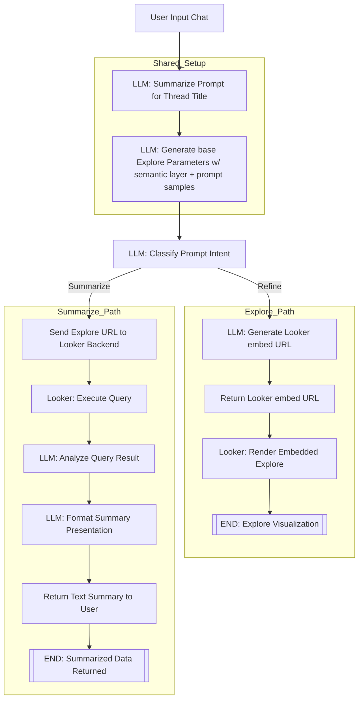

```mermaid
graph TD
    %% Shared initial steps
    A[User Input Chat] --> B[LLM: Summarize Prompt for Thread Title]
    B --> C[LLM: Generate base Explore Parameters w/ semantic layer + prompt samples]
    C --> D[LLM: Classify Prompt Intent]

    %% Explore Visualization path
    D -->|Refine| E[LLM: Generate Looker embed URL]
    E --> F[Return Looker embed URL]
    F --> G[Looker: Render Embedded Explore]
    G --> H1[[END: Explore Visualization]]

    %% Summarize Data path
    D -->|Summarize| I[Send Explore URL to Looker Backend]
    I --> J[Looker: Execute Query]
    J --> K[LLM: Analyze Query Result]
    K --> L[LLM: Format Summary Presentation]
    L --> M[Return Text Summary to User]
    M --> H2[[END: Summarized Data Returned]]

    %% Optional grouping (purely visual, no layout logic)
    subgraph Shared_Setup
        B
        C
    end

    subgraph Explore_Path
        E
        F
        G
        H1
    end

    subgraph Summarize_Path
        I
        J
        K
        L
        M
        H2
    end

```